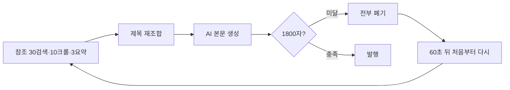
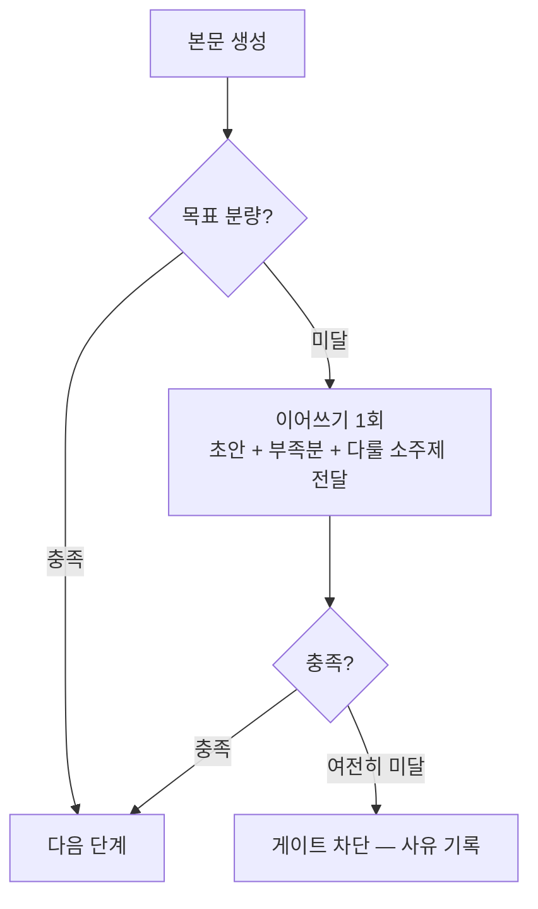

# 최소 글자수 미달 — 원인과 생성 단계 해결 방안 (제안)

> 2026-08-31 · 수작남 3회 연속 생성 실패 조사
> 상태: **조사 완료 · 수정 전** (사용자 지시로 수정 미진행)

## 1. 무슨 일이 있었나

```
15:11:56  수작남  글 생성 실패: 품질 기준 미달: 본문 1385자 (최소 1800자)
15:13:17  수작남  글 생성 실패: 품질 기준 미달: 본문 1449자 (최소 1800자)
15:14:37  수작남  글 생성 실패: 품질 기준 미달: 본문 1549자 (최소 1800자)
```

제목은 「순천 메가박스 상영시간표…」. 한 번의 디스패치(15:11:32)에서
Celery `max_retries=2` 로 **3회 전체 재생성**이 돌았다.

## 2. 토큰수 설정은 왜 소용이 없었나

**`max_tokens` 는 상한이지 하한이 아니다.** 모델이 그 길이까지 쓸 수
있게 허용할 뿐, 그만큼 쓰라고 요구하지 않는다. 짧게 쓰는 것을 막는
장치가 아니다.

수작남 설정은 `max_tokens: 4096`, 모델 `gpt-4o-mini`.

| 확인 | 값 |
|---|---|
| 같은 설정으로 만든 글 (30일, gpt-4o-mini) | 762편 |
| 그중 최대 HTML 길이 | 4,665자 |
| 08-31 06:31 성공한 글 | 3,763자 |

상한에 걸렸다면 결과가 천장 근처에 몰려야 한다. 실제로는 천장까지
여유가 남은 채 1,385자에서 끝났다. **토큰 상한은 이번 실패와 무관하다.**

분량을 실제로 정하는 것은 프롬프트의 지시문
(`한글 기준 2,000자 이상`)인데, 이것은 **모델이 지키지 않아도 되는
목표치**다.

## 3. 진짜 원인 — 임계값이 실제 생산 분포의 한가운데 있다

최근 90일 글 400편을 **게이트와 같은 기준**(마크다운 기호 제거,
공백 포함)으로 재어 봤다.

| 분위 | 분량 |
|---|---|
| 5% | 1,318자 |
| 10% | 1,484자 |
| 25% | 1,655자 |
| **50%** | **1,883자** |
| 75% | 2,091자 |

**1,800자 미만이 42%다.** 즉 게이트는 이 시스템이 실제로 만들어 온
글의 약 40%를 막는 위치에 있다.

수작남의 1,385 / 1,449 / 1,549자는 하위 5~15% 구간이다. 특별히 이상한
결과가 아니라 **평소 분포의 아래 꼬리**이며, 40%가 미달인 상태에서
3연속 미달은 충분히 나올 수 있다(0.42³ ≈ 7%).

### 주제 탓이 아니다

「상영시간표」처럼 확인 불가한 정보가 핵심인 주제라 짧아진 것으로
의심했으나 근거가 없었다.

| 유형 | 편수 | 중앙 분량 | 1800 미달 |
|---|---|---|---|
| 시간표·연락처형 | 50 | 1,854자 | 46% |
| 일반 | 350 | 1,888자 | 42% |

차이가 없다. 참조자료 수집도 정상이었다(3회 모두 30검색·10크롤·3선택).

### 모델 편차가 그대로 드러난 사례

```
08-31 06:30  꿀팁대백과사전  실패 (1,689자)
08-31 06:31  꿀팁대백과사전  성공 (3,763자)   ← 같은 조건, 1분 뒤 재시도
```

같은 블로그·같은 설정에서 1분 사이에 1,689자와 3,763자가 나온다.
**분량이 통제되지 않고 운에 맡겨져 있다.**

### 분량을 정하는 실제 변수 — 섹션당 글자수

| 소제목 수 | 편수 | 중앙 분량 | 1800 통과율 |
|---|---|---|---|
| 5 | 28 | 1,551자 | 32% |
| 6 | 101 | 1,791자 | 50% |
| 7 | 134 | 2,003자 | 71% |
| 10 | 14 | 2,147자 | 93% |

**소제목 1개당 약 231자.** 현재 프롬프트는 "3~6개 구획" 만 요구하고
구획당 분량은 말하지 않는다. 6구획 × 231자 = 1,386자 — 이번 실패값과
정확히 겹친다. 모델은 지시를 어긴 것이 아니라 **지시받은 대로** 쓴 것이다.

## 4. 지금 방식의 비용

게이트는 `raise RuntimeError` 로 결과를 통째로 버린다.



3회 재시도 = 검색 90회 · 크롤 30회 · 요약 9회 · 본문 생성 3회, 약 4분.
그러고도 **모델에게 "짧았다" 는 사실이 전달되지 않는다.** 같은 지시로
다시 뽑으니 같은 분포에서 다시 뽑는 것과 같다.

(다행히 제목은 `available` 로 남아 소모되지는 않는다.)

## 5. 제안 — 생성 단계에서 채우게 한다

### 권장 순서

| 순위 | 항목 | 효과 | 비고 |
|---|---|---|---|
| 1 | 목표 분량을 게이트 임계에서 유도해 프롬프트에 주입 | 큼 | 숫자 하나로 묶는다 |
| 2 | 구획 수 × 구획당 최소 분량 지시 | 큼 | 분량의 실제 지렛대 |
| 3 | 미달 시 재생성 대신 **이어쓰기 1회** | 중 | 비용 1/3 이하 |
| 4 | 임계값을 실측 기준으로 재설정 | 중 | 1·2 적용 뒤 판단 |
| 5 | 성공 건도 분량을 기록 | 작음 | 이후 조정 근거 |

### 5-1. 목표 분량을 한 숫자로 묶는다

지금은 **게이트 임계(1,800)와 프롬프트 지시(2,000)가 서로 모른다.**
모듈에서 `quality_gate.min_chars` 를 바꿔도 모델에게 가는 말은 그대로다.

모듈 설정 하나를 근원으로 삼고, 프롬프트 지시는 거기서 **여유를 두고**
계산해 넣는다.

실측 대비:

| 요구 | 실제 결과 |
|---|---|
| 2,000자 | 중앙 1,883자 (0.94배) · 하위10% 1,484자 (0.74배) |

하위 10%가 1,800자를 넘게 하려면 `1,800 ÷ 0.74 ≈ 2,430자` 를 요구해야
한다. **임계 × 1.4** 를 지시문에 넣는 것이 근거 있는 값이다.

게이트가 마크다운 기호·링크를 걷어내고 세므로, "2,000자 썼다" 가
1,800자로 계산되는 격차도 이 여유분이 흡수한다.

### 5-2. 구획당 분량을 지시한다

길이만 말하는 지시는 약하다. 구조로 못 박는 편이 훨씬 잘 지켜진다.

```
현재: "3~6개 구획으로 나눕니다"           → 구획당 231자 → 1,386자
제안: "소제목 6개 이상, 각 350자 이상"     → 2,100자
```

7구획 글의 1800 통과율이 71%, 10구획은 93%인 것이 근거다. 다만
**구획 수만 늘리면 얕아진다**(11구획 글은 통과율 36%로 오히려 낮다).
구획 수와 구획당 분량을 **함께** 지시해야 한다.

### 5-3. 미달이면 이어쓰기 1회

버리고 다시 만들지 않는다. 이미 쓴 초안과 참조자료를 그대로 두고
모자란 만큼만 더 받는다.



- 참조 수집·제목 재조합을 다시 하지 않는다 → 비용이 재생성의 1/3 이하.
- 모델에게 **"몇 자 모자라며 무엇을 더 다루라"** 를 명시한다. 지금은
  이 정보가 전혀 전달되지 않는다.
- 이어쓰기도 실패하면 그때 차단한다. 차단은 없애지 않고 **마지막 수단**
  으로 물린다.

### 5-4. 임계값 재설정은 1·2 적용 뒤에

지금 1,800은 실제 생산 분포의 43번째 백분위다. 1·2를 적용해 분포가
올라간 뒤에도 미달률이 높으면 그때 낮춘다. **먼저 낮추면 품질 기준을
현실에 맞추는 것이 아니라 포기하는 것이 된다.**

### 5-5. 성공 건도 분량을 남긴다

지금은 실패했을 때만 게이트 기준 글자수가 기록된다. 성공 로그의
"길이 3,336자" 는 HTML 길이라 기준이 다르다. 같은 기준으로 매번
남겨야 임계값을 추측이 아니라 데이터로 조정할 수 있다.

## 6. 하지 않기를 권하는 것

- **재시도 횟수 늘리기** — 같은 분포에서 다시 뽑을 뿐이다. 3회로도
  0.42³ ≈ 7% 확률로 실패한다. 5회로 늘리면 1%로 줄지만 비용은 계속 든다.
- **게이트 끄기** — 색인 0건인 사이트에 얇은 글을 계속 쌓는 원인으로
  돌아간다.
- **`max_tokens` 올리기** — 상한은 이미 남아돌았다. 아무 효과가 없다.

## 7. 정직하게 덧붙임

- 5-1의 1.4배는 400편 표본에서 나온 값이다. 프롬프트를 바꾸면 분포도
  바뀌므로 적용 뒤 재측정이 필요하다.
- 5-2의 "구획당 350자" 는 현재 231자를 근거로 한 목표치이며, 모델이
  얼마나 따르는지는 적용해 봐야 안다.
- 분량을 늘리면 얕은 내용으로 채울 위험이 있다. 구획당 분량을 지시할
  때 "요약·반복으로 채우지 말라" 는 기존 문구를 함께 강화해야 한다.
