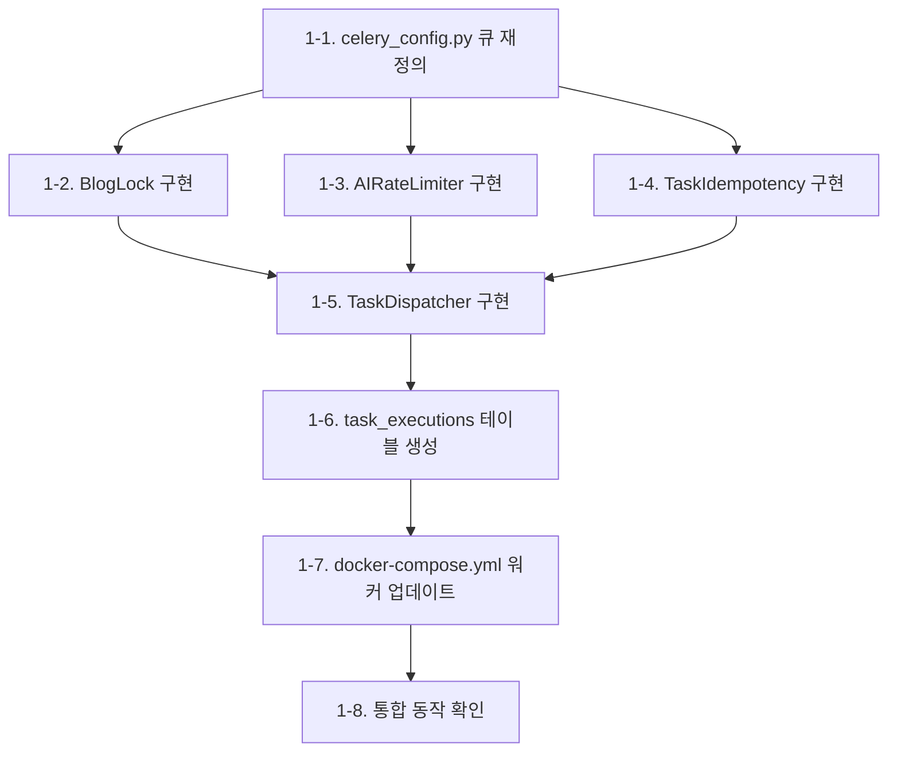
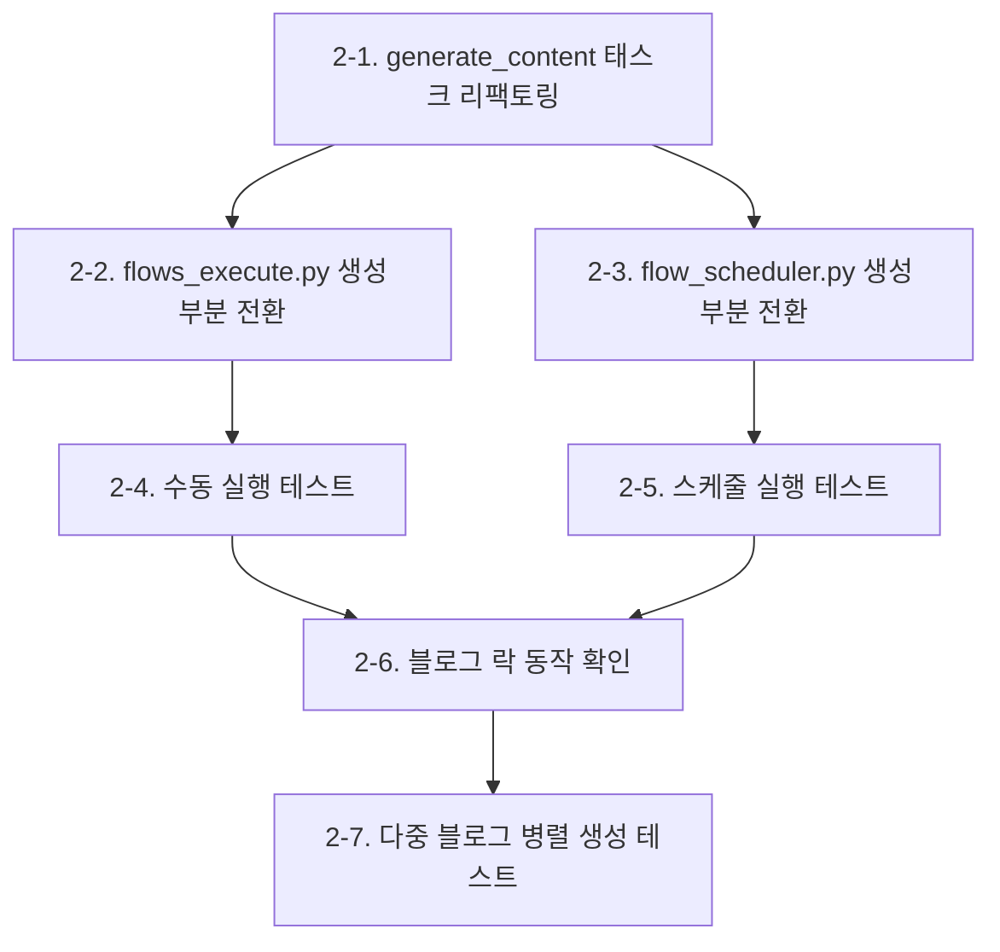

# BlogAuto V2 큐/워커 시스템 도입 계획서

> **버전**: v1.2.0 | **작성일**: 2026-04-05 (Standalone Mode 추가)
> **대상 시스템**: blogauto_v2/services/republish
> **목표**: 단일 프로세스 기반 시스템을 큐/다중 워커 아키텍처로 전환하여 수평 확장 가능한 구조 확보

---

## 1. 현재 시스템 분석

### 1.1 아키텍처 현황

```
┌──────────────────────────────────────────────────┐
│              FastAPI + Uvicorn (단일 프로세스)      │
│                                                    │
│  ┌───────────┐  ┌──────────────┐  ┌────────────┐  │
│  │ API 라우터 │  │ APScheduler  │  │ asyncio    │  │
│  │ (HTTP)    │  │ (인메모리)    │  │ create_task│  │
│  └─────┬─────┘  └──────┬───────┘  └─────┬──────┘  │
│        │               │                │          │
│  ┌─────▼───────────────▼────────────────▼──────┐  │
│  │        동기/비동기 혼합 실행 레이어           │  │
│  │  ContentGenerator | PublisherPipeline        │  │
│  │  InventoryTrigger | FlowScheduler           │  │
│  └─────────────────────┬───────────────────────┘  │
│                         │                          │
│  ┌──────────────────────▼──────────────────────┐  │
│  │          AI API 호출 (OpenAI/Anthropic/Google)│  │
│  │          WordPress/Blogger API 호출           │  │
│  └─────────────────────────────────────────────┘  │
└──────────────────────┬───────────────────────────┘
                       │
           ┌───────────▼───────────┐
           │ PostgreSQL │ Redis    │
           │ (데이터)    │ (미사용) │
           └───────────────────────┘
```

### 1.2 주요 컴포넌트 역할

| 컴포넌트 | 파일 위치 | 역할 | 실행 방식 |
|---------|----------|------|----------|
| FlowScheduler | `app/scheduler/flow_scheduler.py` | GP 기반 스케줄 관리, 플로우 실행 오케스트레이션 | APScheduler IntervalTrigger |
| flows_execute | `app/routers/flows_execute.py` | 플로우 즉시 실행 API, 모듈 타입별 디스패치 | asyncio.create_task |
| ContentGenerator | `app/services/generation/generator.py` | 글 생성 파이프라인 (제목 재조합 -> 참조수집 -> AI생성 -> 치환) | async/await |
| PublisherPipeline | `app/services/publishing/publisher_pipeline.py` | 발행 파이프라인 (이미지 업로드 -> HTML가공 -> 플랫폼 발행) | async/await |
| InventoryTrigger | `app/services/generation/inventory_trigger.py` | 재고 기반 생성 트리거 | async/await |
| Celery Tasks | `app/core/celery_tasks.py` | 제목/글/이미지 생성 태스크 (구현됨, **미사용**) | Celery (비활성) |

### 1.3 식별된 문제점

#### 병목 지점
1. **AI API 호출 직렬화**: ContentGenerator 내에서 제목 재조합, 참조자료 요약, 글 생성, 이미지 생성이 순차 실행. 블로그 50개 x 글 3개 = 150회 AI 호출이 단일 프로세스에서 순차 처리
2. **외부 API Rate Limit**: OpenAI/Anthropic API의 RPM/TPM 제한에 걸리면 전체 파이프라인 블로킹
3. **WordPress/Blogger API 지연**: 이미지 업로드 + 글 발행이 블로그당 5-15초, 100개 블로그 순차 처리 시 25분 이상

#### 안정성 문제
4. **동일 블로그 동시 요청 충돌**: FlowScheduler와 수동 실행(flows_execute)이 같은 블로그에 동시 접근 시 중복 발행/생성 가능
5. **단일 장애점**: 하나의 AI API 호출 실패가 asyncio 이벤트 루프에서 다른 작업에 영향
6. **메모리 누수 위험**: `_module_exec_states` 딕셔너리가 메모리 기반으로, 서버 재시작 시 실행 상태 유실

#### 확장성 한계
7. **수평 확장 불가**: APScheduler + asyncio.create_task는 단일 프로세스에 종속
8. **자원 경합**: AI 호출(CPU/IO 바운드)과 HTTP 서빙이 같은 프로세스에서 자원 경합
9. **우선순위 없음**: 긴급 수동 발행과 자동 스케줄 발행이 동일 우선순위로 실행

### 1.4 기존 Celery 인프라 평가

docker-compose.yml에 정의된 Celery 워커 4개(title, content, image, flower)와 `celery_config.py`, `celery_tasks.py`가 존재하지만 실제 연동되지 않은 상태:

- **celery_config.py**: 큐 3개(title_queue, content_queue, image_queue) 정의, 라우팅 설정 완료
- **celery_tasks.py**: 4개 태스크 구현됨, `_run_async()` 래퍼로 비동기 코드 실행
- **문제점**: 실제 서비스 코드(flows_execute, FlowScheduler)에서 Celery를 호출하지 않음. asyncio.create_task로 직접 실행 중

---

## 2. 벤치마킹 결과

### 2.1 유사 시스템 아키텍처 비교

#### WordPress 자동화 도구

| 시스템 | 아키텍처 | 큐 시스템 | 동시성 제어 |
|-------|---------|---------|-----------|
| **ManageWP** | 중앙 SaaS + 사이트별 Worker Plugin | 서버사이드 작업 큐 + 우선순위 큐 | 사이트별 직렬화, 전체는 병렬 |
| **InfiniteWP** | 자체 호스팅 패널 + 사이트별 에이전트 | MySQL 기반 작업 큐 | 사이트 단위 락, 배치 크기 제한 |
| **WP-CLI** | CLI 단일 실행 | 없음 (스크립트 기반) | OS 레벨 프로세스 제한 |
| **MainWP** | WordPress 플러그인 기반 | WordPress Cron + Action Scheduler | 사이트당 동시 작업 수 제한 |

**핵심 패턴**: 대부분의 WordPress 다중 사이트 관리 도구는 "사이트(블로그)별 작업 직렬화 + 전체 병렬 실행" 패턴을 사용. 이는 동일 사이트에 대한 동시 수정 충돌을 방지하면서 전체 처리량을 극대화하는 전략.

#### SEO/콘텐츠 자동화 플랫폼

| 시스템 | 아키텍처 | AI 호출 처리 | 확장 전략 |
|-------|---------|------------|---------|
| **Jasper AI** | 마이크로서비스 + 이벤트 드리븐 | AI 호출 전용 워커 풀 + Rate Limit 관리자 | Kubernetes 오토스케일링 |
| **Copy.ai** | 서버리스 + 큐 | AWS SQS + Lambda | 워크로드 기반 자동 확장 |
| **SurferSEO** | 모노리스 + 워커 | 분석 작업 전용 큐 분리 | 작업 유형별 워커 독립 스케일 |

**핵심 패턴**: AI API 호출은 전용 워커 풀에서 처리하되, Rate Limit을 중앙에서 관리하는 "토큰 버킷" 또는 "레이트 리미터" 패턴이 공통적. AI 프로바이더별로 분당 호출 수를 추적하고 초과 시 큐에서 대기.

#### Python 태스크 큐 시스템 비교

| 시스템 | 브로커 | 장점 | 단점 | 적합도 |
|-------|-------|------|------|-------|
| **Celery** | Redis, RabbitMQ | 생태계 성숙, 풍부한 기능, Flower 모니터링 | 복잡한 설정, async 네이티브 아님 | ★★★★☆ |
| **Dramatiq** | Redis, RabbitMQ | 간결한 API, 안정적 재시도 | Celery 대비 작은 생태계 | ★★★☆☆ |
| **Huey** | Redis | 경량, 단순 | 대규모 부적합, 기능 제한 | ★★☆☆☆ |
| **ARQ** | Redis | asyncio 네이티브, 경량 | 미성숙, 기능 제한, 모니터링 부족 | ★★★☆☆ |
| **Taskiq** | Redis, RabbitMQ 등 | asyncio 네이티브, FastAPI 통합, 유연 | 비교적 신규, 생태계 작음 | ★★★★☆ |

### 2.2 벤치마킹 결론

BlogAuto의 요구사항에 가장 적합한 조합:

1. **Celery 채택 (기존 인프라 활용)**: 이미 docker-compose.yml, celery_config.py, celery_tasks.py가 구현되어 있어 추가 인프라 비용 최소화. Flower 모니터링도 이미 설정됨
2. **블로그 단위 작업 직렬화**: ManageWP/InfiniteWP의 "사이트별 직렬화" 패턴 적용
3. **AI Rate Limit 중앙 관리**: Jasper/Copy.ai의 "토큰 버킷" 패턴을 Redis 기반으로 구현
4. **APScheduler는 트리거 역할만**: 스케줄러는 작업을 "발생"시키고, 실제 실행은 Celery에 위임

---

## 3. 목표 아키텍처

### 3.1 전체 구조

```
┌─────────────────────────────────────────────────────────────────┐
│                    FastAPI (API + 스케줄러)                       │
│                                                                   │
│  ┌───────────┐  ┌──────────────┐  ┌──────────────────────────┐  │
│  │ HTTP API  │  │ APScheduler  │  │ TaskDispatcher           │  │
│  │ (라우터)   │  │ (트리거만)   │  │ (Celery send_task 래퍼)  │  │
│  └─────┬─────┘  └──────┬───────┘  └────────────┬─────────────┘  │
│        │               │                        │                 │
│        └───────────────┴────────────────────────┘                 │
│                         │ Celery send_task()                      │
└─────────────────────────┼─────────────────────────────────────────┘
                          │
                ┌─────────▼─────────┐
                │    Redis Broker    │
                │  + Result Backend  │
                │  + Rate Limiter    │
                │  + Blog Lock       │
                └────────┬──────────┘
                         │
         ┌───────────────┼───────────────┬────────────────┐
         │               │               │                │
   ┌─────▼─────┐  ┌─────▼─────┐  ┌─────▼─────┐  ┌──────▼──────┐
   │ Generation │  │ Publish   │  │ Image     │  │ Utility     │
   │ Workers    │  │ Workers   │  │ Workers   │  │ Workers     │
   │            │  │           │  │           │  │             │
   │ - 제목재조합│  │ - WP 발행 │  │ - DALL-E  │  │ - 수집      │
   │ - 참조수집 │  │ - Blogger │  │ - 템플릿  │  │ - 데이터    │
   │ - AI 글생성│  │ - 재발행  │  │   이미지  │  │ - 제목이동  │
   │            │  │ - SEO     │  │           │  │             │
   │ autoscale  │  │ autoscale │  │ fixed     │  │ fixed       │
   │ 3~8       │  │ 2~5       │  │ 2         │  │ 1           │
   └────────────┘  └───────────┘  └───────────┘  └─────────────┘
         │               │               │                │
         └───────────────┴───────────────┴────────────────┘
                                │
                     ┌──────────▼──────────┐
                     │    PostgreSQL       │
                     └─────────────────────┘

   ┌──────────────────┐
   │ Flower (모니터링) │ :5555
   └──────────────────┘
```

### 3.2 핵심 설계 원칙

| 원칙 | 설명 | 적용 |
|------|------|------|
| **관심사 분리** | API 서빙, 스케줄링, 작업 실행을 프로세스 단위로 분리 | FastAPI / APScheduler / Celery Workers |
| **블로그 단위 직렬화** | 동일 블로그 작업은 절대 동시 실행하지 않음 | Redis 분산 락 (blog:{id}:lock) |
| **작업 유형별 큐 분리** | 글 생성과 발행은 독립적으로 확장 | generation_queue, publish_queue, image_queue, utility_queue |
| **Rate Limit 중앙 관리** | AI API 호출량을 Redis에서 프로바이더별 추적 | Redis 슬라이딩 윈도우 카운터 |
| **멱등성** | 동일 작업의 중복 실행이 부작용을 만들지 않음 | 작업 ID + 상태 체크로 중복 방지 |
| **점진적 실패** | 하나의 작업 실패가 다른 작업에 전파되지 않음 | 워커 프로세스 격리 + 개별 재시도 |

---

## 4. 큐 설계

### 4.1 큐 구조

```
Redis Broker
├── generation_queue (글 생성 전체 파이프라인)
│   ├── priority: 0-9 (높을수록 우선)
│   ├── tasks: generate_content, recombine_title
│   └── rate_limit: AI 프로바이더별 RPM 제한 적용
│
├── publish_queue (발행/재발행)
│   ├── priority: 0-9
│   ├── tasks: publish_post, republish_post, publish_batch
│   └── rate_limit: 블로그 플랫폼별 API 제한 적용
│
├── image_queue (이미지 생성/업로드)
│   ├── priority: 0-9
│   ├── tasks: generate_image, upload_image
│   └── rate_limit: DALL-E API 제한 적용
│
├── utility_queue (수집/데이터 처리)
│   ├── priority: 0-9
│   ├── tasks: collect_keywords, transfer_titles, collect_references
│   └── rate_limit: 검색 API 제한 적용
│
└── callback_queue (완료 후처리)
    ├── priority: 항상 최고
    ├── tasks: on_generation_complete, on_publish_complete
    └── rate_limit: 없음
```

### 4.2 작업 유형별 정의

#### generation_queue

```python
# 태스크 1: 글 생성 전체 파이프라인
@celery_app.task(
    name="tasks.generate_content",
    queue="generation_queue",
    bind=True,
    max_retries=2,
    default_retry_delay=60,
    soft_time_limit=300,   # 5분 소프트 제한
    time_limit=360,        # 6분 하드 제한
    acks_late=True,
    reject_on_worker_lost=True,
)
def generate_content(self, blog_id, module_id, title_id, priority=5):
    """
    ContentGenerator.generate() 전체 파이프라인 실행
    블로그 단위 락 획득 후 실행
    """
    pass
```

#### publish_queue

```python
# 태스크 2: 단일 포스트 발행
@celery_app.task(
    name="tasks.publish_post",
    queue="publish_queue",
    bind=True,
    max_retries=3,
    default_retry_delay=30,
    soft_time_limit=120,
    time_limit=180,
    acks_late=True,
    reject_on_worker_lost=True,
)
def publish_post(self, blog_id, post_id, priority=5):
    """
    PublisherPipeline.publish_post() 실행
    블로그 단위 락 획득 후 실행
    """
    pass

# 태스크 3: 배치 발행
@celery_app.task(
    name="tasks.publish_batch",
    queue="publish_queue",
    bind=True,
    soft_time_limit=600,
    time_limit=720,
)
def publish_batch(self, blog_id, count, priority=5):
    """
    PublisherPipeline.publish_batch() 실행
    내부적으로 publish_post를 순차 호출 (동일 블로그이므로 직렬)
    """
    pass
```

### 4.3 우선순위 체계

| 우선순위 | 값 | 사용처 | 설명 |
|---------|---|-------|------|
| CRITICAL | 9 | 수동 즉시 실행 | 사용자가 UI에서 "지금 실행" 클릭 |
| HIGH | 7 | 재고 부족 긴급 생성 | InventoryTrigger에서 재고 0일 때 |
| NORMAL | 5 | 스케줄 기반 자동 실행 | FlowScheduler 정기 실행 |
| LOW | 3 | 배치 작업 | 대량 일괄 생성/발행 |
| BACKGROUND | 1 | 유지보수 작업 | 재고 확인, 통계 갱신 |

### 4.4 재시도 전략

```python
RETRY_POLICIES = {
    "generate_content": {
        "max_retries": 2,
        "retry_backoff": True,       # 지수 백오프
        "retry_backoff_max": 300,    # 최대 5분
        "retry_jitter": True,        # 백오프에 랜덤 지터 추가
        "autoretry_for": (
            "openai.RateLimitError",
            "anthropic.RateLimitError",
            "ConnectionError",
            "TimeoutError",
        ),
        "dont_retry_for": (
            "ValueError",             # 잘못된 입력 (재시도 무의미)
            "PermissionError",         # API 키 오류
        ),
    },
    "publish_post": {
        "max_retries": 3,
        "retry_backoff": True,
        "retry_backoff_max": 120,
        "autoretry_for": (
            "ConnectionError",
            "TimeoutError",
            "requests.HTTPError",      # 5xx 오류
        ),
    },
    "generate_image": {
        "max_retries": 1,
        "retry_backoff": False,
        "default_retry_delay": 30,
    },
}
```

---

## 5. 워커 설계

### 5.1 워커 유형 및 사양

| 워커 | 큐 | 동시성 | 오토스케일 | 프리페치 | 이유 |
|------|---|-------|----------|---------|------|
| **generation_worker** | generation_queue | 3~8 | autoscale=8,3 | 1 | AI API 호출은 IO 바운드, 병렬 처리 효과 큼 |
| **publish_worker** | publish_queue | 2~5 | autoscale=5,2 | 1 | WordPress/Blogger API 호출, 중간 수준 병렬 |
| **image_worker** | image_queue | 2 | fixed | 1 | DALL-E RPM 제한 엄격, 적은 동시성으로 충분 |
| **utility_worker** | utility_queue, callback_queue | 2 | fixed | 2 | 가벼운 작업, 콜백은 빠르게 처리 |

### 5.2 Docker Compose 워커 정의 (목표)

```yaml
# 글 생성 워커
generation_worker:
  build: { context: ., dockerfile: docker/Dockerfile }
  command: >
    celery -A app.core.celery_config worker
    -Q generation_queue
    --autoscale=8,3
    --prefetch-multiplier=1
    -l INFO
    -n generation@%h
    --without-heartbeat
    --without-mingle
  deploy:
    resources:
      limits: { memory: 512M }
  restart: unless-stopped

# 발행 워커
publish_worker:
  build: { context: ., dockerfile: docker/Dockerfile }
  command: >
    celery -A app.core.celery_config worker
    -Q publish_queue
    --autoscale=5,2
    --prefetch-multiplier=1
    -l INFO
    -n publish@%h
  deploy:
    resources:
      limits: { memory: 256M }
  restart: unless-stopped

# 이미지 워커
image_worker:
  build: { context: ., dockerfile: docker/Dockerfile }
  command: >
    celery -A app.core.celery_config worker
    -Q image_queue
    --concurrency=2
    --prefetch-multiplier=1
    -l INFO
    -n image@%h
  deploy:
    resources:
      limits: { memory: 256M }
  restart: unless-stopped

# 유틸리티 워커
utility_worker:
  build: { context: ., dockerfile: docker/Dockerfile }
  command: >
    celery -A app.core.celery_config worker
    -Q utility_queue,callback_queue
    --concurrency=2
    --prefetch-multiplier=2
    -l INFO
    -n utility@%h
  deploy:
    resources:
      limits: { memory: 256M }
  restart: unless-stopped
```

### 5.3 워커 프로세스 모델

```
celery worker (메인 프로세스)
├── prefork pool (기본)
│   ├── worker-1 (subprocess)
│   ├── worker-2 (subprocess)
│   └── worker-N (subprocess)
└── 각 subprocess에서 asyncio.run() 으로 async 코드 실행
```

현재 `celery_tasks.py`의 `_run_async()` 패턴을 유지하되, 이벤트 루프 관리를 개선:

```python
def _run_async(coro):
    """Celery prefork 워커에서 async 코루틴 실행"""
    return asyncio.run(coro)
```

> 주의: prefork 모드에서는 각 subprocess가 독립적이므로 `asyncio.get_event_loop()` 문제 없음. 기존 `_run_async()`의 복잡한 분기 로직을 단순화 가능.

---

## 6. 동시성/충돌 제어

### 6.1 블로그 단위 분산 락

동일 블로그에 대한 동시 작업(생성 + 발행, 또는 스케줄 + 수동 실행)을 방지하는 핵심 메커니즘.

```python
import redis
from contextlib import contextmanager

class BlogLock:
    """Redis 기반 블로그 단위 분산 락"""

    def __init__(self, redis_client: redis.Redis):
        self.redis = redis_client
        self.lock_prefix = "blogauto:lock:blog"
        self.default_ttl = 600  # 10분 (작업 최대 예상 시간)

    def acquire(self, blog_id: int, task_type: str, ttl: int = None) -> bool:
        """
        블로그 락 획득 시도

        키: blogauto:lock:blog:{blog_id}:{task_type}
        task_type: "generate" | "publish" | "all"
        """
        key = f"{self.lock_prefix}:{blog_id}:{task_type}"
        return self.redis.set(key, "locked", nx=True, ex=ttl or self.default_ttl)

    def release(self, blog_id: int, task_type: str) -> None:
        key = f"{self.lock_prefix}:{blog_id}:{task_type}"
        self.redis.delete(key)

    def is_locked(self, blog_id: int, task_type: str) -> bool:
        key = f"{self.lock_prefix}:{blog_id}:{task_type}"
        return self.redis.exists(key) > 0
```

### 6.2 락 적용 범위

| 작업 유형 | 락 키 패턴 | 동시 허용 | TTL |
|----------|-----------|---------|-----|
| 글 생성 | `blog:{id}:generate` | 같은 블로그 생성 불가, 다른 블로그 생성 가능 | 600초 |
| 발행 | `blog:{id}:publish` | 같은 블로그 발행 불가, 다른 블로그 발행 가능 | 300초 |
| 생성+발행 동시 | 별도 키이므로 허용 | 같은 블로그에서 생성과 발행은 동시 가능 (다른 글) | - |
| 수집 (collect) | `module:{id}:collect` | 같은 모듈 수집 불가 | 1800초 |

### 6.3 AI API Rate Limit 관리

```python
class AIRateLimiter:
    """
    Redis 기반 슬라이딩 윈도우 Rate Limiter

    AI 프로바이더별 분당 호출 수를 추적하고,
    제한 초과 시 대기 시간을 반환합니다.
    """

    LIMITS = {
        "openai": {"rpm": 60, "tpm": 90000},
        "anthropic": {"rpm": 50, "tpm": 80000},
        "google": {"rpm": 60, "tpm": 120000},
    }

    def __init__(self, redis_client):
        self.redis = redis_client
        self.key_prefix = "blogauto:ratelimit"

    def can_call(self, provider: str) -> tuple[bool, int]:
        """
        호출 가능 여부 확인

        Returns:
            (가능 여부, 대기 필요 시간(초))
        """
        key = f"{self.key_prefix}:{provider}:rpm"
        current = self.redis.get(key)
        limit = self.LIMITS.get(provider, {}).get("rpm", 60)

        if current and int(current) >= limit:
            ttl = self.redis.ttl(key)
            return False, max(ttl, 1)

        return True, 0

    def record_call(self, provider: str, tokens_used: int = 0):
        """호출 기록"""
        rpm_key = f"{self.key_prefix}:{provider}:rpm"
        pipe = self.redis.pipeline()
        pipe.incr(rpm_key)
        pipe.expire(rpm_key, 60)  # 1분 윈도우
        pipe.execute()
```

### 6.4 작업 멱등성 보장

```python
class TaskIdempotency:
    """
    동일 작업의 중복 실행 방지

    플로우 스케줄러가 같은 blog+module 조합을
    짧은 시간 내 중복 발행하는 것을 방지합니다.
    """

    def __init__(self, redis_client):
        self.redis = redis_client
        self.key_prefix = "blogauto:task:dedup"

    def is_duplicate(self, task_key: str, window_seconds: int = 300) -> bool:
        """
        task_key 예: "generate:blog_1:module_5:title_123"
        window_seconds: 중복 판단 윈도우 (기본 5분)
        """
        key = f"{self.key_prefix}:{task_key}"
        if self.redis.exists(key):
            return True
        self.redis.set(key, "1", ex=window_seconds)
        return False
```

---

## 7. 모니터링/에러 처리

### 7.1 모니터링 스택

```
┌──────────────┐     ┌──────────────┐     ┌──────────────┐
│   Flower     │     │ FastAPI      │     │ Redis        │
│  (Celery)    │     │ /health      │     │ INFO         │
│  :5555       │     │ /metrics     │     │              │
└──────┬───────┘     └──────┬───────┘     └──────┬───────┘
       │                    │                    │
       └────────────────────┴────────────────────┘
                            │
                     ┌──────▼──────┐
                     │  Dashboard  │
                     │  (기존 UI)  │
                     └─────────────┘
```

### 7.2 모니터링 지표

| 카테고리 | 지표 | 수집 방식 | 알림 기준 |
|---------|------|---------|---------|
| **큐 상태** | 큐별 대기 작업 수 | Flower API / Redis LLEN | 대기 > 50 |
| **워커 상태** | 활성 워커 수, 처리 중 작업 수 | Flower API | 워커 0개 |
| **작업 성공률** | 성공/실패/재시도 비율 | Celery events | 실패율 > 10% |
| **처리 시간** | 작업별 평균/P95 처리 시간 | Celery task_postrun signal | P95 > 5분 |
| **AI Rate Limit** | 프로바이더별 잔여 호출 수 | Redis 카운터 | 잔여 < 10% |
| **블로그 락** | 활성 락 수, 락 대기 작업 수 | Redis SCAN | 락 > 30분 |

### 7.3 에러 처리 전략

#### Dead Letter Queue (DLQ)

최대 재시도 횟수를 초과한 작업을 별도 큐에 보관하여 수동 검토 가능하도록 함:

```python
@celery_app.task(
    name="tasks.handle_dead_letter",
    queue="dlq",
)
def handle_dead_letter(task_name, task_args, task_kwargs, exception_info):
    """
    DLQ 핸들러: 최대 재시도 초과 작업 기록

    - DB에 실패 이력 저장 (AutorunLog 또는 전용 테이블)
    - 관리자 알림 (추후 Slack/이메일)
    """
    pass
```

#### 에러 분류 및 대응

| 에러 유형 | 예시 | 대응 | 재시도 |
|----------|------|------|-------|
| **일시적 네트워크** | ConnectionError, Timeout | 지수 백오프 재시도 | O (최대 3회) |
| **Rate Limit** | 429 Too Many Requests | Rate Limiter에 기록, 대기 후 재시도 | O (대기 후) |
| **인증 오류** | 401 Unauthorized, API Key Invalid | DLQ로 이동, 관리자 알림 | X |
| **입력 오류** | ValueError, 존재하지 않는 blog_id | DLQ로 이동, 로그 기록 | X |
| **서비스 장애** | 500 Internal Server Error | 지수 백오프 재시도 | O (최대 2회) |
| **워커 OOM** | MemoryError | 워커 자동 재시작 (Docker restart) | O (다른 워커에서) |

### 7.4 작업 상태 추적 (DB)

현재 `_module_exec_states` (인메모리 딕셔너리)를 DB 테이블로 전환:

```sql
CREATE TABLE task_executions (
    id SERIAL PRIMARY KEY,
    task_id VARCHAR(255) UNIQUE NOT NULL,    -- Celery task ID
    task_name VARCHAR(100) NOT NULL,         -- 'generate_content', 'publish_post' 등
    queue VARCHAR(50) NOT NULL,
    blog_id INTEGER REFERENCES blogs(id),
    module_id INTEGER REFERENCES modules(id),
    flow_id INTEGER REFERENCES flows(id),
    status VARCHAR(20) DEFAULT 'pending',    -- pending/running/success/failed/retrying
    priority INTEGER DEFAULT 5,
    params JSONB,                            -- 태스크 파라미터
    result JSONB,                            -- 실행 결과
    error_message TEXT,
    retry_count INTEGER DEFAULT 0,
    created_at TIMESTAMP DEFAULT NOW(),
    started_at TIMESTAMP,
    completed_at TIMESTAMP,

    -- 인덱스
    INDEX idx_task_status (status),
    INDEX idx_task_blog (blog_id, status),
    INDEX idx_task_created (created_at DESC)
);
```

---

## 8. 기존 시스템과의 통합 전략

### 8.1 APScheduler와 Celery 공존 방안

APScheduler를 **완전히 제거하지 않고**, "트리거(발사기)" 역할로 유지:

```
현재:
  APScheduler → FlowScheduler → asyncio.create_task → 직접 실행

목표:
  APScheduler → FlowScheduler → TaskDispatcher → Celery send_task → 워커에서 실행
```

#### TaskDispatcher (신규 컴포넌트)

```python
class TaskDispatcher:
    """
    APScheduler/HTTP API와 Celery 사이의 중재자

    기존 코드의 asyncio.create_task() 호출을
    celery_app.send_task() 호출로 대체하는 어댑터 레이어
    """

    def __init__(self, celery_app, blog_lock, rate_limiter, idempotency):
        self.celery = celery_app
        self.lock = blog_lock
        self.limiter = rate_limiter
        self.dedup = idempotency

    def dispatch_generation(
        self, blog_id: int, module_id: int, title_id: int,
        priority: int = 5, flow_id: int = None,
    ) -> str:
        """
        글 생성 작업 디스패치

        Returns:
            Celery task_id
        """
        # 1. 멱등성 체크
        dedup_key = f"generate:{blog_id}:{module_id}:{title_id}"
        if self.dedup.is_duplicate(dedup_key):
            raise DuplicateTaskError(dedup_key)

        # 2. Celery 태스크 전송
        result = self.celery.send_task(
            "tasks.generate_content",
            kwargs={
                "blog_id": blog_id,
                "module_id": module_id,
                "title_id": title_id,
            },
            queue="generation_queue",
            priority=priority,
        )

        # 3. 실행 상태 DB 기록
        # (task_executions 테이블에 INSERT)

        return result.id

    def dispatch_publish(
        self, blog_id: int, post_id: int,
        priority: int = 5, flow_id: int = None,
    ) -> str:
        """발행 작업 디스패치"""
        dedup_key = f"publish:{blog_id}:{post_id}"
        if self.dedup.is_duplicate(dedup_key):
            raise DuplicateTaskError(dedup_key)

        result = self.celery.send_task(
            "tasks.publish_post",
            kwargs={"blog_id": blog_id, "post_id": post_id},
            queue="publish_queue",
            priority=priority,
        )
        return result.id
```

### 8.2 코드 변경 영향 범위

| 컴포넌트 | 변경 내용 | 난이도 | 영향도 |
|---------|----------|-------|-------|
| `flow_scheduler.py` | `_execute_module_callback()` 내부에서 직접 실행 대신 TaskDispatcher 호출 | 중 | 높음 |
| `flows_execute.py` | `asyncio.create_task()` 대신 TaskDispatcher 호출, 실행 상태를 DB에서 조회 | 중 | 높음 |
| `celery_tasks.py` | 기존 태스크 리팩토링 + 신규 태스크 추가 | 중 | 중 |
| `celery_config.py` | 큐 재정의, 라우팅 업데이트, 설정 최적화 | 낮 | 중 |
| `generator.py` | 변경 없음 (Celery 태스크에서 그대로 호출) | 없음 | 없음 |
| `publisher_pipeline.py` | 변경 없음 (Celery 태스크에서 그대로 호출) | 없음 | 없음 |
| `main.py` | TaskDispatcher 초기화 추가 | 낮 | 낮 |
| `docker-compose.yml` | 워커 정의 업데이트 | 낮 | 중 |

핵심 서비스(ContentGenerator, PublisherPipeline, InventoryTrigger)는 변경하지 않음. 변경은 "호출하는 곳"(스케줄러, 라우터)에 집중.

---

## 9. 마이그레이션 단계

### Phase 1: 인프라 준비 및 기반 구축 (1주)

**목표**: Celery 인프라 활성화, 기반 컴포넌트 구현



작업 목록:
- [ ] `app/core/celery_config.py` 큐 구조 변경 (4큐 체계)
- [ ] `app/core/blog_lock.py` Redis 분산 락 구현
- [ ] `app/core/rate_limiter.py` AI Rate Limiter 구현
- [ ] `app/core/task_idempotency.py` 멱등성 관리 구현
- [ ] `app/core/task_dispatcher.py` TaskDispatcher 구현
- [ ] `alembic/versions/xxx_add_task_executions.py` 마이그레이션
- [ ] `docker-compose.yml` 워커 재정의
- [ ] Flower 연결 확인

### Phase 2: 글 생성 파이프라인 전환 (1주)

**목표**: ContentGenerator 호출을 Celery 태스크로 전환



작업 목록:
- [ ] `app/core/celery_tasks.py` generate_content 태스크 리팩토링 (블로그 락 + Rate Limit 적용)
- [ ] `app/routers/flows_execute.py` 내 `_execute_generate_module()` 수정 (TaskDispatcher 사용)
- [ ] `app/scheduler/flow_scheduler.py` 내 `_execute_generate_module()` 수정
- [ ] 기존 `_module_exec_states` 딕셔너리 → task_executions DB 테이블 전환
- [ ] 수동 실행 + 스케줄 실행 동시 테스트
- [ ] 블로그 5개 이상 동시 생성 테스트

### Phase 3: 발행 파이프라인 전환 (1주)

**목표**: PublisherPipeline 호출을 Celery 태스크로 전환

작업 목록:
- [ ] `app/core/celery_tasks.py` publish_post, publish_batch 태스크 구현
- [ ] `app/routers/flows_execute.py` 내 `_execute_publish_module()` 수정
- [ ] `app/scheduler/flow_scheduler.py` 내 발행 관련 콜백 수정
- [ ] 재발행(republish) 태스크 Celery 전환
- [ ] WordPress + Blogger 동시 발행 테스트
- [ ] 발행 실패 시 재시도 동작 확인

### Phase 4: 이미지/유틸리티 전환 + 모니터링 (1주)

**목표**: 나머지 작업 유형 전환, 모니터링 대시보드, DLQ

작업 목록:
- [ ] 이미지 생성/업로드 태스크 Celery 전환
- [ ] 수집(collect), 데이터(data) 모듈 태스크 전환
- [ ] DLQ 핸들러 구현
- [ ] 대시보드에 큐/워커 상태 위젯 추가
- [ ] task_executions 기반 실행 이력 페이지
- [ ] Flower 접근 경로 설정 (프록시)

### Phase 5: 안정화 및 최적화 (1주)

**목표**: 프로덕션 안정성 확보, 성능 튜닝

작업 목록:
- [ ] 오토스케일 파라미터 튜닝 (실 사용량 기반)
- [ ] Rate Limiter 수치 조정 (AI 프로바이더별 실측)
- [ ] 블로그 50개 이상 동시 운영 부하 테스트
- [ ] 워커 메모리 사용량 모니터링 및 제한 조정
- [ ] APScheduler 잔존 직접 실행 코드 제거
- [ ] 문서화 (운영 가이드, 트러블슈팅)

---

## 10. 예상 일정

| 단계 | 기간 | 주요 마일스톤 | 선행 조건 |
|------|------|-------------|---------|
| **Phase 1** | 1주 | Celery 인프라 활성화, 기반 컴포넌트 | 없음 |
| **Phase 2** | 1주 | 글 생성 Celery 전환 완료 | Phase 1 |
| **Phase 3** | 1주 | 발행 Celery 전환 완료 | Phase 1 |
| **Phase 4** | 1주 | 전체 작업 Celery 전환 + 모니터링 | Phase 2, 3 |
| **Phase 5** | 1주 | 안정화, 최적화, 문서화 | Phase 4 |

> Phase 2와 Phase 3은 Phase 1 완료 후 병렬 진행 가능.
> 전체 예상 소요: **4~5주**

### 리스크 및 완화 방안

| 리스크 | 확률 | 영향 | 완화 방안 |
|-------|------|------|---------|
| Celery prefork + asyncio 호환 문제 | 중 | 높 | _run_async() 개선, gevent 풀 대안 검토 |
| 마이그레이션 중 기존 기능 장애 | 중 | 높 | Phase별 롤백 계획, 기능 플래그로 Celery/직접실행 전환 |
| Redis 단일 장애점 | 낮 | 높 | Redis Sentinel 또는 Redis Cluster 고려 (Phase 5) |
| 워커 메모리 초과 (OCI 서버 자원 제한) | 중 | 중 | 워커 메모리 제한, max_tasks_per_child로 주기적 재시작 |
| AI API 비용 증가 (병렬 처리 시 더 빠르게 소진) | 낮 | 중 | Rate Limiter로 일일 호출량 상한 설정 |

### 기능 플래그 (안전한 전환)

```python
# app/core/config.py
class Settings:
    # Phase별로 하나씩 True로 전환
    use_celery_generation: bool = False   # Phase 2 완료 시 True
    use_celery_publish: bool = False      # Phase 3 완료 시 True
    use_celery_image: bool = False        # Phase 4 완료 시 True
    use_celery_utility: bool = False      # Phase 4 완료 시 True
```

```python
# flows_execute.py (전환 예시)
if settings.use_celery_generation:
    task_id = dispatcher.dispatch_generation(blog_id, module_id, title_id)
else:
    # 기존 asyncio.create_task() 방식 유지
    task = asyncio.create_task(_execute_generate_module(...))
```

이 기능 플래그를 통해 문제 발생 시 `.env` 파일 한 줄 변경으로 즉시 롤백 가능.

---


## 부록 A: 10배 성장 시나리오 시뮬레이션

### 현재 규모
- 블로그: 10~20개
- 일일 글 생성: 30~60건
- 일일 발행: 30~60건

### 10배 성장 시 (목표)
- 블로그: 100~200개
- 일일 글 생성: 300~600건
- 일일 발행: 300~600건

### 필요 자원 추정

| 작업 | 건당 소요시간 | 일 600건 기준 | 워커 3대 병렬 |
|------|------------|-------------|-------------|
| 글 생성 | 30~120초 | 5~20시간 | 1.7~6.7시간 |
| 발행 | 5~15초 | 0.8~2.5시간 | 0.3~0.8시간 |
| 이미지 생성 | 10~30초 | 1.7~5시간 | 0.6~1.7시간 |

Celery 워커 도입 시 24시간 내 처리 가능. 단일 프로세스에서는 글 생성만으로도 20시간 이상 소요되어 스케줄 지연 발생.

---

## 부록 B: 파일 구조 변경 예상

```
app/core/
├── celery_config.py        # 수정: 큐 재정의, 설정 최적화
├── celery_tasks.py          # 수정: 태스크 리팩토링 + 신규 태스크
├── task_dispatcher.py       # 신규: Celery 디스패치 래퍼
├── blog_lock.py             # 신규: Redis 분산 락
├── rate_limiter.py          # 신규: AI Rate Limit 관리
├── task_idempotency.py      # 신규: 중복 실행 방지
└── config.py                # 수정: 기능 플래그 추가

app/models/
└── task_execution.py        # 신규: 작업 실행 상태 DB 모델

alembic/versions/
└── xxx_add_task_executions.py  # 신규: 마이그레이션

docker-compose.yml           # 수정: 워커 재정의
```

신규 파일 6개, 수정 파일 5개. 핵심 서비스 코드(generator.py, publisher_pipeline.py 등)는 변경 없음.

---


---

## 부록 C: 변경 이력 (Change Log)

### v1.2.0 (2026-04-05)
- Standalone Mode 관련 내용은 grade_pricing_plan.md로 이동

### v1.0.0 (2026-03-30) - 초안 작성
- 큐/워커 시스템 도입 초기 계획서 작성
- 섹션 1~10: 현황 분석, 벤치마킹, 목표 아키텍처, 마이그레이션 단계
