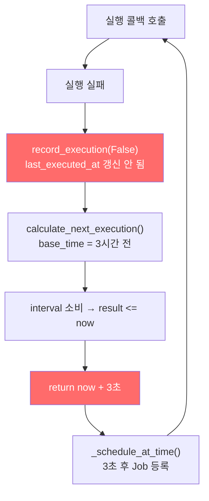
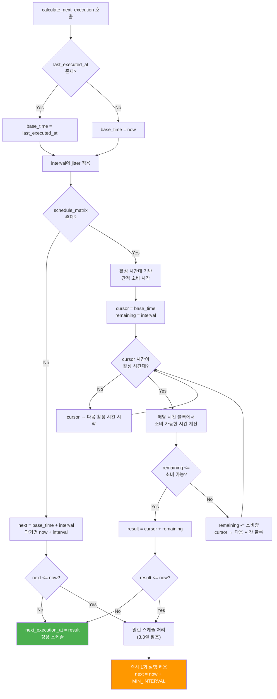
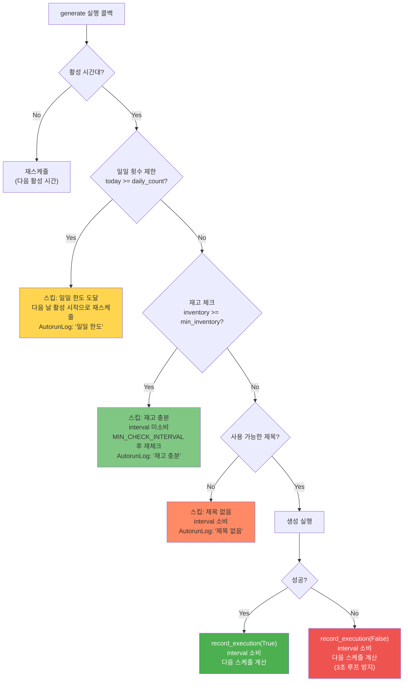
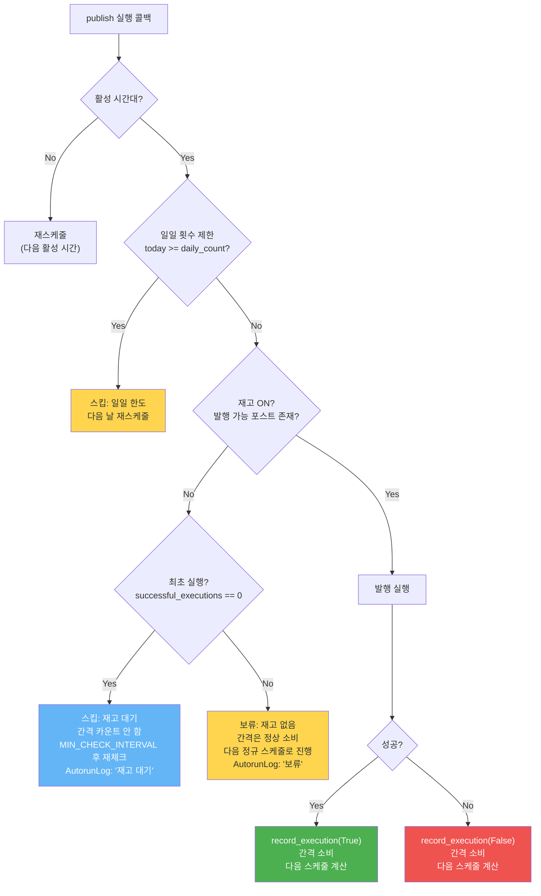

# 오토런 스케줄 시스템 전면 개편 계획서

> **버전**: v1.0 | **작성일**: 2026-04-23 | **상태**: 계획

---

## 1. 개요

### 1.1 문제 요약

현재 오토런 스케줄 시스템은 다음과 같은 근본적인 설계 결함을 가지고 있다:

1. **생성(generate)과 발행(publish)이 서로 다른 코드 경로**를 사용하면서도 개념적으로 동일한 스케줄 워크플로우를 가짐
2. **스케줄 계산 버그**로 인해 3초 간격 무한 루프가 발생
3. `record_execution(False)` 시 `last_executed_at`을 갱신하지 않아 스케줄이 항상 과거 시점을 기준으로 계산됨
4. 발행 전 **재고 확인 미수행**
5. **일일 실행 횟수 제한** 미적용

### 1.2 설계 원칙

#### 스케줄 계산 (모든 액션 타입에 동일 적용)
1. 첫 실행 후 간격(interval)에 지터(jitter) 적용
2. 활성 시간대 종료 시 간격 카운트다운 **정지**
3. 잔여 간격은 다음 활성 시간대 시작 시점부터 재개
4. 예시: last=20:45, interval=300분, 활성 종료=24:00
   - 소비: 195분 (20:45~24:00)
   - 잔여: 105분
   - 다음 활성: 09:00 (다음 날)
   - 다음 실행: 09:00 + 105분 = 10:45

#### 실패/스킵 시 동작
- 실패/스킵 시에도 **반드시 다음 간격으로 진행** (절대 즉시 재시도 없음)
- `last_executed_at`은 실패 시에도 갱신하여 스케줄 진행 보장

---

## 2. 현재 문제 분석

### 2.1 생성 vs 발행 코드 경로 비교표

| 구분 | 생성 (generate) | 발행 (publish) |
|------|-----------------|----------------|
| **등록 경로** | `register_flow()` → 모듈 링크 순회 → `module_type.code == "generate"` | `register_flow()` → GP stages 루프 → `gp_action == "publish"` |
| **실행 메서드** | `_execute_generate_module()` | `_execute_publish_action()` |
| **GP 간격 조회** | `_get_gp_interval(gp_settings, blogs, "generate")` | `_get_gp_interval(gp_settings, blogs, "publish")` |
| **재고 확인** | `FlowGenerateExecutor` 내부에서 `InventoryTrigger` 사용 | **없음** (재고 확인 없이 바로 발행 시도) |
| **일일 횟수 제한** | 미적용 | 미적용 |
| **스케줄 후처리** | `_reschedule_next()` → `calculate_next_execution()` | 동일 |
| **Celery 완료 핸들러** | `celery_tasks.py` → `_update_execution_state()` (자체 구현) | `celery_publish_tasks.py` → `_update_execution_state()` (자체 구현) |

**문제**: 등록 시 generate는 모듈 링크 순회에서, publish는 GP stages 루프에서 별도로 처리되어 **동일 로직이 중복 구현**되고 유지보수가 어렵다.

### 2.2 스케줄 계산 버그 목록

| # | 파일 | 위치 | 버그 내용 | 심각도 |
|---|------|------|-----------|--------|
| B1 | `flow_execution_state.py` | `_calc_active_time_schedule()` L302 | `now + 3초` 폴백이 반복 호출되어 무한 루프 발생 | **치명적** |
| B2 | `flow_execution_state.py` | `record_execution()` L181-194 | 실패 시 `last_executed_at` 미갱신 → 다음 스케줄이 항상 과거 계산 | **치명적** |
| B3 | `flow_execution_state.py` | `_calc_active_time_schedule()` L304 | `_next_active_hour()` 반환값이 None일 때 `now + 60초` 폴백도 루프 유발 가능 | **높음** |
| B4 | `flow_scheduler.py` | `_schedule_at_time()` L813 | `run_time <= now`일 때 `now + 3초` 설정 → 연속 트리거 시 3초 루프 | **높음** |
| B5 | `flow_scheduler.py` | `_execute_publish_action()` L1917-2070 | 재고 확인 없이 발행 시도 → 발행 대상 없을 때 빈 실행 반복 | **중간** |
| B6 | `celery_publish_tasks.py` | `_update_execution_state()` L94-130 | `record_execution(success)` 호출 후 다음 스케줄 등록 안 함 | **높음** |

### 2.3 무한 루프 발생 메커니즘

```
[시나리오] 활성 시간대 내 실행 실패 시

1. 실행 실패 → record_execution(False) → last_executed_at 갱신 안 됨
2. _reschedule_next() → calculate_next_execution() 호출
3. base_time = last_executed_at (이전 성공 시점, 예: 3시간 전)
4. interval 소비 후 result <= now (이미 과거)
5. _calc_active_time_schedule() L302: return now + 3초
6. _schedule_at_time() → 3초 후 실행 트리거
7. 다시 실패 → 1번으로 돌아감 (무한 루프)
```



---

## 3. 스케줄 계산 공통 로직

> 모든 액션 타입(generate, publish, republish, collect, data)에 **동일하게** 적용

### 3.1 활성 시간대 기반 간격 소비



**핵심 변경점**:
- `_calc_active_time_schedule()` 내 `now + 3초` 폴백 **제거**
- 결과가 과거일 때: 즉시 실행 1회 허용하되, `next_execution_at`은 `now + MIN_INTERVAL`로 설정

### 3.2 지터(Jitter) 적용 방식

- 지터는 **매 실행마다** 간격에 적용 (등록 시가 아닌 실행 완료 후)
- 범위: `interval * (1 + min_percent/100)` ~ `interval * (1 + max_percent/100)`
- 기본값: min=-15%, max=+25%
- 지터 적용 결과가 `MIN_EXECUTION_GAP` 미만이면 `MIN_EXECUTION_GAP`으로 보정

### 3.3 밀린 스케줄 처리

계산된 다음 실행 시간이 현재보다 과거인 경우:

1. **즉시 실행 1회 허용**: `next_execution_at = now + MIN_EXECUTION_GAP` (60초)
2. **이후 스케줄은 원래 시간 기준**으로 계산 (현재 시점 기준이 아님)
3. 예: 밀린 실행이 10:00이었고 interval=60분 → 즉시 실행 후 다음은 11:00 기준 계산

### 3.4 최소 간격 보장 (3초 루프 방지)

```python
# 상수 정의
MIN_EXECUTION_GAP = 60  # 최소 60초 간격 (기존 3초 → 60초)
MAX_SCHEDULE_SEARCH_DAYS = 14  # 최대 14일 탐색

# 모든 스케줄 계산 결과에 적용
if next_time <= now:
    next_time = now + timedelta(seconds=MIN_EXECUTION_GAP)
elif (next_time - now).total_seconds() < MIN_EXECUTION_GAP:
    next_time = now + timedelta(seconds=MIN_EXECUTION_GAP)
```

---

## 4. 생성 모듈 워크플로우

### 4.1 최소 재고 체크

- GP `StageParams.generate.min_inventory`로 최소 재고 기준 설정
- 현재 재고(`source="generated" AND published_at IS NULL`) >= `min_inventory` → 생성 스킵
- 생성 스킵 시 **간격 카운트하지 않음** (재고가 소진되면 다시 생성 시작)
  - `last_executed_at`은 갱신하되 `skip_interval_count = True` 플래그로 구분
  - 다음 체크는 `MIN_INVENTORY_CHECK_INTERVAL` (예: 10분) 후

### 4.2 일일 횟수 제한

- GP `StageParams.generate.daily_count`로 일일 최대 생성 횟수 설정
- 오늘 날짜 기준 해당 블로그의 `GenerationHistory` 카운트 조회
- `today_count >= daily_count` → 생성 스킵 (재고 충분과 동일 처리)
- 다음 날 00:00 (활성 시간대 시작) 이후 카운트 리셋

### 4.3 실행/스킵 판단 흐름



---

## 5. 발행 모듈 워크플로우 (신규)

### 5.1 재고 ON/OFF 개념

- **재고 ON**: `source="generated" AND published_at IS NULL` 인 CrawledPost가 1개 이상 존재
- **재고 OFF**: 발행 가능한 포스트가 0개

### 5.2 최초 실행 vs 후속 실행 분기

| 상태 | 재고 ON | 재고 OFF |
|------|---------|----------|
| **최초 실행** (flow play 직후) | 발행 실행 → 간격 카운트 시작 | 실행 안 함, 간격 카운트 안 함 → 재고 대기 |
| **후속 실행** (첫 발행 이후) | 발행 실행 → 정상 간격 진행 | 실행 안 함, 간격은 계속 소비 → "보류" 로그 |

**최초 실행 판별 기준**: `FlowExecutionState.successful_executions == 0`

### 5.3 보류(hold) 상태와 동작 로그 표시

- 보류 상태: 재고 OFF로 발행을 건너뛴 경우
- AutorunLog에 `status="hold"`, `message="재고 없음 (보류)"` 기록
- UI 대시보드에서 "보류" 상태를 별도 색상(노란색)으로 표시
- **핵심: 보류 시에도 다음 정규 간격으로 진행** (3초 재시도 절대 없음)

### 5.4 실행/보류/스킵 판단 흐름



**보류 vs 스킵 차이점**:

| 구분 | 보류 (hold) | 스킵 (skip) |
|------|-------------|-------------|
| 발생 조건 | 후속 실행에서 재고 OFF | 최초 실행에서 재고 OFF, 또는 일일 한도 |
| 간격 소비 | **소비함** (다음 정규 간격으로 진행) | **소비 안 함** (짧은 주기로 재체크) |
| `last_executed_at` | **갱신** | 갱신 안 함 (최초 재고 대기) 또는 갱신 (일일 한도) |
| AutorunLog | `status="hold"` | `status="skipped"` |
| 목적 | 재고 없어도 리듬 유지 | 조건 미충족 시 대기 |

---

## 6. 재발행 모듈 워크플로우

- 스케줄 계산: 3절의 공통 로직과 **완전히 동일**
- 간격 소비: generate/publish와 동일한 규칙
- GP `StageParams.republish.enabled` 체크 후 실행
- 실패 시에도 간격 소비하고 다음 스케줄로 진행
- 별도의 재고 개념 없음 (대상 글은 기존 발행된 포스트)

---

## 7. record_execution 개선

### 7.1 last_executed_at vs last_success_at

**현재** (`flow_execution_state.py` L181-194):
```python
def record_execution(self, success: bool) -> None:
    self.total_executions += 1
    if success:
        self.last_executed_at = datetime.now(KST)  # 성공 시에만!
        self.successful_executions += 1
        self.consecutive_failures = 0
    else:
        self.failed_executions += 1
        self.consecutive_failures += 1
```

**개선안**:
```python
def record_execution(self, success: bool) -> None:
    now = datetime.now(KST)
    self.total_executions += 1
    self.last_executed_at = now  # 항상 갱신 (스케줄 진행 보장)
    if success:
        self.last_success_at = now  # 신규 필드: 실제 마지막 성공
        self.successful_executions += 1
        self.consecutive_failures = 0
    else:
        self.failed_executions += 1
        self.consecutive_failures = (self.consecutive_failures or 0) + 1
```

**필요한 DB 변경**:
- `flow_execution_states` 테이블에 `last_success_at` 컬럼 추가 (DateTime, nullable)
- alembic 마이그레이션 작성

### 7.2 실패 시에도 스케줄 진행

| 시나리오 | last_executed_at | last_success_at | 다음 스케줄 기준 |
|----------|------------------|-----------------|-----------------|
| 성공 | 갱신 | 갱신 | `last_executed_at + interval` |
| 실패 | **갱신** | 유지 | `last_executed_at + interval` |
| 보류 (publish) | **갱신** | 유지 | `last_executed_at + interval` |
| 재고 충분 스킵 (generate) | 유지 | 유지 | `MIN_CHECK_INTERVAL` 후 재체크 |
| 최초 재고 대기 (publish) | 유지 | 유지 | `MIN_CHECK_INTERVAL` 후 재체크 |

**핵심 원칙**: `last_executed_at`은 "이 액션이 마지막으로 스케줄러에 의해 처리된 시점"이며, `last_success_at`은 "실제 작업이 성공한 마지막 시점"이다.

---

## 8. 구현 단계

### Phase 1: record_execution + calculate_next_execution 핵심 수정

**목표**: 3초 루프 근절, 실패 시에도 스케줄 정상 진행

**변경 파일**:
- `app/models/flow_execution_state.py`
- `alembic/versions/xxx_add_last_success_at.py` (신규)

**체크리스트**:
- [ ] `FlowExecutionState` 모델에 `last_success_at` 컬럼 추가
- [ ] `record_execution()` 수정: `last_executed_at` 항상 갱신
- [ ] `_calc_active_time_schedule()` 전면 재작성:
  - [ ] `now + 3초` 폴백 제거
  - [ ] `MIN_EXECUTION_GAP = 60` 상수 도입
  - [ ] 결과가 과거일 때 `now + MIN_EXECUTION_GAP` 반환
- [ ] `_schedule_at_time()` 수정: `run_time <= now`일 때 `now + MIN_EXECUTION_GAP` 사용
- [ ] alembic 마이그레이션 작성 (`last_success_at` 추가)
- [ ] 기존 테스트 수정 및 신규 테스트 작성:
  - [ ] 활성 시간대 경계에서의 간격 소비 테스트
  - [ ] 비활성 → 활성 전환 시 잔여 간격 테스트
  - [ ] 실패 후 다음 스케줄이 과거가 아닌지 검증
  - [ ] MIN_EXECUTION_GAP 미만 간격 보정 테스트

### Phase 2: publish 재고 ON/OFF + 보류 로직

**목표**: 발행 전 재고 확인, 보류 상태 도입

**변경 파일**:
- `app/scheduler/flow_scheduler.py` (`_execute_publish_action()`)
- `app/models/autorun_log.py` (status "hold" 추가)
- `app/core/celery_publish_tasks.py`

**체크리스트**:
- [ ] `_execute_publish_action()` 시작 부분에 재고 확인 로직 추가:
  - [ ] `InventoryManager.get_post_for_publish(blog_id)` 호출
  - [ ] 반환값 None → 재고 OFF 판정
- [ ] 최초 실행 vs 후속 실행 분기:
  - [ ] `state.successful_executions == 0` 판별
  - [ ] 최초 + 재고 OFF: 간격 미소비, `MIN_CHECK_INTERVAL` 후 재체크
  - [ ] 후속 + 재고 OFF: 보류 처리, 간격 소비, 다음 정규 스케줄
- [ ] AutorunLog에 `status="hold"` 지원 추가
- [ ] `celery_publish_tasks.py`의 `_update_execution_state()` 수정:
  - [ ] `record_execution()` 후 다음 스케줄도 등록
- [ ] Celery 발행 태스크에서도 재고 확인 로직 적용

### Phase 3: daily count 제한 + generate 재고 체크 통합

**목표**: 일일 횟수 제한 적용, 생성 모듈 재고 체크 개선

**변경 파일**:
- `app/scheduler/flow_scheduler.py` (`_execute_generate_module()`, `_execute_publish_action()`)
- `app/services/generation/flow_generate_executor.py`

**체크리스트**:
- [ ] 일일 횟수 제한 공통 함수 작성:
  ```python
  async def _check_daily_limit(
      db, blog_id: int, action_type: str, daily_count: int
  ) -> Tuple[bool, int]:
      """일일 한도 체크. (한도 초과 여부, 오늘 실행 횟수) 반환"""
  ```
- [ ] `_execute_generate_module()` 내 블로그 루프 진입 전 일일 횟수 체크
- [ ] `_execute_publish_action()` 내 블로그 루프 진입 전 일일 횟수 체크
- [ ] 일일 한도 도달 시 다음 날 첫 활성 시간으로 재스케줄
- [ ] 생성 모듈에서 재고 충분 시 스킵 로직 명확화:
  - [ ] 재고 >= min_inventory → 간격 미소비 + 짧은 재체크
  - [ ] AutorunLog에 스킵 사유 기록

### Phase 4: 코드 경로 통합 (generate/publish 동일 구조)

**목표**: 등록/실행/후처리 코드 경로 통일

**변경 파일**:
- `app/scheduler/flow_scheduler.py` (`register_flow()`, `_execute_module_callback()`)
- `app/core/celery_tasks.py`
- `app/core/celery_publish_tasks.py`

**체크리스트**:
- [ ] `register_flow()` 리팩토링:
  - [ ] 모듈 링크 순회와 GP stages 루프를 **단일 액션 수집 로직**으로 통합
  - [ ] 모든 액션 타입의 등록이 동일한 코드 경로 사용
  ```python
  # 통합 등록 패턴
  actions_to_register = self._collect_actions(flow, gp_settings)
  for action in actions_to_register:
      state = await self._get_or_create_execution_state(db, flow.id, action.type)
      # ... 공통 등록 로직
  ```
- [ ] `_execute_module_callback()` 내 액션별 분기를 공통 패턴으로 정리:
  ```python
  # 공통 패턴
  pre_check_result = await self._pre_execution_check(action_type, ...)
  if pre_check_result.skip:
      return self._handle_skip(pre_check_result)
  result = await self._dispatch_action(action_type, ...)
  await self._post_execution(state, result, ...)
  ```
- [ ] Celery 완료 핸들러 통합:
  - [ ] `_update_execution_state()`에 다음 스케줄 등록 추가
  - [ ] generate/publish/republish 모두 동일한 완료 핸들러 사용

---

## 9. 파일 변경 목록

| 파일 | Phase | 변경 내용 |
|------|-------|-----------|
| `app/models/flow_execution_state.py` | 1 | `last_success_at` 추가, `record_execution()` 수정, `_calc_active_time_schedule()` 재작성, `MIN_EXECUTION_GAP` 상수 |
| `alembic/versions/xxx_add_last_success_at.py` | 1 | 신규 마이그레이션 |
| `app/scheduler/flow_scheduler.py` | 2,3,4 | `_execute_publish_action()` 재고 확인 추가, `_execute_generate_module()` 일일 한도 추가, `register_flow()` 통합, `_execute_module_callback()` 공통 패턴 |
| `app/models/autorun_log.py` | 2 | `status` 값에 "hold" 추가 |
| `app/core/celery_publish_tasks.py` | 2,4 | `_update_execution_state()` 수정 (다음 스케줄 등록), 재고 확인 |
| `app/core/celery_tasks.py` | 4 | 완료 핸들러 통합 |
| `app/services/generation/flow_generate_executor.py` | 3 | 일일 횟수 체크 통합 |

---

## 10. 테스트 계획

### 10.1 단위 테스트 (`tests/unit/`)

| 테스트 | 검증 내용 |
|--------|-----------|
| `test_calculate_next_execution_basic` | schedule_matrix 없이 기본 간격 계산 |
| `test_calculate_next_execution_with_jitter` | 지터 적용 후 간격 범위 검증 |
| `test_active_time_interval_consumption` | 활성 시간대에서만 간격 소비되는지 검증 |
| `test_interval_pause_at_window_end` | 활성 시간대 종료 시 잔여 간격 보존 |
| `test_interval_resume_at_window_start` | 다음 활성 시간대에서 잔여 간격 재개 |
| `test_past_result_returns_min_gap` | 과거 결과 시 MIN_EXECUTION_GAP 반환 |
| `test_no_3_second_loop` | 연속 실패 시 3초 루프 발생 안 함 |
| `test_record_execution_always_updates` | 실패 시에도 last_executed_at 갱신 |
| `test_last_success_at_only_on_success` | last_success_at은 성공 시에만 갱신 |

### 10.2 통합 테스트 (`tests/integration/`)

| 테스트 | 검증 내용 |
|--------|-----------|
| `test_publish_inventory_on` | 재고 있을 때 정상 발행 |
| `test_publish_inventory_off_first_execution` | 최초 실행 + 재고 없음 → 간격 미소비, 재체크 |
| `test_publish_inventory_off_subsequent` | 후속 실행 + 재고 없음 → 보류, 간격 소비 |
| `test_publish_hold_log` | 보류 시 AutorunLog에 hold 기록 |
| `test_generate_daily_limit` | 일일 한도 도달 시 스킵 |
| `test_generate_inventory_sufficient` | 재고 충분 시 생성 스킵 |
| `test_failure_advances_schedule` | 실패 후 다음 스케줄이 정상 진행 |
| `test_celery_update_reschedules` | Celery 완료 후 다음 스케줄 등록 |

### 10.3 시나리오 테스트

| # | 시나리오 | 기대 결과 |
|---|----------|-----------|
| S1 | 5회 연속 실패 | 일시정지(paused), 15분 폴백 간격 아닌 완전 정지 |
| S2 | 활성 20:45 ~ 비활성 00:00, interval=300분 | 다음 날 10:45 실행 |
| S3 | 발행 재고 OFF → 생성 완료 → 재고 ON | 다음 발행 스케줄에서 정상 발행 |
| S4 | 일일 한도 3개, 현재 3개 생성 완료 | 생성 스킵, 다음 날 재개 |
| S5 | 서버 재시작 후 밀린 스케줄 3개 | 즉시 1회 실행 후 정규 간격 복귀 |

---

## 11. 리스크 및 고려사항

### 11.1 마이그레이션 리스크

| 리스크 | 완화 방안 |
|--------|-----------|
| `last_success_at` 컬럼 추가 시 기존 데이터 | nullable로 추가, 기존 `last_executed_at` 값으로 초기화 |
| `record_execution()` 동작 변경 | Phase 1 배포 후 모니터링, 롤백 가능한 단위로 배포 |
| Celery 태스크와 스케줄러 간 경합 | `is_running` 락 + `ZOMBIE_TIMEOUT_MINUTES` 유지 |

### 11.2 하위 호환성

- `last_executed_at`의 의미 변경: "마지막 성공 시점" → "마지막 처리 시점"
  - 대시보드 등 `last_executed_at`을 참조하는 코드 검토 필요
  - `last_success_at` 사용처로 변경 필요한 곳 파악

### 11.3 성능 고려

- `_check_daily_limit()`: `GenerationHistory` 테이블 조회 추가
  - 인덱스: `(blog_id, created_at)` 복합 인덱스 필요
- 발행 전 재고 확인: `CrawledPost` 테이블 COUNT 쿼리 추가
  - 기존 `InventoryManager.get_post_for_publish()` 활용으로 추가 쿼리 최소화

### 11.4 모니터링 항목

배포 후 다음 항목을 집중 모니터링:

1. **3초 루프 재발 여부**: AutorunLog에서 동일 액션의 3초 간격 기록 탐지
2. **보류(hold) 빈도**: 과도한 보류는 생성-발행 불균형 의미
3. **일일 한도 도달 시점**: 일일 한도가 너무 낮으면 활성 시간대 초반에 한도 소진
4. **스케줄 편차**: 예상 실행 시간 vs 실제 실행 시간 차이 추적

---

## 부록: 상수 정의

```python
# flow_execution_state.py에 추가
MIN_EXECUTION_GAP = 60          # 최소 실행 간격 (초)
MIN_CHECK_INTERVAL = 600        # 재고 부족 시 재체크 간격 (초, 10분)
MAX_SCHEDULE_SEARCH_DAYS = 14   # 활성 시간대 탐색 최대 일수
ZOMBIE_TIMEOUT_MINUTES = 30     # 좀비 실행 판정 기준 (기존 유지)
MAX_CONSECUTIVE_FAILURES = 5    # 연속 실패 시 일시정지 기준 (기존 유지)
FAILURE_BACKOFF_MINUTES = 15    # 실패 시 폴백 간격 (기존 유지)
```
