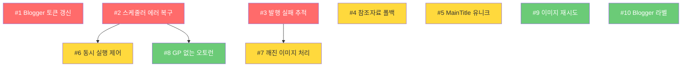

# BlogAuto v2 안정성 개선 계획서

> **버전**: v1.0.0
> **작성일**: 2026-03-30
> **대상 서비스**: services/republish
> **총 예상 작업량**: 약 24~32시간

---

## 목차

1. [개요](#개요)
2. [높은 우선순위 (P0)](#높은-우선순위-p0)
3. [중간 우선순위 (P1)](#중간-우선순위-p1)
4. [낮은 우선순위 (P2)](#낮은-우선순위-p2)
5. [의존성 그래프](#의존성-그래프)
6. [구현 로드맵](#구현-로드맵)

---

## 개요

시스템 전체 점검에서 발견된 10개 문제점에 대한 수정 계획입니다.
운영 중 실제 장애로 이어질 가능성이 높은 순서대로 우선순위를 부여하였습니다.

**우선순위 기준**:
- P0 (높음): 운영 장애 직결, 데이터 손실 또는 무한 루프 가능성
- P1 (중간): 품질 저하, 자원 낭비, 간헐적 오류
- P2 (낮음): 기능 제약, 사용성 불편

---

## 높은 우선순위 (P0)

### 1. Blogger 재발행 시 토큰 갱신 없음

**현재 상태**

- 파일: `app/services/blogger_service.py`
- `BloggerRepublishService._make_request()`에서 400~499 에러를 모두 `BloggerAPIError`로 raise
- 401 Unauthorized 발생 시 토큰 갱신 시도 없이 즉시 에러 발생
- 반면 `app/services/publishing/blogger_publisher.py`의 `BloggerPublisher.publish()`는 401 시 `_exchange_refresh_token()`을 호출하여 토큰 갱신 로직이 이미 구현되어 있음

**문제의 영향 범위**

- 재발행(republish) 작업 전체가 토큰 만료 시 실패
- Google OAuth access_token의 유효기간은 약 1시간이므로, 장기 오토런 시 반드시 만료 발생
- 오토런 중 Blogger 재발행이 1시간 이후부터 모두 실패하게 됨

**수정 방안**

1. `BloggerRepublishService`에 `_refresh_access_token(credential)` 메서드 추가
   - `GoogleCredential`의 `refresh_token`으로 Google OAuth2 토큰 엔드포인트 호출
   - 새 access_token을 `GoogleCredential` 모델에 업데이트
2. `_make_request()`에서 401 응답 시:
   - 토큰 갱신 1회 시도
   - 갱신 성공 시 헤더 재구성 후 요청 재시도
   - 갱신 실패 시 기존처럼 에러 raise
3. `BloggerPublisher`의 기존 `_exchange_refresh_token()` 로직을 공통 유틸로 추출하여 재사용

```
변경 파일:
- app/services/blogger_service.py (토큰 갱신 로직 추가)
- app/services/publishing/blogger_publisher.py (공통 유틸 추출)
- (신규) app/services/publishing/google_oauth_helper.py (공통 토큰 갱신)
```

**예상 작업량**: 2~3시간

**의존성**: 없음 (독립 작업)

---

### 2. 스케줄러 에러 시 다음 실행 미등록

**현재 상태**

- 파일: `app/scheduler/flow_scheduler.py` (953행 부근)
- `_execute_module_callback()`의 try 블록 안에서 실행 후 다음 스케줄을 등록하는 구조 (919~942행)
- except 블록(953행)에서는 에러 로그만 남기고 종료
- 다음 실행 스케줄 등록 코드가 try 블록 내부에만 존재하므로, 예외 발생 시 다음 Job이 영원히 등록되지 않음
- 결과적으로 한 번 에러가 발생하면 해당 action_type의 오토런이 영구 정지

**문제의 영향 범위**

- 모든 오토런 플로우(collect, generate, publish, republish, data)에 영향
- 네트워크 일시 장애, DB 타임아웃 등 일시적 에러로도 오토런 영구 정지 가능
- 사용자가 수동으로 오토런을 재등록해야만 복구됨

**수정 방안**

1. `_execute_module_callback()`의 except 블록에 다음 실행 스케줄 등록 로직 추가
2. `finally` 블록 패턴으로 리팩토링하여, 성공/실패 무관하게 다음 스케줄이 항상 등록되도록 변경
3. 에러 발생 시 다음 실행까지의 간격을 기본 간격 또는 고정 폴백(예: 15분)으로 설정
4. 연속 실패 횟수를 `FlowExecutionState`에 기록하고, 임계값(예: 5회) 초과 시 오토런 일시정지 + 사용자 알림

```
변경 파일:
- app/scheduler/flow_scheduler.py (_execute_module_callback 리팩토링)
- app/models/flow_execution_state.py (연속 실패 횟수 필드 추가 검토)
```

**예상 작업량**: 3~4시간

**의존성**: 없음 (독립 작업)

---

### 3. 발행 실패 횟수 미추적

**현재 상태**

- 파일: `app/models/crawled_post.py`
- CrawledPost 모델에 발행 시도 횟수, 마지막 에러 메시지, 마지막 시도 시각 필드 없음
- `PublisherPipeline.publish_batch()`에서 발행 실패 시 다음 시도에 동일 글을 다시 선택
- `InventoryManager.get_post_for_publish()`는 `source="generated" AND published_at IS NULL` 조건으로 조회하므로, 실패한 글이 계속 최상위로 선택됨

**문제의 영향 범위**

- 특정 글이 발행 불가능한 경우(예: 제목에 특수문자, HTML 파싱 에러) 무한 재시도
- 정상 발행 가능한 다른 글이 발행되지 못하고 대기열에 쌓임
- 디버깅 시 실패 원인 추적 불가

**수정 방안**

1. CrawledPost 모델에 필드 추가:
   - `publish_attempts`: Integer, default=0 (발행 시도 횟수)
   - `last_publish_error`: Text, nullable (마지막 에러 메시지)
   - `last_publish_attempted_at`: DateTime, nullable (마지막 시도 시각)
2. `PublisherPipeline.publish_post()` 실패 시 해당 필드 업데이트
3. `InventoryManager.get_post_for_publish()` 쿼리에 조건 추가:
   - `publish_attempts < MAX_RETRY_COUNT` (예: 3회)
   - 또는 `publish_attempts`가 적은 순서로 정렬
4. 최대 시도 횟수 초과 시 `source`를 "failed"로 변경하거나 별도 상태 필드 추가
5. Alembic 마이그레이션 스크립트 작성

```
변경 파일:
- app/models/crawled_post.py (필드 3개 추가)
- app/services/publishing/publisher_pipeline.py (실패 시 필드 업데이트)
- app/services/generation/inventory_manager.py (쿼리 조건 추가)
- (신규) alembic/versions/033_add_publish_retry_fields.py
```

**예상 작업량**: 3~4시간

**의존성**: 없음 (독립 작업)

---

## 중간 우선순위 (P1)

### 4. 참조자료 수집 실패 시 폴백 없음

**현재 상태**

- 파일: `app/services/generation/reference_collector.py` (112행)
- `collect_and_summarize()`의 except 블록에서 `ReferenceCollectionResult(count=0)`을 반환
- 파일: `app/services/generation/generator.py` (179~203행)
- generator가 `ref_result.count`를 확인하지 않고 `ref_result.to_prompt_injection()`을 프롬프트에 주입
- 참조자료가 0건이면 빈 문자열이 주입되어 글 품질이 크게 저하
- 네이버 API 키 미설정, API 호출 실패 등의 상황에서 빈 참조로 글 생성이 진행됨

**문제의 영향 범위**

- 참조자료 없는 저품질 글이 발행됨
- 네이버 API 일시 장애 시 전체 생성 파이프라인의 품질 저하
- 사용자가 인지하지 못한 채 품질 낮은 글이 자동 발행

**수정 방안**

1. `ContentGenerator._execute_pipeline()`에서 참조자료 수집 결과 확인 분기 추가:
   - `ref_result.count == 0`일 때 모듈 설정의 `reference.required` 플래그 확인
   - `required=True`이면 글 생성 중단, `GenerationResult(success=False)` 반환
   - `required=False`(기본값)이면 경고 로그 후 참조 없이 계속
2. 참조자료 수집 재시도 옵션 추가:
   - 모듈 설정에 `reference.retry_count` (기본 1)
   - 첫 시도 실패 시 검색어를 단순화(제목 앞부분만)하여 재시도
3. GenerationResult에 `warnings` 필드 추가하여 "참조자료 없이 생성됨" 경고 전달
4. 오토런 로그에 경고 정보 기록

```
변경 파일:
- app/services/generation/generator.py (참조자료 검증 로직)
- app/services/generation/reference_collector.py (재시도 로직)
- (선택) Module.settings 스키마 문서 업데이트
```

**예상 작업량**: 2~3시간

**의존성**: 없음

---

### 5. MainTitle 유니크 제약 없음

**현재 상태**

- 파일: `app/models/title.py` (66행)
- `MainTitle.title`에 `index=True`만 설정, `unique=True` 없음
- 제목 수집(TempTitle -> MainTitle 이동) 과정에서 중복 검사가 코드 레벨에서만 수행
- 동시 실행 시 race condition으로 동일 제목이 여러 개 생성 가능

**문제의 영향 범위**

- 동일 제목의 글이 여러 번 생성/발행될 수 있음
- 재고(inventory) 계산이 부정확해짐
- 매칭 로직에서 혼동 발생 가능

**수정 방안**

1. MainTitle에 복합 유니크 제약 추가 검토:
   - 단순 `title` UNIQUE는 위험 (같은 제목이 다른 카테고리에 있을 수 있음)
   - `(title, topic_id)` 또는 `(title, subtopic_id)` 복합 유니크 권장
2. 제목 이동(TempTitle -> MainTitle) 로직에 DB 레벨 중복 검사 추가:
   - `INSERT ... ON CONFLICT DO NOTHING` 패턴 또는
   - 이동 전 `SELECT FOR UPDATE`로 잠금
3. Alembic 마이그레이션:
   - 기존 중복 데이터 정리 스크립트 포함
   - 유니크 인덱스 추가

```
변경 파일:
- app/models/title.py (유니크 제약 추가)
- (신규) alembic/versions/034_add_main_title_unique.py
- 제목 이동 관련 서비스 파일 (중복 검사 강화)
```

**예상 작업량**: 2~3시간 (기존 데이터 정리 포함)

**의존성**: 없음

---

### 6. 플로우별 동시 실행 제어 없음

**현재 상태**

- 파일: `app/scheduler/flow_scheduler.py`
- 동일 플로우의 동일 action_type이 이전 실행 완료 전에 다시 트리거될 수 있음
- `FlowExecutionState`에 실행 중 여부 필드 없음
- 특히 generate 액션은 AI API 호출 + 이미지 생성으로 수 분 소요 가능

**문제의 영향 범위**

- 동일 블로그에 대한 동시 생성으로 중복 글 발행
- AI API 비용 이중 청구
- DB 세션 충돌 가능성

**수정 방안**

1. `FlowExecutionState`에 `is_running` (Boolean) 필드 추가
2. `_execute_module_callback()` 진입 시:
   - `is_running=True`이면 실행 스킵 + 로그 기록
   - `is_running=False`이면 `is_running=True`로 설정 후 실행
3. 실행 완료/실패 시 `finally` 블록에서 `is_running=False`로 복원
4. 안전장치: `is_running=True`이지만 `last_executed_at`이 30분 이상 전이면 강제 해제 (좀비 방지)

```
변경 파일:
- app/models/flow_execution_state.py (is_running, last_execution_started_at 추가)
- app/scheduler/flow_scheduler.py (동시 실행 가드 로직)
- (신규) alembic/versions/035_add_execution_guard.py
```

**예상 작업량**: 3~4시간

**의존성**: #2 (스케줄러 에러 처리)와 함께 작업 권장

---

### 7. 로컬 이미지 업로드 실패 시 404 URL 남음

**현재 상태**

- 파일: `app/services/publishing/publisher_pipeline.py` (349~384행)
- `_upload_inline_images()`에서 인라인 이미지 업로드 실패 시 로컬 URL(`/static/generated/images/...`)을 그대로 유지
- 발행된 글에서 해당 URL은 외부에서 접근 불가하여 404 발생
- 대표 이미지(`_upload_image`)도 실패 시 이미지 없이 발행되나, `post.image_url`은 로컬 경로로 남아있음

**문제의 영향 범위**

- 발행된 글에 깨진 이미지 표시
- SEO 점수 하락 (이미지 404는 구글 크롤링 품질 저하)
- 사용자 경험 저하

**수정 방안**

1. `_upload_inline_images()`에서 업로드 실패한 이미지에 대해:
   - 옵션 A: 로컬 URL을 완전히 제거 (img 태그 삭제)
   - 옵션 B: 플레이스홀더 이미지 URL로 대체
   - 옵션 C (권장): 이미지 태그에 `data-upload-failed="true"` 속성 추가 + 로컬 URL 제거
2. 발행 결과 `PublishResult.warnings`에 실패한 이미지 목록 기록
3. 대표 이미지 업로드 실패 시에도 `post.image_url`을 None으로 정리

```
변경 파일:
- app/services/publishing/publisher_pipeline.py (_upload_inline_images 수정)
- app/services/publishing/publish_result.py (warnings 필드 확인/추가)
```

**예상 작업량**: 2시간

**의존성**: 없음

---

## 낮은 우선순위 (P2)

### 8. GP 없는 플로우 오토런 불가

**현재 상태**

- 파일: `app/scheduler/flow_scheduler.py` (152~161행)
- `register_flow()`에서 GP(Growth Profile) 모듈이 없으면 오토런 등록 자체를 거부
- collect, data 같은 단순 수집 플로우는 GP가 불필요하지만 오토런 불가

**문제의 영향 범위**

- 제목 수집, 데이터 갱신 등 단순 반복 작업의 자동화 불가
- 사용자가 반드시 GP 모듈을 추가해야 하는 불필요한 제약

**수정 방안**

1. GP 필수 여부를 action_type별로 분리:
   - `generate`, `publish`, `republish`: GP 필수 (성장 단계별 전략 필요)
   - `collect`, `data`: GP 선택 (없으면 모듈 자체의 스케줄 설정 사용)
2. GP 없는 경우 폴백 스케줄 설정:
   - Module.settings의 레거시 `schedule_matrix`, `jitter_*` 필드 활용
   - 또는 플로우 레벨 기본 간격 설정 (예: 60분)

```
변경 파일:
- app/scheduler/flow_scheduler.py (register_flow GP 필수 조건 완화)
- app/scheduler/flow_scheduler.py (_get_gp_interval 폴백 로직)
```

**예상 작업량**: 2~3시간

**의존성**: #2 (스케줄러 에러 처리 선행 권장)

---

### 9. 이미지 생성 재시도 없음

**현재 상태**

- 파일: `app/services/generation/generator.py` (268~289행)
- 이미지 생성(`ImageGenerator.generate()`) 실패 시 try/except로 감싸고 경고 로그만 남김
- 재시도 로직 없음
- DALL-E API의 간헐적 타임아웃, rate limit 등에 취약

**문제의 영향 범위**

- 간헐적으로 이미지 없는 글이 발행됨
- 이미지 모드가 "openai"이고 API 일시 장애인 경우 전체 글에 이미지 누락

**수정 방안**

1. `ImageGenerator.generate()`에 재시도 로직 추가:
   - 최대 2회 재시도, 지수 백오프 (2초, 4초)
   - 429 (rate limit) 에러는 `Retry-After` 헤더 존중
2. 또는 `ContentGenerator._execute_pipeline()`에서 이미지 생성 부분에 간단한 retry wrapper 적용
3. `GenerationResult`에 `image_retry_count` 필드 추가하여 모니터링

```
변경 파일:
- app/services/generation/image_generator.py (재시도 로직)
- 또는 app/services/generation/generator.py (retry wrapper)
```

**예상 작업량**: 1~2시간

**의존성**: 없음

---

### 10. Blogger 라벨 자동 설정 없음

**현재 상태**

- 파일: `app/services/publishing/blogger_publisher.py` (123~126행)
- `_get_labels(blog)`가 `Blog.placeholders`에서 정적 라벨만 가져옴
- CrawledPost/MainTitle의 카테고리(Topic/SubTopic) 정보를 라벨로 자동 매핑하지 않음

**문제의 영향 범위**

- Blogger 글의 라벨이 비어있거나 모두 동일한 라벨
- 블로그 카테고리 분류가 제대로 되지 않음
- SEO 및 사용자 내비게이션에 불리

**수정 방안**

1. `BloggerPublisher.publish()`에서 `post`의 카테고리 정보를 라벨로 변환:
   - `CrawledPost.matched_main_title` -> `MainTitle.topic_id/subtopic_id` -> Topic/SubTopic.name
   - DB 조회가 필요하므로 `AsyncSession`을 `BloggerPublisher`에 전달하거나,
     `PublisherPipeline`에서 미리 라벨을 조회하여 전달
2. `Blog.placeholders`의 정적 라벨과 카테고리 기반 동적 라벨을 병합
3. 라벨 매핑 설정을 Blog 레벨에서 커스터마이징 가능하도록 설정 추가

```
변경 파일:
- app/services/publishing/blogger_publisher.py (_get_labels 확장)
- app/services/publishing/publisher_pipeline.py (라벨 정보 사전 조회)
```

**예상 작업량**: 2~3시간

**의존성**: 없음

---

## 의존성 그래프



**핵심 의존 관계**:
- #6 (동시 실행 제어)은 #2 (스케줄러 에러 복구)의 `finally` 패턴 리팩토링 위에 구현하는 것이 효율적
- #8 (GP 없는 오토런)은 #2의 스케줄러 안정화 이후 작업해야 안전
- #7 (깨진 이미지)은 #3 (발행 실패 추적) 필드를 활용하여 이미지 실패도 기록 가능

---

## 구현 로드맵

### Phase 1: 핵심 안정성 (1주차)

| 순서 | 이슈 | 예상 시간 | 병렬 가능 |
|------|------|-----------|-----------|
| 1-A | #2 스케줄러 에러 시 다음 실행 미등록 | 3~4h | 독립 |
| 1-B | #1 Blogger 토큰 갱신 | 2~3h | 1-A와 병렬 |
| 1-C | #3 발행 실패 횟수 추적 | 3~4h | 1-A와 병렬 |

> Phase 1 완료 후 반드시 오토런 24시간 모니터링 수행

### Phase 2: 품질 보강 (2주차)

| 순서 | 이슈 | 예상 시간 | 병렬 가능 |
|------|------|-----------|-----------|
| 2-A | #6 동시 실행 제어 | 3~4h | #2 완료 후 |
| 2-B | #4 참조자료 폴백 | 2~3h | 2-A와 병렬 |
| 2-C | #7 깨진 이미지 처리 | 2h | 2-A와 병렬 |
| 2-D | #5 MainTitle 유니크 | 2~3h | 독립 |

### Phase 3: 기능 개선 (3주차)

| 순서 | 이슈 | 예상 시간 | 병렬 가능 |
|------|------|-----------|-----------|
| 3-A | #8 GP 없는 오토런 | 2~3h | #2 완료 후 |
| 3-B | #9 이미지 재시도 | 1~2h | 독립 |
| 3-C | #10 Blogger 라벨 | 2~3h | 독립 |

### DB 마이그레이션 요약

| 마이그레이션 | 이슈 | 변경 내용 |
|-------------|------|-----------|
| 033 | #3 | `crawled_posts`에 `publish_attempts`, `last_publish_error`, `last_publish_attempted_at` 추가 |
| 034 | #5 | `main_titles`에 복합 유니크 인덱스 추가 |
| 035 | #6 | `flow_execution_states`에 `is_running`, `last_execution_started_at` 추가 |

---

## 테스트 계획

각 이슈 수정 후 다음 테스트 수행:

1. **단위 테스트**: 변경된 서비스/모델별 pytest 작성
2. **통합 테스트**: 오토런 시나리오 (정상/에러/동시실행)
3. **수동 검증**:
   - Blogger 토큰 만료 후 재발행 동작 확인
   - 스케줄러 인위적 에러 발생 후 다음 실행 등록 확인
   - 동일 글 3회 발행 실패 후 스킵 확인
4. **24시간 모니터링**: Phase 1 완료 후 오토런 로그 확인

---

> **참고**: 이 계획서는 코드 수정 방향을 기술한 것이며, 실제 구현 시 Mermaid 순서도를 먼저 작성한 후 코딩을 시작합니다.
