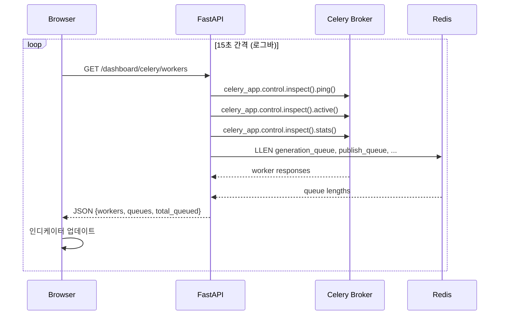
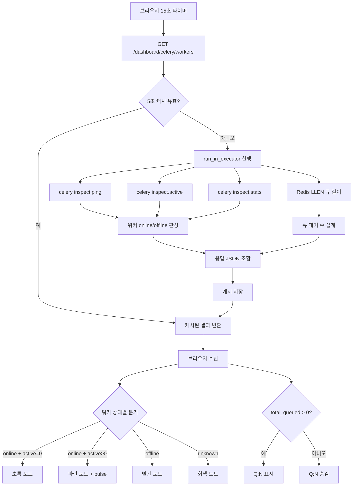
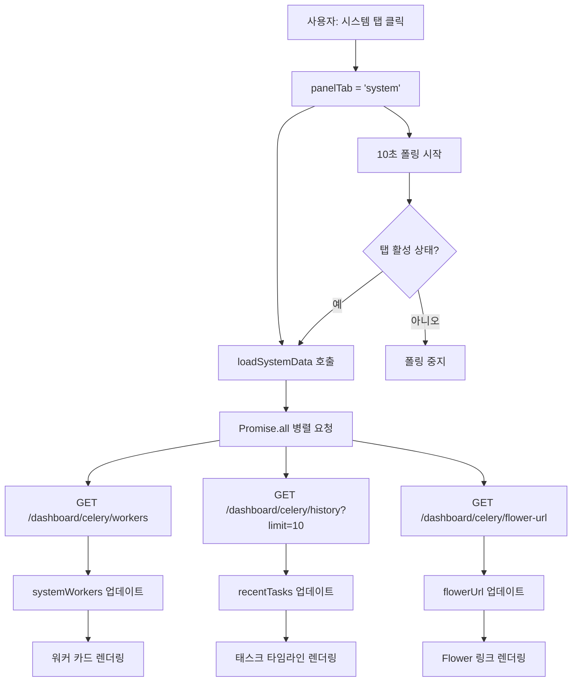

# Celery Worker Status UI 구현 계획서

> **버전**: v1.0.0 | **작성일**: 2026-04-23 | **상태**: 승인됨

---

## 1. 개요

BlogAuto v2 시스템의 Celery 워커 상태를 사용자에게 실시간으로 시각화하는 하이브리드 UI를 구현한다.

**하이브리드 접근법**:
- **Layer 1**: 기존 동작로그 바(`bg-gray-900`)에 워커 상태 인디케이터 추가
- **Layer 2**: 대시보드 패널에 "시스템" 탭 추가 (상세 모니터링)

**핵심 원칙**: Flower(localhost:5555)가 상세 모니터링 역할을 하므로, 이 UI는 "한눈에 파악 가능한 요약 정보"에 집중한다.

---

## 2. 현재 상태 분석

### 2.1 기존 인프라

| 구성 요소 | 파일 경로 | 현재 상태 |
|-----------|-----------|-----------|
| Celery 설정 | `app/core/celery_config.py` | 5큐 체계 (generation, publish, image, utility, callback) |
| 큐 모니터링 API | `app/routers/dashboard_celery.py` | Redis LLEN 기반 큐 길이 조회 + TaskExecution 이력 |
| 동작로그 바 | `app/templates/components/global_summary.html` | `bg-gray-900` 바에 시간+레벨+메시지 표시 |
| 대시보드 패널 | `global_summary.html` 내 슬라이드 패널 | 3탭: 요약탭 선택, 최근 활동, 동작 로그 |
| GlobalSummary JS | `app/static/js/components/GlobalSummary.js` | 22개 요약탭 + 로그 폴링 |
| TaskExecution 모델 | `app/models/task_execution.py` | status: pending/running/success/failed/retrying |
| Flower | `docker-compose.yml` | localhost:5555 노출 |

### 2.2 Docker 워커 구성 (현재)

```
celery_generation_worker  - generation_queue      (autoscale=8,3)
celery_publish_worker     - publish_queue          (autoscale=5,2)
celery_image_worker       - image_queue            (concurrency=2)  ← 제거 예정
celery_utility_worker     - utility_queue,callback (concurrency=2)
```

**참고**: image_worker는 generation_worker에 통합 예정. UI에서는 3개 워커(G/P/U)만 표시한다.

### 2.3 기존 API 한계

`dashboard_celery.py`의 `/status` 엔드포인트는 Redis LLEN과 TaskExecution DB 집계만 제공한다. **워커의 online/offline 상태, active task 수 등 실시간 워커 정보가 없다.**

---

## 3. 목표

### 3.1 기능 목표

| 우선순위 | 목표 | 설명 |
|----------|------|------|
| P0 | 워커 온라인 여부 확인 | 3개 워커의 online/offline 상태를 로그바에서 즉시 확인 |
| P0 | 큐 대기 작업 수 표시 | 전체 대기 작업 수를 한눈에 파악 |
| P1 | 상세 워커 정보 제공 | 워커별 active tasks, processed count, 큐별 대기 수 |
| P1 | 최근 태스크 타임라인 | 최근 실행된 태스크 이력을 시스템 탭에서 조회 |
| P2 | Flower 연동 | 상세 분석이 필요할 때 Flower로 바로 이동 |

### 3.2 비기능 목표

- 로그바 폴링 주기: **15초** (네트워크 부담 최소화)
- 시스템 탭 폴링 주기: **10초** (탭 활성 시에만)
- Celery `inspect()` 호출은 `run_in_executor`로 비동기 래핑
- 로그바 인디케이터는 모바일에서도 표시 (반응형)

---

## 4. 기술 설계

### 4.1 아키텍처 다이어그램

```
┌─────────────────────────────────────────────────────────┐
│  Browser (Alpine.js)                                    │
│                                                         │
│  ┌──────────────────┐    ┌──────────────────────────┐   │
│  │ 로그바 인디케이터  │    │ 대시보드 "시스템" 탭      │   │
│  │ (15초 폴링)       │    │ (10초 폴링, 탭 활성 시)   │   │
│  └────────┬─────────┘    └─────────┬────────────────┘   │
│           │                        │                     │
│           └────────┬───────────────┘                     │
│                    │ GET /dashboard/celery/workers       │
└────────────────────┼────────────────────────────────────┘
                     │
┌────────────────────┼────────────────────────────────────┐
│  FastAPI           │                                    │
│  dashboard_celery.py                                    │
│                    │                                    │
│  ┌─────────────────▼─────────────────┐                  │
│  │  /workers 엔드포인트               │                  │
│  │  run_in_executor(inspect_workers) │                  │
│  └────────┬──────────────┬───────────┘                  │
│           │              │                              │
│  ┌────────▼───────┐ ┌───▼──────────┐                   │
│  │ Celery inspect │ │ Redis LLEN   │                   │
│  │ (sync → async) │ │ (큐 길이)    │                   │
│  └────────────────┘ └──────────────┘                   │
└─────────────────────────────────────────────────────────┘
```

### 4.2 데이터 흐름



### 4.3 API 응답 설계

`GET /dashboard/celery/workers` 응답:

```json
{
  "workers": {
    "generation": {
      "name": "generation@hostname",
      "status": "online",
      "active_tasks": 2,
      "processed": 1523,
      "concurrency": 8,
      "uptime": "2d 14h"
    },
    "publish": {
      "name": "publish@hostname",
      "status": "online",
      "active_tasks": 0,
      "processed": 892,
      "concurrency": 5,
      "uptime": "2d 14h"
    },
    "utility": {
      "name": "utility@hostname",
      "status": "offline",
      "active_tasks": 0,
      "processed": 0,
      "concurrency": 0,
      "uptime": null
    }
  },
  "queues": {
    "generation_queue": 3,
    "publish_queue": 0,
    "image_queue": 0,
    "utility_queue": 1,
    "callback_queue": 0
  },
  "total_queued": 4,
  "timestamp": "2026-04-23T14:30:00+09:00"
}
```

### 4.4 백엔드 구현 상세

`app/routers/dashboard_celery.py`에 `/workers` 엔드포인트 추가:

```python
import asyncio
from datetime import datetime, timezone
from functools import partial

from celery import Celery


# 워커 이름 → 표시 키 매핑
WORKER_KEY_MAP = {
    "generation": "generation",
    "publish": "publish",
    "utility": "utility",
}


@router.get("/workers", summary="Celery 워커 실시간 상태")
async def get_worker_status() -> dict:
    """
    Celery inspect()와 Redis LLEN을 조합하여 워커 실시간 상태를 조회합니다.

    Returns:
        dict: workers(워커별 상태), queues(큐별 대기 수), total_queued, timestamp
    """
    loop = asyncio.get_event_loop()
    worker_info = await loop.run_in_executor(None, _inspect_workers)
    queue_lengths = await loop.run_in_executor(None, _get_queue_lengths)

    total_queued = sum(
        max(v, 0) for k, v in queue_lengths.items()
        if k not in ("callback_queue",)
    )

    return {
        "workers": worker_info,
        "queues": queue_lengths,
        "total_queued": total_queued,
        "timestamp": datetime.now(timezone.utc).isoformat(),
    }


def _inspect_workers() -> dict:
    """
    Celery inspect()로 워커 상태를 조회합니다.
    동기 함수이므로 run_in_executor로 호출해야 합니다.

    timeout=3초로 설정하여 워커가 응답하지 않는 경우 빠르게 반환합니다.

    Returns:
        dict: 워커 키별 상태 정보
    """
    from app.core.celery_config import celery_app

    result = {
        key: {
            "name": None,
            "status": "offline",
            "active_tasks": 0,
            "processed": 0,
            "concurrency": 0,
            "uptime": None,
        }
        for key in WORKER_KEY_MAP.values()
    }

    try:
        inspector = celery_app.control.inspect(timeout=3.0)

        # ping으로 온라인 워커 확인
        ping_response = inspector.ping() or {}

        # active tasks 조회
        active_response = inspector.active() or {}

        # 통계 조회
        stats_response = inspector.stats() or {}

        for worker_name in ping_response:
            # worker_name 예: "generation@hostname"
            worker_key = _resolve_worker_key(worker_name)
            if worker_key is None:
                continue

            result[worker_key]["name"] = worker_name
            result[worker_key]["status"] = "online"

            # active tasks
            active_tasks = active_response.get(worker_name, [])
            result[worker_key]["active_tasks"] = len(active_tasks)

            # stats
            stats = stats_response.get(worker_name, {})
            total_tasks = stats.get("total", {})
            processed = sum(
                v for k, v in total_tasks.items()
                if k.startswith("tasks.")
            ) if isinstance(total_tasks, dict) else 0
            result[worker_key]["processed"] = processed

            pool = stats.get("pool", {})
            result[worker_key]["concurrency"] = pool.get(
                "max-concurrency", 0
            )

            # uptime 계산
            clock = stats.get("clock", None)
            if clock:
                hours = int(clock) // 3600
                days = hours // 24
                remaining_hours = hours % 24
                result[worker_key]["uptime"] = (
                    f"{days}d {remaining_hours}h"
                    if days > 0
                    else f"{remaining_hours}h"
                )

    except Exception as e:
        logger.warning(f"[WORKER_STATUS] inspect 실패: {e}")

    return result


def _resolve_worker_key(worker_name: str) -> str | None:
    """
    워커 이름에서 키를 추출합니다.

    Args:
        worker_name: Celery 워커 이름 (예: "generation@hostname")

    Returns:
        str | None: 워커 키 또는 None
    """
    for prefix, key in WORKER_KEY_MAP.items():
        if worker_name.startswith(prefix):
            return key
    return None
```

### 4.5 inspect() 호출 최적화

Celery `inspect()`는 동기 호출이며 내부적으로 브로커를 통한 RPC를 수행한다. 주요 고려사항:

| 항목 | 설계 | 이유 |
|------|------|------|
| timeout | 3초 | 워커 응답 없으면 offline 판정 |
| run_in_executor | 기본 ThreadPoolExecutor | 이벤트 루프 블로킹 방지 |
| 호출 빈도 | 15초 (로그바) / 10초 (시스템 탭) | Redis/Celery 부하 최소화 |
| 캐싱 | 서버 측 5초 캐시 | 동일 시점 다수 요청 병합 |

**서버 측 캐시 구현**:

```python
import time

_worker_cache: dict = {}
_worker_cache_time: float = 0.0
_CACHE_TTL: float = 5.0  # 5초 캐시


def _inspect_workers_cached() -> dict:
    """5초 TTL 캐시가 적용된 워커 상태 조회."""
    global _worker_cache, _worker_cache_time

    now = time.monotonic()
    if now - _worker_cache_time < _CACHE_TTL and _worker_cache:
        return _worker_cache

    result = _inspect_workers()
    _worker_cache = result
    _worker_cache_time = now
    return result
```

---

## 5. UI 설계

### 5.1 Layer 1: 로그바 워커 인디케이터

기존 동작로그 바(`bg-gray-900`) 좌측에 워커 상태 인디케이터를 추가한다.

**ASCII 목업**:

```
┌─────────────────────────────────────────────────────────────────┐
│ [G●] [P●] [U●]  Q:3  │ 14:30:05 INFO [N] 블로그 포스트 발행... │
│                       │ 14:29:52 SUCCESS [W] 제목 재조합 완료    │
└─────────────────────────────────────────────────────────────────┘
  ▲                ▲     ▲
  워커 인디케이터    큐 수   기존 로그 메시지
```

**상태 도트 색상**:

| 상태 | 도트 색상 | Tailwind 클래스 | 설명 |
|------|----------|----------------|------|
| idle (online, 0 active) | 초록 | `bg-green-400` | 온라인, 대기 중 |
| busy (online, >0 active) | 파란+펄스 | `bg-blue-400 animate-pulse` | 온라인, 작업 중 |
| offline | 빨강 | `bg-red-400` | 응답 없음 |
| unknown | 회색 | `bg-gray-500` | 초기 로딩/데이터 없음 |

**HTML 구조** (`global_summary.html` 내 동작로그 바 수정):

```html
<!-- 동작로그 바 -->
<div class="border-t border-gray-200 bg-gray-900">
    <div class="max-w-7xl mx-auto px-4 py-1">
        <!-- 워커 상태 + 로그 컨테이너 -->
        <div class="flex items-start gap-3">
            <!-- 워커 인디케이터 영역 (좌측 고정) -->
            <div class="flex items-center gap-2 flex-shrink-0 py-0.5">
                <!-- Generation 워커 -->
                <div class="flex items-center gap-1" :title="getWorkerTooltip('generation')">
                    <span class="text-[10px] font-bold text-gray-400">G</span>
                    <span class="w-2 h-2 rounded-full"
                          :class="getWorkerDotClass('generation')"></span>
                </div>
                <!-- Publish 워커 -->
                <div class="flex items-center gap-1" :title="getWorkerTooltip('publish')">
                    <span class="text-[10px] font-bold text-gray-400">P</span>
                    <span class="w-2 h-2 rounded-full"
                          :class="getWorkerDotClass('publish')"></span>
                </div>
                <!-- Utility 워커 -->
                <div class="flex items-center gap-1" :title="getWorkerTooltip('utility')">
                    <span class="text-[10px] font-bold text-gray-400">U</span>
                    <span class="w-2 h-2 rounded-full"
                          :class="getWorkerDotClass('utility')"></span>
                </div>
                <!-- 큐 카운터 (0일 때 숨김) -->
                <span x-show="workerStatus.total_queued > 0"
                      x-cloak
                      class="text-[10px] font-mono text-amber-400 ml-1">
                    Q:<span x-text="workerStatus.total_queued"></span>
                </span>
                <!-- 구분선 -->
                <div class="w-px h-3 bg-gray-700 ml-1"></div>
            </div>

            <!-- 기존 로그 메시지 영역 (우측, flex-1) -->
            <div class="flex-1 min-w-0">
                <!-- 기존 로그 template 유지 -->
            </div>
        </div>
    </div>
</div>
```

**모바일 반응형** (화면폭 < 768px):

```
┌──────────────────────────────┐
│ G● P● U● Q:3 │ 14:30 INFO.. │
└──────────────────────────────┘
```

모바일에서도 동일한 레이아웃을 유지하되, 로그 메시지가 슬라이드로 처리되므로 인디케이터 영역은 고정 너비(`flex-shrink-0`)로 유지한다.

### 5.2 Layer 2: 대시보드 "시스템" 탭

기존 대시보드 패널(슬라이드 다운)의 탭 네비게이션에 "시스템" 탭을 추가한다.

**탭 구조 변경**:

```
[요약탭 선택] [최근 활동] [동작 로그] [시스템]  ← 새 탭 추가
```

**시스템 탭 ASCII 목업**:

```
┌─────────────────────────────────────────────────────────┐
│                      시스템 모니터링                       │
│                                                         │
│  ┌──────────────┐ ┌──────────────┐ ┌──────────────┐    │
│  │  Generation   │ │   Publish    │ │   Utility    │    │
│  │  ● Online     │ │  ● Online    │ │  ● Offline   │    │
│  │               │ │              │ │              │    │
│  │  Active: 2    │ │  Active: 0   │ │  Active: -   │    │
│  │  처리: 1,523  │ │  처리: 892   │ │  처리: -     │    │
│  │  동시성: 8    │ │  동시성: 5   │ │  동시성: -   │    │
│  │  가동: 2d 14h │ │  가동: 2d 14h│ │  가동: -     │    │
│  └──────────────┘ └──────────────┘ └──────────────┘    │
│                                                         │
│  ── 큐 상태 ────────────────────────────────────────     │
│  generation_queue  ████████░░░░  3 대기                  │
│  publish_queue     ░░░░░░░░░░░░  0 대기                  │
│  utility_queue     ██░░░░░░░░░░  1 대기                  │
│  callback_queue    ░░░░░░░░░░░░  0 대기                  │
│                                                         │
│  ── 최근 태스크 ────────────────────────────────────     │
│  14:30  ✅  generate_content    blog-A    2.3s          │
│  14:29  ✅  recombine_title     blog-A    0.8s          │
│  14:28  ❌  publish_post        blog-B    timeout       │
│  14:25  ✅  collect_keywords    -         1.2s          │
│                                                         │
│  [🌸 Flower에서 상세 보기 →]                             │
└─────────────────────────────────────────────────────────┘
```

**워커 카드 HTML**:

```html
<!-- 워커 카드 그리드 -->
<div class="grid grid-cols-1 md:grid-cols-3 gap-4 mb-6">
    <template x-for="wk in ['generation', 'publish', 'utility']" :key="wk">
        <div class="bg-white rounded-xl border p-4 shadow-sm"
             :class="systemWorkers[wk]?.status === 'online'
                 ? 'border-green-200'
                 : 'border-red-200 bg-red-50/30'">
            <!-- 워커 헤더 -->
            <div class="flex items-center justify-between mb-3">
                <span class="text-sm font-bold text-gray-800 uppercase"
                      x-text="getWorkerLabel(wk)"></span>
                <div class="flex items-center gap-1.5">
                    <span class="w-2.5 h-2.5 rounded-full"
                          :class="getWorkerDotClass(wk)"></span>
                    <span class="text-xs font-medium"
                          :class="systemWorkers[wk]?.status === 'online'
                              ? 'text-green-600' : 'text-red-500'"
                          x-text="systemWorkers[wk]?.status === 'online'
                              ? 'Online' : 'Offline'"></span>
                </div>
            </div>
            <!-- 워커 상세 정보 -->
            <div class="space-y-2 text-sm">
                <div class="flex justify-between">
                    <span class="text-gray-500">활성 작업</span>
                    <span class="font-medium text-gray-800"
                          x-text="systemWorkers[wk]?.active_tasks ?? '-'"></span>
                </div>
                <div class="flex justify-between">
                    <span class="text-gray-500">처리 완료</span>
                    <span class="font-medium text-gray-800"
                          x-text="(systemWorkers[wk]?.processed ?? 0).toLocaleString()"></span>
                </div>
                <div class="flex justify-between">
                    <span class="text-gray-500">동시성</span>
                    <span class="font-medium text-gray-800"
                          x-text="systemWorkers[wk]?.concurrency ?? '-'"></span>
                </div>
                <div class="flex justify-between">
                    <span class="text-gray-500">가동 시간</span>
                    <span class="font-medium text-gray-800"
                          x-text="systemWorkers[wk]?.uptime ?? '-'"></span>
                </div>
            </div>
        </div>
    </template>
</div>
```

**큐 상태 프로그레스 바**:

```html
<!-- 큐 상태 -->
<div class="mb-6">
    <h4 class="text-sm font-bold text-gray-700 mb-3">큐 상태</h4>
    <div class="space-y-3">
        <template x-for="q in displayQueues" :key="q.name">
            <div class="flex items-center gap-3">
                <span class="text-xs text-gray-500 w-32 truncate font-mono"
                      x-text="q.name"></span>
                <div class="flex-1 bg-gray-200 rounded-full h-2.5">
                    <div class="h-2.5 rounded-full transition-all duration-500"
                         :class="q.count > 5 ? 'bg-amber-400' : (q.count > 0 ? 'bg-blue-400' : 'bg-gray-300')"
                         :style="'width: ' + Math.min(100, (q.count / Math.max(1, maxQueueLength)) * 100) + '%'">
                    </div>
                </div>
                <span class="text-xs font-mono w-12 text-right"
                      :class="q.count > 0 ? 'text-amber-600 font-bold' : 'text-gray-400'"
                      x-text="q.count + ' 대기'"></span>
            </div>
        </template>
    </div>
</div>
```

---

## 6. API 설계

### 6.1 신규 엔드포인트

#### `GET /dashboard/celery/workers`

워커 실시간 상태 + 큐 길이를 통합 조회한다.

| 항목 | 값 |
|------|-----|
| Method | GET |
| Path | `/dashboard/celery/workers` |
| Auth | 로그인 필요 (cookie 기반) |
| Rate Limit | 없음 (클라이언트 폴링 주기로 제어) |

**Response (200 OK)**:

```json
{
  "workers": {
    "generation": {
      "name": "generation@hostname",
      "status": "online",
      "active_tasks": 2,
      "processed": 1523,
      "concurrency": 8,
      "uptime": "2d 14h"
    },
    "publish": { "..." },
    "utility": { "..." }
  },
  "queues": {
    "generation_queue": 3,
    "publish_queue": 0,
    "image_queue": 0,
    "utility_queue": 1,
    "callback_queue": 0
  },
  "total_queued": 4,
  "timestamp": "2026-04-23T14:30:00+09:00"
}
```

**Error Response (500)**:

```json
{
  "workers": {
    "generation": { "status": "unknown", "..." },
    "publish": { "status": "unknown", "..." },
    "utility": { "status": "unknown", "..." }
  },
  "queues": {},
  "total_queued": 0,
  "error": "Redis 연결 실패",
  "timestamp": "2026-04-23T14:30:00+09:00"
}
```

**설계 결정**: 에러 발생 시에도 200을 반환하되 `status: "unknown"`으로 표시한다. 프론트엔드가 에러 핸들링을 별도로 하지 않아도 UI가 graceful하게 동작한다.

### 6.2 기존 엔드포인트 (변경 없음)

| 엔드포인트 | 용도 | 시스템 탭 활용 |
|------------|------|---------------|
| `GET /dashboard/celery/status` | 큐 길이 + TaskExecution 집계 | 사용하지 않음 (workers로 대체) |
| `GET /dashboard/celery/history` | 태스크 실행 이력 | 시스템 탭 "최근 태스크" 영역 |
| `GET /dashboard/celery/flower-url` | Flower URL | 시스템 탭 "Flower 링크" |

---

## 7. 구현 단계

### Phase 1: MVP - 로그바 인디케이터 + API (3-4시간)

#### Step 1.1: `/workers` API 엔드포인트 추가

**파일**: `app/routers/dashboard_celery.py`

- [ ] `WORKER_KEY_MAP` 상수 추가
- [ ] `_inspect_workers()` 동기 함수 구현
- [ ] `_inspect_workers_cached()` 5초 TTL 캐시 래퍼 구현
- [ ] `_resolve_worker_key()` 헬퍼 함수 구현
- [ ] `get_worker_status()` async 엔드포인트 구현
- [ ] `MONITORED_QUEUES`에서 `image_queue` 유지 (하위 호환)

#### Step 1.2: GlobalSummary.js에 워커 폴링 추가

**파일**: `app/static/js/components/GlobalSummary.js`

- [ ] `workerStatus` 상태 객체 추가 (workers, queues, total_queued)
- [ ] `loadWorkerStatus()` 메서드 추가
- [ ] `workerPollInterval` 15초 setInterval 설정
- [ ] `getWorkerDotClass(key)` 헬퍼 메서드 추가
- [ ] `getWorkerTooltip(key)` 헬퍼 메서드 추가
- [ ] `destroy()` 시 interval 정리

```javascript
// GlobalSummary.js에 추가할 상태/메서드

workerStatus: {
    workers: {
        generation: { status: 'unknown' },
        publish: { status: 'unknown' },
        utility: { status: 'unknown' },
    },
    queues: {},
    total_queued: 0,
},
workerPollInterval: null,

async loadWorkerStatus() {
    try {
        const resp = await fetch('/dashboard/celery/workers', {
            credentials: 'include'
        });
        if (resp.ok) {
            const data = await resp.json();
            this.workerStatus = data;
        }
    } catch (e) {
        console.warn('워커 상태 조회 실패:', e);
    }
},

getWorkerDotClass(key) {
    const w = this.workerStatus?.workers?.[key];
    if (!w || w.status === 'unknown') return 'bg-gray-500';
    if (w.status === 'offline') return 'bg-red-400';
    if (w.active_tasks > 0) return 'bg-blue-400 animate-pulse';
    return 'bg-green-400';
},

getWorkerTooltip(key) {
    const w = this.workerStatus?.workers?.[key];
    const labels = { generation: '생성', publish: '발행', utility: '유틸리티' };
    if (!w || w.status === 'unknown') return `${labels[key]} 워커: 상태 확인 중`;
    if (w.status === 'offline') return `${labels[key]} 워커: 오프라인`;
    return `${labels[key]} 워커: 온라인 (활성 ${w.active_tasks}개)`;
},
```

#### Step 1.3: 로그바 HTML 수정

**파일**: `app/templates/components/global_summary.html`

- [ ] 동작로그 바 내부에 워커 인디케이터 영역 추가
- [ ] flex 레이아웃으로 인디케이터(좌측 고정) + 로그(우측 flex-1) 배치
- [ ] 큐 카운터 (`Q:N`) 조건부 표시
- [ ] 구분선 (`w-px h-3 bg-gray-700`) 추가

#### Step 1.4: 테스트

- [ ] `/workers` API 수동 테스트 (curl)
- [ ] 워커 온라인/오프라인 시 인디케이터 색상 변경 확인
- [ ] busy 상태 시 animate-pulse 동작 확인
- [ ] 큐 카운터 0일 때 숨김 확인
- [ ] 모바일 반응형 레이아웃 확인

---

### Phase 2: 시스템 탭 (3-4시간)

#### Step 2.1: 탭 네비게이션에 "시스템" 탭 추가

**파일**: `app/templates/components/global_summary.html`

- [ ] 탭 버튼 추가: `panelTab = 'system'`
- [ ] 탭 색상: `border-rose-500 text-rose-600` (기존 탭과 구분)
- [ ] 탭 클릭 시 `loadSystemData()` 호출

#### Step 2.2: 시스템 탭 콘텐츠 구현

**파일**: `app/templates/components/global_summary.html`

- [ ] 워커 카드 3개 (generation, publish, utility)
- [ ] 큐 상태 프로그레스 바 (4개 큐, image_queue 제외)
- [ ] 최근 태스크 타임라인 (TaskExecution 기반)
- [ ] Flower 외부 링크 버튼

#### Step 2.3: GlobalSummary.js 시스템 탭 로직

**파일**: `app/static/js/components/GlobalSummary.js`

- [ ] `systemWorkers` 상태 객체 추가
- [ ] `systemQueues` 상태 객체 추가
- [ ] `recentTasks` 배열 추가
- [ ] `flowerUrl` 문자열 추가
- [ ] `loadSystemData()` 메서드: workers + history + flower-url 병렬 fetch
- [ ] `systemPollInterval` 10초 setInterval (탭 활성 시에만)
- [ ] `getWorkerLabel(key)` 헬퍼: generation→"Generation", publish→"Publish", utility→"Utility"
- [ ] `displayQueues` computed: callback_queue 제외, image_queue 제외
- [ ] `maxQueueLength` computed: 프로그레스 바 비율 계산용

```javascript
// 시스템 탭 데이터 로드
async loadSystemData() {
    const [workersResp, historyResp, flowerResp] = await Promise.all([
        fetch('/dashboard/celery/workers', { credentials: 'include' }),
        fetch('/dashboard/celery/history?limit=10', { credentials: 'include' }),
        fetch('/dashboard/celery/flower-url', { credentials: 'include' }),
    ]);

    if (workersResp.ok) {
        const data = await workersResp.json();
        this.systemWorkers = data.workers;
        this.systemQueues = data.queues;
    }
    if (historyResp.ok) {
        this.recentTasks = await historyResp.json();
    }
    if (flowerResp.ok) {
        const fdata = await flowerResp.json();
        this.flowerUrl = fdata.url;
    }
},
```

#### Step 2.4: 최근 태스크 타임라인 UI

```html
<!-- 최근 태스크 -->
<div class="mb-6">
    <h4 class="text-sm font-bold text-gray-700 mb-3">최근 태스크</h4>
    <div class="space-y-2">
        <template x-for="task in recentTasks" :key="task.id">
            <div class="flex items-center gap-3 text-sm bg-gray-50 rounded-lg px-3 py-2">
                <span class="text-xs text-gray-400 font-mono w-14 flex-shrink-0"
                      x-text="formatTaskTime(task.completed_at || task.created_at)"></span>
                <span class="flex-shrink-0"
                      x-text="task.status === 'success' ? '✅' : (task.status === 'failed' ? '❌' : '🔄')"></span>
                <span class="text-gray-700 truncate flex-1"
                      x-text="task.task_name?.replace('tasks.', '')"></span>
                <span class="text-xs text-gray-400 flex-shrink-0"
                      x-text="getTaskDuration(task)"></span>
            </div>
        </template>
        <div x-show="recentTasks.length === 0"
             class="text-gray-400 text-sm text-center py-4">
            실행된 태스크가 없습니다
        </div>
    </div>
</div>
```

#### Step 2.5: Flower 링크

```html
<!-- Flower 링크 -->
<div class="mt-6 text-center" x-show="flowerUrl">
    <a :href="flowerUrl" target="_blank" rel="noopener noreferrer"
       class="inline-flex items-center gap-2 px-4 py-2 bg-pink-50 text-pink-600 rounded-lg hover:bg-pink-100 transition-colors text-sm font-medium">
        <span>🌸</span>
        <span>Flower에서 상세 보기</span>
        <svg class="w-4 h-4" fill="none" stroke="currentColor" viewBox="0 0 24 24">
            <path stroke-linecap="round" stroke-linejoin="round" stroke-width="2"
                  d="M10 6H6a2 2 0 00-2 2v10a2 2 0 002 2h10a2 2 0 002-2v-4M14 4h6m0 0v6m0-6L10 14"/>
        </svg>
    </a>
</div>
```

#### Step 2.6: 테스트

- [ ] 시스템 탭 진입 시 워커 카드 3개 표시 확인
- [ ] 온라인 워커: 초록 테두리 + "Online" 표시
- [ ] 오프라인 워커: 빨간 테두리 + "Offline" 표시 + 빨간 배경
- [ ] 큐 프로그레스 바: 대기 수에 비례하여 채워짐 확인
- [ ] 최근 태스크: 성공(✅), 실패(❌), 진행중(🔄) 아이콘 확인
- [ ] Flower 링크 클릭 시 새 탭에서 열림 확인
- [ ] 탭 전환 시 폴링 시작/중지 확인
- [ ] 모바일에서 워커 카드 세로 배치 확인

---

### Phase 3: 고급 기능 (선택, 2-3시간)

#### Step 3.1: 오프라인 알림

- [ ] 워커가 online → offline 전환 시 토스트 알림 표시
- [ ] 이전 상태를 `previousWorkerStatus`에 저장하여 비교

#### Step 3.2: 큐 임계값 경고

- [ ] 큐 대기 수 > 10 일 때 프로그레스 바 색상 빨간색 전환
- [ ] 큐 대기 수 > 20 일 때 로그바에 경고 아이콘 표시

#### Step 3.3: 워커 재시작 버튼 (관리자 전용)

- [ ] 시스템 탭에서 워커 ping/restart 버튼 추가 (향후)

---

## 8. 파일 변경 목록

### Phase 1 변경 파일

| 파일 | 변경 유형 | 설명 |
|------|----------|------|
| `app/routers/dashboard_celery.py` | 수정 | `/workers` 엔드포인트 추가 (~80줄) |
| `app/static/js/components/GlobalSummary.js` | 수정 | 워커 폴링 + 헬퍼 메서드 추가 (~60줄) |
| `app/templates/components/global_summary.html` | 수정 | 로그바 내 인디케이터 영역 추가 (~25줄) |

### Phase 2 변경 파일

| 파일 | 변경 유형 | 설명 |
|------|----------|------|
| `app/templates/components/global_summary.html` | 수정 | 시스템 탭 버튼 + 콘텐츠 추가 (~120줄) |
| `app/static/js/components/GlobalSummary.js` | 수정 | 시스템 탭 데이터 로드 + 폴링 로직 (~80줄) |

### 신규 파일

| 파일 | 설명 |
|------|------|
| `docs/flowcharts/worker_status_ui.md` | Mermaid 순서도 (아래 참조) |

### 변경하지 않는 파일

| 파일 | 이유 |
|------|------|
| `app/core/celery_config.py` | 큐/워커 설정 변경 없음 |
| `app/models/task_execution.py` | 스키마 변경 없음 |
| `docker-compose.yml` | 워커 구성 변경 없음 |
| `base.html` | GlobalSummary JS 경로 변경 없음 (캐시 버스터만 업데이트) |

---

## 9. Flowchart (Mermaid)

### 9.1 워커 상태 조회 흐름

`docs/flowcharts/worker_status_ui.md`에 저장:



### 9.2 시스템 탭 데이터 로드 흐름



---

## 10. 테스트 계획

### 10.1 단위 테스트

| 테스트 | 파일 | 설명 |
|--------|------|------|
| `test_resolve_worker_key` | `tests/unit/test_dashboard_celery.py` | 워커 이름 → 키 매핑 |
| `test_inspect_workers_timeout` | `tests/unit/test_dashboard_celery.py` | inspect timeout 시 offline 반환 |
| `test_inspect_workers_cached` | `tests/unit/test_dashboard_celery.py` | 5초 캐시 동작 검증 |
| `test_worker_status_response` | `tests/unit/test_dashboard_celery.py` | 응답 스키마 검증 |

### 10.2 통합 테스트

| 테스트 | 설명 |
|--------|------|
| API 응답 확인 | Docker 환경에서 `/workers` 호출 후 3개 워커 상태 확인 |
| 워커 중지 시나리오 | `docker-compose stop celery_utility_worker` 후 offline 반환 확인 |
| Redis 연결 실패 | Redis 중지 후 큐 길이 -1 반환 확인 |
| 동시 요청 | 캐시 TTL 내 다수 요청 시 inspect() 1회만 호출 확인 |

### 10.3 UI 테스트 (수동)

| 시나리오 | 확인 사항 |
|----------|----------|
| 페이지 로드 | 3개 인디케이터 회색(unknown)으로 시작 → 15초 내 실제 상태 반영 |
| 전체 워커 온라인 | G(초록) P(초록) U(초록), Q:0 숨김 |
| 워커 1개 작업 중 | 해당 워커 파란+pulse |
| 워커 1개 오프라인 | 해당 워커 빨간 |
| 큐 대기 발생 | Q:N 표시, 시스템 탭 프로그레스 바 채워짐 |
| 모바일 화면 | 인디케이터 좌측 고정, 로그 슬라이드 정상 |
| 시스템 탭 진입/퇴장 | 폴링 시작/중지, 데이터 갱신 확인 |

### 10.4 성능 테스트

| 항목 | 기준 | 측정 방법 |
|------|------|----------|
| `/workers` 응답 시간 | < 4초 (첫 호출), < 100ms (캐시) | Chrome DevTools Network |
| inspect() 호출 빈도 | 최대 12회/분 | 서버 로그 확인 |
| 브라우저 메모리 | 증가 없음 (30분 관찰) | Chrome DevTools Memory |

---

## 11. 리스크 및 고려사항

### 11.1 기술적 리스크

| 리스크 | 심각도 | 완화 방안 |
|--------|--------|----------|
| inspect() timeout으로 API 응답 지연 | 높음 | timeout=3초 설정 + 서버 캐시 5초 TTL |
| Redis 연결 실패 시 전체 UI 영향 | 중간 | 에러 시 `status: "unknown"` 반환, UI는 회색 도트 표시 |
| 워커 이름 패턴 변경 시 매핑 실패 | 낮음 | `_resolve_worker_key()`로 분리, docker-compose의 `-n` 옵션과 동기화 |
| 다수 사용자 동시 접속 시 inspect() 과부하 | 중간 | 서버 측 5초 캐시로 inspect() 호출 병합 |

### 11.2 UX 고려사항

| 항목 | 결정 | 이유 |
|------|------|------|
| 초기 로딩 상태 | 회색 도트 (unknown) | 페이지 로드 직후 API 응답 대기 동안 사용자 혼란 방지 |
| 오프라인 경고 | Phase 3에서 구현 | MVP에서는 도트 색상으로 충분, 토스트 알림은 추후 |
| 폴링 주기 | 로그바 15초, 시스템 탭 10초 | 실시간성과 서버 부하 균형 |
| callback_queue 표시 | 시스템 탭에서 제외 | 내부 후처리 큐이므로 사용자에게 불필요한 정보 |
| image_queue 표시 | 시스템 탭에서 제외 | generation_worker에 통합 예정 |

### 11.3 하위 호환성

- 기존 `/dashboard/celery/status` 엔드포인트는 유지한다 (다른 곳에서 사용 가능성).
- `MONITORED_QUEUES` 리스트는 변경하지 않는다.
- `GlobalSummary.js`의 기존 기능(요약탭, 로그, 활동)에 영향을 주지 않는다.
- `base.html`의 JS 캐시 버스터(`?v=`) 값만 업데이트한다.

### 11.4 향후 확장

- **WebSocket 전환**: 폴링 대신 WebSocket으로 실시간 푸시 (서버 부하 감소)
- **워커 자동 재시작**: 오프라인 감지 시 `docker restart` 트리거 (관리자 기능)
- **히스토리 차트**: 워커 처리량 시간별 그래프 (Chart.js 연동)
- **알림 설정**: 큐 임계값 초과 시 이메일/Slack 알림

---

## 부록: 체크리스트

### Phase 1 배포 전 체크리스트

```
- [ ] dashboard_celery.py < 500줄
- [ ] 모든 함수 < 50줄
- [ ] 타입 힌트 + Docstring 작성
- [ ] _inspect_workers() timeout=3초 확인
- [ ] _inspect_workers_cached() TTL=5초 확인
- [ ] run_in_executor 사용 확인 (이벤트 루프 블로킹 없음)
- [ ] 로그바 인디케이터 모바일 반응형 확인
- [ ] JS 캐시 버스터 업데이트
- [ ] .env.required 변경 없음 확인
```

### Phase 2 배포 전 체크리스트

```
- [ ] global_summary.html < 500줄 (필요시 분리)
- [ ] GlobalSummary.js < 500줄 (필요시 분리)
- [ ] 시스템 탭 폴링 탭 비활성 시 중지 확인
- [ ] Promise.all 병렬 요청 확인
- [ ] Flower URL 환경변수 기반 확인
- [ ] 워커 카드 모바일 세로 배치 확인
```
