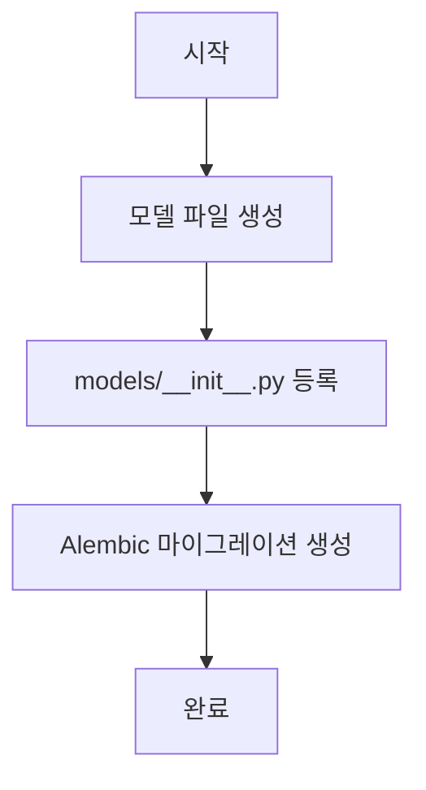
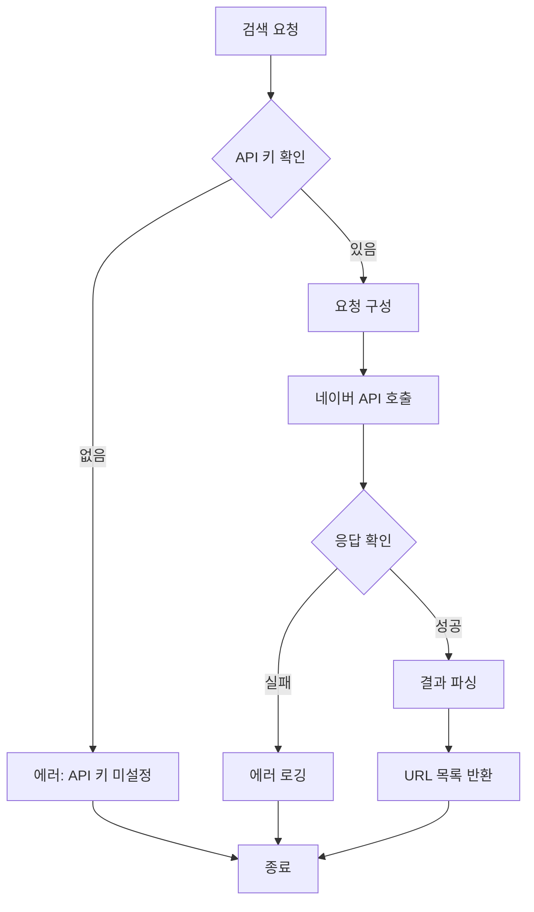
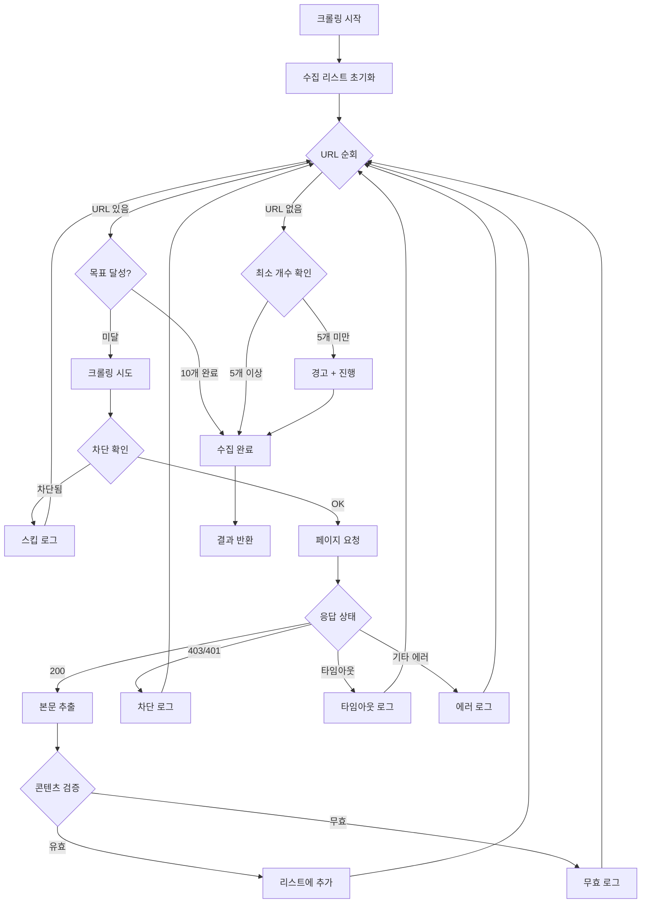
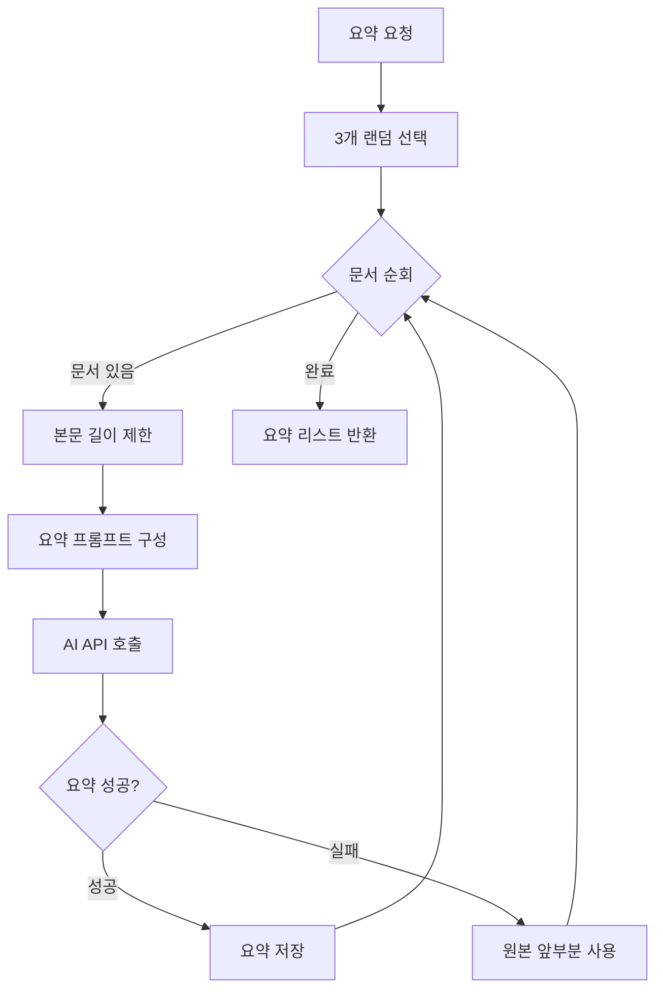
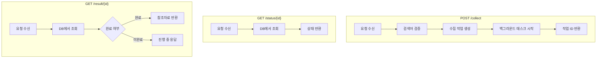
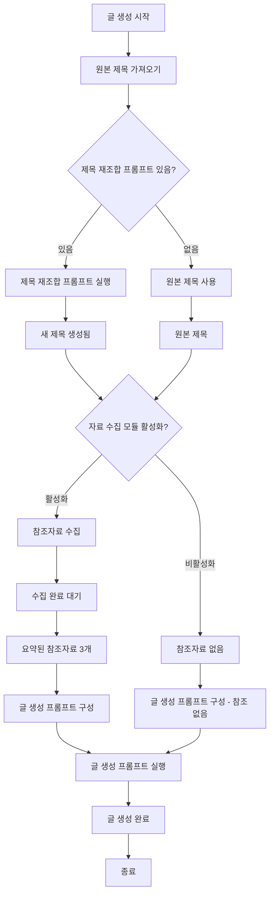

# 자료 수집 모듈 - Claude Code 프롬프트 모음

> **목적**: BlogAuto V2 자료 수집 모듈 개발을 위한 Claude Code 프롬프트  
> **작성일**: 2026-02-01  
> **사용 방법**: 각 Phase를 순서대로 Claude Code에 전달하여 실행

---

## 📋 공통 지침 (모든 Phase에 적용)

```
⚠️ 필수 규칙:
1. 파일 < 500줄, 함수 < 50줄
2. 타입 힌트 필수
3. Docstring 필수
4. 에러 처리 필수
5. 로깅 필수
6. 기존 BlogAuto V2의 모듈 UI/UX 패턴 계승
7. blogauto_new/ 코드는 참조만, 수정 금지
```

---

## Phase 1: 데이터베이스 스키마 설계 및 마이그레이션

### 프롬프트

```
# Phase 1: 자료 수집 모듈 - 데이터베이스 스키마

## 작업 목표
자료 수집 모듈을 위한 데이터베이스 모델과 마이그레이션을 생성합니다.

## 📐 순서도



## 📋 요구사항

### 1. 모델 파일 생성
파일: `app/models/collected_reference.py`

테이블 1: `collected_references` (참조자료 수집 결과)
- id: Integer, PK
- title_id: Integer, FK → main_titles.id (nullable, 제목 없이 직접 검색도 가능)
- search_query: String(500), NOT NULL - 검색어
- total_searched: Integer, default=0 - 검색 결과 수
- total_crawled: Integer, default=0 - 크롤링 성공 수
- total_failed: Integer, default=0 - 크롤링 실패 수
- selected_references: JSONB - 선택된 참조자료 [{url, title, summary, selected_at}]
- status: String(20), default='pending' - pending/collecting/completed/failed
- error_message: Text, nullable - 실패 시 에러 메시지
- created_at: DateTime, server_default=now()
- completed_at: DateTime, nullable

테이블 2: `crawl_logs` (크롤링 상세 로그)
- id: Integer, PK
- reference_id: Integer, FK → collected_references.id, CASCADE DELETE
- url: String(2000), NOT NULL
- domain: String(255) - 도메인 추출 저장
- status: String(20) - success/failed/timeout/blocked/skipped
- error_message: Text, nullable
- content_length: Integer, nullable - 크롤링된 콘텐츠 길이
- crawl_duration_ms: Integer, nullable - 크롤링 소요 시간(ms)
- crawled_at: DateTime, server_default=now()

### 2. 모델 등록
`app/models/__init__.py`에 새 모델 import 및 __all__ 추가

### 3. Alembic 마이그레이션
파일명: `alembic/versions/XXX_add_reference_collection_tables.py`

## 📚 참조
- 기존 모델 패턴: app/models/title.py, app/models/crawled_post.py
- 마이그레이션 패턴: alembic/versions/ 기존 파일들

## ⚠️ 제약사항
- 파일 < 300줄
- 타입 힌트 필수
- Docstring 필수
- relationship은 lazy='selectin' 사용

시작해주세요.
```

---

## Phase 2: 네이버 검색 API 연동

### 프롬프트

```
# Phase 2: 자료 수집 모듈 - 네이버 검색 API 연동

## 작업 목표
네이버 웹문서 검색 API를 연동하는 서비스를 개발합니다.

## 📐 순서도



## 📋 요구사항

### 1. 서비스 파일 생성
파일: `app/services/naver_search_service.py`

클래스: `NaverSearchService`

메서드:
- `async def search_webdoc(query: str, count: int = 30) -> list[SearchResult]`
  - 네이버 웹문서 검색 API 호출
  - 기본 30개 검색 (크롤링 실패 대비 여유분)
  
- `async def _call_api(endpoint: str, params: dict) -> dict`
  - 실제 API 호출 (httpx 사용)
  - 타임아웃: 10초
  - 재시도: 1회
  
- `def _parse_response(response: dict) -> list[SearchResult]`
  - 응답 파싱하여 SearchResult 리스트 반환

### 2. 스키마 파일 생성
파일: `app/schemas/naver_search.py`

```python
class SearchResult(BaseModel):
    title: str
    link: str
    description: str
    bloggername: Optional[str] = None
    bloggerlink: Optional[str] = None
    postdate: Optional[str] = None
```

### 3. 환경변수 설정
`app/core/config.py`에 추가:
- NAVER_CLIENT_ID: str
- NAVER_CLIENT_SECRET: str

### 4. 네이버 API 정보
- 엔드포인트: https://openapi.naver.com/v1/search/webkr.json
- 헤더:
  - X-Naver-Client-Id: {클라이언트 ID}
  - X-Naver-Client-Secret: {클라이언트 시크릿}
- 파라미터:
  - query: 검색어
  - display: 결과 개수 (최대 100)
  - start: 시작 위치
  - sort: sim(유사도) / date(날짜)

## 📚 참조
- 기존 서비스 패턴: app/services/google_search_service.py (있다면)
- HTTP 클라이언트: httpx 사용

## ⚠️ 제약사항
- 파일 < 200줄
- API 키 노출 금지 (환경변수 사용)
- 에러 시 빈 리스트 반환 (예외 전파 X)
- 로깅 필수

시작해주세요.
```

---

## Phase 3: 크롤링 서비스 개발

### 프롬프트

```
# Phase 3: 자료 수집 모듈 - 크롤링 서비스 개발

## 작업 목표
웹 문서 크롤링 서비스를 개발합니다. 핵심은 **실패 시 다음 문서로 자동 이동**하여 목표 개수(10개)를 달성하는 것입니다.

## 📐 순서도



## 📋 요구사항

### 1. 서비스 파일 생성
파일: `app/services/crawling_service.py`

클래스: `CrawlingService`

설정값:
```python
CRAWL_TIMEOUT = 10  # 초
TARGET_COUNT = 10   # 목표 수집 개수
MIN_COUNT = 5       # 최소 수집 개수
MIN_CONTENT_LENGTH = 100  # 최소 본문 길이
MAX_CONTENT_LENGTH = 5000  # 최대 본문 길이
MAX_SAME_DOMAIN = 2  # 같은 도메인 최대 개수
```

메서드:
- `async def crawl_documents(urls: list[str], reference_id: int) -> CrawlResult`
  - 메인 크롤링 메서드
  - 목표: 10개 수집 (실패 시 다음으로 이동)
  - 같은 도메인 2개 초과 시 스킵
  
- `async def _crawl_single(url: str) -> Optional[CrawledDocument]`
  - 단일 URL 크롤링
  - 타임아웃: 10초
  - 실패 시 None 반환
  
- `def _extract_content(html: str) -> Optional[str]`
  - HTML에서 본문 추출
  - BeautifulSoup 사용
  - 스크립트, 스타일, 네비게이션 제거
  
- `def _validate_content(content: str) -> bool`
  - 콘텐츠 유효성 검증
  - 최소 길이 확인
  
- `def _extract_domain(url: str) -> str`
  - URL에서 도메인 추출
  
- `async def _log_crawl(reference_id: int, url: str, status: str, ...)`
  - 크롤링 로그 DB 저장

### 2. 스키마 추가
파일: `app/schemas/reference_collection.py` (기존 파일에 추가 또는 새로 생성)

```python
class CrawledDocument(BaseModel):
    url: str
    domain: str
    title: Optional[str]
    content: str
    content_length: int
    crawled_at: datetime

class CrawlResult(BaseModel):
    total_attempted: int
    total_success: int
    total_failed: int
    documents: list[CrawledDocument]
    has_minimum: bool  # 최소 개수 충족 여부
```

### 3. 차단 사이트 처리
- 403, 401 응답 즉시 스킵
- 타임아웃 발생 시 스킵
- 콘텐츠 길이 100자 미만 시 스킵

## 📚 참조
- 기존 크롤링 패턴: blogauto_new/의 크롤링 관련 코드 (참조만)
- HTTP 클라이언트: httpx (비동기)
- HTML 파싱: beautifulsoup4

## ⚠️ 제약사항
- 파일 < 300줄
- 비동기 처리 필수 (async/await)
- 모든 크롤링 결과 로깅 (성공/실패 모두)
- User-Agent 설정 필수

시작해주세요.
```

---

## Phase 4: 요약 서비스 개발

### 프롬프트

```
# Phase 4: 자료 수집 모듈 - 요약 서비스 개발

## 작업 목표
수집된 문서를 AI를 사용하여 요약하는 서비스를 개발합니다.

## 📐 순서도



## 📋 요구사항

### 1. 서비스 파일 생성
파일: `app/services/summary_service.py`

클래스: `SummaryService`

설정값:
```python
SELECT_COUNT = 3  # 선택할 문서 개수
MAX_INPUT_LENGTH = 3000  # AI 입력 최대 길이
MAX_SUMMARY_LENGTH = 500  # 요약 최대 길이
```

메서드:
- `def select_random_documents(documents: list, count: int = 3) -> list`
  - 랜덤으로 문서 선택
  - random.sample 사용
  
- `async def summarize_documents(documents: list) -> list[DocumentSummary]`
  - 선택된 문서들 요약
  - AI API 사용 (기존 BlogAuto의 AI 서비스 활용)
  
- `async def _summarize_single(content: str) -> str`
  - 단일 문서 요약
  - 실패 시 원본 앞 500자 반환
  
- `def _build_summary_prompt(content: str) -> str`
  - 요약용 프롬프트 생성

### 2. 스키마 추가
파일: `app/schemas/reference_collection.py`에 추가

```python
class DocumentSummary(BaseModel):
    url: str
    title: Optional[str]
    original_length: int
    summary: str
    summary_length: int
    is_ai_summary: bool  # AI 요약 여부 (False면 원본 잘림)
```

### 3. 요약 프롬프트
```
다음 웹 문서 내용을 500자 이내로 요약해주세요.
핵심 정보와 주요 내용만 간결하게 정리해주세요.

[문서 내용]
{content}

[요약]
```

## 📚 참조
- 기존 AI 서비스: app/services/ 내 AI 관련 서비스
- AI API 키 관리: app/models/ai_api_key.py

## ⚠️ 제약사항
- 파일 < 150줄
- AI 호출 실패 시 원본 앞부분 사용 (예외 전파 X)
- 로깅 필수

시작해주세요.
```

---

## Phase 5: API 엔드포인트 개발

### 프롬프트

```
# Phase 5: 자료 수집 모듈 - API 엔드포인트 개발

## 작업 목표
자료 수집 모듈의 REST API 엔드포인트를 개발합니다.

## 📐 순서도



## 📋 요구사항

### 1. 라우터 파일 생성
파일: `app/routers/reference_collection.py`

엔드포인트:

1. `POST /api/v1/references/collect`
   - 참조자료 수집 시작
   - Body: `{ "search_query": "검색어", "title_id": 123 (optional) }`
   - Response: `{ "reference_id": 1, "status": "collecting" }`
   - 백그라운드 태스크로 수집 실행

2. `GET /api/v1/references/{reference_id}/status`
   - 수집 진행 상태 조회
   - Response: `{ "status": "collecting", "progress": { "searched": 30, "crawled": 7, "failed": 3 } }`

3. `GET /api/v1/references/{reference_id}`
   - 수집 결과 조회
   - Response: 전체 수집 결과 + 선택된 참조자료

4. `DELETE /api/v1/references/{reference_id}`
   - 수집 결과 삭제

5. `POST /api/v1/references/{reference_id}/retry`
   - 수집 재시도

### 2. 스키마 정의
파일: `app/schemas/reference_collection.py`에 추가

```python
class CollectRequest(BaseModel):
    search_query: str = Field(..., min_length=2, max_length=200)
    title_id: Optional[int] = None

class CollectResponse(BaseModel):
    reference_id: int
    status: str
    message: str

class StatusResponse(BaseModel):
    reference_id: int
    status: str  # pending, collecting, completed, failed
    progress: dict  # { searched, crawled, failed }
    created_at: datetime
    completed_at: Optional[datetime]

class ReferenceResult(BaseModel):
    reference_id: int
    search_query: str
    status: str
    total_crawled: int
    selected_references: list[DocumentSummary]
    crawl_logs: list[CrawlLogItem]
```

### 3. main.py 등록
`app/main.py`에 라우터 import 및 등록

### 4. 백그라운드 태스크
- FastAPI BackgroundTasks 사용
- 수집 완료 시 DB 상태 업데이트

## 📚 참조
- 기존 라우터 패턴: app/routers/titles.py, app/routers/modules.py
- 백그라운드 태스크: FastAPI BackgroundTasks

## ⚠️ 제약사항
- 파일 < 250줄
- 인증 필수 (Depends(get_current_user))
- 에러 응답 표준화 (HTTPException)

시작해주세요.
```

---

## Phase 6: 프롬프트 모듈 연동

### 프롬프트

```
# Phase 6: 자료 수집 모듈 - 프롬프트 모듈 연동

## 작업 목표
자료 수집 모듈을 프롬프트 모듈 및 글 생성 워크플로우와 연동합니다.

## 📐 순서도 (전체 글 생성 워크플로우)



## 📋 요구사항

### 1. 통합 서비스 생성
파일: `app/services/content_generation_service.py`

클래스: `ContentGenerationService`

메서드:
- `async def generate_content(title_id: int, module_id: int) -> GeneratedContent`
  - 전체 글 생성 워크플로우 실행
  
- `async def _run_title_prompt(original_title: str, prompt_config: dict) -> str`
  - 제목 재조합 프롬프트 실행
  
- `async def _collect_references(search_query: str) -> list[DocumentSummary]`
  - 참조자료 수집 (자료 수집 모듈 호출)
  
- `async def _build_generation_prompt(title: str, references: list, prompt_config: dict) -> str`
  - 글 생성 프롬프트 구성
  - 참조자료를 프롬프트에 삽입
  
- `async def _run_generation_prompt(prompt: str) -> str`
  - AI 글 생성 실행

### 2. 프롬프트 템플릿 구조

글 생성 프롬프트에 참조자료 삽입 형식:
```
{사용자 정의 프롬프트}

---
[참조자료]

참조 1:
{summary_1}
출처: {url_1}

참조 2:
{summary_2}
출처: {url_2}

참조 3:
{summary_3}
출처: {url_3}
---

위 참조자료를 바탕으로 "{title}" 주제의 블로그 글을 작성해주세요.
```

### 3. 모듈 설정 확장
`app/models/module.py` 또는 관련 설정에 추가:
- `enable_reference_collection: bool` - 자료 수집 활성화 여부
- `reference_count: int` - 사용할 참조자료 개수 (기본 3)

### 4. 워크플로우 상태 관리
- 각 단계별 상태 저장 (진행률 표시용)
- 실패 시 재시도 가능하도록 중간 결과 저장

## 📚 참조
- 기존 프롬프트 모듈: app/models/module.py, app/services/ 관련 파일
- 플로우 실행 로직: app/routers/flows_execute.py

## ⚠️ 제약사항
- 파일 < 300줄
- 각 단계 로깅 필수
- 트랜잭션 관리 (실패 시 롤백)

시작해주세요.
```

---

## Phase 7: UI 개발

### 프롬프트

```
# Phase 7: 자료 수집 모듈 - UI 개발

## 작업 목표
자료 수집 모듈의 UI를 개발합니다. 기존 BlogAuto V2 모듈 UI/UX 패턴을 계승합니다.

## 📐 UI 구조

```
모듈 설정 페이지
└── 자료 수집 섹션
    ├── 활성화 토글
    ├── 설정 옵션
    │   ├── 수집 개수 (기본 10)
    │   ├── 사용 개수 (기본 3)
    │   └── 검색 소스 선택 (네이버 웹문서)
    └── 테스트 버튼
        └── 테스트 결과 미리보기

수집 결과 확인 모달
├── 수집 진행 상태
├── 크롤링 로그 테이블
└── 선택된 참조자료 미리보기
```

## 📋 요구사항

### 1. 모듈 폼에 자료 수집 섹션 추가
파일: `app/templates/modules/_form.html` 수정

추가할 섹션:
```html
<!-- 자료 수집 설정 -->
<div class="card mt-4" x-show="moduleType === 'generation'">
    <div class="card-header">
        <h5>참조자료 수집 설정</h5>
    </div>
    <div class="card-body">
        <!-- 활성화 토글 -->
        <div class="form-check form-switch mb-3">
            <input type="checkbox" class="form-check-input" 
                   x-model="formData.enable_reference_collection">
            <label class="form-check-label">참조자료 수집 활성화</label>
        </div>
        
        <!-- 설정 옵션 (활성화 시만 표시) -->
        <div x-show="formData.enable_reference_collection">
            <!-- 수집 개수 -->
            <!-- 사용 개수 -->
            <!-- 테스트 버튼 -->
        </div>
    </div>
</div>
```

### 2. 참조자료 폼 컴포넌트 생성
파일: `app/templates/modules/_reference_collection_form.html`

내용:
- 활성화 토글
- 목표 수집 개수 입력 (기본값: 10, 범위: 5-30)
- 사용할 참조자료 개수 입력 (기본값: 3, 범위: 1-5)
- 같은 도메인 최대 개수 (기본값: 2)
- 테스트 수집 버튼
- 테스트 결과 미리보기 영역

### 3. JavaScript 파일 생성
파일: `app/static/js/modules/reference-collection.js`

기능:
- `testCollection()` - 테스트 수집 실행
- `checkCollectionStatus()` - 수집 상태 폴링
- `displayCollectionResult()` - 결과 표시
- `cancelCollection()` - 수집 취소

### 4. 수집 결과 모달
파일: `app/templates/modules/_reference_result_modal.html`

내용:
- 수집 진행률 표시 (프로그레스 바)
- 크롤링 로그 테이블 (URL, 상태, 소요시간)
- 선택된 참조자료 카드 (제목, 요약, 출처)

## 📚 참조 (UI 패턴 계승)
- 기존 모듈 폼: app/templates/modules/_form.html
- 기존 JavaScript: app/static/js/modules/form.js
- Alpine.js 패턴 사용

## ⚠️ 제약사항
- 기존 UI/UX 패턴 유지
- Alpine.js 사용
- 반응형 디자인
- 로딩 상태 표시 필수

시작해주세요.
```

---

## Phase 8: 테스트 및 디버깅

### 프롬프트

```
# Phase 8: 자료 수집 모듈 - 테스트 및 디버깅

## 작업 목표
자료 수집 모듈의 테스트 코드를 작성하고 통합 테스트를 수행합니다.

## 📐 테스트 구조

```
tests/
├── unit/
│   ├── test_naver_search_service.py
│   ├── test_crawling_service.py
│   └── test_summary_service.py
│
├── integration/
│   ├── test_reference_collection_api.py
│   └── test_content_generation_flow.py
│
└── fixtures/
    └── reference_collection_fixtures.py
```

## 📋 요구사항

### 1. 단위 테스트

#### test_naver_search_service.py
```python
# 테스트 케이스
- test_search_webdoc_success: 정상 검색 테스트
- test_search_webdoc_empty_result: 빈 결과 처리
- test_search_webdoc_api_error: API 오류 처리
- test_search_webdoc_timeout: 타임아웃 처리
```

#### test_crawling_service.py
```python
# 테스트 케이스
- test_crawl_documents_success: 10개 정상 수집
- test_crawl_documents_partial_failure: 일부 실패 시 다음으로 이동
- test_crawl_documents_all_failure: 모두 실패 시 처리
- test_crawl_documents_same_domain_limit: 같은 도메인 제한
- test_crawl_single_timeout: 단일 크롤링 타임아웃
- test_crawl_single_blocked: 차단 사이트 처리
- test_extract_content: 본문 추출 테스트
- test_validate_content: 콘텐츠 검증 테스트
```

#### test_summary_service.py
```python
# 테스트 케이스
- test_select_random_documents: 랜덤 선택 테스트
- test_summarize_documents_success: 요약 성공
- test_summarize_documents_ai_failure: AI 실패 시 원본 사용
```

### 2. 통합 테스트

#### test_reference_collection_api.py
```python
# 테스트 케이스
- test_collect_endpoint_success: 수집 시작 API
- test_status_endpoint: 상태 조회 API
- test_result_endpoint: 결과 조회 API
- test_collect_with_title_id: 제목 ID 연동
- test_collect_unauthorized: 인증 없이 접근
```

#### test_content_generation_flow.py
```python
# 테스트 케이스
- test_full_generation_flow: 전체 워크플로우 테스트
- test_generation_without_reference: 참조자료 없이 생성
- test_generation_with_title_prompt: 제목 재조합 포함
```

### 3. Fixture 생성

#### reference_collection_fixtures.py
```python
# Mock 데이터
- mock_search_results: 검색 결과 목업
- mock_crawled_documents: 크롤링 결과 목업
- mock_summaries: 요약 결과 목업
```

### 4. 실행 및 검증
```bash
# 전체 테스트 실행
pytest tests/ -v

# 특정 모듈 테스트
pytest tests/unit/test_crawling_service.py -v

# 커버리지 확인
pytest tests/ --cov=app/services --cov-report=html
```

## 📚 참조
- 기존 테스트 패턴: tests/ 디렉토리 내 기존 테스트
- pytest-asyncio 사용 (비동기 테스트)
- httpx MockTransport 사용 (HTTP 목업)

## ⚠️ 제약사항
- 각 테스트 파일 < 300줄
- Mock 사용하여 외부 의존성 제거
- 테스트 커버리지 80% 이상 목표

시작해주세요.
```

---

## 📝 사용 가이드

### 순서대로 실행
1. **Phase 1** 완료 후 마이그레이션 적용 확인
2. **Phase 2** 완료 후 API 키 설정 및 검색 테스트
3. **Phase 3** 완료 후 크롤링 테스트
4. **Phase 4** 완료 후 요약 테스트
5. **Phase 5** 완료 후 API 엔드포인트 테스트
6. **Phase 6** 완료 후 프롬프트 연동 테스트
7. **Phase 7** 완료 후 UI 테스트
8. **Phase 8** 완료 후 전체 통합 테스트

### 각 Phase 완료 후 체크리스트
- [ ] 파일 크기 확인 (< 500줄)
- [ ] 타입 힌트 확인
- [ ] Docstring 확인
- [ ] 로컬 테스트 통과
- [ ] Git 커밋

---

**작성**: Claude (Neo)  
**검토**: 제이틴
