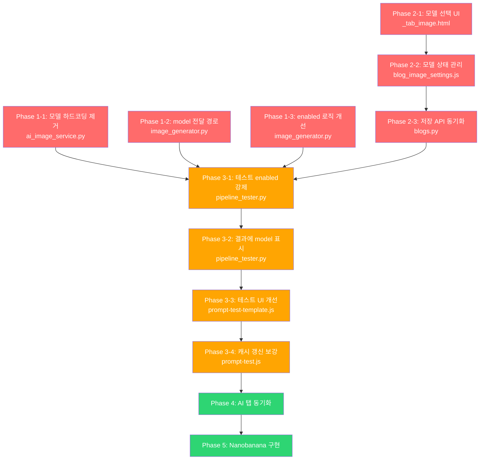

# AI 이미지 생성 시스템 개선 계획

> **버전**: v1.0 | **날짜**: 2026-03-11
> **상태**: 계획 수립 완료 → 구현 대기
> **관련**: generation_pipeline_enhancement_plan.md - Phase C 이미지 생성

---

## 1. 현황 및 문제 분석

### 1.1 발견된 문제점 요약

| # | 문제 | 위치 | 심각도 |
|---|------|------|--------|
| P1 | DALL-E 모델 하드코딩 (`dall-e-3`) | `ai_image_service.py:97` | 🔴 높음 |
| P2 | `image_ai.model` 미전달 (provider만 오버라이드) | `image_generator.py:241-242` | 🔴 높음 |
| P3 | `imageGeneration.enabled` 기본값 false → AI 이미지 건너뜀 | `image_generator.py:72-75` | 🔴 높음 |
| P4 | 이미지 설정 이중화 (이미지탭 vs AI탭) | `_tab_image.html` / `_tab_ai.html` | 🟡 중간 |
| P5 | 이미지 탭에 모델 선택 UI 없음 | `_tab_image.html` | 🟡 중간 |
| P6 | nanobanana provider 미구현 | `ai_image_service.py:76-77` | 🟡 중간 |
| P7 | `blogImageModes` 캐시 미갱신 가능성 | `prompt-form.js:297-326` | 🟡 중간 |
| P8 | 테스트 결과에 AI 모델/provider 정보 미표시 | `prompt-test-template.js` | 🟢 낮음 |

### 1.2 현재 데이터 플로우 (문제있는 구조)

```
[Blog 이미지 탭]                    [Blog AI 탭]
  image_mode: "ai"                    ai_config.image_ai:
  ai_image_service: "openai"            provider: "openai"
  (모델 선택 없음)                       model: "dall-e-3"
  ↓ 별도 저장                          ↓ 별도 저장
  POST /settings/image               POST /settings/ai
        ↓                                   ↓
        └──────── DB Blog 레코드 ───────────┘
                        ↓
              ImageGenerator._generate_ai()
              (provider만 오버라이드, model 무시)
                        ↓
              AIImageService.generate()
              (model = "dall-e-3" 하드코딩)
```

### 1.3 목표 데이터 플로우 (개선 후)

```
[Blog 이미지 탭 - 통합 관리]
  image_mode: "ai"
  ai_image_service: "openai"
  ai_image_model: "dall-e-3"        ← 신규: 모델 선택
  ↓
  POST /settings/image
  → blog.ai_config.image_ai = {provider, model} 자동 동기화
        ↓
  ImageGenerator._generate_ai()
  (provider + model 모두 전달)
        ↓
  AIImageService.generate()
  (settings에서 model 읽기, 하드코딩 제거)
```

---

## 2. 페이즈별 구현 계획

### Phase 1: 백엔드 핵심 수정 (하드코딩 제거 + 설정 전달)

> **목표**: AI 이미지 생성 시 Blog 설정의 provider/model을 실제 사용
> **우선순위**: 🔴 최우선

#### 1-1. `ai_image_service.py` - 모델 하드코딩 제거

**현재 (97줄):**
```python
model = "dall-e-3"
```

**변경 방향:**
```python
model = dalle_settings.get("model", "dall-e-3")
```

**수정 사항:**
- `_generate_with_dalle()` 메서드에서 `settings` 파라미터 또는 `dalle_settings`에서 `model` 키를 읽도록 변경
- 기본값은 `"dall-e-3"` 유지 (하위 호환)
- `generate()` 메서드의 `settings` 딕셔너리에 `model` 키를 추가로 전달받을 수 있도록 구조 확보

**수정 파일:** `app/services/generation/ai_image_service.py`
**수정 줄:** 60, 88-97
**예상 변경량:** ~10줄

#### 1-2. `image_generator.py` - model 전달 경로 추가

**현재 (238-248줄):**
```python
ai_config = blog.ai_config or {}
image_ai = ai_config.get("image_ai", {})
if image_ai.get("provider"):
    effective_settings = img_settings.copy()
    effective_settings["provider"] = image_ai["provider"]
```

**변경 방향:**
```python
if image_ai.get("provider"):
    effective_settings = img_settings.copy()
    effective_settings["provider"] = image_ai["provider"]
    if image_ai.get("model"):
        # dalle 설정에 model 키 추가
        dalle_settings = effective_settings.get("dalle", {}).copy()
        dalle_settings["model"] = image_ai["model"]
        effective_settings["dalle"] = dalle_settings
```

**수정 파일:** `app/services/generation/image_generator.py`
**수정 줄:** 238-248
**예상 변경량:** ~5줄

#### 1-3. `image_generator.py` - enabled 플래그 로직 개선

**현재 (67-75줄):**
```python
image_mode = getattr(blog, "image_mode", None) or "template"
if image_mode != "template":
    if not img_settings.get("enabled", False):
        return ImageResult(success=True)  # 조용히 건너뜀
```

**문제:** `blog.image_mode="ai"`이면 모듈의 `enabled` 플래그와 관계없이 이미지 생성을 시도해야 하거나, 최소한 명확한 에러를 반환해야 함

**변경 방향:**
- 파이프라인 테스트 시에는 `enabled` 플래그를 무시하고 생성 시도
- 실제 생성 시에만 `enabled` 플래그 체크
- 또는 `blog.image_mode`가 `ai`/`openai`이면 `enabled`를 자동으로 `True`로 간주

**수정 파일:** `app/services/generation/image_generator.py`
**수정 줄:** 67-75
**예상 변경량:** ~10줄

**검토 필요:** 두 가지 접근 방식 중 선택
1. 테스트 API에서 `enabled=True`를 강제 주입
2. `blog.image_mode`가 AI 모드이면 `enabled` 체크 건너뛰기

---

### Phase 2: 블로그 이미지 설정 UI 개선 (모델 선택 추가)

> **목표**: 이미지 탭에서 AI 서비스 + 모델을 한 번에 선택 가능
> **우선순위**: 🔴 최우선 (Phase 1과 병렬 가능)

#### 2-1. `_tab_image.html` - 모델 선택 UI 추가

**현재 구조:**
```
이미지 생성 방식: [Template ○] [AI ○] [Both ○]
AI 이미지 서비스: [OpenAI ▾]       ← 모델 선택 없음
```

**변경 방향:**
```
이미지 생성 방식: [Template ○] [AI ○] [Both ○]
AI 이미지 서비스: [OpenAI ▾]
AI 이미지 모델:  [DALL-E 3 ▾]     ← 신규 추가
```

**구현 세부사항:**
- `aiImageService` 값에 따라 모델 드롭다운 옵션 동적 변경
- OpenAI 선택 시: `dall-e-3` (기본), `dall-e-2`, `gpt-image-1`
- Nanobanana 선택 시 (향후): `gemini-3-pro-image-preview`, `gemini-2.5-flash-image`
- 모델 목록은 JS 상수로 관리 (서버 API 불필요)

**수정 파일:** `app/templates/blogs/settings/_tab_image.html`
**예상 변경량:** ~20줄

#### 2-2. `blog_image_settings.js` - 모델 상태 관리 + 저장

**추가할 상태:**
```javascript
aiImageModel: 'dall-e-3',  // 신규

// 서비스별 모델 목록 상수
AI_IMAGE_MODELS: {
    openai: [
        { value: 'dall-e-3', label: 'DALL-E 3 (추천)', default: true },
        { value: 'dall-e-2', label: 'DALL-E 2' },
        { value: 'gpt-image-1', label: 'GPT Image 1' },
    ],
    nanobanana: [
        { value: 'gemini-3-pro-image-preview', label: 'Gemini 3 Pro (추천)', default: true },
        { value: 'gemini-2.5-flash-image', label: 'Gemini 2.5 Flash Image' },
    ],
}
```

**저장 시 전송 데이터 변경:**
```javascript
{
    image_mode: this.imageMode,
    ai_image_service: this.aiImageService,
    ai_image_model: this.aiImageModel,      // ← 신규
    overlay_config: this.overlayConfig,
}
```

**서비스 변경 시 모델 자동 리셋:**
- `aiImageService` watch → 변경 시 해당 서비스의 기본 모델로 `aiImageModel` 초기화

**수정 파일:** `app/static/js/blog_image_settings.js`
**예상 변경량:** ~30줄

#### 2-3. 블로그 이미지 설정 저장 API - `ai_config.image_ai` 동기화

**현재:** `POST /api/v1/blogs/{blogId}/settings/image` → `image_mode`, `ai_image_service`, `overlay_config` 저장

**변경 방향:** 같은 API에서 `ai_config.image_ai`도 동기화
```python
# 이미지 설정 저장 시 ai_config.image_ai 자동 동기화
if data.ai_image_service and data.ai_image_model:
    ai_config = blog.ai_config or {}
    ai_config["image_ai"] = {
        "provider": data.ai_image_service,
        "model": data.ai_image_model,
    }
    blog.ai_config = ai_config
```

**목적:** 이미지 탭과 AI 탭의 설정 이중화 문제 해결. 이미지 탭에서 변경하면 `ai_config.image_ai`도 자동 업데이트

**수정 파일:** 이미지 설정 저장 API 핸들러 (blogs.py 또는 관련 서비스)
**예상 변경량:** ~15줄

---

### Phase 3: 프롬프트/생성 모듈 테스트 개선

> **목표**: AI 이미지 생성 테스트가 정상 동작하고 결과에 provider/model 정보 표시
> **우선순위**: 🟡 중요

#### 3-1. `pipeline_tester.py` - 테스트 시 enabled 강제 주입

**변경 방향:**
- `test_generate_image()` 호출 시 `image_generation.enabled = True` 강제 설정
- 이미지 생성 테스트를 요청했다면 enabled 여부와 관계없이 생성 시도

```python
# 테스트 목적이므로 enabled 강제 활성화
settings["image_generation"]["enabled"] = True
```

**수정 파일:** `app/services/generation/pipeline_tester.py`
**수정 줄:** test_generate_image 메서드 내부
**예상 변경량:** ~3줄

#### 3-2. `pipeline_tester.py` - 결과에 provider/model 정보 추가

**현재 결과 구조:**
```python
{
    "image_url": "...",
    "image_mode": "ai",
    "provider": "openai",
    "ai_model": None,  # ← 항상 None
}
```

**변경 방향:**
- `ImageResult.ai_model`에 실제 사용된 모델명 전달
- `_build_image_result()`에서 `ai_model` 필드 포함

**수정 파일:** `app/services/generation/pipeline_tester.py`, `ai_image_service.py`
**예상 변경량:** ~5줄

#### 3-3. `prompt-test-template.js` - 테스트 결과에 AI 정보 표시

**현재:** image_url, image_mode, generation_time_seconds만 표시

**변경 방향:**
```html
<div>AI 서비스: ${data.provider || '-'}</div>
<div>AI 모델: ${data.ai_model || '-'}</div>
<div>생성 시간: ${data.generation_time_seconds}초</div>
```

**수정 파일:** `app/static/js/modules/prompt-test-template.js`
**예상 변경량:** ~10줄

#### 3-4. `prompt-test.js` - blogImageModes 캐시 갱신 보강

**변경 방향:**
- 테스트 패널 열기 시 (또는 블로그 선택 시) `blogImageModes` 캐시 재조회
- 단일 블로그 API (`GET /api/v1/blogs/{id}`)에서 `image_mode` 가져와 캐시 갱신

**수정 파일:** `app/static/js/modules/prompt-test.js`
**예상 변경량:** ~10줄

---

### Phase 4: AI 탭과 이미지 탭 설정 동기화

> **목표**: 양쪽 탭에서 변경해도 일관된 상태 유지
> **우선순위**: 🟢 권장

#### 4-1. `_tab_ai.html` - 이미지 AI 섹션에 안내 메시지 추가

**변경 방향:**
- AI 탭의 `image_ai` 섹션에 안내 추가: "이미지 AI 설정은 이미지 탭에서도 변경할 수 있습니다"
- 또는 AI 탭의 `image_ai` 섹션을 읽기 전용으로 변경하고 이미지 탭으로 유도

**수정 파일:** `app/templates/blogs/settings/_tab_ai.html`
**예상 변경량:** ~5줄

#### 4-2. `_tab_ai.html` 저장 시 역방향 동기화

**변경 방향:**
- AI 탭에서 `image_ai` 변경 후 저장 시, `blog.image_mode` 관련 필드도 동기화
- 또는 AI 탭에서는 `image_ai` 편집을 비활성화하고 이미지 탭에 통합

**검토 필요:** 이미지 AI 설정의 단일 진실 소스(Single Source of Truth) 결정
- **방안 A**: 이미지 탭이 주(primary) → AI 탭은 읽기전용 표시
- **방안 B**: 양방향 동기화 (복잡도 높음)
- **권장: 방안 A** (단순하고 명확)

**수정 파일:** `_tab_ai.html`, 저장 API
**예상 변경량:** ~15줄

---

### Phase 5: Nanobanana Provider 구현 (선택사항)

> **목표**: Nanobanana provider 실제 구현
> **우선순위**: 🟢 선택 (해당 서비스 사용 시)

#### 5-1. `ai_image_service.py` - Nanobanana API 연동

**현재:**
```python
elif provider_name == "nanobanana":
    logger.warning("[AI_IMAGE] Nanobanana 미구현 - 건너뜀")
    return None
```

**변경 방향:**
- Nanobanana API 클라이언트 구현
- `_generate_with_nanobanana()` 메서드 추가
- 모델 선택 (gemini-3-pro-image-preview 등) 지원
- API 키 관리: 별도 provider 타입 또는 기존 구조 활용

**수정 파일:** `app/services/generation/ai_image_service.py`
**예상 변경량:** ~80줄 (새 메서드)

**주의:** Nanobanana API 스펙 확인 필요

---

## 3. 수정 대상 파일 종합

| 페이즈 | 파일 | 변경 유형 | 예상 변경량 |
|--------|------|-----------|-------------|
| 1 | `app/services/generation/ai_image_service.py` | 수정 | ~10줄 |
| 1 | `app/services/generation/image_generator.py` | 수정 | ~15줄 |
| 2 | `app/templates/blogs/settings/_tab_image.html` | 수정 | ~20줄 |
| 2 | `app/static/js/blog_image_settings.js` | 수정 | ~30줄 |
| 2 | `app/routers/blogs.py` (이미지 설정 저장) | 수정 | ~15줄 |
| 3 | `app/services/generation/pipeline_tester.py` | 수정 | ~8줄 |
| 3 | `app/static/js/modules/prompt-test-template.js` | 수정 | ~10줄 |
| 3 | `app/static/js/modules/prompt-test.js` | 수정 | ~10줄 |
| 4 | `app/templates/blogs/settings/_tab_ai.html` | 수정 | ~5줄 |
| 5 | `app/services/generation/ai_image_service.py` | 추가 | ~80줄 |

**총 예상 변경량:** Phase 1-3 필수 ~120줄, Phase 4 권장 ~20줄, Phase 5 선택 ~80줄

---

## 4. 구현 순서 및 의존성



**병렬 가능:**
- Phase 1 (백엔드)과 Phase 2 (프론트엔드)는 병렬 진행 가능
- Phase 3은 Phase 1 + 2 완료 후 진행

---

## 5. 테스트 시나리오

### 5-1. Phase 1-3 완료 후 검증

| # | 테스트 | 기대 결과 |
|---|--------|-----------|
| T1 | 블로그 이미지 탭에서 OpenAI + DALL-E 3 선택 후 저장 | `blog.ai_config.image_ai = {provider: "openai", model: "dall-e-3"}` |
| T2 | 블로그 이미지 탭에서 OpenAI + DALL-E 2 선택 후 저장 | `blog.ai_config.image_ai = {provider: "openai", model: "dall-e-2"}` |
| T3 | 프롬프트 모듈에서 AI 이미지 테스트 (DALL-E 3) | 이미지 생성 성공, provider/model 표시 |
| T4 | 프롬프트 모듈에서 AI 이미지 테스트 (DALL-E 2) | 이미지 생성 성공, model="dall-e-2" 표시 |
| T5 | 블로그 image_mode="template"일 때 이미지 테스트 | Canvas 렌더링 (서버 호출 없음) |
| T6 | 블로그 image_mode="both"일 때 이미지 테스트 | coverSource에 따라 Canvas 또는 AI |
| T7 | OpenAI API 키 미등록 시 이미지 테스트 | 명확한 에러 메시지 표시 |
| T8 | AI 서비스를 nanobanana로 변경 (Phase 5 전) | "미구현" 에러 메시지 표시 |

### 5-2. 테스트 저장 정책

- **테스트 시**: 이미지 생성은 실행하되 DB에는 저장하지 않음 (현행 유지)
- **실제 생성 시**: `_save_image_from_url()`로 로컬 저장 + `CrawledPost.image_url` 기록 (현행 유지)
- 테스트 결과 이미지는 임시 파일로 생성 후 URL 반환, 이후 정리 가능

---

## 6. 주의사항

1. **하위 호환**: 기존에 `image_ai` 미설정된 블로그는 `dall-e-3` 기본값 유지
2. **Module.settings**: `image_generation.dalle.model`에도 모델 값 저장 (백업 경로)
3. **AI 탭과의 관계**: Phase 4에서 동기화 방향 결정 전까지 AI 탭의 `image_ai`는 기존 로직 유지
4. **파일 크기 제한**: 수정 후 모든 파일 500줄 미만 확인 필수
5. **테스트 격리**: AI 이미지 테스트는 실제 API 호출이므로 비용 발생. dry_run 모드 고려 필요

---

## 7. 에이전트 작업 분배 (구현 시)

| 페이즈 | 에이전트 | 작업 |
|--------|----------|------|
| Phase 1 | @backend-agent | ai_image_service.py, image_generator.py 수정 |
| Phase 2 | @frontend-agent | _tab_image.html, blog_image_settings.js 수정 |
| Phase 2-3 | @backend-agent | blogs.py 저장 API 수정 |
| Phase 3 | @backend-agent | pipeline_tester.py 수정 |
| Phase 3 | @frontend-agent | prompt-test-template.js, prompt-test.js 수정 |
| Phase 4 | @frontend-agent | _tab_ai.html 수정 |
| Phase 5 | @backend-agent | ai_image_service.py nanobanana 구현 |
| 전체 | @reviewer-agent | 코드 리뷰, 파일 크기 검증, 테스트 |
