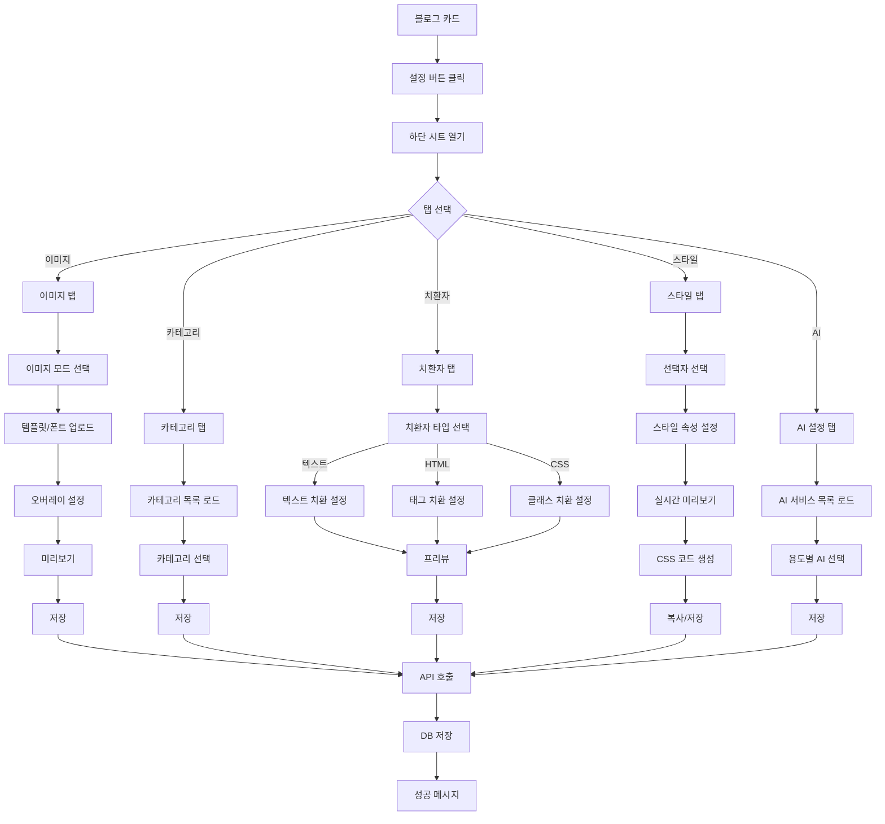
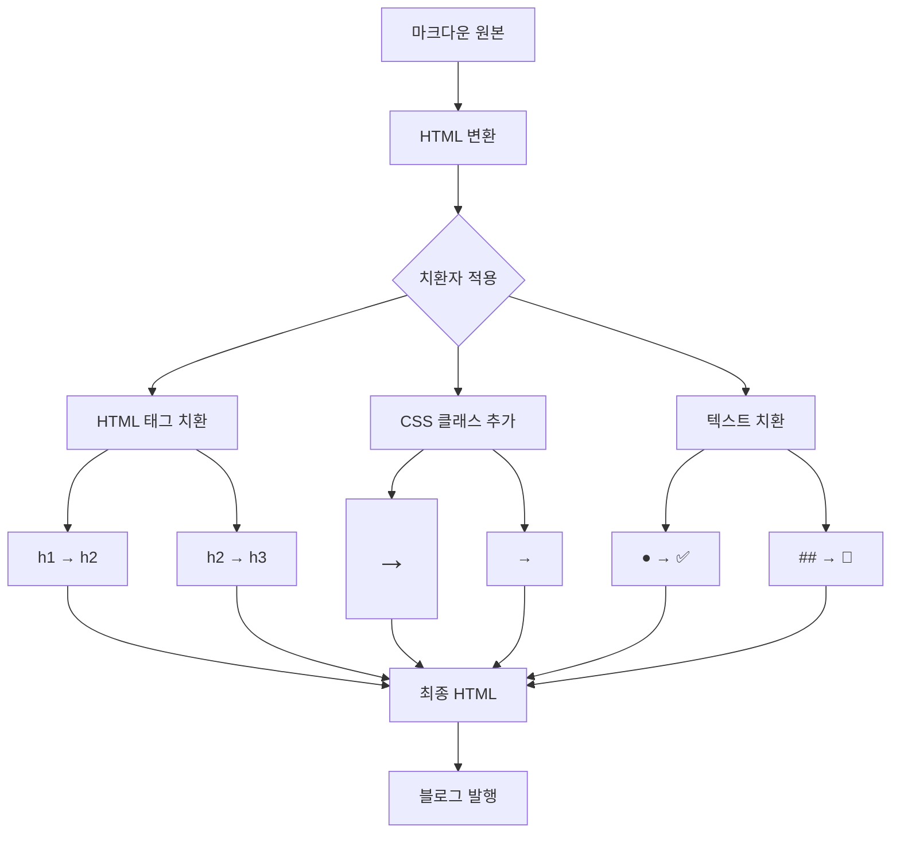

# 블로그 설정 페이지 구현 계획서

> **작성일**: 2026-01-23
> **버전**: v1.0.0
> **작업 범위**: 블로그 설정 하단 시트 전체 구현

---

## 1. 개요

### 1.1 목적
블로그 오토에서 블로그별 설정을 관리하는 하단 시트 UI 구현. 각 블로그마다 독립적인 이미지, 카테고리, 치환자, 스타일, AI 설정을 저장하고 관리할 수 있도록 함.

### 1.2 현재 상태
- 블로그 카드에 설정 버튼 존재 (`openSettingsSheet`)
- 하단 시트 기본 구조 존재 (`blogSettings`)
- 탭 UI 구성됨 (이미지, 스타일, 카테고리, 치환자)
- 각 탭 내용은 "준비 중입니다" 상태

### 1.3 목표
- 5개 탭 완전 구현: 이미지, 카테고리, 치환자, 스타일, AI 설정
- 레거시(blogauto_new) 기능 동일 적용
- 독립 파일로 분리하여 500줄 제한 준수

---

## 2. 기술 아키텍처

### 2.1 파일 구조

```
services/republish/app/
├── models/
│   └── blog.py                    # Blog 모델 확장 (필드 추가)
│
├── schemas/
│   └── blog_settings.py           # 설정 관련 Pydantic 스키마 (신규)
│
├── api/
│   └── blog_settings.py           # 설정 API 엔드포인트 (신규)
│
├── services/
│   └── placeholders.py            # 치환자 처리 서비스 (신규)
│
├── templates/
│   └── blogs/
│       ├── list.html              # 메인 (하단 시트 include)
│       └── settings/
│           ├── _base.html         # 설정 시트 기본 구조
│           ├── _tab_image.html    # 이미지 탭
│           ├── _tab_category.html # 카테고리 탭
│           ├── _tab_replace.html  # 치환자 탭
│           ├── _tab_style.html    # 스타일 탭
│           └── _tab_ai.html       # AI 설정 탭
│
└── static/
    └── js/
        ├── blog_settings.js       # 설정 메인 JS
        └── style_editor.js        # 스타일 에디터 JS
```

### 2.2 모델 확장

```python
# Blog 모델에 추가할 필드
class Blog(Base):
    # 기존 필드...

    # 이미지 설정
    image_mode = Column(String(20), default="template")  # template, openai, both
    overlay_config = Column(JSON, default=dict)  # 오버레이 설정

    # 카테고리 (M2M 관계)
    # BlogCategory 중간 테이블 통해 연결

    # 치환자
    placeholders = Column(JSON, default=dict)  # {html_tags, css_classes, text_replace}

    # 스타일
    style_config = Column(JSON, default=dict)  # {selector: {property: value}}

    # AI 설정
    ai_config = Column(JSON, default=dict)  # {writing_ai, title_ai, image_ai}
```

---

## 3. 탭별 구현 상세

### 3.1 이미지 탭

**레거시 참조**: `blogauto_new/core/templates/core/blogs_v2/_tab_images.html`

**기능**:
- 이미지 생성 모드 선택 (템플릿 / OpenAI / 혼용)
- 템플릿 이미지 업로드
- 폰트 파일 업로드
- 오버레이 설정:
  - 폰트 크기, 줄 높이
  - 텍스트 정렬 (좌/중앙/우)
  - 세로 정렬 (상/중/하)
  - 텍스트 색상
  - 외곽선 (색상, 두께)
  - 그림자 (색상, 블러, 오프셋)
  - 패딩 (상하좌우)
- Canvas 기반 실시간 미리보기

**API**:
```
POST /api/v1/blogs/{blog_id}/settings/image/upload    # 파일 업로드
POST /api/v1/blogs/{blog_id}/settings/image           # 설정 저장
GET  /api/v1/blogs/{blog_id}/settings/image           # 설정 조회
DELETE /api/v1/blogs/{blog_id}/settings/image/file    # 파일 삭제
```

**overlay_config JSON 구조**:
```json
{
  "template_image": "/media/templates/1/image.png",
  "font_file": "/media/fonts/1/font.ttf",
  "font_size": 64,
  "line_height": 1.25,
  "text_align": "center",
  "vertical_align": "center",
  "text_color": "#111111",
  "stroke_enabled": false,
  "stroke_color": "#000000",
  "stroke_width": 0,
  "shadow_enabled": false,
  "shadow_color": "rgba(0,0,0,0.35)",
  "shadow_blur": 0,
  "shadow_offset_x": 0,
  "shadow_offset_y": 0,
  "padding": {
    "left": 60,
    "right": 60,
    "top": 80,
    "bottom": 80
  }
}
```

### 3.2 카테고리 탭

**레거시 참조**: `blogauto_new/core/templates/core/blogs_v2/_tab_categories.html`

**기능**:
- 시스템 카테고리 목록 표시 (대분류 → 세부 카테고리)
- 블로그에 적용할 카테고리 다중 선택
- 선택된 카테고리 칩 형태로 표시
- 카테고리 필터링 (글 생성 시 해당 카테고리만 호출)

**API**:
```
GET  /api/v1/categories                               # 전체 카테고리 목록
GET  /api/v1/blogs/{blog_id}/settings/categories      # 블로그 카테고리 조회
POST /api/v1/blogs/{blog_id}/settings/categories      # 블로그 카테고리 저장
```

**데이터 구조**:
```python
# 중간 테이블
class BlogCategory(Base):
    __tablename__ = "blog_categories"

    id = Column(Integer, primary_key=True)
    blog_id = Column(Integer, ForeignKey("blogs.id"))
    subcategory_id = Column(Integer, ForeignKey("subcategories.id"))
```

### 3.3 치환자 탭

**레거시 참조**: `blogauto_new/core/templates/core/blogs_v2/_tab_placeholders.html`

**기능**:

#### 3.3.1 텍스트 치환
- 원본 텍스트 → 대체 텍스트 매핑
- 예: "●" → "✅", "##" → "🔹"
- 추가/수정/삭제 가능

#### 3.3.2 HTML 태그 치환
- HTML 태그명 변환
- 예: `<h1>` → `<h2>`, `<h2>` → `<h3>`
- 블로그 플랫폼별 태그 구조 대응

#### 3.3.3 CSS 클래스 치환 (핵심)
- 태그별 CSS 클래스 자동 추가
- 예: `<h1>` → `<h1 class="title-main">`
- 블로그 CSS 스타일 자동 적용

**API**:
```
GET  /api/v1/blogs/{blog_id}/settings/placeholders    # 치환자 조회
POST /api/v1/blogs/{blog_id}/settings/placeholders    # 치환자 저장
POST /api/v1/blogs/{blog_id}/settings/placeholders/preview  # 프리뷰
```

**placeholders JSON 구조**:
```json
{
  "html_tags": {
    "h1": "h2",
    "h2": "h3"
  },
  "css_classes": {
    "h1": "title-main",
    "h2": "title-sub",
    "p": "content-text",
    "ul": "list-style",
    "ol": "list-ordered"
  },
  "text_replace": [
    {"find": "●", "replace": "✅"},
    {"find": "##", "replace": "🔹"}
  ]
}
```

### 3.4 스타일 탭

**레거시 참조**: `blogauto_new/core/templates/core/blogs_v2/_tab_style.html`

**기능**:
- CSS 지식 없이 위젯으로 스타일 설정
- 선택자별 스타일 편집 (h1~h5, p, a, li, table 등)
- 속성 설정:
  - 폰트 (크기, 색상, 굵기, 스타일)
  - 여백 (margin, padding)
  - 테두리 (border)
  - 배경색
- 테스트 마크다운 실시간 미리보기 (iframe)
- 완성된 CSS 코드 복사 기능
- 반응형 미리보기 (모바일/태블릿/PC)

**API**:
```
GET  /api/v1/blogs/{blog_id}/settings/style           # 스타일 조회
POST /api/v1/blogs/{blog_id}/settings/style           # 스타일 저장
POST /api/v1/blogs/{blog_id}/settings/style/preview   # CSS 프리뷰 생성
```

**style_config JSON 구조**:
```json
{
  "h1": {
    "font-size": "24px",
    "color": "#333333",
    "font-weight": "bold",
    "margin-bottom": "16px"
  },
  "h2": {
    "font-size": "20px",
    "color": "#444444"
  },
  "p": {
    "line-height": "1.8",
    "margin-bottom": "12px"
  }
}
```

### 3.5 AI 설정 탭 (신규)

**기능**:
- 블로그 오토 전역 설정에 저장된 AI API 키 중 선택
- 용도별 AI 서비스 지정:
  - 글 생성용 AI
  - 제목 변환용 AI
  - 이미지 생성용 AI
- 각각 다른 AI 서비스 선택 가능

**API**:
```
GET  /api/v1/settings/ai-keys                         # 전역 AI 키 목록
GET  /api/v1/blogs/{blog_id}/settings/ai              # 블로그 AI 설정 조회
POST /api/v1/blogs/{blog_id}/settings/ai              # 블로그 AI 설정 저장
```

**ai_config JSON 구조**:
```json
{
  "writing_ai": {
    "provider": "openai",
    "model": "gpt-4"
  },
  "title_ai": {
    "provider": "anthropic",
    "model": "claude-3-sonnet"
  },
  "image_ai": {
    "provider": "openai",
    "model": "dall-e-3"
  }
}
```

---

## 4. 순서도 (Mermaid)

### 4.1 블로그 설정 전체 흐름



### 4.2 치환자 적용 흐름



---

## 5. 구현 단계

### Phase 1: 모델 및 스키마 (백엔드)
1. Blog 모델 필드 확장
2. BlogCategory 중간 테이블 생성
3. Pydantic 스키마 정의
4. DB 마이그레이션

### Phase 2: API 엔드포인트 (백엔드)
1. 설정 조회/저장 API 구현
2. 파일 업로드 처리
3. 치환자 서비스 로직

### Phase 3: UI 템플릿 (프론트엔드)
1. 탭 템플릿 파일 분리
2. 이미지 탭 UI 구현
3. 카테고리 탭 UI 구현
4. 치환자 탭 UI 구현
5. 스타일 탭 UI 구현
6. AI 설정 탭 UI 구현

### Phase 4: JavaScript (프론트엔드)
1. 설정 메인 JS 작성
2. 스타일 에디터 JS 작성
3. API 연동 및 이벤트 처리

### Phase 5: 테스트 및 통합
1. 단위 테스트
2. 통합 테스트
3. UI/UX 검증

---

## 6. 에이전트별 작업 분담

| 에이전트 | 담당 영역 |
|---------|----------|
| @backend-agent | 모델 확장, API 엔드포인트, 서비스 로직 |
| @frontend-agent | 템플릿 UI, JavaScript, 스타일 |
| @explorer-agent | 레거시 코드 분석 (완료) |
| @reviewer-agent | 코드 리뷰, 테스트 |

---

## 7. 주의사항

### 7.1 파일 크기 제한
- 모든 파일 500줄 미만 유지
- 필요시 파일 분리

### 7.2 레거시 호환
- blogauto_new 기능 동일 구현
- JSON 구조 호환 유지

### 7.3 보안
- 파일 업로드 검증 (이미지/폰트만 허용)
- XSS 방지 (치환자 입력값 검증)

### 7.4 성능
- 큰 파일 업로드 시 청크 처리
- 미리보기 디바운싱

---

## 8. 참고 자료

### 레거시 파일 (읽기 전용)
- `/home/jteen/blogauto_new/core/models.py` (Blog 모델: 294-430줄)
- `/home/jteen/blogauto_new/core/templates/core/blogs_v2/_tab_*.html`
- `/home/jteen/blogauto_new/core/services/placeholders.py`
- `/home/jteen/blogauto_new/core/static/core/js/style_editor.js`

### 현재 프로젝트
- `/home/jteen/blogauto_v2/services/republish/app/models/blog.py`
- `/home/jteen/blogauto_v2/services/republish/app/templates/blogs/list.html`

---

**Last Updated**: 2026-01-23
**Author**: Multi-Agent System (orchestrator)
