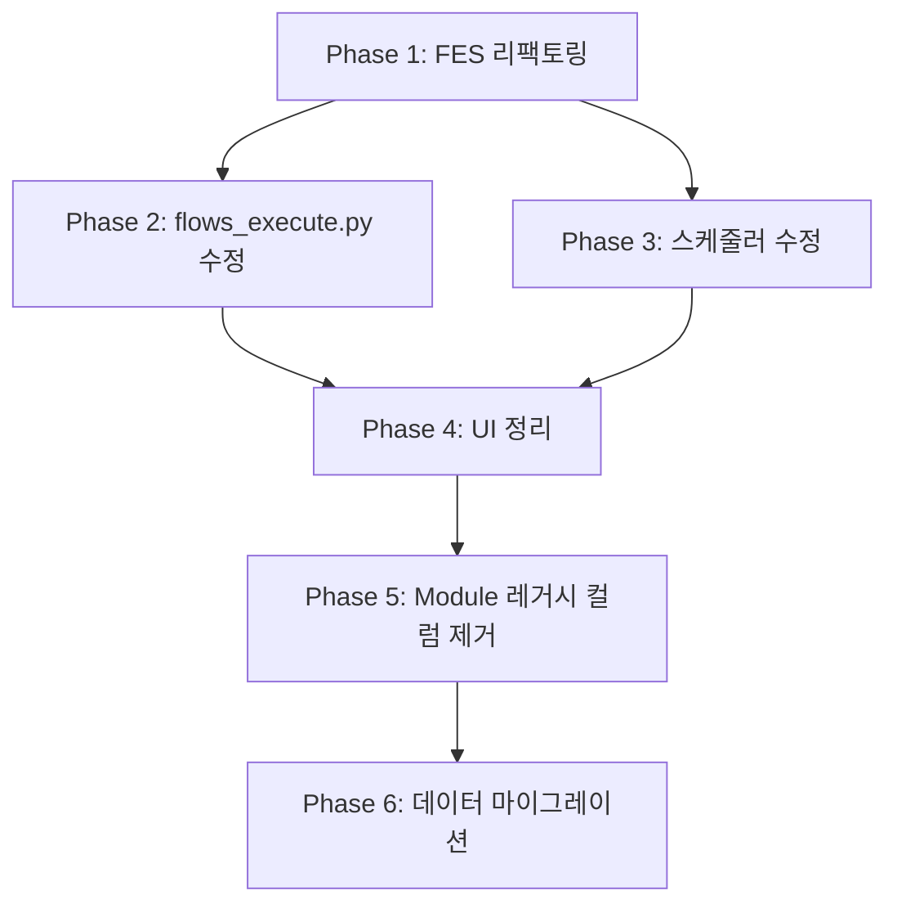

# GP 발행/재발행 통합 작업 계획서

> **버전**: v1.0
> **작성일**: 2026-03-22
> **목적**: 발행(publish)/재발행(republish) 모듈을 제거하고, GP(Growth Profile)가 직접 발행/재발행을 실행하도록 통합

---

## 1. 개요

### 1.1 현재 구조

```
Flow → FlowModule → Module(type=publish)  → flows_execute.py에서 디스패치
Flow → FlowModule → Module(type=republish) → flows_execute.py에서 디스패치
```

- publish/republish 모듈이 별도 모듈로 존재
- GP 스테이지에서 `publish.enabled`, `republish.enabled`, `interval_mode` 등 이미 제어
- 실제로 publish 모듈 settings는 `publish_count`와 `skip_if_no_inventory`뿐 → 둘 다 불필요
- republish 모듈 settings는 사용되지 않음 (GP가 전부 제어)
- Module 모델에 republish 전용 컬럼 16개 → GP 존재 시 사용되지 않음

### 1.2 목표 구조

```
Flow → FlowModule → Module(type=growth_profile) → GP가 직접 publish/republish 실행
```

- GP 스테이지의 `publish.*` / `republish.*` 설정으로 직접 실행
- publish/republish 모듈 타입 완전 제거
- 실행 서비스(PublisherPipeline, RepublishService)는 유지
- **항상 블로그당 1개 글 발행** (배치 발행 없음)

### 1.3 핵심 원칙

| 원칙 | 설명 |
|------|------|
| 1회 1글 | 블로그당 1회 실행에 1개 글만 발행 (플랫폼 페널티 방지) |
| GP 단독 제어 | 발행/재발행 스케줄은 GP 스테이지 설정이 유일한 소스 |
| 서비스 보존 | PublisherPipeline, RepublishService 등 실행 엔진은 그대로 유지 |
| FES 리팩토링 | module_id 대신 action_type으로 실행 상태 추적 |

---

## 2. 변경 범위 분석

### 2.1 제거 대상

| 구분 | 파일 | 변경 내용 |
|------|------|----------|
| **JS 파일 삭제** | `app/static/js/modules/publish-form-template.js` | 파일 전체 삭제 |
| **HTML 템플릿** | `app/templates/modules/list.html` | publish/republish 섹션, 탭, 타입선택 제거 |
| **HTML 템플릿** | `app/templates/modules/_form.html` | republish 조건부 블록 제거 |
| **HTML 템플릿** | `app/templates/modules/_publish_form.html` | 파일 전체 삭제 |
| **JS 로직** | `app/static/js/modules/list.js` | publish/republish 타입 참조 제거 |
| **JS 로직** | `app/static/js/modules/form.js` | publish/republish 기본값/저장 로직 제거 |
| **모듈 타입** | `app/models/module_type.py` | publish/republish 타입 정의 제거 |
| **실행 로직** | `app/routers/flows_execute.py` | publish/republish 모듈 디스패치 블록 → GP 직접 실행으로 교체 |
| **스케줄러** | `app/scheduler/flow_scheduler.py` | publish/republish 모듈 개별 스케줄 제거 |
| **DB 모델** | `app/models/module.py` | republish 전용 컬럼 16개 제거 (별도 마이그레이션) |

### 2.2 보존 대상

| 구분 | 파일 | 이유 |
|------|------|------|
| **발행 파이프라인** | `app/services/publishing/publisher_pipeline.py` | GP에서 직접 호출 |
| **WP 발행** | `app/services/publishing/wordpress_publisher.py` | 플랫폼 API 서비스 |
| **Blogger 발행** | `app/services/publishing/blogger_publisher.py` | 플랫폼 API 서비스 |
| **이미지 업로더** | `app/services/publishing/image_uploader.py` | 발행 시 이미지 업로드 |
| **HTML 주입** | `app/services/publishing/html_injector.py` | 발행 시 HTML 가공 |
| **발행 결과** | `app/services/publishing/publish_result.py` | 공통 결과 모델 |
| **재발행 서비스** | `app/services/wordpress_service.py` | WordPressRepublishService |
| **재발행 서비스** | `app/services/blogger_service.py` | BloggerRepublishService |
| **재고 관리** | `app/services/generation/inventory_manager.py` | 발행 대상 선택/완료 처리 |
| **Publisher** | `app/services/generation/publisher.py` | publish_for_blog, complete_publish |
| **워밍업** | `app/services/generation/warmup_manager.py` | 신규 블로그 발행 제한 |
| **재발행 라우터** | `app/routers/republish.py` | 수동 재발행, 이력 조회 (독립 기능) |
| **재발행 스키마** | `app/schemas/republish.py` | 재발행 API 스키마 |
| **GP UI** | `app/templates/modules/_growth_profile_form.html` | publish/republish 설정 유지 |
| **GP JS** | `app/static/js/modules/growth-profile-form-*.js` | 스테이지별 설정 유지 |
| **마이그레이션** | `alembic/versions/027_add_platform_post_id.py` | 모듈과 무관 |

### 2.3 수정 대상

| 구분 | 파일 | 변경 내용 |
|------|------|----------|
| **FES 모델** | `app/models/flow_execution_state.py` | `module_id` → `action_type` 전환 |
| **FES 마이그레이션** | `alembic/versions/028_*.py` | 신규: FES 스키마 변경 |
| **AutorunLog** | `app/models/autorun_log.py` | action 필드에 "publish"/"republish" 유지 (변경 없음) |
| **플로우 실행** | `app/routers/flows_execute.py` | GP 컨텍스트에서 직접 publish/republish 실행 |
| **스케줄러** | `app/scheduler/flow_scheduler.py` | GP 기반 action_type 스케줄링 |

---

## 3. 단계별 작업 계획

### Phase 1: FES 모델 리팩토링

**목적**: `(flow_id, module_id, blog_id)` → `(flow_id, action_type, blog_id)` 전환

#### 3.1.1 FES 모델 변경

**파일**: `app/models/flow_execution_state.py`

```python
# 변경 전
module_id = Column(Integer, ForeignKey("modules.id"), nullable=False)

# 변경 후
action_type = Column(String(30), nullable=False)
# action_type 값: "generate", "publish", "republish", "collect", "data", "prompt"
```

- `module_id` FK 제거 → `action_type` String(30) 추가
- 유니크 인덱스: `(flow_id, module_id, blog_id)` → `(flow_id, action_type, blog_id)`
- 기존 메서드(record_execution, calculate_next_execution 등)는 변경 없음

#### 3.1.2 Alembic 마이그레이션

**파일**: `alembic/versions/028_fes_action_type.py`

```python
def upgrade():
    # 1. action_type 컬럼 추가
    op.add_column("flow_execution_states",
        sa.Column("action_type", sa.String(30), nullable=True))

    # 2. 기존 데이터 마이그레이션 (module_id → action_type)
    #    modules 테이블 JOIN하여 module_type.code 매핑
    op.execute("""
        UPDATE flow_execution_states fes
        SET action_type = mt.code
        FROM modules m
        JOIN module_types mt ON m.module_type_id = mt.id
        WHERE fes.module_id = m.id
    """)

    # 3. 매핑 안 된 레코드 기본값
    op.execute("""
        UPDATE flow_execution_states
        SET action_type = 'unknown'
        WHERE action_type IS NULL
    """)

    # 4. NOT NULL 제약 추가
    op.alter_column("flow_execution_states", "action_type", nullable=False)

    # 5. 기존 유니크 인덱스 삭제
    op.drop_index("ix_fes_flow_module_blog")

    # 6. 새 유니크 인덱스 생성
    op.create_index("ix_fes_flow_action_blog",
        "flow_execution_states",
        ["flow_id", "action_type", "blog_id"],
        unique=True)

    # 7. module_id FK 및 컬럼 삭제
    op.drop_constraint("fk_fes_module_id", "flow_execution_states")
    op.drop_column("flow_execution_states", "module_id")

def downgrade():
    # 역순
```

#### 3.1.3 FES 헬퍼 함수 수정

**파일**: `app/routers/flows_execute.py`

```python
# 변경 전
async def _get_or_create_blog_fes(db, flow_id, module_id, blog_id):
    ...FlowExecutionState.module_id == module_id...

# 변경 후
async def _get_or_create_blog_fes(db, flow_id, action_type, blog_id):
    ...FlowExecutionState.action_type == action_type...
```

**파일**: `app/scheduler/flow_scheduler.py`

```python
# 변경 전
async def _get_or_create_execution_state(self, db, flow_id, module_id):

# 변경 후
async def _get_or_create_execution_state(self, db, flow_id, action_type, blog_id=None):
```

---

### Phase 2: flows_execute.py 리팩토링

**목적**: publish/republish 모듈 디스패치 → GP 직접 실행

#### 3.2.1 현재 실행 순서

```
① collect 모듈 (블로그 무관)
② data 모듈 (블로그 무관)
③ prompt 모듈 (블로그별)
④ generate 모듈 (블로그별)
⑤ publish 모듈 (블로그별) ← 모듈 디스패치
⑥ republish 모듈 (블로그별) ← 모듈 디스패치
```

#### 3.2.2 변경 후 실행 순서

```
① collect 모듈 (블로그 무관)
② data 모듈 (블로그 무관)
③ prompt 모듈 (블로그별)
④ generate 모듈 (블로그별)
⑤ GP → publish 실행 (블로그별) ← GP 직접 실행
⑥ GP → republish 실행 (블로그별) ← GP 직접 실행
```

#### 3.2.3 publish 실행 블록 (GP 직접)

**변경 전** (라인 329-525): publish 모듈 순회 → 블로그 순회
**변경 후**: GP 컨텍스트에서 직접 블로그 순회

```python
# ===== Step 5: GP 기반 발행 =====
if gp_context and gp_context.has_growth_profile():
    publisher = Publisher(db)
    warmup_mgr = WarmupManager(db)
    pipeline = PublisherPipeline(db)

    active_hours = _count_active_hours(gp_context.schedule_matrix)
    warmup_settings = gp_context.growth_profile.get("warmup", {})

    for blog in blogs:
        stage_params = gp_context.get_stage_for_blog(blog.id)

        # publish 비활성 → 스킵
        if not stage_params or not stage_params.publish.enabled:
            await _save_autorun_log(db, user_id, flow.id, ...,
                {"success": True, "message": "발행 비활성"}, action="publish")
            continue

        # FES 간격 체크 (action_type="publish")
        fes = await _get_or_create_blog_fes(db, flow.id, "publish", blog.id)
        if not _check_fes_interval(fes, now):
            continue

        # 워밍업 체크
        warmup_status = await warmup_mgr.check_warmup(
            blog.id, warmup_settings, active_hours)

        # 발행 실행 (항상 1개)
        result = await publisher.publish_for_blog(blog, warmup_status)

        if not result.get("skipped"):
            crawled_post = result.get("crawled_post")
            if crawled_post:
                credential = blog.google_credential if blog.platform == "blogger" else None
                pub_result = await pipeline.publish_post(blog, crawled_post, credential)

                if pub_result.success:
                    await publisher.complete_publish(
                        blog.id, crawled_post.id, pub_result.published_url)

            # FES 업데이트
            effective_interval = (
                warmup_status.effective_interval
                if warmup_status.is_active and warmup_status.effective_interval
                else stage_params.publish.computed_interval
            )
            _update_fes_after_execution(fes, pub_result.success,
                effective_interval or 60, gp_context)

        # AutorunLog 저장
        await _save_autorun_log(db, user_id, flow.id, ..., result, action="publish")
```

#### 3.2.4 republish 실행 블록 (GP 직접)

```python
# ===== Step 6: GP 기반 재발행 =====
if gp_context and gp_context.has_growth_profile():
    for blog in blogs:
        stage_params = gp_context.get_stage_for_blog(blog.id)

        # republish 비활성 → 스킵
        if not stage_params or not stage_params.republish.enabled:
            await _save_autorun_log(db, user_id, flow.id, ...,
                {"success": True, "message": "재발행 비활성"}, action="republish")
            continue

        # FES 간격 체크 (action_type="republish")
        fes = await _get_or_create_blog_fes(db, flow.id, "republish", blog.id)
        if not _check_fes_interval(fes, now):
            continue

        # 재발행 실행
        result = await _execute_republish_for_blog(blog)

        if result.get("success"):
            _update_fes_after_execution(fes, True,
                stage_params.republish.computed_interval or 60, gp_context)

        # AutorunLog 저장
        await _save_autorun_log(db, user_id, flow.id, ..., result, action="republish")
```

#### 3.2.5 모듈 디스패치 코드 제거

- `modules_by_type["publish"]` 관련 코드 전체 제거 (라인 329-525)
- `modules_by_type["republish"]` 관련 코드 전체 제거 (라인 526-654)
- `_execute_republish_for_blog()` 함수는 유지 (GP 실행에서 재사용)

---

### Phase 3: 스케줄러 수정

**파일**: `app/scheduler/flow_scheduler.py`

#### 3.3.1 register_flow 변경

```python
# 변경 전: 각 모듈별로 FES 생성 + 스케줄링
for module in flow.modules:
    if module.type_code in ("prompt", "growth_profile"):
        continue  # 개별 스케줄링 안 함
    fes = await _get_or_create_execution_state(db, flow.id, module.id)
    ...

# 변경 후: action_type 기반 스케줄링
for action_type in ["collect", "data", "generate", "publish", "republish"]:
    # GP 스테이지에서 해당 action 활성화 확인
    # FES 생성: (flow_id, action_type, blog_id)
    fes = await _get_or_create_execution_state(db, flow.id, action_type)
    ...
```

#### 3.3.2 _execute_module_callback 변경

- module_id 파라미터 → action_type 파라미터
- 내부에서 action_type에 따라 실행 로직 분기

---

### Phase 4: 모듈 타입 및 UI 정리

#### 3.4.1 ModuleType 정의 수정

**파일**: `app/models/module_type.py`

```python
# get_default_types()에서 제거:
# - {"code": "publish", "name": "발행", "icon": "📤", "display_order": 3}
# - {"code": "republish", "name": "재발행", "icon": "🔄", "display_order": 4}
```

#### 3.4.2 UI 파일 삭제

| 파일 | 작업 |
|------|------|
| `app/static/js/modules/publish-form-template.js` | 삭제 |
| `app/templates/modules/_publish_form.html` | 삭제 |

#### 3.4.3 list.html 수정

**파일**: `app/templates/modules/list.html`

- 라인 333-351: Publish 섹션 (`getModulesByType('publish')`) 제거
- 라인 354-372: Republish 섹션 (`getModulesByType('republish')`) 제거
- 라인 451-463: 모바일 탭 Publish/Republish 버튼 제거
- 라인 498-514: 모바일 탭 콘텐츠 Publish/Republish 제거
- 라인 581-593: 모듈 타입 선택 팝업에서 Publish/Republish 버튼 제거
- 라인 683: `publish-form-template.js` 스크립트 태그 제거

#### 3.4.4 list.js 수정

**파일**: `app/static/js/modules/list.js`

- 라인 102: typeOrder에서 `'publish': 3, 'republish': 4` 제거
- 라인 174: moduleTypes 배열에서 `'publish', 'republish'` 제거
- 라인 209-210: 이모지 매핑에서 `publish`, `republish` 제거
- 라인 229-230: 한글 이름 매핑에서 제거
- 라인 269: republish 조건부 폼 블록 제거
- 라인 1211: `getPublishModuleFormTemplate()` 호출 제거
- 라인 1214: publish 제외 조건 제거
- 라인 1263, 1266: 배경색 매핑에서 제거
- 라인 1951: Republish 필수 설정 제거
- 라인 1980: Publish 기본값 제거
- 라인 2231: generate/publish/republish 루프 → generate만 유지

#### 3.4.5 form.js 수정

**파일**: `app/static/js/modules/form.js`

- 라인 241: republish 제외 조건 제거
- 라인 283-286: publish 기본값 블록 제거
- 라인 292: republish 제외 처리 제거
- 라인 497: republish 처리 제거
- 라인 705: publish 제외 조건 제거
- 라인 732: republish 처리 제거
- 라인 834-837: publish 저장 로직 제거

#### 3.4.6 _form.html 수정

**파일**: `app/templates/modules/_form.html`

- 라인 22: `x-show="formData.type_code === 'republish'"` 블록 제거

---

### Phase 5: Module 모델 레거시 컬럼 정리

**목적**: republish 전용 컬럼 제거 (GP가 모든 스케줄 제어)

#### 3.5.1 제거 대상 컬럼

| 컬럼 | 타입 | 용도 (레거시) |
|------|------|-------------|
| `schedule_matrix` | JSONB | GP에서 제어 |
| `interval_mode` | String | GP 스테이지에서 제어 |
| `manual_interval_minutes` | Integer | GP 스테이지에서 제어 |
| `auto_daily_count` | Integer | GP 스테이지에서 제어 |
| `jitter_enabled` | Boolean | GP에서 제어 |
| `jitter_min_percent` | Integer | GP에서 제어 |
| `jitter_max_percent` | Integer | GP에서 제어 |
| `active_hours_start` | String | GP schedule_matrix에서 제어 |
| `active_hours_end` | String | GP schedule_matrix에서 제어 |
| `blackout_days` | JSONB | GP schedule_matrix에서 제어 |
| `cooldown_days` | Integer | 재발행 서비스 자체에서 관리 |
| `priority` | Integer | 사용처 없음 |
| `platform_overrides` | JSONB | 사용처 없음 |
| `min_post_count` | Integer | GP stages.post_count_min에서 제어 |
| `post_range_start` | Integer | 사용처 없음 |
| `post_range_end` | Integer | 사용처 없음 |

#### 3.5.2 Alembic 마이그레이션

**파일**: `alembic/versions/029_remove_republish_columns.py`

```python
def upgrade():
    columns_to_drop = [
        "schedule_matrix", "interval_mode", "manual_interval_minutes",
        "auto_daily_count", "jitter_enabled", "jitter_min_percent",
        "jitter_max_percent", "active_hours_start", "active_hours_end",
        "blackout_days", "cooldown_days", "priority", "platform_overrides",
        "min_post_count", "post_range_start", "post_range_end",
    ]
    for col in columns_to_drop:
        op.drop_column("modules", col)

def downgrade():
    # 역순으로 컬럼 복원 (기본값 포함)
```

#### 3.5.3 Module 모델 수정

**파일**: `app/models/module.py`

- 위 16개 컬럼 정의 제거
- 관련 프로퍼티/메서드 제거 (있는 경우)

---

### Phase 6: 기존 데이터 마이그레이션 및 정리

#### 3.6.1 기존 publish/republish 모듈 데이터 처리

**Alembic 마이그레이션** (028과 통합 가능):

```python
# 1. 기존 publish/republish 타입 모듈의 FlowModule 관계 삭제
op.execute("""
    DELETE FROM flow_modules
    WHERE module_id IN (
        SELECT m.id FROM modules m
        JOIN module_types mt ON m.module_type_id = mt.id
        WHERE mt.code IN ('publish', 'republish')
    )
""")

# 2. 기존 publish/republish 타입 모듈 삭제
op.execute("""
    DELETE FROM modules
    WHERE module_type_id IN (
        SELECT id FROM module_types
        WHERE code IN ('publish', 'republish')
    )
""")

# 3. publish/republish 모듈 타입 삭제
op.execute("""
    DELETE FROM module_types
    WHERE code IN ('publish', 'republish')
""")

# 4. FES에서 publish/republish 모듈 참조 레코드 → action_type으로 변환
# (Phase 1 마이그레이션에서 처리)
```

---

## 4. 실행 순서 및 의존성



| Phase | 의존성 | 예상 수정 파일 수 |
|-------|--------|------------------|
| Phase 1 | 없음 | 3 (모델 + 마이그레이션 + 헬퍼) |
| Phase 2 | Phase 1 | 1 (flows_execute.py) |
| Phase 3 | Phase 1 | 1 (flow_scheduler.py) |
| Phase 4 | Phase 2, 3 | 7 (JS 3 + HTML 3 + 모델 1) |
| Phase 5 | Phase 4 | 2 (모델 + 마이그레이션) |
| Phase 6 | Phase 5 | 1 (마이그레이션) |

---

## 5. Oracle 서버 배포 고려사항

### 5.1 현재 운영 상태

- Oracle 서버에서 republish 모듈이 운영 중
- 기존 플로우에 publish/republish 모듈이 연결되어 있을 수 있음
- FES 레코드에 module_id로 publish/republish 모듈 참조 존재

### 5.2 마이그레이션 전략

```
1. 코드 배포 전: Alembic 마이그레이션이 데이터 변환 처리
2. 코드 배포: 새 코드가 action_type 기반으로 동작
3. 기존 publish/republish 모듈: 마이그레이션에서 자동 삭제
4. 기존 FES: module_id → action_type 자동 변환
5. GP 설정: 이미 publish/republish 스테이지 설정 존재 → 변경 없음
```

### 5.3 롤백 계획

- Alembic downgrade로 스키마 복원 가능
- 삭제된 모듈 데이터는 downgrade에서 복원 불가 → 배포 전 DB 백업 필수

```bash
# 배포 전 백업
ssh ubuntu@158.180.66.204
docker exec blogauto_db pg_dump -U blogauto blogauto_v2 > backup_pre_gp_integration.sql
```

---

## 6. 테스트 계획

### 6.1 단위 테스트

| 테스트 | 대상 |
|--------|------|
| FES action_type 생성/조회 | `_get_or_create_blog_fes("publish", blog_id)` |
| FES 간격 체크 | `_check_fes_interval` with action_type |
| GP publish 실행 | GP 활성 + publish.enabled → 발행 실행 |
| GP publish 스킵 | GP publish.enabled=False → 스킵 |
| GP republish 실행 | GP 활성 + republish.enabled → 재발행 실행 |
| GP republish 스킵 | GP republish.enabled=False → 스킵 |
| 워밍업 연동 | WarmupManager → 발행 제한 적용 |
| 1글 제한 | 블로그당 항상 1개만 발행 확인 |

### 6.2 통합 테스트

| 테스트 | 시나리오 |
|--------|---------|
| 전체 플로우 | collect → data → prompt → generate → publish → republish |
| GP 없는 플로우 | publish/republish 실행되지 않음 확인 |
| 비활성 시간대 | 전체 플로우 스킵 확인 |
| 재고 0 | publish 스킵 + FES 미갱신 확인 |
| 워밍업 한도 | daily_max 초과 시 스킵 확인 |

### 6.3 기존 테스트 영향

| 파일 | 영향 |
|------|------|
| `tests/integration/test_publishing_pipeline.py` | 영향 없음 (서비스 레벨 테스트) |
| `tests/integration/test_inventory_manager.py` | 영향 없음 |
| 기타 generation 테스트 | 영향 없음 |

---

## 7. 리스크 및 완화

| 리스크 | 영향도 | 완화 방법 |
|--------|--------|----------|
| FES 마이그레이션 실패 | 높음 | 배포 전 DB 백업, 마이그레이션 테스트 |
| 기존 모듈 데이터 손실 | 중간 | downgrade 스크립트 준비, 백업 |
| flows_execute.py 리팩토링 범위 | 높음 | Phase별 순차 적용, 각 단계 테스트 |
| 스케줄러 호환성 | 중간 | flow_scheduler.py 신중하게 수정 |
| UI 참조 누락 | 낮음 | grep 검증 후 배포 |

---

## 8. 최종 아키텍처

```
┌──────────────────────────────────────────────────────┐
│                    Flow 실행                          │
├──────────────────────────────────────────────────────┤
│                                                      │
│  ① collect 모듈 → CollectService                    │
│  ② data 모듈 → DataService                          │
│  ③ prompt 모듈 → PromptLoader                       │
│  ④ generate 모듈 → ContentGenerator                 │
│                                                      │
│  ⑤ GP → publish 실행                                │
│     ├─ StageParams.publish.enabled 체크              │
│     ├─ FES(action_type="publish") 간격 체크          │
│     ├─ WarmupManager 체크                            │
│     ├─ Publisher.publish_for_blog() (1개)            │
│     ├─ PublisherPipeline.publish_post()              │
│     └─ Publisher.complete_publish()                  │
│                                                      │
│  ⑥ GP → republish 실행                              │
│     ├─ StageParams.republish.enabled 체크            │
│     ├─ FES(action_type="republish") 간격 체크        │
│     ├─ _execute_republish_for_blog()                 │
│     │   ├─ WordPressRepublishService                 │
│     │   └─ BloggerRepublishService                   │
│     └─ FES 업데이트                                  │
│                                                      │
├──────────────────────────────────────────────────────┤
│  FES: (flow_id, action_type, blog_id) 단위 추적      │
│  AutorunLog: action="publish"/"republish" 기록       │
│  GP: 유일한 스케줄 설정 소스                          │
└──────────────────────────────────────────────────────┘
```

---

## 9. 변경 없는 항목 (확인용)

- GP UI (스테이지별 publish/republish 설정): **변경 없음**
- GP settings 구조: **변경 없음** (새 설정 추가 없음)
- PublisherPipeline 4단계 파이프라인: **변경 없음**
- RepublishService (WordPress/Blogger): **변경 없음**
- WarmupManager: **변경 없음**
- InventoryManager: **변경 없음**
- Publisher 서비스: **변경 없음**
- republish.py 라우터 (수동 재발행 API): **변경 없음**
- CrawledPost 모델: **변경 없음**
- GoogleCredential: **변경 없음**

---

**작성자**: @orchestrator
**검토 필요**: 사용자 확인 후 Phase 1부터 순차 진행
