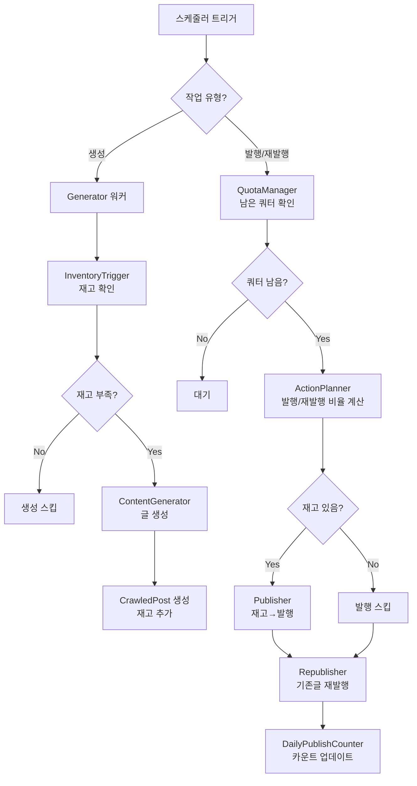

# BlogAuto v2 - 통합 재고 관리 시스템 설계 계획서

> **버전**: v1.3 (Section 6 별도 문서 분리)
> **작성일**: 2026-02-17
> **상태**: 검토 중
> **관련 문서**: generation_module_workplan.md
> **변경 이력**: v1.0 초안 작성 → v1.1 멀티워커 벤치마킹 리서치 결과 통합 → v1.2 Section 7.5 사용자 등급별 제한 시스템 추가, Phase 6-F, Q6/Q7/Q8 → v1.3 Section 6 별도 문서로 분리

---

## 목차

1. [유사 프로그램 분석](#1-유사-프로그램-분석)
2. [현재 시스템 분석 및 문제점](#2-현재-시스템-분석-및-문제점)
3. [핵심 설계 원칙](#3-핵심-설계-원칙)
4. [시스템 아키텍처](#4-시스템-아키텍처)
5. [컴포넌트 상세 설계](#5-컴포넌트-상세-설계)
6. (별도 문서로 분리됨 → growth_stage_strategy_plan.md)
7. [API 쿼터 관리](#7-api-쿼터-관리)
   - 7.5. [사용자 등급별 제한 시스템](#75-사용자-등급별-제한-시스템)
     - 7.5-1. 설계 배경
     - 7.5-2. 등급 체계 및 제한 매트릭스
     - 7.5-3. 데이터 모델
     - 7.5-4. 3계층 디스패치 제한
     - 7.5-5. Redis 키 설계
     - 7.5-6. TierLimitChecker 서비스
     - 7.5-7. 에러 응답
8. [다중 워커 시스템](#8-다중-워커-시스템)
   - 8-1. 워커 분리 원칙
   - 8-2. 발행/재발행 워커 상세
   - 8-3. 생성 워커 상세
   - 8-4. 워커 설정 권장안
   - 8-5. 큐 무한 증가 방지 메커니즘
   - 8-6. async → Celery 마이그레이션 경로
   - 8-7. 모니터링 확장
   - 8-8. 블로그별 동시성 제어
9. [데이터 모델](#9-데이터-모델)
10. [실행 시나리오](#10-실행-시나리오)
11. [구현 단계](#11-구현-단계)
12. [부록 A: 설계 결정 포인트](#부록-설계-결정-포인트)
13. [부록 B: 리서치 출처](#부록-b-리서치-출처)

---

## 1. 유사 프로그램 분석

### 1-1. 한국 블로그 자동화 도구

| 프로그램 | 핵심 기능 | BlogAuto 참고점 |
|---------|---------|----------------|
| **가제트 AI (Gazet.ai)** | 대량 키워드 일괄 생성, SEO 최적화, 스마트블록 키워드 분석 | 키워드 기반 대량 생성 + 큐 방식 발행 |
| **오토판다 (AutoPanda)** | 주제 기반 자동 수집, AI 재작성, 다중 블로그 관리 | 수집→재작성 파이프라인, 동시 실행 제한 |
| **포스팅 팩토리** | 네이버/티스토리 다중 블로그, 예약 발행, 랜덤 시간 발행 | 다중 블로그 슬롯 관리, 시간 분산 |
| **월천무기** | 자동 이웃 추가, 색인 등록, 제목 분석 | 발행 후 색인 자동화 후처리 |

### 1-2. 글로벌 콘텐츠 자동화 도구

| 프로그램 | 핵심 전략 | BlogAuto 참고점 |
|---------|---------|----------------|
| **WP Robot** | Drip Feed(점적 공급), 벌크 생성+백데이트, Draft 모드 | **생성/발행 분리 버퍼 관리** |
| **Buffer** | 콘텐츠 큐 + 타임슬롯, 3주 선행 콘텐츠 확보 | **큐 기반 재고 관리 (7~14일 분량 확보)** |
| **RecurPost/SocialBee** | 콘텐츠 라이브러리, 에버그린 재활용, 카테고리 로테이션 | **우선순위 기반 발행 대기열** |
| **HubSpot** | 성장 단계별 발행 빈도 자동 조절, 분석 기반 최적화 | **성장 단계별 자동 비율 조절** |
| **Trafficontent** | AI 자동 생성→SEO 최적화→큐잉→스케줄 발행 | **완전 자동 파이프라인** |

### 1-3. 핵심 인사이트

1. **생성과 발행의 완전 분리**: 생성(AI API)과 발행(Blog API)은 독립적 파이프라인으로 운영
2. **큐 기반 재고 관리**: 캘린더(날짜 지정) → 큐(우선순위 기반 자동) 트렌드
3. **선행 재고 확보**: 업계 표준 7~14일 분량 선행 생산
4. **적응형 스케줄링**: 성장 데이터 기반 자동 빈도 조절
5. **Drip Feed**: 대량 생성 후 점진적 발행이 가장 효과적

---

## 2. 현재 시스템 분석 및 문제점

### 2-1. 현재 구조

```
┌─────────────┐     ┌──────────────┐     ┌──────────────┐
│ 생성(prompt) │     │ 발행(publish) │     │재발행(republish)│
│             │     │  (미구현)     │     │   (운영 중)   │
│ inventory=5 │     │              │     │ post_range   │
│ → 재고 < 5  │     │              │     │ 기반 필터링   │
│   → 생성    │     │              │     │              │
└──────┬──────┘     └──────────────┘     └──────┬───────┘
       │                                        │
       └──── 연결 없음 (독립 실행) ──────────────┘
```

### 2-2. 핵심 문제점

| # | 문제 | 현재 상태 | 영향 |
|---|------|---------|------|
| 1 | **발행 모듈 미구현** | 생성만 하고 발행 파이프라인 없음 | 재고가 쌓이기만 하고 소진 안 됨 |
| 2 | **모듈 간 연결 없음** | 생성/발행/재발행이 독립 실행 | 재고 기반 연동 사이클 불가 |
| 3 | **API 쿼터 미관리** | `daily_limit` 필드 있지만 미체크 | Google Blogger API 초과 위험 |
| 4 | **재발행 비율 고정** | `post_range`로만 필터링 | 성장 단계별 동적 비율 조절 불가 |
| 5 | **계정-블로그 쿼터 미분배** | 계정당 제한인데 블로그별만 관리 | 같은 계정의 블로그들이 쿼터 경쟁 |
| 6 | **다중 워커 미설계** | Celery 워커 설정만 존재 | 대량 작업 시 무한 대기 발생 가능 |

### 2-3. 기존 인프라 현황

| 인프라 | 상태 | 파일 |
|--------|------|------|
| Celery + Redis | 설정 완료 | `celery_config.py`, `celery_tasks.py` |
| Docker Compose | 워커 3개 설정 | `docker-compose.yml` |
| InventoryTrigger | 구현 완료 | `inventory_trigger.py` |
| FlowGenerateExecutor | 구현 완료 | `flow_generate_executor.py` |
| DailyPublishCounter | 모델 존재 | `daily_publish_counter.py` |
| GoogleAccountPolicy | 모델 존재 | `google_account_policy.py` |
| BloggerGlobalSlot | 모델 존재 | `blogger_global_slot.py` |

**현재 Celery 큐 구조:**

| 큐 | 워커 | Concurrency | 태스크 | 문제점 |
|----|------|------------|--------|--------|
| `title_queue` | celery_title_worker | 고정 2 | `recombine_title` | 적절 |
| `content_queue` | celery_content_worker | autoscale 5,3 | `generate_content` + `on_generation_complete` | ⚠️ **과부하** (heavy+light 혼재) |
| `image_queue` | celery_image_worker | 고정 2 | `generate_image` (미구현) | ⚠️ **유휴 워커** 리소스 낭비 |

**주의 사항:**
- `content_queue`에 글 생성(3~10분)과 후처리(2~3초)가 혼재 → 후처리 지연 발생
- `image_queue` 워커 2개가 항상 대기 상태 (generate_image가 스킵 모드)
- 발행/재발행 태스크는 Celery 미사용 → `flows_execute.py` async 직접 실행
- 현재 `task_acks_late=True`, `worker_prefetch_multiplier=1` 설정 (적절)

---

## 3. 핵심 설계 원칙

### 3-1. 생성과 발행의 완전 분리

```
┌─────────────────────────────────┐     ┌─────────────────────────────────┐
│         생성 영역 (AI API)       │     │      발행 영역 (Blog API)       │
│                                 │     │                                 │
│  • 예산이 허락하면 24시간 가동    │     │  • 플랫폼별 일일 한도 준수       │
│  • AI API 비용만 발생            │     │  • Google Blogger: 100건/계정/일 │
│  • 생성 시간: 3~10분/건          │     │  • WordPress: 제한 없음          │
│  • 다중 워커로 병렬 처리         │     │  • 발행 시간: 2~3초/건           │
│                                 │     │  • 최소 30분 간격 발행           │
│  제목 재조합 → 참조자료 수집     │     │                                 │
│  → 글 생성 → 이미지 생성         │     │  재고 → 발행 → 카운터 업데이트   │
│  → CrawledPost (재고 저장)       │     │  기존글 → 재발행 → 카운터 업데이트│
└────────────────┬────────────────┘     └────────────────┬────────────────┘
                 │                                       │
                 │         ┌──────────────┐              │
                 └────────►│  재고 (큐)    │◄─────────────┘
                           │ CrawledPost  │
                           │ source=      │
                           │ "generated"  │
                           │ published_at │
                           │ IS NULL      │
                           └──────────────┘
```

### 3-2. 핵심 규칙

| # | 규칙 | 설명 |
|---|------|------|
| 1 | **생성은 AI 예산 기반** | Blog API 쿼터와 무관, 사용자 예산으로만 제어 |
| 2 | **발행/재발행은 쿼터 기반** | Google Blogger: 100건/계정/일, WordPress: 무제한 |
| 3 | **발행은 재고가 있을 때만** | `CrawledPost(source="generated", published_at=NULL)` 존재 시 |
| 4 | **생성→발행→재발행 순서** | 재고 확보 우선, 남은 쿼터로 재발행 |
| 5 | **쿼터는 플랫폼별 차등** | Blogger는 엄격, WordPress는 느슨 |

---

## 4. 시스템 아키텍처

### 4-1. 전체 구조

```
┌─────────────────────────────────────────────────────────────┐
│                   QuotaManager (계정 쿼터 관리)               │
│  Google Credential → 100건/일 (Blogger) → 슬롯 분배          │
│  WordPress → 무제한                                         │
│  ┌──────────┬──────────┬──────────┐                         │
│  │ Blog A   │ Blog B   │ Blog C   │  ← 같은 계정의 블로그들   │
│  │ 발행:30  │ 발행:30  │ 발행:30  │  ← 합계 ≤ 100 (Blogger)  │
│  └────┬─────┴────┬─────┴────┬─────┘                         │
└───────┼──────────┼──────────┼───────────────────────────────┘
        │          │          │
┌───────▼──────────▼──────────▼───────────────────────────────┐
│              ActionPlanner (행동 계획 수립)                    │
│                                                             │
│  블로그별 일일 행동 계획 (Daily Action Plan):                  │
│  ┌───────────────────────────────────────────┐              │
│  │ Blog A (30글, rapid_growth)               │              │
│  │ 쿼터: 30회/일 (Blogger 계정 기준 분배)     │              │
│  │                                           │              │
│  │ 비율: 발행 60% / 재발행 40%               │              │
│  │ → 발행 18회 / 재발행 12회                 │              │
│  │                                           │              │
│  │ 생성: 재고 < 임계값이면 별도 실행          │              │
│  │       (쿼터와 무관, AI 예산 기반)          │              │
│  └───────────────────────────────────────────┘              │
└─────────────────────────┬───────────────────────────────────┘
                          │
        ┌─────────────────┼─────────────────┐
        ▼                 ▼                 ▼
┌───────────────┐ ┌───────────────┐ ┌───────────────┐
│   Generator   │ │   Publisher   │ │  Republisher  │
│  (독립 실행)  │ │   (신규)      │ │   (기존)      │
│               │ │               │ │               │
│ AI API 사용   │ │ Blog API 사용 │ │ Blog API 사용 │
│ 쿼터 무관     │ │ 쿼터 소비     │ │ 쿼터 소비     │
│ 다중 워커     │ │               │ │               │
│ 3~10분/건     │ │ 2~3초/건      │ │ 2~3초/건      │
└───────────────┘ └───────────────┘ └───────────────┘
```

### 4-2. 실행 사이클



---

## 5. 컴포넌트 상세 설계

### 5-1. QuotaManager - 계정 쿼터 관리자

```
파일: app/services/generation/quota_manager.py (~200줄)

역할:
  - 플랫폼별 API 쿼터를 블로그들에 공정 분배
  - Blogger: 100건/계정/일 (발행+재발행 합산)
  - WordPress: 제한 없음

기존 활용:
  - GoogleAccountPolicy.max_daily_total (계정 일일 한도, 기본 100)
  - GoogleAccountPolicy.max_daily_per_blog (블로그별 한도)
  - DailyPublishCounter (일일 카운팅, publish/republish 구분)

메서드:
  get_remaining_quota(credential_id) → int
    # 오늘 남은 쿼터 조회

  allocate_quota(credential_id, blogs) → Dict[blog_id, int]
    # 블로그별 쿼터 분배 (성장 단계 가중치 기반)

  consume_quota(blog_id, action_type) → bool
    # 쿼터 1 소비 (publish/republish)
    # False 반환 시 한도 초과

  is_wordpress(blog_id) → bool
    # WordPress이면 쿼터 무제한
```

**쿼터 분배 알고리즘** (Blogger 전용):

```
계정 일일 쿼터: 100 (Google Blogger API 한도)
  ├─ 안전 마진: 10% → 실사용 90회
  │
  ├─ Blog A (rapid_growth): 가중치 3 → 90 × 3/(3+2+1) = 45회
  ├─ Blog B (growth):       가중치 2 → 90 × 2/(3+2+1) = 30회
  └─ Blog C (stable):       가중치 1 → 90 × 1/(3+2+1) = 15회
```

### 5-2. ActionPlanner - 행동 계획 수립자

```
파일: app/services/generation/action_planner.py (~250줄)

역할:
  - 블로그별 발행/재발행 비율 계산 (쿼터 내에서)
  - 생성은 별도 (재고 기반 독립 판단)

메서드:
  create_daily_plan(blog_id, allocated_quota) → DailyActionPlan
    # 발행/재발행 목표 수립

  get_publish_republish_ratio(growth_stage) → (float, float)
    # 성장 단계별 기본 비율

  adjust_for_inventory(plan, current_inventory) → DailyActionPlan
    # 재고 상태에 따른 발행 수 보정
```

**발행/재발행 비율** (쿼터 내에서 분배):

| 성장 단계 | 발행(신규글) | 재발행(기존글) | 설명 |
|----------|------------|-------------|------|
| **rapid_growth** (0~50글) | 60% | 40% | 신규글 공격적 발행 |
| **growth** (51~150글) | 40% | 60% | 균형 전환 |
| **stable** (151글+) | 20% | 80% | 유지보수 중심 |
| **custom** | 사용자 설정 | 사용자 설정 | 사용자 지정 |

### 5-3. Publisher - 발행 서비스 (신규)

```
파일: app/services/generation/publisher.py (~180줄)

역할: 재고(source="generated") 중 미발행 글을 Blog API로 발행

메서드:
  get_post_for_publish(blog_id) → CrawledPost?
    # FIFO: created_at ASC, 미발행 재고 1개 조회

  publish_post(crawled_post_id, blog) → PublishResult
    # Blog API로 발행, published_at 설정

  on_publish_complete(blog_id) → None
    # DailyPublishCounter 업데이트
    # 재고 상태 확인 로그

기존 재활용:
  - BloggerRepublishService의 API 호출 로직
  - GoogleAccountPolicy의 간격/시간대 제한
  - DailyPublishCounter의 카운팅
```

### 5-4. CycleExecutor - 통합 실행 사이클

```
파일: app/services/generation/cycle_executor.py (~200줄)

역할: 생성→발행→재발행 사이클 통합 관리

메서드:
  execute_generation_cycle(blog_id, module) → GenerationResult
    # 재고 확인 → 부족 시 생성 (AI 워커에 위임)

  execute_publish_cycle(blog_id, quota) → PublishResult
    # 재고→발행, 쿼터 차감

  execute_republish_cycle(blog_id, quota) → RepublishResult
    # 기존글 재발행, 쿼터 차감

  execute_daily_cycle(blog_id) → DailyCycleResult
    # 전체 일일 사이클 실행
```

---

## 6. 성장 단계별 전략

> **별도 문서로 분리됨**: [성장 단계별 전략 설계 계획서](growth_stage_strategy_plan.md)
>
> 성장 단계별 전략은 생성/발행/재발행 모듈 전체에 영향을 미치는 독립적 설계이므로
> 별도 계획서로 분리하여 관리합니다.

---

## 7. API 쿼터 관리

### 7-1. 플랫폼별 제한

| 플랫폼 | 일일 제한 | 단위 | 비고 |
|--------|---------|------|------|
| **Google Blogger** | **100건** | 계정당 (포스트 발행/수정 기준) | 사용자 증언 기반, 초과 시 403 |
| **WordPress** | 무제한 | - | 자체 호스팅, API 제한 없음 |

### 7-2. Google Blogger 쿼터 관리

```
Google Blogger 계정 구조:
  GoogleCredential (계정)
    ├─ Blog A (Blogger)
    ├─ Blog B (Blogger)
    └─ Blog C (Blogger)

  일일 한도: 100건 (발행 + 재발행 합산)
  ※ 10,000건은 API 요청 토큰 기준으로 발행 건수와 다름
  ※ 실제 포스트 발행/수정 기준 100건 제한

  안전 마진: 10% → 실사용 90회

  분배 예시 (3개 블로그):
    Blog A (rapid_growth): 45회
    Blog B (growth):       30회
    Blog C (stable):       15회
```

### 7-3. 에러 핸들링

```
Blogger API 에러 대응:

403 (quotaExceeded):
  → 해당 계정 오늘 작업 중단
  → 다른 계정의 블로그로 전환
  → DailyPublishCounter에 한도 도달 기록

429 (rateLimitExceeded):
  → 지수 백오프 적용
  → 1차: 1분 → 2차: 2분 → 3차: 4분 → 최대 32분
  → 3회 연속 실패 시 해당 블로그 일일 작업 중단

발행 간격:
  → 최소 30분 간격 (GoogleAccountPolicy.min_interval_minutes)
  → 랜덤 지터 0~15분 추가 (기계적 패턴 회피)
  → 허용 시간대: 오전 8시~오후 10시 (설정 가능)
```

---

## 7.5. 사용자 등급별 제한 시스템

### 7.5-1. 설계 배경

```
운영 계획:
  1단계: 제이틴(관리자)이 직접 사용 + 운영
  2단계: 지인 몇 명에게 베타 테스터 권한 부여
  3단계: 상용화 가능성 검토 (확정 아님)

핵심 원칙:
  - 워커 자체를 제한하지 않음 (워커는 서버 공유 자원)
  - 사용자별 "동시 실행 태스크 수"를 제한하는 방식
  - 등급 체계를 단순하게 유지하되 확장 가능하게 설계
```

### 7.5-2. 등급 체계 및 제한 매트릭스

```python
class UserTier(str, Enum):
    ADMIN = "admin"      # 관리자 (제이틴) - 모든 제한 해제
    BETA = "beta"        # 베타 테스터 (지인) - 중간 수준
    FREE = "free"        # 무료 사용자 (향후) - 기본 제한
    PRO = "pro"          # 유료 사용자 (향후) - 확장 제한
```

| 항목 | admin | beta | free | pro |
|------|-------|------|------|-----|
| **등록 블로그 수** | 무제한 | 10 | 3 | 30 |
| **등록 계정 수** | 무제한 | 3 | 1 | 10 |
| **플로우 수** | 무제한 | 5 | 2 | 20 |
| **동시 생성 태스크** | 무제한 | 2 | 1 | 5 |
| **동시 발행 태스크** | 무제한 | 2 | 1 | 3 |
| **일일 생성 상한** | 무제한 | 50 | 10 | 200 |
| **일일 발행 상한** | 무제한 | 30 | 5 | 100 |
| **AI 모델 선택** | 전체 | 전체 | 기본만 | 전체 |
| **참조자료 수집** | O | O | X | O |
| **이미지 생성** | O | O | X | O |
| **커스텀 프롬프트** | O | O | X | O |

※ 수치는 초기값이며 TierLimits 테이블에서 동적 변경 가능

### 7.5-3. 데이터 모델

```python
# app/models/tier_limits.py (신규 ~90줄)

class TierLimits(Base):
    """사용자 등급별 제한 설정 (DB 기반 동적 관리)"""
    __tablename__ = "tier_limits"

    id: int (PK)
    tier: str (unique)           # admin/beta/free/pro

    # 리소스 제한
    max_blogs: int               # 최대 블로그 수 (0=무제한)
    max_credentials: int         # 최대 계정 수
    max_flows: int               # 최대 플로우 수

    # 동시 실행 제한 (Redis 세마포어)
    max_concurrent_generation: int
    max_concurrent_publish: int

    # 일일 상한
    daily_generation_limit: int  # 0=무제한
    daily_publish_limit: int     # 0=무제한

    # 기능 제한 (JSON)
    feature_flags: JSON          # {"allowed_ai_models": [...], ...}

    created_at, updated_at

# DB 레코드 없으면 DEFAULT_TIER_LIMITS (코드 내장) 폴백
```

### 7.5-4. 기술적 구현: 3계층 디스패치 제한

```
┌───────────────────────────────────────────────────────┐
│              태스크 디스패치 계층                       │
│                                                       │
│  Layer 1: TierLimitChecker (사용자 등급 제한)           │
│    ├─ 동시 실행 제한 (Redis 세마포어)                   │
│    ├─ 일일 상한 확인 (Redis 카운터)                     │
│    └─ 기능 접근 확인 (feature_flags)                    │
│                                                       │
│  Layer 2: BlogRateLimiter (블로그별 동시성 제어)         │
│    └─ 블로그당 동시 실행 2건 제한 (Section 8-8)         │
│                                                       │
│  Layer 3: QuotaManager (플랫폼 API 쿼터)               │
│    └─ Blogger 100건/계정/일 (Section 7)                │
│                                                       │
│  → 3개 계층 모두 통과해야 태스크 디스패치                │
└───────────────────────────────────────────────────────┘

  예시: beta 사용자가 5개 블로그에 동시 생성 요청
    Layer 1: max_concurrent_generation=2 → 2개만 즉시 실행, 3개 대기
    Layer 2: blog별 max_concurrent=2 → 통과 (블로그당 1건)
    Layer 3: 생성은 쿼터 무관 → 통과
    결과: 2건 실행 → 완료 시 다음 2건 → 마지막 1건
```

### 7.5-5. Redis 키 설계

```
사용자별 동시 실행:
  user_concurrent:{user_id}:generation  → int (TTL: 3600초)
  user_concurrent:{user_id}:publish     → int (TTL: 3600초)

사용자별 일일 카운터:
  user_daily:{user_id}:generation:{날짜} → int (TTL: 90000초)
  user_daily:{user_id}:publish:{날짜}    → int (TTL: 90000초)
```

### 7.5-6. TierLimitChecker 서비스

```
파일: app/services/generation/tier_limit_checker.py (~200줄)

메서드:
  get_tier_limits(tier) → Dict          # DB 조회 + 폴백
  check_concurrent_limit(user_id, type) → LimitCheckResult
  acquire_concurrent_slot(user_id, type) → bool   # Redis INCR
  release_concurrent_slot(user_id, type) → None   # Redis DECR (finally)
  check_daily_limit(user_id, type)      → LimitCheckResult
  increment_daily_counter(user_id, type) → int
  check_resource_limit(user_id, type)   → LimitCheckResult  # 블로그/계정 수
  check_feature_access(tier, feature)   → bool
  check_ai_model_access(tier, model)    → bool

QuotaManager 연동:
  allocate_quota() 호출 전 → check_daily_limit() 먼저 체크
  min(사용자 상한 남은 수, API 쿼터 남은 수) = 실제 분배 가능 쿼터
```

### 7.5-7. 에러 응답

```
리소스 제한 초과:     HTTP 403 + TIER_RESOURCE_LIMIT
동시 실행/일일 초과:  HTTP 429 + TIER_DAILY_LIMIT
기능 접근 제한:       HTTP 403 + TIER_FEATURE_RESTRICTED

모든 응답에 upgrade_hint 포함 (상위 등급 안내)
```

---

## 8. 다중 워커 시스템

### 8-1. 워커 분리 원칙

생성과 발행/재발행은 완전히 다른 워커에서 실행됩니다.

> **⚠️ 워커 풀 타입 주의사항**
> 현재 `celery_tasks.py`의 `_run_async()` 함수가 `asyncio.run()`을 사용하므로
> **gevent/eventlet 풀과 호환되지 않습니다.** 현재는 prefork 풀만 사용 가능합니다.
> gevent 도입은 `_run_async()` 제거 + 순수 동기 코드 전환 이후 가능합니다. (중기 과제)
>
> | 풀 타입 | 현재 호환 | 적합 작업 | 비고 |
> |---------|----------|----------|------|
> | **prefork** | ✅ 호환 | 모든 태스크 | 현재 기본값, 유지 |
> | **gevent** | ❌ 비호환 | I/O-bound (발행 API 호출) | async 제거 후 도입 가능 |
> | **solo** | ✅ 호환 | 디버깅 전용 | 개발 환경만 |

```
┌─────────────────────────────────────────────────────────────┐
│                    Celery 워커 구조                          │
│                                                             │
│  ┌─────────────────────────────────┐                       │
│  │    발행/재발행 워커 그룹         │                       │
│  │    (publish_worker)             │                       │
│  │                                 │                       │
│  │  Worker 1 (메인): 1회차 작업    │ 2~3초/건              │
│  │  Worker 2 (서브): 2회차 작업    │ 블로그 100개 = ~5분    │
│  │                                 │                       │
│  │  → 2개 워커 교대 = 무한 반복    │                       │
│  └─────────────────────────────────┘                       │
│                                                             │
│  ┌─────────────────────────────────┐                       │
│  │    생성 워커 그룹               │                       │
│  │    (generation_worker)          │                       │
│  │                                 │                       │
│  │  Worker 1 (제목 재조합)         │ ~1분/건               │
│  │  Worker 2 (참조자료 수집)       │ ~2분/건               │
│  │  Worker 3 (글 생성)             │ ~3~5분/건             │
│  │  Worker 4 (이미지 생성)         │ ~1~2분/건             │
│  │  Worker 5~6 (서브, 분산용)      │ 대기열 분산           │
│  │                                 │                       │
│  │  → 파이프라인 분리 + 다중 분산  │                       │
│  └─────────────────────────────────┘                       │
└─────────────────────────────────────────────────────────────┘
```

### 8-2. 발행/재발행 워커 상세

```
발행/재발행 소요 시간:
  - 단일 건: 2~3초
  - 블로그 100개 × 1회: ~300초 (5분)
  - 렉 포함 최대: ~10분

문제 시나리오:
  Blog A 작업 완료 → 10분 뒤 다음 작업 도래
  But: 나머지 블로그들의 1회차가 아직 미완료
  → 큐에 2회차 작업 적재 → 대기 발생

해결: 2-워커 교대 시스템
  ┌──────────────┐     ┌──────────────┐
  │  Worker 1    │     │  Worker 2    │
  │  (메인)      │     │  (서브)      │
  │              │     │              │
  │  1회차 작업  │     │  대기 중     │
  │  처리 중...  │     │              │
  │              │     │              │
  │  ──완료──    │     │  2회차 작업  │
  │              │     │  시작        │
  │  3회차 대기  │     │  처리 중...  │
  │  또는 즉시   │     │              │
  │  시작        │     │  ──완료──    │
  └──────────────┘     └──────────────┘

  → 교대 실행으로 대기 없는 연속 처리
  → 블로그 200개 이상 시 워커 3개로 확장
```

### 8-3. 생성 워커 상세

```
생성 파이프라인 단계별 소요 시간:
  1. 제목 재조합:    ~1분 (AI API 1회)
  2. 참조자료 수집:  ~2분 (검색 + 크롤링 + AI 요약)
  3. 글 생성:        ~3~5분 (AI API 1회, 긴 프롬프트)
  4. 이미지 생성:    ~1~2분 (AI API 1회)

  총 소요: 약 7~10분/건

문제 시나리오:
  블로그 5개 동시 생성 요청
  → Worker 1개로 순차 처리 시: 5건 × 7분 = 35분
  → 35분 동안 다른 블로그 작업 대기
  → 2회차, 3회차 작업 누적 → 무한 대기

해결: 파이프라인 분리 + 다중 워커

  방안 A: 단계별 워커 분리 (파이프라인)
  ┌──────────┐   ┌──────────┐   ┌──────────┐   ┌──────────┐
  │ Worker 1 │──►│ Worker 2 │──►│ Worker 3 │──►│ Worker 4 │
  │ 제목     │   │ 참조수집 │   │ 글 생성  │   │ 이미지   │
  │ 재조합   │   │          │   │          │   │ 생성     │
  │ ~1분     │   │ ~2분     │   │ ~3~5분   │   │ ~1~2분   │
  └──────────┘   └──────────┘   └──────────┘   └──────────┘

  장점: 파이프라인 병렬화로 처리량 증가
  단점: 각 단계 간 의존성 관리 복잡

  방안 B: 동일 작업 다중 워커 (추천)
  ┌──────────────────────────────────┐
  │        생성 큐 (Redis)            │
  │  [Blog1-생성] [Blog2-생성] ...   │
  └────┬──────┬──────┬──────┬───────┘
       │      │      │      │
  ┌────▼──┐ ┌─▼───┐ ┌▼────┐ ┌▼────┐
  │ W1    │ │ W2  │ │ W3  │ │ W4  │
  │ 전체  │ │ 전체│ │ 전체│ │ 전체│
  │파이프 │ │파이프│ │파이프│ │파이프│
  │ 라인  │ │라인 │ │ 라인│ │ 라인│
  └───────┘ └─────┘ └─────┘ └─────┘

  장점: 구현 단순, 워커 수로 처리량 조절
  단점: 워커당 전체 파이프라인 실행 (리소스 사용)

  방안 C: 하이브리드 (단계 분리 + 다중 워커)
  ┌───────────────────────────────────────┐
  │           생성 큐 구조                 │
  │                                       │
  │  제목 재조합 큐  → Worker T1, T2      │
  │  참조수집 큐     → Worker R1, R2      │
  │  글 생성 큐      → Worker G1, G2, G3  │
  │  이미지 생성 큐  → Worker I1          │
  │                                       │
  │  ※ 글 생성이 가장 오래 걸리므로       │
  │    글 생성 워커를 가장 많이 배치       │
  └───────────────────────────────────────┘

  장점: 병목 단계에 워커 집중 배치 가능
  단점: 구현 복잡도 높음

  ──────────────────────────────────────────
  ★ Celery Canvas 패턴으로 방안 A의 단점 해소
  ──────────────────────────────────────────

  방안 A의 "의존성 관리 복잡" 문제는 Celery Canvas의
  chain/chord 프리미티브로 해결할 수 있습니다:

  # chain: 순차 파이프라인 (결과가 다음 태스크에 자동 전달)
  from celery import chain
  pipeline = chain(
      recombine_title.s(blog_id, title_id),
      generate_content.s(),     # 이전 결과 자동 수신
      generate_image.s(),
      on_generation_complete.s()
  )
  pipeline.apply_async()

  # chord: 병렬 실행 후 집계 (다중 블로그 동시 처리)
  from celery import chord, group
  chord(
      group(generate_for_blog.s(bid, module_id) for bid in blog_ids),
      on_batch_complete.s()
  ).apply_async()

  Canvas 장점:
  - 각 단계가 독립 태스크 → 실패 시 해당 단계만 재시도
  - 중간 결과가 Redis에 저장 → 워커 장애 시 이어서 실행
  - chord로 병렬 + 집계 패턴 자동 관리

  ★ 결론: 현재는 방안 B(동일 작업 다중 워커)로 시작하되,
         향후 대규모 확장 시 Canvas chain으로 방안 A 전환 검토
```

### 8-4. 워커 설정 권장안

**서버 환경:** Oracle Cloud 1 OCPU / 6GB RAM

```yaml
# docker-compose.yml 워커 설정 (Oracle Cloud 최적화)

# 빠른 작업 워커 (제목 재조합, 후처리, 재고 확인)
celery_fast_worker:
  command: >
    celery -A app.core.celery_config worker
    -Q fast_queue
    --concurrency=4
    --max-tasks-per-child=100
    --hostname=fast-worker
    -l INFO
  deploy:
    resources:
      limits:
        memory: 512M

# 글 생성 워커 (핵심, 장시간 작업)
celery_generation_worker:
  command: >
    celery -A app.core.celery_config worker
    -Q generation_queue
    --autoscale=3,1
    --max-tasks-per-child=20
    --hostname=gen-worker
    -l INFO
  deploy:
    resources:
      limits:
        memory: 1G

# 발행/재발행 워커 (rate limit 적용)
celery_publish_worker:
  command: >
    celery -A app.core.celery_config worker
    -Q publish_queue
    --concurrency=2
    --hostname=publish-worker
    -l INFO
  deploy:
    resources:
      limits:
        memory: 256M

# Flower 모니터링 (기존 유지)
flower:
  command: >
    celery -A app.core.celery_config flower
    --port=5555 --persistent=True --db=/data/flower.db
```

**메모리 예산 (6GB 기준):**

| 컴포넌트 | 메모리 | 비고 |
|----------|--------|------|
| FastAPI App | ~512MB | 메인 서비스 |
| PostgreSQL | ~1GB | 데이터베이스 |
| Redis | ~256MB | 브로커 + 캐시 |
| fast_worker | ~512MB | concurrency=4 |
| generation_worker | ~1GB | autoscale=3,1 |
| publish_worker | ~256MB | concurrency=2 |
| Flower | ~128MB | 모니터링 |
| OS + 여유분 | ~2.3GB | 시스템 |
| **합계** | **~6GB** | |

**태스크 라우팅 설정:**

```python
# celery_config.py
celery_app.conf.task_routes = {
    # 빠른 작업 (< 30초)
    "app.core.celery_tasks.recombine_title":        {"queue": "fast_queue"},
    "app.core.celery_tasks.on_generation_complete":  {"queue": "fast_queue"},

    # 글 생성 (3~10분)
    "app.core.celery_tasks.generate_content":        {"queue": "generation_queue"},
    "app.core.celery_tasks.generate_image":          {"queue": "generation_queue"},

    # 발행/재발행 (rate limit 적용, 신규)
    "app.core.celery_tasks.publish_post":            {"queue": "publish_queue"},
    "app.core.celery_tasks.republish_post":          {"queue": "publish_queue"},
}
```

**태스크별 Time Limit 설정 (좀비 태스크 방지):**

```python
# celery_config.py - 글로벌 기본값
celery_app.conf.update(
    task_soft_time_limit=600,        # 기본 10분
    task_time_limit=720,             # 기본 12분 (hard)
    worker_max_tasks_per_child=50,   # 50 태스크 후 워커 재시작 (메모리 누수 방지)
    worker_max_memory_per_child=256000,  # 256MB 초과 시 워커 재시작
)

# 태스크별 오버라이드
recombine_title:        soft_time_limit=15,   time_limit=30
generate_content:       soft_time_limit=600,  time_limit=720
on_generation_complete: soft_time_limit=10,   time_limit=20
publish_post:           soft_time_limit=30,   time_limit=60
republish_post:         soft_time_limit=30,   time_limit=60
```

### 8-5. 큐 무한 증가 방지 메커니즘

```
문제: 블로그 100개에서 동시 생성 요청 → 큐에 수백 건 적체 → 처리 불가

해결 전략 3가지:

1. 디스패처 레벨 (큐 투입 전 필터)
   ┌────────────────────────────────────────────┐
   │  check_queue_before_dispatch()              │
   │                                            │
   │  큐 대기 수 확인 → max_pending 초과 시 스킵 │
   │  → "큐 포화" 로그 기록                      │
   │  → 다음 스케줄 사이클에서 재시도             │
   └────────────────────────────────────────────┘

2. 태스크 레벨 (Rate Limiting)
   @celery_app.task(rate_limit='10/m')  # 분당 10건
   def publish_post(blog_id, post_id):
       ...

   ※ rate_limit은 워커 단위 적용 (워커 2개면 실제 20/m)

3. ETA 방식 (시간 지정 실행)
   publish_post.apply_async(
       args=[blog_id, post_id],
       eta=next_available_time,   # 30분 간격 보장
       queue='publish_queue'
   )
```

### 8-6. 현재 async → Celery 마이그레이션 경로

```
현재 상태:
  flows_execute.py → _execute_flow_background() → async 직접 실행
  → Celery를 통하지 않고 FastAPI BackgroundTasks로 생성 실행

마이그레이션 3단계:

  1단계: 발행 태스크만 Celery화 (기존 생성은 그대로)
    - publish_post, republish_post Celery 태스크 신규 생성
    - publish_queue 워커 신규 추가
    - 기존 flows_execute.py의 재발행 로직은 유지
    → 영향 범위: 최소

  2단계: 생성 파이프라인 Celery 전환
    - flows_execute.py의 prompt 모듈 → Celery task dispatch로 교체
    - FlowGenerateExecutor.execute_for_blogs()를 group/chord로 전환
    - 기존 title_queue, content_queue 라우팅 유지
    → 영향 범위: flow_generate_executor.py, flows_execute.py

  3단계 (중기): _run_async() 제거 + gevent 도입
    - celery_tasks.py에서 _run_async() 함수 제거
    - 각 태스크를 순수 동기 함수로 전환
    - 서비스 레이어도 동기 버전 제공
    - 발행 워커를 gevent pool로 전환 (I/O 효율화)
    → 영향 범위: celery_tasks.py, 서비스 전체
```

### 8-7. 모니터링 확장

```
현재: Flower 기본 대시보드 (localhost:5555)

확장 계획:

1단계 (즉시): Flower 고급 활용
  - persistent=True로 이력 저장
  - 큐별 태스크 수, 워커 상태, 에러율 실시간 확인
  - /api/tasks API로 프로그래밍적 접근 가능

2단계 (추후): 자체 대시보드 연동
  - DailyActionPlan 모델 기반 일일 실행 보고서 UI
  - 블로그별 재고 현황 + 발행 실적 시각화
  - Flower API → 자체 대시보드로 워커 상태 표시

3단계 (장기): Prometheus + Grafana
  - celery-exporter로 Celery 메트릭 수집
  - Grafana 대시보드로 장기 트렌드 분석
  - 알림 설정 (큐 적체, 워커 다운, 에러율 급증)
```

### 8-8. 블로그별 동시성 제어

```
문제: 한 블로그에 대해 생성 + 발행 + 재발행이 동시에 실행되면
      DB 경합, 중복 작업 발생 가능

해결: Redis 기반 분산 락

  class BlogRateLimiter:
      def __init__(self, redis_client):
          self.redis = redis_client

      def acquire(self, blog_id: int, max_concurrent: int = 2) -> bool:
          key = f"blog_lock:{blog_id}"
          current = self.redis.incr(key)
          if current == 1:
              self.redis.expire(key, 900)  # 15분 TTL (안전장치)
          if current > max_concurrent:
              self.redis.decr(key)
              return False
          return True

      def release(self, blog_id: int):
          key = f"blog_lock:{blog_id}"
          self.redis.decr(key)

  활용:
  - 블로그당 최대 2건 동시 실행 제한
  - 태스크 시작 시 acquire() → 실패 시 재시도/스킵
  - 태스크 완료 시 release()
  - TTL 15분으로 워커 장애 시 자동 해제

다중 블로그 배치 처리 패턴:

  def dispatch_generation_batch(blog_ids, module_id, batch_size=10):
      """100개 블로그를 10개씩 배치로 분할 실행"""
      batches = [
          blog_ids[i:i+batch_size]
          for i in range(0, len(blog_ids), batch_size)
      ]
      for batch in batches:
          chord(
              group(generate_for_blog.s(bid, module_id) for bid in batch),
              on_batch_complete.s(batch_ids=batch)
          ).apply_async()

  ※ 배치 간 대기 시간을 두어 서버 부하 분산 가능
```

---

## 9. 데이터 모델

### 9-1. 신규: DailyActionPlan

```python
class DailyActionPlan(Base):
    """일일 행동 계획"""
    __tablename__ = "daily_action_plans"

    id: int (PK)
    date: Date
    blog_id: int (FK → blogs)
    google_credential_id: int (FK → google_credentials, nullable)

    # 블로그 상태 스냅샷
    growth_stage: str          # rapid_growth / growth / stable
    platform: str              # blogger / wordpress
    allocated_quota: int       # 할당된 일일 쿼터 (WP는 999)

    # 발행/재발행 목표
    publish_target: int        # 발행 목표
    republish_target: int      # 재발행 목표

    # 실적
    publish_actual: int        # 실제 발행 수
    republish_actual: int      # 실제 재발행 수

    # 생성 (별도 추적)
    generate_count: int        # 실제 생성 수

    # 재고 스냅샷
    inventory_before: int      # 실행 전 재고
    inventory_after: int       # 실행 후 재고

    created_at: datetime
```

### 9-2. 기존 수정: Module.settings 확장

```python
# generate 모듈의 settings.inventory 확장
module.settings = {
    "inventory": {
        # 기존 유지 (재고 임계값)
        "rapid_growth_threshold": 50,
        "growth_threshold": 150,
        "rapid_growth_inventory": 10,
        "growth_inventory": 5,
        "stable_inventory": 2,

        # 신규: 발행/재발행 비율 (쿼터 내)
        "ratios": {
            "rapid_growth": {"publish": 60, "republish": 40},
            "growth": {"publish": 40, "republish": 60},
            "stable": {"publish": 20, "republish": 80},
        },

        # 신규: 쿼터 분배 가중치
        "quota_weights": {
            "rapid_growth": 3,
            "growth": 2,
            "stable": 1,
        },

        # 신규: 안전 설정
        "safety": {
            "quota_safety_margin": 0.1,       # 10% 안전 마진
            "min_interval_minutes": 30,       # 최소 발행 간격
            "jitter_minutes": 15,             # 랜덤 지터 (0~15분)
        }
    }
}
```

### 9-3. 서비스 파일 구조

```
app/services/generation/
├── inventory_trigger.py      (기존 317줄 - 재고 확인)
├── inventory_manager.py      (Phase 6 계획 ~180줄 - 발행 연계)
├── generator.py              (기존 291줄 - 콘텐츠 생성)
├── flow_generate_executor.py (기존 197줄 - 플로우 생성 실행)
│
├── quota_manager.py          (신규 ~200줄) - 계정 쿼터 관리
├── action_planner.py         (신규 ~250줄) - 행동 계획 수립
├── publisher.py              (신규 ~180줄) - 재고→발행
├── cycle_executor.py         (신규 ~200줄) - 통합 실행 사이클
└── tier_limit_checker.py     (신규 ~150줄) - 사용자 등급별 제한 검사

app/models/
├── ...                       (기존 모델)
└── tier_limits.py            (신규 ~80줄) - TierLimits DB 모델
```

---

## 10. 실행 시나리오

### 시나리오 A: 단일 Blogger 계정, 블로그 3개

```
계정: user1@gmail.com (Blogger, 100건/일)
  Blog A: 30글 (rapid_growth)
  Blog B: 100글 (growth)
  Blog C: 200글 (stable)

쿼터 분배: 90 × [3/6, 2/6, 1/6] = [45, 30, 15]

Blog A (rapid_growth, 쿼터 45):
  발행 27회 (60%) / 재발행 18회 (40%)
  생성: 재고 < 10이면 재고 보충 (쿼터 무관)

Blog B (growth, 쿼터 30):
  발행 12회 (40%) / 재발행 18회 (60%)
  생성: 재고 < 5이면 재고 보충

Blog C (stable, 쿼터 15):
  발행 3회 (20%) / 재발행 12회 (80%)
  생성: 재고 < 2이면 재고 보충
```

### 시나리오 B: WordPress 블로그 (쿼터 무제한)

```
Blog D: WordPress, 50글 (rapid_growth)

쿼터: 무제한
  발행: 재고만큼 무제한 발행 가능
  재발행: 무제한
  생성: AI 예산 기반

  ※ 단, 발행 간격 최소 30분은 유지 (SEO 관점)
  ※ 일일 최대 발행 수: 사용자 설정 (기본 50건)
```

### 시나리오 C: 생성 워커 부하 예시

```
블로그 10개에서 동시 생성 요청 발생:
  - 각 블로그 재고 부족 (재고 0, 임계값 5)
  - 총 50건 생성 필요

워커 4개 배치 시:
  Round 1: W1=Blog1, W2=Blog2, W3=Blog3, W4=Blog4
           ~7~10분 소요
  Round 2: W1=Blog5, W2=Blog6, W3=Blog7, W4=Blog8
           ~7~10분 소요
  Round 3: W1=Blog9, W2=Blog10, W3=Blog1(2차), W4=Blog2(2차)
           ~7~10분 소요
  ...

총 소요: 10블로그 × 5건 = 50건
         50건 ÷ 4워커 = ~13 라운드
         13 × 7분 = ~91분 (약 1.5시간)

※ 워커 수 증가로 처리 시간 단축 가능
※ 서버 리소스(CPU/메모리)와 AI API 동시 호출 제한 고려
```

---

## 11. 구현 단계

### Phase 6-A: 기반 인프라 (기존 계획 유지)

| 파일 | 작업 | 줄 수 |
|------|------|-------|
| `crawled_post.py` | 프로퍼티/메서드 추가 | +33줄 |
| `inventory_trigger.py` | published_at IS NULL 필터 | +1줄 |
| `inventory_manager.py` | InventoryManager 신규 | ~180줄 |
| `__init__.py` | Phase 6 export | +8줄 |

### Phase 6-B: 쿼터 관리 + 발행 서비스

| 파일 | 작업 | 줄 수 |
|------|------|-------|
| `quota_manager.py` | QuotaManager 신규 | ~200줄 |
| `publisher.py` | Publisher 서비스 신규 | ~180줄 |
| `flows_execute.py` | publish 모듈 타입 추가 | +80줄 |

### Phase 6-C: 행동 계획 + 통합 사이클

| 파일 | 작업 | 줄 수 |
|------|------|-------|
| `action_planner.py` | ActionPlanner 신규 | ~250줄 |
| `cycle_executor.py` | CycleExecutor 신규 | ~200줄 |
| `daily_action_plan.py` (모델) | DailyActionPlan 신규 | ~60줄 |

### Phase 6-D: 다중 워커 시스템 (마이그레이션 1~2단계)

**1단계: 큐 재구성 + 발행 워커 신설**

| 파일 | 작업 | 줄 수 |
|------|------|-------|
| `celery_config.py` | 큐 분리 (fast/generation/publish), task_routes, time_limit 설정 | 수정 ~40줄 |
| `celery_tasks.py` | `publish_post`, `republish_post` 태스크 신규, 태스크별 time_limit | 수정 +80줄 |
| `docker-compose.yml` | 워커 3개 재구성 (fast/generation/publish), 메모리 제한 | 수정 |

**2단계: 생성 파이프라인 Celery 전환**

| 파일 | 작업 | 줄 수 |
|------|------|-------|
| `flow_generate_executor.py` | `execute_for_blogs`를 Celery group dispatch로 전환 | 수정 ~30줄 |
| `flows_execute.py` | prompt 모듈 실행부를 Celery task dispatch로 교체 | 수정 ~20줄 |
| `celery_tasks.py` | `generate_for_blog` 통합 태스크 추가 | +40줄 |

### Phase 6-E: UI + 모니터링

| 파일 | 작업 | 줄 수 |
|------|------|-------|
| generate 모듈 settings UI | 비율 설정, 쿼터 표시 | 신규 |
| 재고 현황 대시보드 | 블로그별 재고/발행 현황 | 신규 |
| 일일 실행 보고서 | DailyActionPlan 기반 | 신규 |

### Phase 6-F: 사용자 등급별 제한 시스템

**F-1: 데이터 모델 + 서비스 기반**

| 파일 | 작업 | 줄 수 |
|------|------|-------|
| `tier_limits.py` (모델) | TierLimits DB 모델 신규 | ~80줄 |
| `tier_limit_checker.py` | TierLimitChecker 서비스 신규 | ~150줄 |
| `alembic/migration` | tier_limits 테이블 마이그레이션 | 자동 생성 |

**F-2: 디스패치 통합**

| 파일 | 작업 | 줄 수 |
|------|------|-------|
| `flows_execute.py` | 플로우 실행 전 TierLimitChecker 호출 추가 | +15줄 |
| `celery_tasks.py` | 태스크 디스패치 전 등급 검사 래퍼 추가 | +20줄 |
| `quota_manager.py` | 쿼터 분배 시 등급별 max_blogs 반영 | +10줄 |

**F-3: 관리자 UI + API**

| 파일 | 작업 | 줄 수 |
|------|------|-------|
| `api/tier_limits.py` | 관리자용 등급 CRUD API | ~120줄 |
| `templates/admin/tiers.html` | 등급 관리 페이지 | 신규 |
| `api/users.py` | `GET /users/me/usage` 사용량 조회 엔드포인트 | +30줄 |

**F-4: Redis 동시성 제어**

| 파일 | 작업 | 줄 수 |
|------|------|-------|
| `tier_limit_checker.py` | Redis INCR/DECR 기반 동시 실행 제한 구현 | +40줄 |
| `celery_tasks.py` | 태스크 완료/실패 시 Redis 세마포어 해제 콜백 | +15줄 |

---

## 부록 A: 설계 결정 포인트

### Q1: 생성 시간 제약을 어떻게 처리할까?

```
생성은 쿼터가 아닌 "시간"이 제약:
  - 1건 생성: 7~10분
  - AI API는 예산만 있으면 무제한
  - 하루 종일 가동 가능 (사용자 선택)

해결:
  - 다중 워커로 병렬 처리 (4개 기본)
  - 야간 배치 생성 옵션
  - 생성 일일 상한은 사용자가 설정 (기본: 무제한)
```

### Q2: 발행과 재발행의 쿼터 경쟁?

```
Blogger: 100건 = 발행 + 재발행 합산
  - 성장 단계별 비율로 자동 분배
  - 발행(신규글) 우선 (검색 노출 유리)
  - 남은 쿼터로 재발행

WordPress: 쿼터 무관
  - 발행 간격만 유지 (30분)
  - 사용자 설정 일일 상한만 적용
```

### Q3: 생성 실패 시 재시도?

```
  - 생성 실패 → 해당 건 스킵, 다음 제목으로
  - 3회 연속 실패 → 해당 블로그 일일 생성 중단
  - 실패 사유 GenerationHistory에 기록
  - 일일 보고서에 실패 건수 포함
```

### Q4: AI Batch API로 비용 절감?

```
Claude/OpenAI 모두 Batch API 제공:
  - 비용: 일반 API 대비 50% 할인
  - 처리 시간: 최대 24시간 이내
  - 최대 요청: 10만 건/배치

활용 방안:
  - 야간(00:00~06:00) 대량 생성 시 Batch API 사용
  - 긴급하지 않은 재고 보충에 적합
  - 설정: Module.settings에 "batch_mode": true 추가
  - Celery Beat으로 야간 배치 실행 스케줄링

비용 시뮬레이션:
  - 일 50건 생성 × 30일 = 1,500건/월
  - 일반 API: ~$45/월 (GPT-4o-mini 기준)
  - Batch API: ~$22.5/월 (50% 절감)
  - 연간 절감: ~$270

※ 초기에는 일반 API로 시작, 안정화 후 야간 Batch 모드 도입
```

### Q5: 워커 풀 타입 전환 시점?

```
현재: prefork (asyncio.run() 사용 중)
목표: 발행 워커를 gevent로 전환 (I/O 효율화)

전환 조건:
  1. _run_async() 함수 제거 완료
  2. celery_tasks.py 태스크 전부 순수 동기 함수 전환
  3. 서비스 레이어에 동기 버전 메서드 제공
  4. gevent monkey patching 호환성 테스트 완료

전환 효과 (발행 워커):
  - prefork concurrency=2: 동시 2건 처리
  - gevent concurrency=10: 동시 10건 처리
  - 메모리: prefork ~256MB → gevent ~50MB
  - 블로그 100개 발행 시간: 5분 → ~30초

※ 생성 워커는 prefork 유지 권장 (AI API 호출 시간이 길어 gevent 이점 적음)
```

### Q6: 왜 사용자별 워커를 분리하지 않는가?

```
검토 옵션:
  A) 사용자별 전용 워커 (user1-worker, user2-worker, ...)
  B) 공용 워커 + 소프트웨어 제한 (채택)

옵션 A 문제점:
  - 사용자 10명 × 워커 3종 = 30개 프로세스 → Oracle 1 OCPU/6GB에서 불가능
  - 유휴 워커가 리소스 낭비 (사용자마다 사용 패턴 다름)
  - Docker Compose 동적 관리 복잡

옵션 B 장점 (채택):
  - 공용 워커 3~5개로 전체 사용자 처리
  - Redis 세마포어로 사용자별 동시 실행 수 제한
  - TierLimits DB로 등급별 한도 중앙 관리
  - 서버 리소스 효율 극대화
```

### Q7: 왜 TierLimits를 DB에 저장하는가?

```
Redis만으로 등급 관리 가능하지 않은가?

DB 저장 이유:
  1. 영속성: Redis 재시작 시 등급 설정 유실 방지
  2. 감사 로그: 등급 변경 이력 추적 (updated_at)
  3. 관리 UI: 관리자가 웹에서 등급별 한도 수정 가능
  4. 마이그레이션: 등급 체계 변경 시 Alembic으로 관리

Redis 역할 (런타임만):
  - 동시 실행 카운터: tier:{user_id}:concurrent → INCR/DECR
  - 일일 사용량 캐시: tier:{user_id}:daily:{date} → EXPIRE 86400
  - 읽기 빈도 높은 데이터의 캐시 레이어
```

### Q8: Free 등급에도 핵심 기능을 제한하는 이유?

```
현재 사용자 구성:
  - ADMIN (제이틴): 무제한
  - BETA (지인): 제한적 사용
  - FREE: 향후 유료 서비스 전환 시 기본 등급

Free 등급 제한 근거:
  1. 서버 보호: Oracle 1 OCPU/6GB에서 무제한 사용은 서비스 불안정 초래
  2. AI API 비용: 무료 사용자의 AI 생성 요청이 비용 직결
  3. 단계적 확장: 베타 테스트 안정화 후 유료 전환 판단 근거
  4. 공정 사용: 소수 사용자가 리소스 독점 방지

제한하지 않는 것:
  - 블로그 등록 및 기본 조회
  - 수동 크롤링/재발행 (1개 블로그)
  - 대시보드 및 통계 열람
```

---

## 부록 B: 리서치 출처

### Celery 공식 문서
- [Canvas: Designing Workflows](https://docs.celeryq.dev/en/stable/userguide/canvas.html)
- [Workers Guide](https://docs.celeryq.dev/en/stable/userguide/workers.html)
- [Optimizing](https://docs.celeryq.dev/en/stable/userguide/optimizing.html)
- [Routing Tasks](https://docs.celeryq.dev/en/latest/userguide/routing.html)

### 워커 풀 & 성능
- [Celery Execution Pools: What is it all about?](https://celery.school/celery-worker-pools)
- [Gevent vs Prefork: Busting the Performance Myth](https://celery.school/gevent-vs-prefork-performance)
- [Mastering Celery Workers: Prefork, Eventlet, or Gevent](https://medium.com/@gupta.rishabh2912)

### 베스트 프랙티스
- [Celery Best Practices: Practical Approach](https://khashtamov.com/en/celery-best-practices-practical-approach/)
- [Advanced Celery: Mastering Idempotency & Retries](https://www.vintasoftware.com/blog/celery-wild-tips-and-tricks)
- [Celery Task Routing & Error Handling](https://usmanasifbutt.github.io/blog/2025/03/13/celery-task-routing-and-retries.html)

### Rate Limiting & 대규모 처리
- [Rate Limiting in Celery Tasks using Lock Mechanism](https://glinteco.com/en/post/rate-limiting-celery-tasks)
- [Celery Dyrygent - Orchestrating 10000+ Tasks](https://github.com/ovh/celery-dyrygent)
- [Auto Scaling Celery via Kubernetes](https://medium.com/data-platform-engineering/auto-scaling-celery-via-kubernetes)

### AI 콘텐츠 생성 패턴
- [Claude Batch Processing API](https://platform.claude.com/docs/en/build-with-claude/batch-processing)
- [Azure Generative AI Bulk Processing Pattern](https://techcommunity.microsoft.com/t5/ai-azure-ai-services-blog)
- [Bulk Content Generation With AI: Complete Guide 2026](https://www.trysight.ai/blog/bulk-content-generation-with-ai)

### 유사 프로그램
- [WP Robot Features](https://wprobot.net/features/)
- [Trafficontent WordPress Plugin](https://wordpress.org/plugins/trafficontent/)
