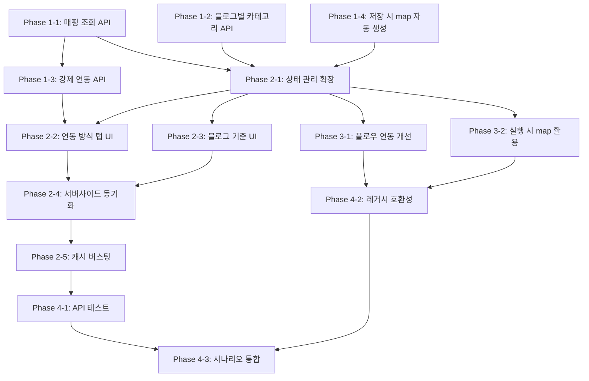

# 프롬프트 모듈 양방향 연동 및 중복 방지 시스템

> **버전**: v1.0.0 | **날짜**: 2026-03-17
> **상태**: 승인됨 | **작성**: Claude Code Multi-Agent

---

## 1. 개요

### 1.1 현재 구조

```
카테고리 선택 → API(/blogs/by-categories) → 블로그 자동 매칭 → 블로그 선택
                     (단방향)
```

- Module.settings에 `categories[]`, `blogs[]` 저장 (JSONB)
- 플로우에 모듈 추가 시 `settings.blogs`의 블로그가 FlowBlog에 자동 등록 (flows/form.js의 `syncPromptModuleBlogs()`)
- 중복 방지 메커니즘 없음

### 1.2 목표

```
경로 A: 카테고리 선택 → 해당 카테고리의 블로그 자동 연동 (기존)
경로 B: 블로그 선택 → 해당 블로그의 카테고리 전체 자동 연결 (신규)
+ (blog_id, topic_id, subtopic_id) 단위 중복 방지
+ 강제 연동 시 기존 모듈에서 자동 해제
```

### 1.3 핵심 규칙

```
충돌 단위: (blog_id, topic_id, subtopic_id)
→ 하나의 블로그의 특정 카테고리는 하나의 프롬프트 모듈에서만 사용 가능
```

---

## 2. 시나리오 정의

### 시나리오 1: 카테고리 기준 → 블로그 매칭 (기존 + 중복 필터)

```
전제:
  블로그 X = [건강/의학, 생활 정보, 의료]
  블로그 Y = [IT, 생활 정보]
  블로그 Z = [생활 정보, 요리]
  모듈 A: 블로그 X 선택됨 → (X, 건강/의학), (X, 생활 정보), (X, 의료)

동작:
  모듈 B에서 "생활 정보" 카테고리 선택
  → 생활 정보가 있는 블로그: X, Y, Z
  → (X, 생활 정보)는 모듈 A에서 사용 중
  → 결과: 블로그 Y, Z만 연동
  → 안내: "블로그 X는 모듈 A에서 '생활 정보' 카테고리로 연동 중이므로 제외"
```

### 시나리오 2: 블로그 기준 → 카테고리 자동 연결 + 충돌 처리

```
전제:
  모듈 B: "생활 정보" → 블로그 X, Y, Z 연동
  등록됨: (X, 생활 정보), (Y, 생활 정보), (Z, 생활 정보)

동작:
  모듈 A에서 블로그 X 선택 (블로그 기준 모드)
  → 블로그 X의 카테고리: 건강/의학, 생활 정보, 의료
  → (X, 생활 정보)는 모듈 B에서 사용 중
  → 결과: 건강/의학, 의료만 자동 연결
  → 안내: "'생활 정보'는 모듈 B에서 블로그 X와 연동 중이므로 제외됨"
```

### 시나리오 3: 강제 연동

```
시나리오 2에서 사용자가 "이 모듈에서 사용하기" 클릭:
  → 모듈 A: (X, 건강/의학), (X, 생활 정보), (X, 의료) 등록
  → 모듈 B: (X, 생활 정보) 자동 제거 → 블로그 Y, Z만 남음
  → 안내: "모듈 B에서 블로그 X의 '생활 정보' 연동이 해제되었습니다"
```

### 시나리오 4: 충돌 없는 일반 선택

```
아무 모듈도 없는 상태에서:
  모듈 B에서 "생활 정보" 카테고리 선택
  → 충돌 없음 → 블로그 X, Y, Z 모두 연동
```

---

## 3. 데이터 구조 설계

### 3.1 Module.settings 확장

```javascript
// 기존 필드 유지 + 신규 필드 추가
Module.settings = {
    // 신규: 연동 기준 모드
    "link_mode": "category" | "blog",   // 기본값: "category"

    // 기존: 선택된 카테고리 (UI 상태 + 실행 참조)
    "categories": [
        {"topic_id": 1, "subtopic_id": null},
        {"topic_id": 2, "subtopic_id": 3}
    ],

    // 기존: 선택된 블로그 ID (UI 상태 + 플로우 연동)
    "blogs": [101, 102],

    // 신규: 블로그-카테고리 매핑 (충돌 방지의 Single Source of Truth)
    "blog_category_map": [
        {"blog_id": 101, "topic_id": 1, "subtopic_id": null},
        {"blog_id": 101, "topic_id": 2, "subtopic_id": 3},
        {"blog_id": 102, "topic_id": 2, "subtopic_id": 3}
    ],

    // 기존 필드들 (변경 없음)
    "reference": {...},
    "title_recombine": {...},
    "content_generation": {...},
    "internal_links": {...},
    "text_replace_enabled": true,
    "image_generation": {...}
}
```

### 3.2 blog_category_map 생성 규칙

```
카테고리 기준 모드:
  categories[] 선택 → API로 매칭 블로그 조회 → 사용자가 블로그 선택
  → blog_category_map = 선택한 블로그 × 선택한 카테고리의 교집합

블로그 기준 모드:
  blogs[] 선택 → API로 각 블로그의 카테고리 조회
  → blog_category_map = 선택한 블로그의 모든 카테고리 (충돌 제외)
```

### 3.3 기존 모듈 호환성

```
기존 모듈의 settings에는 blog_category_map이 없음
→ 편집 시 categories[] + blogs[]로부터 blog_category_map 자동 생성
→ link_mode 없으면 "category" 기본값 적용
```

---

## 4. API 설계

### 4.1 사용 중인 블로그-카테고리 매핑 조회 (신규)

```
GET /api/v1/modules/used-blog-categories?exclude_module_id={id}

파라미터:
  - exclude_module_id (선택): 현재 편집 중인 모듈 제외

응답:
{
    "mappings": [
        {
            "blog_id": 101,
            "topic_id": 2,
            "subtopic_id": 3,
            "topic_name": "생활 정보",
            "subtopic_name": "일상",
            "module_id": 5,
            "module_name": "건강블로그세트"
        }
    ]
}

구현 위치: app/routers/modules.py
로직:
  1. 현재 사용자의 모든 프롬프트 모듈 조회
  2. exclude_module_id 제외
  3. 각 모듈의 settings.blog_category_map 수집
  4. 모듈명, 카테고리명과 함께 반환
```

### 4.2 블로그의 카테고리 목록 조회 (신규)

```
GET /api/v1/blogs/{blog_id}/categories

응답:
{
    "blog_id": 101,
    "blog_name": "블로그 X",
    "categories": [
        {
            "topic_id": 1,
            "subtopic_id": null,
            "topic_name": "건강/의학",
            "subtopic_name": null
        },
        {
            "topic_id": 2,
            "subtopic_id": 3,
            "topic_name": "생활 정보",
            "subtopic_name": "일상"
        }
    ]
}

구현 위치: app/routers/blogs.py
로직: BlogCategory 테이블에서 blog_id 기준 조회 + Topic/SubTopic 이름 조인
```

### 4.3 강제 연동 API (신규)

```
POST /api/v1/modules/{module_id}/force-link

Body:
{
    "blog_id": 101,
    "categories": [
        {"topic_id": 2, "subtopic_id": 3}
    ]
}

응답:
{
    "success": true,
    "affected_modules": [
        {
            "module_id": 7,
            "module_name": "모듈 B",
            "removed_mappings": [
                {"blog_id": 101, "topic_id": 2, "subtopic_id": 3}
            ],
            "remaining_blogs": [102, 103]
        }
    ]
}

구현 위치: app/routers/modules.py
로직:
  1. 요청된 (blog_id, topic_id, subtopic_id)를 사용 중인 다른 모듈 조회
  2. 해당 모듈의 settings.blog_category_map에서 충돌 항목 제거
  3. 블로그의 모든 카테고리가 제거되면 settings.blogs에서도 해당 blog_id 제거
  4. 현재 모듈의 blog_category_map에 추가
  5. 영향받은 모듈 정보 반환
```

---

## 5. 프론트엔드 UI 설계

### 5.1 연동 방식 탭 UI

```
┌──────────────────────────────────────────────────┐
│  1. 카테고리 / 블로그 연동                        │
│                                                   │
│  연동 방식:                                       │
│  [📂 카테고리 기준]  [📝 블로그 기준]            │
│                                                   │
│  (카테고리 기준 선택 시)                          │
│  ┌─ 카테고리 선택 영역 (기존 UI) ──────────────┐ │
│  │  ☑ 건강/의학  ☑ 생활 정보  ☐ IT            │ │
│  └──────────────────────────────────────────────┘ │
│                                                   │
│  ┌─ 매칭된 블로그 ─────────────────────────────┐ │
│  │  ☑ 블로그 Y (생활 정보)                      │ │
│  │  ☑ 블로그 Z (생활 정보)                      │ │
│  │  ⚠️ 블로그 X 제외                           │ │
│  │     └ "생활 정보" → 모듈 A에서 사용 중       │ │
│  │     └ [이 모듈에서 사용하기]                 │ │
│  └──────────────────────────────────────────────┘ │
│                                                   │
│  (블로그 기준 선택 시)                            │
│  ┌─ 블로그 선택 영역 ──────────────────────────┐ │
│  │  전체 블로그 목록 (플랫폼 탭 + 검색)         │ │
│  │  ☑ 블로그 X  ☐ 블로그 Y  ☐ 블로그 Z       │ │
│  └──────────────────────────────────────────────┘ │
│                                                   │
│  ┌─ 자동 연결된 카테고리 ──────────────────────┐ │
│  │  ✅ 건강/의학 (자동 연결)                    │ │
│  │  ✅ 의료 (자동 연결)                         │ │
│  │  ⚠️ 생활 정보 제외                          │ │
│  │     └ 모듈 B에서 블로그 X와 연동 중          │ │
│  │     └ [이 모듈에서 사용하기]                 │ │
│  └──────────────────────────────────────────────┘ │
└──────────────────────────────────────────────────┘
```

### 5.2 강제 연동 확인 모달

```
┌──────────────────────────────────────────────────┐
│  ⚠️ 연동 변경 확인                               │
│                                                   │
│  "생활 정보" 카테고리의 블로그 X 연동을           │
│  모듈 B에서 이 모듈로 이동합니다.                 │
│                                                   │
│  변경 내용:                                       │
│  • 모듈 B: 블로그 X 제거 (블로그 Y, Z 유지)      │
│  • 이 모듈: 블로그 X의 "생활 정보" 추가          │
│                                                   │
│  [취소]  [확인]                                   │
└──────────────────────────────────────────────────┘
```

### 5.3 상태 관리 변경 (prompt-form.js)

```javascript
// 추가할 상태
linkMode: 'category',           // 'category' | 'blog'
blogCategoryMap: [],            // [{blog_id, topic_id, subtopic_id}]
usedMappings: [],               // 다른 모듈에서 사용 중인 매핑
excludedBlogs: [],              // 충돌로 제외된 블로그 정보
excludedCategories: [],         // 충돌로 제외된 카테고리 정보

// 추가할 메서드
loadUsedBlogCategories()        // 중복 매핑 조회 API 호출
loadBlogCategories(blogId)      // 블로그별 카테고리 조회 API 호출
checkConflicts()                // 충돌 검사 + excludedBlogs/Categories 업데이트
forceLink(blogId, categories)   // 강제 연동 API 호출
buildBlogCategoryMap()          // 현재 선택 상태로 blog_category_map 생성
switchLinkMode(mode)            // 모드 전환 시 상태 초기화
```

---

## 6. 구현 계획

### Phase 1: 백엔드 API (중복 체크 + 강제 연동)

#### Phase 1-1: 사용 중인 매핑 조회 API

```
파일: app/routers/modules.py
작업:
  - GET /modules/used-blog-categories 엔드포인트 추가
  - 현재 사용자의 프롬프트 모듈 settings.blog_category_map 수집
  - blog_category_map이 없는 레거시 모듈: categories + blogs에서 추론
  - Topic/SubTopic 이름 조인
예상 추가 줄 수: ~40줄
```

#### Phase 1-2: 블로그별 카테고리 조회 API

```
파일: app/routers/blogs.py
작업:
  - GET /blogs/{blog_id}/categories 엔드포인트 추가
  - BlogCategory + Topic + SubTopic 조인 조회
예상 추가 줄 수: ~30줄
```

#### Phase 1-3: 강제 연동 API

```
파일: app/routers/modules.py
작업:
  - POST /modules/{module_id}/force-link 엔드포인트 추가
  - 충돌 모듈 조회 → blog_category_map 수정 → blogs 정리
  - 트랜잭션으로 원자적 처리
예상 추가 줄 수: ~60줄
```

#### Phase 1-4: 모듈 저장 시 blog_category_map 자동 생성

```
파일: app/routers/modules.py
작업:
  - PUT /modules/{id} 수정: settings 저장 시 blog_category_map 검증
  - blog_category_map이 없으면 categories + blogs로부터 자동 생성
  - 기존 모듈 호환성 유지
예상 추가 줄 수: ~20줄
```

---

### Phase 2: 프론트엔드 UI (탭 + 양방향 연동 + 경고/강제)

#### Phase 2-1: 상태 관리 확장 (prompt-form.js)

```
파일: app/static/js/modules/prompt-form.js (현재 500줄 - 분할 필요!)
작업:
  - linkMode, blogCategoryMap, usedMappings, excludedBlogs/Categories 상태 추가
  - loadUsedBlogCategories() 메서드 추가
  - loadBlogCategories(blogId) 메서드 추가
  - checkConflicts() 메서드 추가
  - forceLink() 메서드 추가
  - buildBlogCategoryMap() 메서드 추가
  - switchLinkMode() 메서드 추가
  - preparePromptModuleData()에 link_mode, blog_category_map 추가
  - initPromptModuleFromData()에 link_mode, blog_category_map 로드

주의: prompt-form.js가 500줄 한계이므로 파일 분할 필수
  → prompt-form-linking.js (신규, ~200줄): 연동/중복 관련 메서드
  → prompt-form.js: 기존 코드에서 블로그 로드/필터 메서드를 prompt-form-linking.js로 이동
```

#### Phase 2-2: 연동 방식 탭 UI (prompt-form-template.js)

```
파일: app/static/js/modules/prompt-form-template.js (현재 399줄)
작업:
  - 카테고리/블로그 섹션을 탭 UI로 변경
  - 카테고리 기준: 기존 UI + 제외 블로그 경고 영역
  - 블로그 기준: 블로그 직접 선택 UI + 자동 카테고리 연결 표시
  - 제외 항목의 [이 모듈에서 사용하기] 버튼
  - 강제 연동 확인 모달
예상 추가 줄 수: ~80줄 (기존 섹션 리팩토링 포함)
```

#### Phase 2-3: 블로그 기준 모드의 카테고리/블로그 UI

```
파일: app/static/js/modules/prompt-form-template.js 또는 별도 섹션 파일
작업:
  - 블로그 기준 모드: 전체 블로그 목록 (플랫폼 탭)
  - 블로그 선택 시 카테고리 자동 표시
  - 충돌 카테고리 경고 + 강제 연동 옵션
```

#### Phase 2-4: 서버사이드 템플릿 동기화

```
파일: app/templates/modules/_prompt_form.html
작업:
  - JS 동적 렌더링과 동일한 구조로 업데이트
  - 연동 방식 탭 + 충돌 경고 영역 추가
  - 레거시 - 실제 UI는 JS 사용이므로 최소한 구조만 맞춤
```

#### Phase 2-5: 캐시 버스팅 + 스크립트 로드

```
파일: app/templates/modules/list.html
작업:
  - prompt-form-linking.js 스크립트 태그 추가
  - 버전 업데이트
```

---

### Phase 3: 플로우 블로그 자동 연동 보완

#### Phase 3-1: syncPromptModuleBlogs() 개선

```
파일: app/static/js/flows/form.js (752줄)
작업:
  - 기존 syncPromptModuleBlogs(): settings.blogs 기반 → 그대로 유지
  - blog_category_map 존재 시: map에서 고유 blog_id 추출하여 연동
  - 레거시 모듈 (blog_category_map 없음): 기존 settings.blogs 사용
예상 수정: ~10줄 변경
```

#### Phase 3-2: 플로우 실행 시 blog_category_map 활용

```
파일: app/services/generation/flow_generate_executor.py
작업:
  - execute_for_blog() 호출 시 해당 블로그의 카테고리만 필터
  - Module.settings.blog_category_map에서 blog_id 기준 필터
  - 필터된 카테고리를 글 생성 파이프라인에 전달
  - 레거시 호환: blog_category_map 없으면 settings.categories 전체 사용
예상 수정: ~15줄 변경
```

---

### Phase 4: 테스트 + 기존 모듈 호환성

#### Phase 4-1: API 테스트

```
파일: tests/integration/test_module_blog_linking.py (신규)
테스트 케이스:
  1. GET /modules/used-blog-categories - 빈 상태
  2. GET /modules/used-blog-categories - 매핑 있는 상태
  3. GET /modules/used-blog-categories?exclude_module_id - 자기 제외
  4. GET /blogs/{id}/categories - 카테고리 목록
  5. POST /modules/{id}/force-link - 정상 강제 연동
  6. POST /modules/{id}/force-link - 기존 모듈 블로그 제거 확인
  7. POST /modules/{id}/force-link - 충돌 없는 경우
```

#### Phase 4-2: 레거시 호환성 테스트

```
테스트 케이스:
  8. blog_category_map 없는 레거시 모듈 편집 → 자동 생성 확인
  9. link_mode 없는 레거시 모듈 → "category" 기본값 확인
  10. 레거시 모듈의 플로우 연동 → settings.blogs 기반 동작 확인
```

#### Phase 4-3: 시나리오 통합 테스트

```
테스트 케이스:
  11. 시나리오 1: 카테고리 기준 → 충돌 블로그 제외 확인
  12. 시나리오 2: 블로그 기준 → 충돌 카테고리 제외 확인
  13. 시나리오 3: 강제 연동 → 기존 모듈 자동 업데이트 확인
  14. 시나리오 4: 충돌 없는 일반 선택
```

---

## 7. 파일 영향 범위

### 수정 파일

| 파일 | 현재 줄 수 | 예상 변경 | 에이전트 |
|------|-----------|----------|---------|
| `app/routers/modules.py` | 202 | +130 (3개 API) | @backend |
| `app/routers/blogs.py` | 871 | +30 (1개 API) | @backend |
| `app/static/js/modules/prompt-form.js` | 500 | 리팩토링 (분할) | @frontend |
| `app/static/js/modules/prompt-form-template.js` | 399 | +80 (탭 UI) | @frontend |
| `app/static/js/flows/form.js` | 752 | +10 (연동 개선) | @frontend |
| `app/services/generation/flow_generate_executor.py` | 182 | +15 (map 필터) | @backend |
| `app/templates/modules/list.html` | - | 스크립트 태그 추가 | @frontend |
| `app/templates/modules/_prompt_form.html` | 723 | 구조 동기화 | @frontend |

### 신규 파일

| 파일 | 예상 줄 수 | 에이전트 |
|------|-----------|---------|
| `app/static/js/modules/prompt-form-linking.js` | ~200 | @frontend |
| `tests/integration/test_module_blog_linking.py` | ~200 | @reviewer |

---

## 8. 의존성 및 실행 순서



### 병렬 가능 작업

```
Phase 1: 모든 API 병렬 가능 (1-1, 1-2, 1-3, 1-4)
Phase 2: 2-1 완료 후 2-2, 2-3 병렬 가능
Phase 3: Phase 2-1 완료 후 3-1, 3-2 병렬 가능 (Phase 2와도 병렬)
Phase 4: Phase 2, 3 완료 후 진행
```

---

## 9. 리스크 및 대응

| 리스크 | 영향 | 대응 |
|--------|------|------|
| prompt-form.js 500줄 초과 | 파일 크기 제한 위반 | prompt-form-linking.js로 분할 |
| modules.py 500줄 초과 가능 (202+130) | 파일 크기 제한 | 332줄이므로 안전 |
| blogs.py 500줄 이미 초과 (871줄) | HTML 아닌 py 파일 | 이미 초과 상태, 추가 30줄은 허용 범위 |
| 레거시 모듈 blog_category_map 없음 | 기존 모듈 오류 | 편집/실행 시 자동 생성 로직으로 대응 |
| 강제 연동 시 데이터 일관성 | 부분 실패 시 불일치 | DB 트랜잭션으로 원자적 처리 |
| 다수 모듈의 동시 편집 | 충돌 매핑 비동기 불일치 | 저장 시점에 재검증 (낙관적 동시성) |

---

## 10. 기존 기능 영향 분석

### 영향 없음 (하위 호환)

- **글 생성 파이프라인**: ContentGenerator는 Module.settings의 기존 필드만 참조
- **이미지 생성**: ImageGenerator는 blog_category_map 미참조
- **내부링크/치환**: 독립적 동작
- **스케줄러**: GP 기반 스케줄에 영향 없음

### 영향 있음 (검증 필요)

- **플로우 폼**: syncPromptModuleBlogs() 로직 변경
- **플로우 실행**: flow_generate_executor.py에서 카테고리 필터 추가
- **모듈 편집 UI**: 카테고리/블로그 섹션 구조 변경

---

## 11. 완료 기준

- [ ] 카테고리 기준 연동: 충돌 블로그 제외 + 경고 표시
- [ ] 블로그 기준 연동: 카테고리 자동 연결 + 충돌 카테고리 제외
- [ ] 강제 연동: 기존 모듈 자동 업데이트 + 확인 모달
- [ ] blog_category_map: 모든 저장/로드 경로에서 관리
- [ ] 플로우 블로그 자동 연동: blog_category_map 기반 동작
- [ ] 레거시 모듈: blog_category_map 없어도 정상 동작
- [ ] 14개 테스트 케이스 전부 PASSED
- [ ] 모든 파일 500줄 이내
