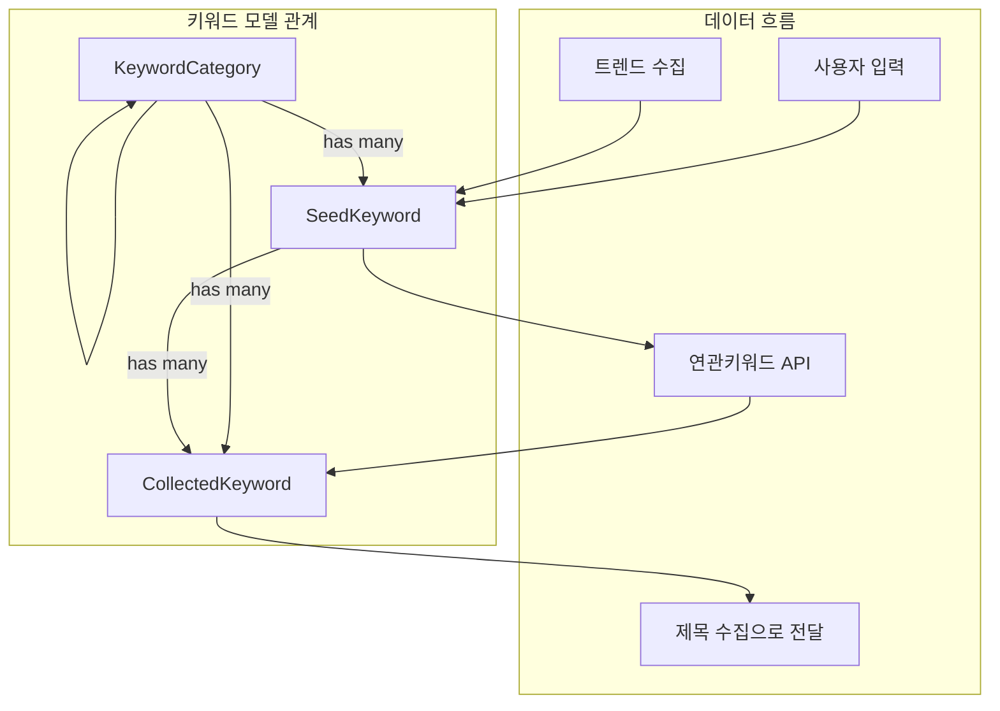

# Phase D-1-1: 키워드 관련 모델 구현

## 📋 작업 개요

| 항목 | 내용 |
|-----|------|
| Phase | D-1-1 |
| 작업명 | 키워드 관련 모델 구현 |
| 목표 | 수집 시스템의 키워드 데이터 모델 생성 |
| 예상 시간 | 2-3시간 |

---

## 📐 순서도



---

## 📁 파일 구조

```
app/
├── models/
│   ├── __init__.py          # 모델 등록 (수정)
│   └── keyword.py           # 키워드 모델 (신규) < 200줄
│
└── schemas/
    └── keyword.py           # 키워드 스키마 (신규) < 100줄
```

---

## 📝 모델 상세

### 1. KeywordCategory (키워드 카테고리)

```python
class KeywordCategory(Base):
    """
    키워드 카테고리
    
    계층 구조를 지원하며 키워드 분류에 사용됩니다.
    예: 건강 > 반려동물 > 강아지
    """
    __tablename__ = "keyword_categories"
    
    id: Mapped[int] = mapped_column(primary_key=True)
    name: Mapped[str] = mapped_column(String(100), nullable=False)
    parent_id: Mapped[int | None] = mapped_column(
        ForeignKey("keyword_categories.id"), 
        nullable=True
    )  # 상위 카테고리 (자기참조)
    description: Mapped[str | None] = mapped_column(String(500), nullable=True)
    is_active: Mapped[bool] = mapped_column(default=True)
    created_at: Mapped[datetime] = mapped_column(default=func.now())
    updated_at: Mapped[datetime] = mapped_column(default=func.now(), onupdate=func.now())
    
    # Relationships
    parent = relationship("KeywordCategory", remote_side=[id], backref="children")
    seed_keywords = relationship("SeedKeyword", back_populates="category")
    collected_keywords = relationship("CollectedKeyword", back_populates="category")
```

### 2. SeedKeyword (시드 키워드)

```python
class SeedKeyword(Base):
    """
    시드 키워드 (자동 수집용)
    
    사용자가 입력하거나 트렌드에서 수집한 기본 키워드입니다.
    이 키워드를 기반으로 연관 키워드를 확장합니다.
    """
    __tablename__ = "seed_keywords"
    
    id: Mapped[int] = mapped_column(primary_key=True)
    keyword: Mapped[str] = mapped_column(String(200), nullable=False, index=True)
    category_id: Mapped[int | None] = mapped_column(
        ForeignKey("keyword_categories.id"),
        nullable=True
    )
    source_type: Mapped[str] = mapped_column(
        String(50), 
        nullable=False,
        default="user_input"
    )  # "user_input" | "trend" | "extracted"
    is_active: Mapped[bool] = mapped_column(default=True)
    last_used_at: Mapped[datetime | None] = mapped_column(nullable=True)
    use_count: Mapped[int] = mapped_column(default=0)
    priority: Mapped[int] = mapped_column(default=0)  # 순환 우선순위
    created_at: Mapped[datetime] = mapped_column(default=func.now())
    updated_at: Mapped[datetime] = mapped_column(default=func.now(), onupdate=func.now())
    
    # Relationships
    category = relationship("KeywordCategory", back_populates="seed_keywords")
    collected_keywords = relationship("CollectedKeyword", back_populates="seed_keyword")
    
    # Unique constraint
    __table_args__ = (
        UniqueConstraint('keyword', 'category_id', name='uq_seed_keyword_category'),
    )
```

### 3. CollectedKeyword (수집된 연관 키워드)

```python
class CollectedKeyword(Base):
    """
    수집된 연관 키워드
    
    시드 키워드를 기반으로 API에서 확장 수집한 키워드입니다.
    이 키워드로 제목을 수집합니다.
    """
    __tablename__ = "collected_keywords"
    
    id: Mapped[int] = mapped_column(primary_key=True)
    keyword: Mapped[str] = mapped_column(String(200), nullable=False, index=True)
    seed_keyword_id: Mapped[int] = mapped_column(
        ForeignKey("seed_keywords.id"),
        nullable=False
    )
    category_id: Mapped[int | None] = mapped_column(
        ForeignKey("keyword_categories.id"),
        nullable=True
    )
    search_volume: Mapped[int | None] = mapped_column(nullable=True)  # 검색량
    competition: Mapped[float | None] = mapped_column(nullable=True)  # 경쟁도 (0.0~1.0)
    is_processed: Mapped[bool] = mapped_column(default=False)  # 제목 수집 완료 여부
    process_count: Mapped[int] = mapped_column(default=0)  # 처리 횟수
    last_processed_at: Mapped[datetime | None] = mapped_column(nullable=True)
    created_at: Mapped[datetime] = mapped_column(default=func.now())
    
    # Relationships
    seed_keyword = relationship("SeedKeyword", back_populates="collected_keywords")
    category = relationship("KeywordCategory", back_populates="collected_keywords")
    
    # Unique constraint
    __table_args__ = (
        UniqueConstraint('keyword', 'seed_keyword_id', name='uq_collected_keyword_seed'),
    )
```

---

## 📝 스키마 상세

### Pydantic 스키마 (app/schemas/keyword.py)

```python
from pydantic import BaseModel, Field
from datetime import datetime

# ============ KeywordCategory ============

class KeywordCategoryBase(BaseModel):
    name: str = Field(..., max_length=100)
    parent_id: int | None = None
    description: str | None = Field(None, max_length=500)
    is_active: bool = True

class KeywordCategoryCreate(KeywordCategoryBase):
    pass

class KeywordCategoryUpdate(BaseModel):
    name: str | None = Field(None, max_length=100)
    parent_id: int | None = None
    description: str | None = Field(None, max_length=500)
    is_active: bool | None = None

class KeywordCategoryResponse(KeywordCategoryBase):
    id: int
    created_at: datetime
    updated_at: datetime
    
    class Config:
        from_attributes = True

class KeywordCategoryTree(KeywordCategoryResponse):
    """계층 구조 포함"""
    children: list["KeywordCategoryTree"] = []


# ============ SeedKeyword ============

class SeedKeywordBase(BaseModel):
    keyword: str = Field(..., max_length=200)
    category_id: int | None = None
    source_type: str = Field(default="user_input", pattern="^(user_input|trend|extracted)$")
    is_active: bool = True
    priority: int = 0

class SeedKeywordCreate(SeedKeywordBase):
    pass

class SeedKeywordUpdate(BaseModel):
    keyword: str | None = Field(None, max_length=200)
    category_id: int | None = None
    source_type: str | None = Field(None, pattern="^(user_input|trend|extracted)$")
    is_active: bool | None = None
    priority: int | None = None

class SeedKeywordResponse(SeedKeywordBase):
    id: int
    last_used_at: datetime | None
    use_count: int
    created_at: datetime
    updated_at: datetime
    category: KeywordCategoryResponse | None = None
    
    class Config:
        from_attributes = True


# ============ CollectedKeyword ============

class CollectedKeywordBase(BaseModel):
    keyword: str = Field(..., max_length=200)
    seed_keyword_id: int
    category_id: int | None = None
    search_volume: int | None = None
    competition: float | None = Field(None, ge=0.0, le=1.0)

class CollectedKeywordCreate(CollectedKeywordBase):
    pass

class CollectedKeywordBulkCreate(BaseModel):
    """대량 생성용"""
    seed_keyword_id: int
    keywords: list[str]
    category_id: int | None = None

class CollectedKeywordUpdate(BaseModel):
    category_id: int | None = None
    search_volume: int | None = None
    competition: float | None = Field(None, ge=0.0, le=1.0)
    is_processed: bool | None = None

class CollectedKeywordResponse(CollectedKeywordBase):
    id: int
    is_processed: bool
    process_count: int
    last_processed_at: datetime | None
    created_at: datetime
    seed_keyword: SeedKeywordResponse | None = None
    category: KeywordCategoryResponse | None = None
    
    class Config:
        from_attributes = True
```

---

## 🔧 에이전트별 작업 분담

### @explorer-agent
- blogauto_new/에서 기존 키워드 관련 모델/로직 분석 (있다면)
- 기존 카테고리 구조 파악

### @backend-agent
- app/models/keyword.py 생성
- app/schemas/keyword.py 생성
- app/models/__init__.py에 모델 등록
- 관계(Relationship) 설정

### @reviewer-agent
- 모델 관계 검증 (FK, 자기참조)
- 타입 힌트 검증
- 인덱스 설정 적절성 검토
- Unique 제약조건 검토

---

## ⚠️ 제약 사항

1. **파일 크기**: app/models/keyword.py < 200줄
2. **파일 크기**: app/schemas/keyword.py < 100줄
3. **타입 힌트**: 필수 (Mapped[] 사용)
4. **Docstring**: 모든 클래스에 필수
5. **기존 패턴**: 현재 프로젝트의 모델 패턴 따름

---

## 📚 참조

- 기존 모델 패턴: app/models/blog.py, app/models/module.py
- 기존 스키마 패턴: app/schemas/
- SQLAlchemy 2.0 스타일 사용

---

## ✅ 완료 조건

- [ ] KeywordCategory 모델 생성
- [ ] SeedKeyword 모델 생성
- [ ] CollectedKeyword 모델 생성
- [ ] 모델 간 관계 설정 완료
- [ ] Pydantic 스키마 생성
- [ ] app/models/__init__.py에 등록
- [ ] 타입 힌트 100%
- [ ] Docstring 100%
- [ ] 파일 크기 제한 준수
