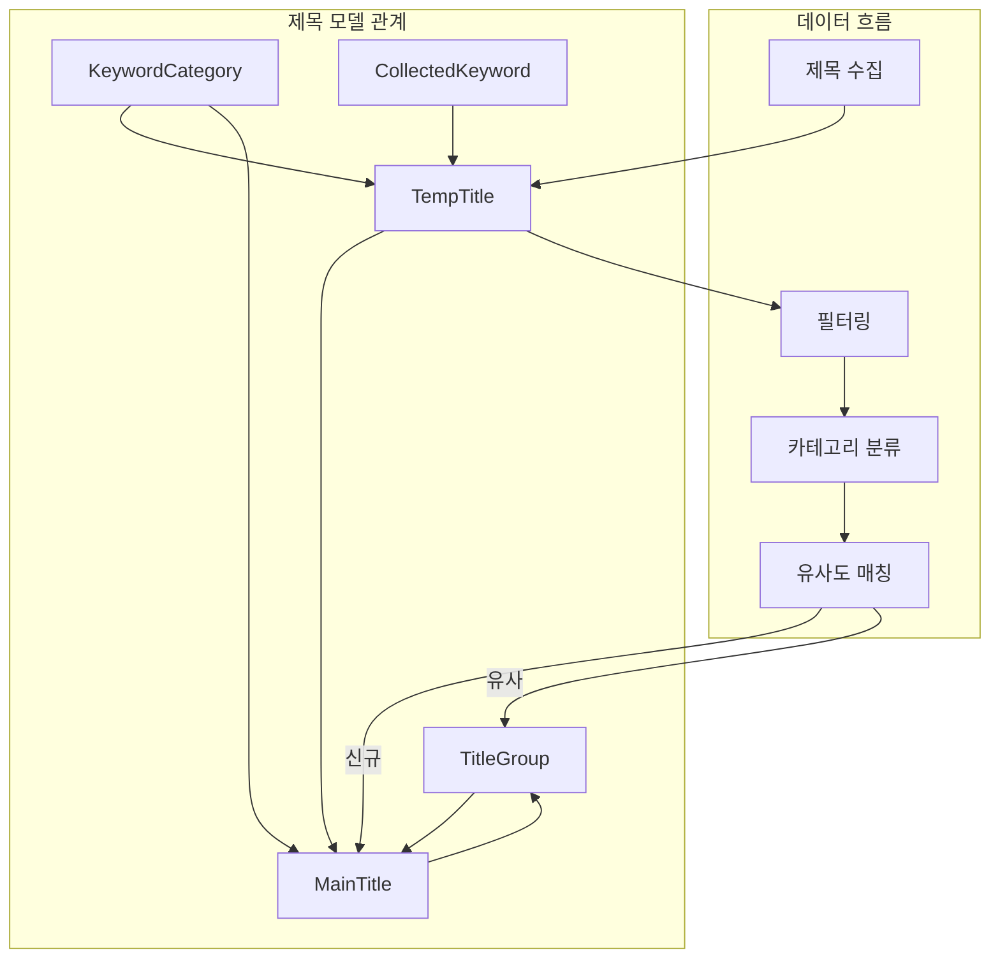

# Phase D-1-2: 제목 관련 모델 구현

## 📋 작업 개요

| 항목 | 내용 |
|-----|------|
| Phase | D-1-2 |
| 작업명 | 제목 관련 모델 구현 |
| 목표 | 임시 제목, 메인 타이틀, 활성 그룹 모델 생성 |
| 선행 작업 | D-1-1 키워드 모델 완료 |
| 예상 시간 | 2-3시간 |

---

## 📐 순서도



---

## 📁 파일 구조

```
app/
├── models/
│   ├── __init__.py          # 모델 등록 (수정)
│   ├── keyword.py           # ✅ D-1-1 완료
│   └── title.py             # 제목 모델 (신규) < 250줄
│
└── schemas/
    ├── keyword.py           # ✅ D-1-1 완료
    └── title.py             # 제목 스키마 (신규) < 150줄
```

---

## 📝 모델 상세

### 1. TitleGroup (활성 그룹)

```python
class TitleGroup(Base):
    """
    활성 그룹
    
    유사한 제목들을 그룹으로 묶어 관리합니다.
    그룹에는 대표 제목이 있으며, 블로그 매칭 시 대표 제목을 우선 사용합니다.
    
    예시:
    - 그룹: "강아지 치아 관리"
      - 대표: "강아지 치아 발치 가격"
      - 멤버: "강아지 유치 발치 비용", "반려견 발치 비용 정리"
    """
    __tablename__ = "title_groups"
    
    id: Mapped[int] = mapped_column(primary_key=True)
    name: Mapped[str] = mapped_column(String(200), nullable=False)  # 그룹명
    description: Mapped[str | None] = mapped_column(String(500), nullable=True)
    representative_title_id: Mapped[int | None] = mapped_column(
        ForeignKey("main_titles.id", use_alter=True),
        nullable=True
    )  # 대표 제목 (순환 참조 주의)
    member_count: Mapped[int] = mapped_column(default=0)  # 멤버 수 (캐시)
    is_active: Mapped[bool] = mapped_column(default=True)
    created_at: Mapped[datetime] = mapped_column(default=func.now())
    updated_at: Mapped[datetime] = mapped_column(default=func.now(), onupdate=func.now())
    
    # Relationships
    titles = relationship("MainTitle", back_populates="group", foreign_keys="MainTitle.group_id")
    representative_title = relationship(
        "MainTitle", 
        foreign_keys=[representative_title_id],
        post_update=True
    )
```

### 2. MainTitle (메인 타이틀)

```python
class MainTitle(Base):
    """
    메인 타이틀 (정식 제목)
    
    필터링과 분류를 거쳐 정식으로 등록된 제목입니다.
    블로그와 매칭하여 글 생성에 사용됩니다.
    
    상태:
    - available: 사용 가능 (매칭 대기)
    - matched: 블로그와 매칭됨
    - used: 글 생성에 사용됨
    - archived: 보관 (더 이상 사용 안 함)
    """
    __tablename__ = "main_titles"
    
    id: Mapped[int] = mapped_column(primary_key=True)
    title: Mapped[str] = mapped_column(String(500), nullable=False, index=True)
    category_id: Mapped[int | None] = mapped_column(
        ForeignKey("keyword_categories.id"),
        nullable=True
    )
    group_id: Mapped[int | None] = mapped_column(
        ForeignKey("title_groups.id"),
        nullable=True
    )
    is_group_representative: Mapped[bool] = mapped_column(default=False)  # 그룹 대표 여부
    status: Mapped[str] = mapped_column(
        String(50),
        default="available"
    )  # "available" | "matched" | "used" | "archived"
    
    # 매칭 정보
    matched_blog_ids: Mapped[str | None] = mapped_column(Text, nullable=True)  # JSON array
    matched_count: Mapped[int] = mapped_column(default=0)
    
    # 사용 정보
    use_count: Mapped[int] = mapped_column(default=0)
    last_used_at: Mapped[datetime | None] = mapped_column(nullable=True)
    
    # 원본 정보
    source_temp_title_id: Mapped[int | None] = mapped_column(nullable=True)  # 원본 임시제목 ID
    source_url: Mapped[str | None] = mapped_column(String(1000), nullable=True)
    
    created_at: Mapped[datetime] = mapped_column(default=func.now())
    updated_at: Mapped[datetime] = mapped_column(default=func.now(), onupdate=func.now())
    
    # Relationships
    category = relationship("KeywordCategory")
    group = relationship("TitleGroup", back_populates="titles", foreign_keys=[group_id])
    
    # Unique constraint
    __table_args__ = (
        Index('ix_main_title_status_category', 'status', 'category_id'),
    )
```

### 3. TempTitle (임시 수집 제목)

```python
class TempTitle(Base):
    """
    임시 수집 제목
    
    크롤링으로 수집된 원본 제목입니다.
    필터링, 카테고리 분류, 유사도 매칭을 거쳐 메인 타이틀로 이동합니다.
    
    수집 단계 (collection_stage):
    - keyword_search: 키워드 검색 결과에서 수집
    - blog_crawl: 블로그 전체 크롤링에서 수집
    
    상태 (status):
    - new: 신규 수집
    - filtered: 필터링됨 (제외)
    - categorized: 카테고리 분류 완료
    - moved: 메인 타이틀로 이동 완료
    - duplicate: 중복 제거됨
    """
    __tablename__ = "temp_titles"
    
    id: Mapped[int] = mapped_column(primary_key=True)
    title: Mapped[str] = mapped_column(String(500), nullable=False, index=True)
    
    # 수집 정보
    source_keyword_id: Mapped[int | None] = mapped_column(
        ForeignKey("collected_keywords.id"),
        nullable=True
    )
    source_blog_url: Mapped[str] = mapped_column(String(1000), nullable=False)
    source_post_url: Mapped[str] = mapped_column(String(1000), nullable=False)
    collection_stage: Mapped[str] = mapped_column(
        String(50),
        nullable=False
    )  # "keyword_search" | "blog_crawl"
    
    # 처리 상태
    status: Mapped[str] = mapped_column(
        String(50),
        default="new"
    )  # "new" | "filtered" | "categorized" | "moved" | "duplicate"
    
    # 필터링 정보
    filter_reason: Mapped[str | None] = mapped_column(String(200), nullable=True)
    filter_keywords: Mapped[str | None] = mapped_column(Text, nullable=True)  # JSON array
    
    # 카테고리 정보
    category_id: Mapped[int | None] = mapped_column(
        ForeignKey("keyword_categories.id"),
        nullable=True
    )
    category_confidence: Mapped[float | None] = mapped_column(nullable=True)  # 분류 신뢰도
    
    # 유사도 매칭 정보
    similar_title_id: Mapped[int | None] = mapped_column(nullable=True)  # 유사한 메인타이틀 ID
    similarity_score: Mapped[float | None] = mapped_column(nullable=True)
    
    # 이동 정보
    moved_to_main_id: Mapped[int | None] = mapped_column(nullable=True)  # 이동된 메인타이틀 ID
    moved_at: Mapped[datetime | None] = mapped_column(nullable=True)
    
    created_at: Mapped[datetime] = mapped_column(default=func.now())
    processed_at: Mapped[datetime | None] = mapped_column(nullable=True)
    
    # Relationships
    source_keyword = relationship("CollectedKeyword")
    category = relationship("KeywordCategory")
    
    # Indexes
    __table_args__ = (
        Index('ix_temp_title_status', 'status'),
        Index('ix_temp_title_collection_stage', 'collection_stage'),
    )
```

---

## 📝 스키마 상세

### Pydantic 스키마 (app/schemas/title.py)

```python
from pydantic import BaseModel, Field
from datetime import datetime

# ============ TitleGroup ============

class TitleGroupBase(BaseModel):
    name: str = Field(..., max_length=200)
    description: str | None = Field(None, max_length=500)
    is_active: bool = True

class TitleGroupCreate(TitleGroupBase):
    pass

class TitleGroupUpdate(BaseModel):
    name: str | None = Field(None, max_length=200)
    description: str | None = Field(None, max_length=500)
    representative_title_id: int | None = None
    is_active: bool | None = None

class TitleGroupResponse(TitleGroupBase):
    id: int
    representative_title_id: int | None
    member_count: int
    created_at: datetime
    updated_at: datetime
    
    class Config:
        from_attributes = True

class TitleGroupWithTitles(TitleGroupResponse):
    """멤버 제목 포함"""
    titles: list["MainTitleResponse"] = []


# ============ MainTitle ============

class MainTitleBase(BaseModel):
    title: str = Field(..., max_length=500)
    category_id: int | None = None
    status: str = Field(default="available", pattern="^(available|matched|used|archived)$")

class MainTitleCreate(MainTitleBase):
    source_temp_title_id: int | None = None
    source_url: str | None = Field(None, max_length=1000)

class MainTitleUpdate(BaseModel):
    title: str | None = Field(None, max_length=500)
    category_id: int | None = None
    group_id: int | None = None
    is_group_representative: bool | None = None
    status: str | None = Field(None, pattern="^(available|matched|used|archived)$")

class MainTitleResponse(MainTitleBase):
    id: int
    group_id: int | None
    is_group_representative: bool
    matched_count: int
    use_count: int
    last_used_at: datetime | None
    source_url: str | None
    created_at: datetime
    updated_at: datetime
    
    class Config:
        from_attributes = True

class MainTitleWithGroup(MainTitleResponse):
    """그룹 정보 포함"""
    group: TitleGroupResponse | None = None


# ============ TempTitle ============

class TempTitleBase(BaseModel):
    title: str = Field(..., max_length=500)
    source_blog_url: str = Field(..., max_length=1000)
    source_post_url: str = Field(..., max_length=1000)
    collection_stage: str = Field(..., pattern="^(keyword_search|blog_crawl)$")

class TempTitleCreate(TempTitleBase):
    source_keyword_id: int | None = None

class TempTitleBulkCreate(BaseModel):
    """대량 생성용"""
    titles: list[TempTitleCreate]

class TempTitleUpdate(BaseModel):
    status: str | None = Field(None, pattern="^(new|filtered|categorized|moved|duplicate)$")
    filter_reason: str | None = Field(None, max_length=200)
    category_id: int | None = None
    category_confidence: float | None = Field(None, ge=0.0, le=1.0)

class TempTitleResponse(TempTitleBase):
    id: int
    source_keyword_id: int | None
    status: str
    filter_reason: str | None
    category_id: int | None
    category_confidence: float | None
    similar_title_id: int | None
    similarity_score: float | None
    moved_to_main_id: int | None
    moved_at: datetime | None
    created_at: datetime
    processed_at: datetime | None
    
    class Config:
        from_attributes = True

class TempTitleFilter(BaseModel):
    """필터링 결과"""
    title_id: int
    is_filtered: bool
    filter_reason: str | None = None
    filter_keywords: list[str] = []

class TempTitleSimilarity(BaseModel):
    """유사도 매칭 결과"""
    title_id: int
    similar_title_id: int | None
    similarity_score: float
    is_duplicate: bool  # 100% 동일
    suggested_group_id: int | None  # 추천 그룹
```

---

## 🔧 에이전트별 작업 분담

### @explorer-agent
- blogauto_new/에서 기존 제목 관리 로직 분석 (있다면)
- 기존 유사도 매칭 로직 파악

### @backend-agent
- app/models/title.py 생성
- app/schemas/title.py 생성
- app/models/__init__.py에 모델 등록
- KeywordCategory와의 관계 설정 (D-1-1 모델 참조)

### @reviewer-agent
- 순환 참조 처리 검증 (TitleGroup ↔ MainTitle)
- FK 관계 검증
- 인덱스 설정 적절성 검토
- 상태값 일관성 검토

---

## ⚠️ 제약 사항

1. **파일 크기**: app/models/title.py < 250줄
2. **파일 크기**: app/schemas/title.py < 150줄
3. **타입 힌트**: 필수 (Mapped[] 사용)
4. **Docstring**: 모든 클래스에 필수
5. **순환 참조**: TitleGroup ↔ MainTitle 순환 참조 주의
   - use_alter=True, post_update=True 사용

---

## ⚠️ 순환 참조 처리

TitleGroup과 MainTitle은 서로를 참조합니다:
- TitleGroup.representative_title_id → MainTitle
- MainTitle.group_id → TitleGroup

이를 위해:
```python
# TitleGroup에서
representative_title_id = mapped_column(
    ForeignKey("main_titles.id", use_alter=True),  # use_alter 필수
    nullable=True
)
representative_title = relationship(
    "MainTitle",
    foreign_keys=[representative_title_id],
    post_update=True  # post_update 필수
)
```

---

## 📚 참조

- D-1-1 완료 파일: app/models/keyword.py, app/schemas/keyword.py
- 기존 모델 패턴: app/models/blog.py, app/models/module.py

---

## ✅ 완료 조건

- [ ] TitleGroup 모델 생성
- [ ] MainTitle 모델 생성
- [ ] TempTitle 모델 생성
- [ ] 모델 간 관계 설정 완료 (순환 참조 포함)
- [ ] KeywordCategory와의 관계 설정
- [ ] CollectedKeyword와의 관계 설정
- [ ] Pydantic 스키마 생성
- [ ] app/models/__init__.py에 등록
- [ ] 타입 힌트 100%
- [ ] Docstring 100%
- [ ] 파일 크기 제한 준수
