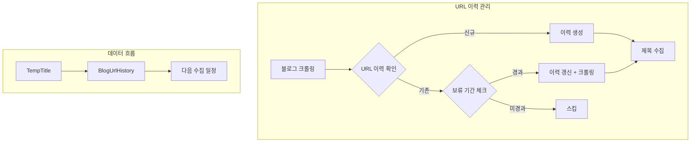

# Phase D-1-3: URL 이력 모델 구현

## 📋 작업 개요

| 항목 | 내용 |
|-----|------|
| Phase | D-1-3 |
| 작업명 | URL 이력 모델 구현 |
| 목표 | 블로그 URL 수집 이력 관리 모델 생성 |
| 선행 작업 | D-1-1 키워드 모델, D-1-2 제목 모델 완료 |
| 예상 시간 | 1-2시간 |

---

## 📐 순서도



---

## 📁 파일 구조

```
app/
├── models/
│   ├── __init__.py          # 모델 등록 (수정)
│   ├── keyword.py           # ✅ D-1-1 완료
│   ├── title.py             # ✅ D-1-2 완료
│   └── url_history.py       # URL 이력 모델 (신규) < 100줄
│
└── schemas/
    ├── keyword.py           # ✅ D-1-1 완료
    ├── title.py             # ✅ D-1-2 완료
    └── url_history.py       # URL 이력 스키마 (신규) < 80줄
```

---

## 📝 모델 상세

### BlogUrlHistory (블로그 URL 수집 이력)

```python
class BlogUrlHistory(Base):
    """
    블로그 URL 수집 이력
    
    블로그 전체 크롤링 시 중복 수집을 방지합니다.
    보류 기간(hold_days) 동안은 같은 블로그를 재수집하지 않습니다.
    
    플랫폼:
    - naver: 네이버 블로그
    - tistory: 티스토리
    - wordpress: 워드프레스
    - other: 기타
    
    사용 예시:
    1. 블로그 URL로 크롤링 시도
    2. BlogUrlHistory에서 URL 검색
    3. 신규면 → 크롤링 후 이력 생성
    4. 기존이면 → next_collection_date 확인
       - 도래했으면 → 크롤링 후 이력 갱신
       - 미도래면 → 스킵
    """
    __tablename__ = "blog_url_histories"
    
    id: Mapped[int] = mapped_column(primary_key=True)
    
    # 블로그 정보
    blog_url: Mapped[str] = mapped_column(
        String(1000), 
        nullable=False, 
        unique=True, 
        index=True
    )
    blog_platform: Mapped[str] = mapped_column(
        String(50),
        nullable=False,
        default="other"
    )  # "naver" | "tistory" | "wordpress" | "other"
    blog_name: Mapped[str | None] = mapped_column(String(200), nullable=True)
    
    # 수집 통계
    total_posts_count: Mapped[int] = mapped_column(default=0)  # 블로그 전체 포스트 수
    collected_posts_count: Mapped[int] = mapped_column(default=0)  # 수집한 포스트 수
    collection_count: Mapped[int] = mapped_column(default=0)  # 수집 횟수
    
    # 수집 일정
    last_collected_at: Mapped[datetime] = mapped_column(default=func.now())
    hold_days: Mapped[int] = mapped_column(default=30)  # 보류 기간 (일)
    next_collection_date: Mapped[datetime] = mapped_column(nullable=False)  # 재수집 가능일
    
    # 상태
    is_active: Mapped[bool] = mapped_column(default=True)  # 수집 대상 여부
    last_error: Mapped[str | None] = mapped_column(String(500), nullable=True)  # 마지막 에러
    error_count: Mapped[int] = mapped_column(default=0)  # 연속 에러 횟수
    
    created_at: Mapped[datetime] = mapped_column(default=func.now())
    updated_at: Mapped[datetime] = mapped_column(default=func.now(), onupdate=func.now())
    
    # Indexes
    __table_args__ = (
        Index('ix_blog_url_next_collection', 'next_collection_date', 'is_active'),
        Index('ix_blog_url_platform', 'blog_platform'),
    )
    
    def update_collection(self, posts_count: int) -> None:
        """
        수집 완료 후 이력 갱신
        
        Args:
            posts_count: 이번에 수집한 포스트 수
        """
        from datetime import timedelta
        
        self.collected_posts_count += posts_count
        self.collection_count += 1
        self.last_collected_at = func.now()
        self.next_collection_date = datetime.now() + timedelta(days=self.hold_days)
        self.last_error = None
        self.error_count = 0
    
    def record_error(self, error_message: str) -> None:
        """
        에러 기록
        
        Args:
            error_message: 에러 메시지
        """
        self.last_error = error_message[:500]  # 최대 500자
        self.error_count += 1
        
        # 연속 에러 5회 이상이면 비활성화
        if self.error_count >= 5:
            self.is_active = False
    
    @property
    def can_collect(self) -> bool:
        """수집 가능 여부"""
        from datetime import datetime
        return self.is_active and datetime.now() >= self.next_collection_date
```

---

## 📝 스키마 상세

### Pydantic 스키마 (app/schemas/url_history.py)

```python
from pydantic import BaseModel, Field, field_validator
from datetime import datetime

# ============ BlogUrlHistory ============

class BlogUrlHistoryBase(BaseModel):
    blog_url: str = Field(..., max_length=1000)
    blog_platform: str = Field(
        default="other", 
        pattern="^(naver|tistory|wordpress|other)$"
    )
    blog_name: str | None = Field(None, max_length=200)
    hold_days: int = Field(default=30, ge=1, le=365)

class BlogUrlHistoryCreate(BlogUrlHistoryBase):
    total_posts_count: int = 0
    
    @field_validator('blog_url')
    @classmethod
    def normalize_url(cls, v: str) -> str:
        """URL 정규화 (trailing slash 제거)"""
        return v.rstrip('/')

class BlogUrlHistoryUpdate(BaseModel):
    blog_name: str | None = Field(None, max_length=200)
    hold_days: int | None = Field(None, ge=1, le=365)
    is_active: bool | None = None
    total_posts_count: int | None = None

class BlogUrlHistoryResponse(BlogUrlHistoryBase):
    id: int
    total_posts_count: int
    collected_posts_count: int
    collection_count: int
    last_collected_at: datetime
    next_collection_date: datetime
    is_active: bool
    last_error: str | None
    error_count: int
    created_at: datetime
    updated_at: datetime
    
    class Config:
        from_attributes = True

class BlogUrlHistoryCheck(BaseModel):
    """URL 수집 가능 여부 체크 응답"""
    blog_url: str
    exists: bool
    can_collect: bool
    next_collection_date: datetime | None = None
    reason: str | None = None  # 수집 불가 사유

class BlogUrlHistoryStats(BaseModel):
    """URL 이력 통계"""
    total_urls: int
    active_urls: int
    collectible_urls: int  # 현재 수집 가능한 URL 수
    by_platform: dict[str, int]  # 플랫폼별 URL 수
```

---

## 🔧 에이전트별 작업 분담

### @explorer-agent
- 분석 불필요 (프롬프트에 상세 명세 제공됨)

### @backend-agent
- app/models/url_history.py 생성
- app/schemas/url_history.py 생성
- app/models/__init__.py에 모델 등록
- 헬퍼 메서드 구현 (update_collection, record_error, can_collect)

### @reviewer-agent
- 인덱스 설정 검토
- URL 정규화 로직 검토
- 에러 처리 로직 검토

---

## ⚠️ 제약 사항

1. **파일 크기**: app/models/url_history.py < 100줄
2. **파일 크기**: app/schemas/url_history.py < 80줄
3. **타입 힌트**: 필수 (Mapped[] 사용)
4. **Docstring**: 모든 클래스/메서드에 필수

---

## 📚 참조

- D-1-1 완료 파일: app/models/keyword.py
- D-1-2 완료 파일: app/models/title.py
- 기존 모델 패턴 참조

---

## ✅ 완료 조건

- [ ] BlogUrlHistory 모델 생성
- [ ] 헬퍼 메서드 구현 (update_collection, record_error, can_collect)
- [ ] Pydantic 스키마 생성
- [ ] app/models/__init__.py에 등록
- [ ] 타입 힌트 100%
- [ ] Docstring 100%
- [ ] 파일 크기 제한 준수
