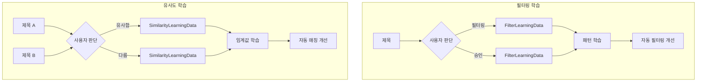

# Phase D-1-4: 학습 데이터 모델 구현

## 📋 작업 개요

| 항목 | 내용 |
|-----|------|
| Phase | D-1-4 |
| 작업명 | 학습 데이터 모델 구현 |
| 목표 | 필터링/유사도 학습 데이터 모델 생성 |
| 선행 작업 | D-1-1 ~ D-1-3 완료 |
| 예상 시간 | 1-2시간 |

---

## 📐 순서도



---

## 📁 파일 구조

```
app/
├── models/
│   ├── __init__.py          # 모델 등록 (수정)
│   ├── keyword.py           # ✅ D-1-1 완료
│   ├── title.py             # ✅ D-1-2 완료
│   ├── url_history.py       # ✅ D-1-3 완료
│   └── learning.py          # 학습 데이터 모델 (신규) < 120줄
│
└── schemas/
    ├── keyword.py           # ✅ D-1-1 완료
    ├── title.py             # ✅ D-1-2 완료
    ├── url_history.py       # ✅ D-1-3 완료
    └── learning.py          # 학습 스키마 (신규) < 100줄
```

---

## 📝 모델 상세

### 1. FilterLearningData (필터링 학습 데이터)

```python
class FilterLearningData(Base):
    """
    필터링 학습 데이터
    
    사용자가 제목을 필터링하거나 승인한 기록을 저장합니다.
    이 데이터를 분석하여 자동 필터링을 개선합니다.
    
    user_action:
    - filtered: 사용자가 필터링함 (제외)
    - approved: 사용자가 승인함 (유지)
    - auto_filtered: 시스템이 자동 필터링함
    
    filter_type:
    - sensitive: 민감 주제 (19금, 도박 등)
    - spam: 스팸 패턴 (무료다운, 토렌트 등)
    - ad: 광고성 (최저가, 할인코드 등)
    - low_quality: 저품질 (펌글, 퍼온글 등)
    - custom: 사용자 커스텀
    """
    __tablename__ = "filter_learning_data"
    
    id: Mapped[int] = mapped_column(primary_key=True)
    
    # 제목 정보
    title: Mapped[str] = mapped_column(String(500), nullable=False, index=True)
    title_hash: Mapped[str] = mapped_column(String(64), nullable=False, index=True)  # 중복 체크용
    
    # 필터링 정보
    filter_type: Mapped[str | None] = mapped_column(String(50), nullable=True)
    filter_reason: Mapped[str | None] = mapped_column(String(200), nullable=True)
    keywords_detected: Mapped[str | None] = mapped_column(Text, nullable=True)  # JSON array
    
    # 사용자 판단
    user_action: Mapped[str] = mapped_column(
        String(50),
        nullable=False
    )  # "filtered" | "approved" | "auto_filtered"
    
    # 학습 메트릭
    confidence: Mapped[float] = mapped_column(default=0.0)  # 신뢰도 (0.0 ~ 1.0)
    is_trained: Mapped[bool] = mapped_column(default=False)  # 학습에 사용됨 여부
    
    created_at: Mapped[datetime] = mapped_column(default=func.now())
    
    # Indexes
    __table_args__ = (
        Index('ix_filter_learning_action', 'user_action'),
        Index('ix_filter_learning_type', 'filter_type'),
    )
```

### 2. SimilarityLearningData (유사도 매칭 학습 데이터)

```python
class SimilarityLearningData(Base):
    """
    유사도 매칭 학습 데이터
    
    사용자가 두 제목의 유사 여부를 판단한 기록을 저장합니다.
    이 데이터를 분석하여 유사도 임계값과 알고리즘을 개선합니다.
    
    user_action:
    - matched: 사용자가 유사하다고 판단
    - rejected: 사용자가 다르다고 판단
    - grouped: 같은 그룹으로 묶음
    - separated: 그룹에서 분리함
    """
    __tablename__ = "similarity_learning_data"
    
    id: Mapped[int] = mapped_column(primary_key=True)
    
    # 비교 제목
    title_a: Mapped[str] = mapped_column(String(500), nullable=False)
    title_b: Mapped[str] = mapped_column(String(500), nullable=False)
    pair_hash: Mapped[str] = mapped_column(String(64), nullable=False, unique=True)  # 중복 체크용
    
    # 유사도 정보
    similarity_score: Mapped[float] = mapped_column(nullable=False)  # 계산된 유사도 (0.0 ~ 1.0)
    similarity_algorithm: Mapped[str] = mapped_column(
        String(50),
        default="combined"
    )  # "cosine" | "jaccard" | "combined"
    
    # 공통 요소
    common_keywords: Mapped[str | None] = mapped_column(Text, nullable=True)  # JSON array
    common_patterns: Mapped[str | None] = mapped_column(Text, nullable=True)  # JSON array
    
    # 사용자 판단
    is_similar: Mapped[bool] = mapped_column(nullable=False)  # 최종 판단
    user_action: Mapped[str] = mapped_column(
        String(50),
        nullable=False
    )  # "matched" | "rejected" | "grouped" | "separated"
    
    # 학습 메트릭
    is_trained: Mapped[bool] = mapped_column(default=False)  # 학습에 사용됨 여부
    
    created_at: Mapped[datetime] = mapped_column(default=func.now())
    
    # Indexes
    __table_args__ = (
        Index('ix_similarity_learning_action', 'user_action'),
        Index('ix_similarity_learning_score', 'similarity_score'),
    )
```

---

## 📝 스키마 상세

### Pydantic 스키마 (app/schemas/learning.py)

```python
from pydantic import BaseModel, Field
from datetime import datetime

# ============ FilterLearningData ============

class FilterLearningBase(BaseModel):
    title: str = Field(..., max_length=500)
    filter_type: str | None = Field(
        None, 
        pattern="^(sensitive|spam|ad|low_quality|custom)$"
    )
    filter_reason: str | None = Field(None, max_length=200)
    keywords_detected: list[str] = []

class FilterLearningCreate(FilterLearningBase):
    user_action: str = Field(..., pattern="^(filtered|approved|auto_filtered)$")
    confidence: float = Field(default=0.0, ge=0.0, le=1.0)

class FilterLearningResponse(FilterLearningBase):
    id: int
    title_hash: str
    user_action: str
    confidence: float
    is_trained: bool
    created_at: datetime
    
    class Config:
        from_attributes = True

class FilterLearningStats(BaseModel):
    """필터링 학습 통계"""
    total_count: int
    filtered_count: int
    approved_count: int
    auto_filtered_count: int
    by_filter_type: dict[str, int]
    trained_count: int


# ============ SimilarityLearningData ============

class SimilarityLearningBase(BaseModel):
    title_a: str = Field(..., max_length=500)
    title_b: str = Field(..., max_length=500)
    similarity_score: float = Field(..., ge=0.0, le=1.0)
    similarity_algorithm: str = Field(
        default="combined",
        pattern="^(cosine|jaccard|combined)$"
    )

class SimilarityLearningCreate(SimilarityLearningBase):
    is_similar: bool
    user_action: str = Field(..., pattern="^(matched|rejected|grouped|separated)$")
    common_keywords: list[str] = []
    common_patterns: list[str] = []

class SimilarityLearningResponse(SimilarityLearningBase):
    id: int
    pair_hash: str
    common_keywords: list[str] | None
    common_patterns: list[str] | None
    is_similar: bool
    user_action: str
    is_trained: bool
    created_at: datetime
    
    class Config:
        from_attributes = True

class SimilarityLearningStats(BaseModel):
    """유사도 학습 통계"""
    total_count: int
    similar_count: int  # is_similar=True
    different_count: int  # is_similar=False
    by_action: dict[str, int]
    avg_similarity_for_similar: float  # 유사 판단된 것들의 평균 유사도
    avg_similarity_for_different: float  # 다름 판단된 것들의 평균 유사도
    trained_count: int

class SimilarityThreshold(BaseModel):
    """학습된 유사도 임계값"""
    recommended_threshold: float  # 권장 임계값
    confidence: float  # 신뢰도
    sample_count: int  # 학습 샘플 수
```

---

## 🔧 에이전트별 작업 분담

### @explorer-agent
- 분석 불필요 (프롬프트에 상세 명세 제공됨)

### @backend-agent
- app/models/learning.py 생성
- app/schemas/learning.py 생성
- app/models/__init__.py에 모델 등록
- 해시 생성 로직 (title_hash, pair_hash)

### @reviewer-agent
- 해시 충돌 가능성 검토
- JSON 필드 직렬화/역직렬화 검토
- 인덱스 설정 검토

---

## ⚠️ 제약 사항

1. **파일 크기**: app/models/learning.py < 120줄
2. **파일 크기**: app/schemas/learning.py < 100줄
3. **타입 힌트**: 필수 (Mapped[] 사용)
4. **Docstring**: 모든 클래스에 필수

---

## 💡 해시 생성 참고

```python
import hashlib

def generate_title_hash(title: str) -> str:
    """제목 해시 생성"""
    return hashlib.sha256(title.encode()).hexdigest()

def generate_pair_hash(title_a: str, title_b: str) -> str:
    """제목 쌍 해시 생성 (순서 무관)"""
    # 정렬하여 순서 무관하게 동일한 해시 생성
    sorted_titles = sorted([title_a, title_b])
    combined = f"{sorted_titles[0]}||{sorted_titles[1]}"
    return hashlib.sha256(combined.encode()).hexdigest()
```

---

## 📚 참조

- D-1-1 ~ D-1-3 완료 파일 참조
- 기존 모델 패턴 참조

---

## ✅ 완료 조건

- [ ] FilterLearningData 모델 생성
- [ ] SimilarityLearningData 모델 생성
- [ ] 해시 생성 로직 구현
- [ ] Pydantic 스키마 생성 (Stats 포함)
- [ ] app/models/__init__.py에 등록
- [ ] 타입 힌트 100%
- [ ] Docstring 100%
- [ ] 파일 크기 제한 준수
