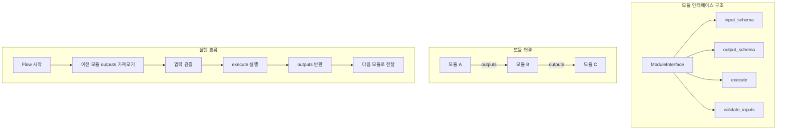

# Phase D-1-5: 모듈 인터페이스 정의

## 📋 작업 개요

| 항목 | 내용 |
|-----|------|
| Phase | D-1-5 |
| 작업명 | 모듈 인터페이스 정의 |
| 목표 | 모든 모듈이 따를 표준 인터페이스 정의 |
| 선행 작업 | D-1-1 ~ D-1-4 완료 |
| 예상 시간 | 1-2시간 |

---

## 📐 순서도



---

## 📁 파일 구조

```
app/
├── core/
│   └── module_interface.py  # 모듈 인터페이스 (신규) < 150줄
│
└── schemas/
    └── module_interface.py  # 인터페이스 스키마 (신규) < 80줄
```

---

## 📝 모듈 인터페이스 상세

### ModuleInterface (베이스 클래스)

```python
from abc import ABC, abstractmethod
from typing import Any
from enum import Enum

class ModuleType(str, Enum):
    """모듈 유형"""
    COLLECTION = "collection"      # 수집 (키워드, 제목)
    PROCESSING = "processing"      # 처리 (필터링, 분류, 유사도)
    GENERATION = "generation"      # 생성 (프롬프트, AI API)
    PUBLISHING = "publishing"      # 발행 (재발행, 신규발행)
    CONTROL = "control"            # 제어 (조건문)


class ModuleInterface(ABC):
    """
    모듈 표준 인터페이스
    
    모든 모듈은 이 인터페이스를 상속받아 구현합니다.
    플로우 내에서 모듈 간 데이터 전달을 표준화합니다.
    
    사용 예시:
    ```python
    class RepublishModule(ModuleInterface):
        module_type = ModuleType.PUBLISHING
        module_name = "republish"
        
        input_schema = {
            "required": [],
            "optional": ["blog_id", "post_id"]
        }
        
        output_schema = {
            "provides": ["published_url", "publish_status", "publish_timestamp"]
        }
        
        def execute(self, inputs: dict | None = None) -> dict:
            # 구현...
            return {"published_url": url, "publish_status": "success", ...}
    ```
    """
    
    # ========== 메타 정보 (서브클래스에서 오버라이드) ==========
    
    module_type: ModuleType = ModuleType.PROCESSING
    module_name: str = ""
    module_description: str = ""
    
    # ========== Input/Output 스키마 ==========
    
    input_schema: dict = {
        "required": [],    # 필수 입력 키 목록
        "optional": [],    # 선택 입력 키 목록
    }
    
    output_schema: dict = {
        "provides": [],    # 제공하는 출력 키 목록
    }
    
    # ========== 추상 메서드 ==========
    
    @abstractmethod
    def execute(self, inputs: dict | None = None) -> dict:
        """
        모듈 실행
        
        Args:
            inputs: 이전 모듈에서 전달받은 데이터
                   - None이면 모듈 자체 설정값 사용
                   - dict면 전달값 우선, 없는 항목은 설정값 폴백
        
        Returns:
            다음 모듈로 전달할 데이터 (output_schema.provides 키 포함)
        
        Raises:
            ModuleExecutionError: 실행 중 오류 발생
        """
        pass
    
    # ========== 유틸리티 메서드 ==========
    
    def validate_inputs(self, inputs: dict | None) -> tuple[bool, str | None]:
        """
        입력값 검증
        
        Args:
            inputs: 검증할 입력 데이터
        
        Returns:
            (is_valid, error_message)
            - is_valid: 검증 통과 여부
            - error_message: 실패 시 오류 메시지
        """
        if not inputs:
            # inputs가 없으면 required도 없어야 함
            if self.input_schema["required"]:
                missing = self.input_schema["required"]
                return False, f"Missing required inputs: {missing}"
            return True, None
        
        # required 키 체크
        for key in self.input_schema["required"]:
            if key not in inputs:
                return False, f"Missing required input: {key}"
        
        return True, None
    
    def get_input_value(
        self, 
        inputs: dict | None, 
        key: str, 
        default: Any = None,
        fallback_config: dict | None = None
    ) -> Any:
        """
        입력값 가져오기 (폴백 지원)
        
        우선순위:
        1. inputs[key] (이전 모듈에서 전달)
        2. fallback_config[key] (모듈 자체 설정)
        3. default (기본값)
        
        Args:
            inputs: 이전 모듈에서 전달받은 데이터
            key: 가져올 키
            default: 기본값
            fallback_config: 모듈 자체 설정 (보통 self.config)
        
        Returns:
            값
        """
        # 1. inputs에서 먼저 찾기
        if inputs and key in inputs:
            return inputs[key]
        
        # 2. fallback_config에서 찾기
        if fallback_config and key in fallback_config:
            return fallback_config[key]
        
        # 3. 기본값 반환
        return default
    
    def create_output(self, **kwargs) -> dict:
        """
        출력 데이터 생성
        
        output_schema.provides에 정의된 키만 포함하여 반환합니다.
        
        Args:
            **kwargs: 출력 데이터
        
        Returns:
            정제된 출력 데이터
        """
        output = {}
        for key in self.output_schema["provides"]:
            if key in kwargs:
                output[key] = kwargs[key]
            else:
                output[key] = None  # 미제공 키는 None으로
        return output
    
    def get_schema_info(self) -> dict:
        """
        모듈 스키마 정보 반환
        
        Returns:
            모듈 메타 정보 및 스키마
        """
        return {
            "module_type": self.module_type.value,
            "module_name": self.module_name,
            "module_description": self.module_description,
            "input_schema": self.input_schema,
            "output_schema": self.output_schema,
        }


class ModuleExecutionError(Exception):
    """모듈 실행 오류"""
    
    def __init__(self, module_name: str, message: str, details: dict | None = None):
        self.module_name = module_name
        self.message = message
        self.details = details or {}
        super().__init__(f"[{module_name}] {message}")
```

---

## 📝 스키마 상세

### Pydantic 스키마 (app/schemas/module_interface.py)

```python
from pydantic import BaseModel, Field
from typing import Any
from enum import Enum

class ModuleTypeEnum(str, Enum):
    """모듈 유형"""
    COLLECTION = "collection"
    PROCESSING = "processing"
    GENERATION = "generation"
    PUBLISHING = "publishing"
    CONTROL = "control"


class InputSchema(BaseModel):
    """입력 스키마"""
    required: list[str] = []
    optional: list[str] = []


class OutputSchema(BaseModel):
    """출력 스키마"""
    provides: list[str] = []


class ModuleSchemaInfo(BaseModel):
    """모듈 스키마 정보"""
    module_type: ModuleTypeEnum
    module_name: str
    module_description: str = ""
    input_schema: InputSchema
    output_schema: OutputSchema


class ModuleExecutionInput(BaseModel):
    """모듈 실행 입력"""
    module_id: int
    inputs: dict[str, Any] = {}


class ModuleExecutionResult(BaseModel):
    """모듈 실행 결과"""
    success: bool
    module_name: str
    outputs: dict[str, Any] = {}
    error_message: str | None = None
    execution_time_ms: int = 0


class ModuleConnectionInfo(BaseModel):
    """모듈 연결 정보"""
    source_module_id: int
    source_output_key: str
    target_module_id: int
    target_input_key: str


class FlowExecutionContext(BaseModel):
    """플로우 실행 컨텍스트"""
    flow_id: int
    current_module_id: int
    accumulated_outputs: dict[int, dict[str, Any]] = {}  # module_id -> outputs
    execution_history: list[ModuleExecutionResult] = []
```

---

## 🔧 에이전트별 작업 분담

### @explorer-agent
- 기존 모듈 구조 분석 (app/modules/ 또는 app/services/)
- 현재 사용 중인 패턴 파악

### @backend-agent
- app/core/module_interface.py 생성
- app/schemas/module_interface.py 생성
- ModuleInterface 베이스 클래스 구현
- 유틸리티 메서드 구현

### @reviewer-agent
- 인터페이스 설계 검토
- 확장성 검토 (새 모듈 추가 용이성)
- 타입 힌트 검증

---

## ⚠️ 제약 사항

1. **파일 크기**: app/core/module_interface.py < 150줄
2. **파일 크기**: app/schemas/module_interface.py < 80줄
3. **타입 힌트**: 필수
4. **Docstring**: 모든 클래스/메서드에 필수
5. **ABC 사용**: 추상 베이스 클래스로 구현

---

## 💡 설계 원칙

1. **하위 호환성**: 기존 모듈이 인터페이스 없이도 동작해야 함
2. **선택적 적용**: inputs=None이면 기존 방식(설정값 기반) 동작
3. **점진적 마이그레이션**: 새 모듈부터 인터페이스 적용
4. **유연한 연결**: 모듈 간 동적 연결 지원

---

## 📚 참조

- 기존 모듈: app/modules/ 또는 app/services/
- D-1-1 ~ D-1-4 완료 모델 참조

---

## ✅ 완료 조건

- [ ] ModuleInterface 베이스 클래스 생성
- [ ] ModuleType Enum 정의
- [ ] ModuleExecutionError 예외 클래스
- [ ] 유틸리티 메서드 구현 (validate_inputs, get_input_value, create_output)
- [ ] Pydantic 스키마 생성
- [ ] 타입 힌트 100%
- [ ] Docstring 100%
- [ ] 파일 크기 제한 준수
