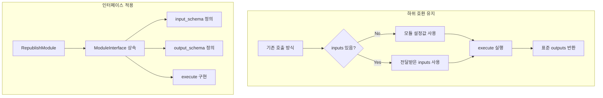

# Phase D-1-6: 재발행 모듈 인터페이스 적용

## 📋 작업 개요

| 항목 | 내용 |
|-----|------|
| Phase | D-1-6 |
| 작업명 | 재발행 모듈에 ModuleInterface 적용 |
| 목표 | 기존 재발행 모듈을 ModuleInterface 상속으로 확장 |
| 선행 작업 | D-1-5 모듈 인터페이스 완료 |
| 예상 시간 | 1-2시간 |

---

## 📐 순서도



---

## 📁 파일 구조

```
app/
├── core/
│   └── module_interface.py  # ✅ D-1-5 완료
│
├── modules/
│   └── republish.py         # 재발행 모듈 (수정) - 인터페이스 적용
│
└── schemas/
    └── module_interface.py  # ✅ D-1-5 완료
```

---

## 📝 수정 내용

### 재발행 모듈 확장 (app/modules/republish.py 또는 해당 위치)

```python
from app.core.module_interface import ModuleInterface, ModuleType, ModuleExecutionError


class RepublishModule(ModuleInterface):
    """
    재발행 모듈
    
    등록된 블로그의 기존 포스트를 자동으로 재발행합니다.
    ModuleInterface를 상속받아 플로우 내 모듈 연결을 지원합니다.
    
    하위 호환성:
    - inputs=None으로 호출하면 기존 방식(모듈 설정값) 사용
    - inputs 전달 시 전달값 우선, 없는 항목은 설정값 폴백
    
    사용 예시:
    ```python
    # 기존 방식 (하위 호환)
    module = RepublishModule(config=module_config)
    result = module.execute()
    
    # 새 방식 (플로우 연결)
    module = RepublishModule(config=module_config)
    result = module.execute(inputs={"blog_id": 1, "post_id": 123})
    ```
    """
    
    # ========== 메타 정보 ==========
    
    module_type = ModuleType.PUBLISHING
    module_name = "republish"
    module_description = "블로그 포스트 재발행"
    
    # ========== Input/Output 스키마 ==========
    
    input_schema = {
        "required": [],  # 없음 - 기존 방식 호환
        "optional": [
            "blog_id",      # 특정 블로그만 재발행
            "post_id",      # 특정 포스트만 재발행
            "category_id",  # 특정 카테고리만
        ]
    }
    
    output_schema = {
        "provides": [
            "published_post_id",    # 발행된 포스트 ID
            "published_url",        # 발행된 URL
            "publish_status",       # 발행 상태 ("success" | "failed" | "skipped")
            "publish_timestamp",    # 발행 시간
            "blog_id",              # 블로그 ID
            "error_message",        # 실패 시 에러 메시지
        ]
    }
    
    # ========== 생성자 ==========
    
    def __init__(self, config: dict | None = None, db_session=None):
        """
        Args:
            config: 모듈 설정 (기존 방식 호환)
            db_session: 데이터베이스 세션
        """
        self.config = config or {}
        self.db_session = db_session
    
    # ========== execute 구현 ==========
    
    def execute(self, inputs: dict | None = None) -> dict:
        """
        재발행 실행
        
        Args:
            inputs: 이전 모듈에서 전달받은 데이터 (선택)
                   - None이면 모듈 설정값 사용 (하위 호환)
                   - dict면 전달값 우선
        
        Returns:
            output_schema.provides에 정의된 키 포함
        
        Raises:
            ModuleExecutionError: 실행 중 오류 발생
        """
        import logging
        from datetime import datetime
        
        logger = logging.getLogger(__name__)
        
        try:
            # 1. 입력값 가져오기 (폴백 지원)
            blog_id = self.get_input_value(inputs, "blog_id", fallback_config=self.config)
            post_id = self.get_input_value(inputs, "post_id", fallback_config=self.config)
            category_id = self.get_input_value(inputs, "category_id", fallback_config=self.config)
            
            logger.info(f"[REPUBLISH] Starting: blog_id={blog_id}, post_id={post_id}")
            
            # 2. 기존 재발행 로직 호출
            # TODO: 기존 republish 로직을 여기서 호출
            # result = self._do_republish(blog_id, post_id, category_id)
            
            # 임시 구현 (실제 로직으로 교체 필요)
            result = self._execute_republish(blog_id, post_id, category_id)
            
            # 3. 표준 output 형식으로 반환
            return self.create_output(
                published_post_id=result.get("post_id"),
                published_url=result.get("url"),
                publish_status=result.get("status", "success"),
                publish_timestamp=datetime.now().isoformat(),
                blog_id=blog_id,
                error_message=None,
            )
            
        except Exception as e:
            logger.error(f"[REPUBLISH] Failed: {e}")
            
            # 실패해도 output 형식 유지
            return self.create_output(
                published_post_id=None,
                published_url=None,
                publish_status="failed",
                publish_timestamp=datetime.now().isoformat(),
                blog_id=self.get_input_value(inputs, "blog_id", fallback_config=self.config),
                error_message=str(e),
            )
    
    # ========== 내부 메서드 ==========
    
    def _execute_republish(
        self, 
        blog_id: int | None, 
        post_id: int | None,
        category_id: int | None
    ) -> dict:
        """
        실제 재발행 로직
        
        TODO: 기존 재발행 로직을 이 메서드에서 호출하거나 구현
        
        Args:
            blog_id: 블로그 ID (None이면 전체)
            post_id: 포스트 ID (None이면 랜덤 선택)
            category_id: 카테고리 ID (None이면 전체)
        
        Returns:
            {"post_id": int, "url": str, "status": str}
        """
        # 기존 로직 호출 (예시)
        # from app.services.republish_service import republish_post
        # return republish_post(blog_id, post_id, category_id)
        
        # 임시 반환 (실제 구현 필요)
        return {
            "post_id": post_id or 0,
            "url": f"https://example.com/post/{post_id or 0}",
            "status": "success",
        }
```

---

## 🔧 에이전트별 작업 분담

### @explorer-agent
- 기존 재발행 모듈 위치 및 구조 분석
- 기존 republish 로직 파악 (호출 방법, 반환값)

### @backend-agent
- 재발행 모듈에 ModuleInterface 상속 적용
- input_schema, output_schema 정의
- execute() 메서드 구현 (기존 로직 래핑)
- 하위 호환성 유지

### @reviewer-agent
- 하위 호환성 검증 (기존 호출 방식 동작)
- 인터페이스 준수 검증
- 에러 처리 검증

---

## ⚠️ 제약 사항

1. **하위 호환 필수**: 기존 호출 방식이 깨지면 안 됨
2. **기존 코드 유지**: 기존 로직 삭제 금지, 래핑만
3. **파일 크기**: 증가분 최소화
4. **타입 힌트**: 필수
5. **Docstring**: 필수

---

## ⚠️ 하위 호환성 체크

### 기존 호출 방식 (유지해야 함)

```python
# 방식 1: 설정값만 사용
module = RepublishModule(config={"blog_id": 1})
result = module.run()  # 또는 execute()

# 방식 2: 직접 호출
republish_service.republish(blog_id=1)
```

### 새 호출 방식 (추가)

```python
# 방식 3: 플로우 연결 (inputs 전달)
module = RepublishModule(config=module_config)
result = module.execute(inputs={"blog_id": 1, "post_id": 123})
```

---

## 💡 구현 팁

1. **기존 메서드 유지**: 기존 `run()` 메서드가 있다면 그대로 두고, `execute()`에서 호출
2. **get_input_value 활용**: inputs 우선, config 폴백
3. **create_output 활용**: 표준 출력 형식 보장
4. **에러도 output 형식**: 실패 시에도 output_schema 형식 유지

---

## 📚 참조

- D-1-5 완료 파일: app/core/module_interface.py
- 기존 재발행 모듈: (탐색 필요)

---

## ✅ 완료 조건

- [ ] 재발행 모듈에 ModuleInterface 상속 적용
- [ ] module_type, module_name, module_description 정의
- [ ] input_schema 정의 (optional: blog_id, post_id, category_id)
- [ ] output_schema 정의 (provides: 6개 키)
- [ ] execute() 메서드 구현
- [ ] 하위 호환성 유지 (기존 호출 방식 동작)
- [ ] 에러 시에도 output 형식 유지
- [ ] 타입 힌트 100%
- [ ] Docstring 100%
