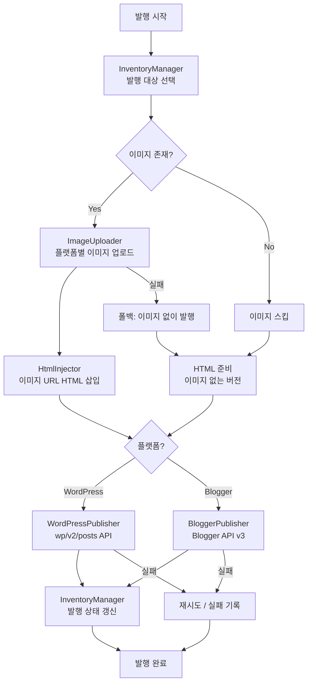

# 발행 모듈 구현 계획서

> **문서명**: publish_module_implementation_plan.md
> **작성일**: 2026-03-21
> **대상**: BlogAuto v2 - 생성 콘텐츠 자동 발행 시스템
> **상태**: 계획 수립 완료, 구현 대기

---

## 1. 개요

### 1.1 목적

생성된 콘텐츠(CrawledPost, source="generated")를 WordPress 및 Blogger 플랫폼에 자동으로 발행하는 모듈을 구현합니다. 이미지 업로드, HTML 가공, 플랫폼별 API 호출, 발행 상태 관리를 포함하는 전체 파이프라인입니다.

### 1.2 현재 상태

```
[생성 파이프라인 완료]
ContentGenerator → CrawledPost (source="generated", content_html, image_url)
                 → GenerationHistory (기록)

[발행 파이프라인 미구현]
CrawledPost → ??? → WordPress/Blogger 발행
```

### 1.3 목표 상태

```
CrawledPost (발행대기)
  → ImageUploader (이미지 업로드)
  → HtmlInjector (이미지 URL 주입)
  → PlatformPublisher (플랫폼별 발행)
  → InventoryManager (상태 갱신)
  → CrawledPost (발행완료)
```

---

## 2. 아키텍처 설계

### 2.1 전체 플로우차트



### 2.2 서비스 구조

```
app/services/publishing/
├── __init__.py
├── image_uploader.py         # Phase 1: 이미지 업로드 서비스
├── html_injector.py          # Phase 2: HTML 이미지 주입
├── wordpress_publisher.py    # Phase 3: WordPress 발행
├── blogger_publisher.py      # Phase 3: Blogger 발행
├── publisher_pipeline.py     # Phase 4: 통합 파이프라인
└── publish_result.py         # 공통 결과 모델
```

### 2.3 기존 코드 연동 포인트

| 기존 서비스 | 역할 | 연동 방식 |
|------------|------|----------|
| `InventoryManager` | 발행 대상 선택, 상태 갱신 | `get_post_for_publish()`, `mark_as_published()` |
| `flows_execute.py` | 플로우 실행에서 발행 모듈 디스패치 | `_execute_publish_module()` 추가 |
| `Blog` 모델 | 플랫폼 정보, API 키, 에디터 타입 | `blog.platform`, `blog.api_key_encrypted` |
| `CrawledPost` 모델 | 발행 대상 콘텐츠 | `content_html`, `image_url`, `published_at` |

---

## 3. Phase별 구현 계획

### Phase 1: 이미지 업로드 서비스

**파일**: `app/services/publishing/image_uploader.py`
**예상 라인**: ~250줄

#### 3.1.1 WordPress 이미지 업로드

```python
# WordPress REST API: POST /wp/v2/media
# Content-Type: multipart/form-data
# Authorization: Basic base64(user:app_password)

class WordPressImageUploader:
    async def upload(self, blog: Blog, image_path: str) -> ImageUploadResult:
        """
        WordPress 미디어 라이브러리에 이미지 업로드

        Returns:
            ImageUploadResult(
                success=True,
                platform_url="https://blog.com/wp-content/uploads/2026/03/image.webp",
                media_id=123,
            )
        """
```

**WordPress 미디어 업로드 API 상세:**
- 엔드포인트: `POST {blog_url}/wp-json/wp/v2/media`
- 인증: Application Password (Basic Auth)
- 요청: `multipart/form-data` (file + alt_text + caption)
- 응답: `{ id, source_url, media_details }`
- WebP 지원: WordPress 5.8+ 기본 지원

#### 3.1.2 Blogger 이미지 업로드

Blogger API는 직접 이미지 업로드를 지원하지 않으므로 외부 이미지 호스팅 필요.

**옵션 A: imgbb (추천 - 무료 티어)**
```python
# POST https://api.imgbb.com/1/upload
# Parameters: key={api_key}, image={base64}
# 무료: 월 100장, 32MB 제한

class ImgbbImageUploader:
    async def upload(self, api_key: str, image_path: str) -> ImageUploadResult:
        """imgbb에 이미지 업로드 후 URL 반환"""
```

**옵션 B: Cloudinary (대안 - 확장성)**
```python
# Cloudinary Upload API
# 무료: 월 25크레딧 (약 25,000 변환)

class CloudinaryImageUploader:
    async def upload(self, config: dict, image_path: str) -> ImageUploadResult:
        """Cloudinary에 이미지 업로드"""
```

#### 3.1.3 통합 ImageUploader

```python
class ImageUploader:
    """플랫폼별 이미지 업로드 라우터"""

    async def upload_image(
        self, blog: Blog, image_path: str
    ) -> ImageUploadResult:
        if blog.platform == "WORDPRESS":
            return await self._upload_wordpress(blog, image_path)
        elif blog.platform == "BLOGGER":
            return await self._upload_blogger(blog, image_path)
        else:
            raise UnsupportedPlatformError(blog.platform)
```

#### 3.1.4 ImageUploadResult 모델

```python
@dataclass
class ImageUploadResult:
    success: bool
    platform_url: Optional[str] = None  # 업로드된 이미지 URL
    media_id: Optional[int] = None      # WordPress media ID
    error: Optional[str] = None
    width: Optional[int] = None
    height: Optional[int] = None
```

#### 3.1.5 이미지 최적화

- WebP 변환 (Pillow): 용량 50-70% 절감
- 리사이징: 최대 1200px 너비
- 메타데이터 제거: EXIF 정보 스트립

---

### Phase 2: HTML 이미지 주입

**파일**: `app/services/publishing/html_injector.py`
**예상 라인**: ~200줄

#### 3.2.1 이미지 삽입 전략

```python
class HtmlInjector:
    """생성된 HTML에 업로드된 이미지 URL 삽입"""

    def inject_featured_image(
        self, html: str, image_url: str, title: str,
        editor_type: str = "classic"
    ) -> str:
        """
        대표 이미지를 HTML 상단에 삽입

        editor_type별 처리:
        - classic:  태그 직접 삽입
        - gutenberg: <!-- wp:image --> 블록 형식
        """
```

#### 3.2.2 에디터 타입별 HTML 포맷

**Classic Editor:**
```html
<div class="featured-image">
    
</div>
{original_html}
```

**Gutenberg Editor:**
```html
<!-- wp:image {"id":{media_id},"sizeSlug":"full"} -->
<figure class="wp-block-image size-full">
    
</figure>
<!-- /wp:image -->

{original_html_as_blocks}
```

**Blogger:**
```html
<div class="separator" style="clear:both;text-align:center;">
    
</div>
<br/>
{original_html}
```

#### 3.2.3 본문 내 이미지 삽입 (선택)

섹션 사이에 이미지를 배치하는 확장 옵션:
```python
def inject_section_images(
    self, html: str, section_images: list[str]
) -> str:
    """본문 h2/h3 섹션 사이에 이미지 삽입 (향후 확장)"""
```

> **참고**: `crawled_posts.section_images` 컬럼(JSON)이 alembic 025에서 추가됨. 현재 미사용이나 향후 다중 이미지 삽입에 활용 가능.

---

### Phase 3: 플랫폼별 발행 서비스

#### 3.3.1 WordPress Publisher

**파일**: `app/services/publishing/wordpress_publisher.py`
**예상 라인**: ~200줄

```python
class WordPressPublisher:
    """WordPress REST API를 통한 글 발행"""

    async def publish(
        self, blog: Blog, post: CrawledPost,
        final_html: str, media_id: Optional[int] = None
    ) -> PublishResult:
        """
        WordPress에 글 발행

        API: POST {blog_url}/wp-json/wp/v2/posts

        Request Body:
        {
            "title": post.title,
            "content": final_html,
            "status": "publish",
            "featured_media": media_id,  # 대표 이미지
            "categories": [category_id],
            "format": "standard"
        }

        Authentication: Basic Auth (Application Password)
        """
```

**WordPress API 상세:**
- 엔드포인트: `POST {blog_url}/wp-json/wp/v2/posts`
- 인증: Application Password (Basic Auth) 또는 JWT
- 필수 필드: `title`, `content`, `status`
- 선택 필드: `featured_media`, `categories`, `tags`, `excerpt`
- 카테고리 매핑: Blog.categories → WordPress category ID

**카테고리 매핑 전략:**
```python
async def _resolve_category(
    self, blog: Blog, post: CrawledPost
) -> Optional[int]:
    """
    CrawledPost의 MainTitle → category_id → Blog의 WordPress 카테고리 ID 매핑
    Blog 설정에 카테고리 매핑 테이블 필요 (향후)
    """
```

#### 3.3.2 Blogger Publisher

**파일**: `app/services/publishing/blogger_publisher.py`
**예상 라인**: ~200줄

```python
class BloggerPublisher:
    """Google Blogger API v3를 통한 글 발행"""

    async def publish(
        self, blog: Blog, post: CrawledPost, final_html: str
    ) -> PublishResult:
        """
        Blogger에 글 발행

        API: POST https://www.googleapis.com/blogger/v3/blogs/{blogId}/posts

        Request Body:
        {
            "kind": "blogger#post",
            "title": post.title,
            "content": final_html,
            "labels": ["auto-generated"]
        }

        Authentication: OAuth 2.0 (google_credential_id)
        """
```

**Blogger API 상세:**
- 엔드포인트: `POST /blogger/v3/blogs/{blogId}/posts`
- 인증: OAuth 2.0 (Service Account 또는 User Credential)
- 필수 필드: `title`, `content`
- 선택 필드: `labels`, `customMetaData`
- 이미지: HTML 내 `` 태그로 직접 삽입 (별도 미디어 API 없음)
- Blog.google_credential_id로 OAuth 토큰 관리

**Google OAuth 토큰 관리:**
```python
async def _get_access_token(self, blog: Blog) -> str:
    """
    google_credential_id로 저장된 OAuth refresh_token에서
    access_token 갱신
    """
```

#### 3.3.3 PublishResult 모델

**파일**: `app/services/publishing/publish_result.py`
**예상 라인**: ~50줄

```python
@dataclass
class PublishResult:
    success: bool
    platform: str                        # "WORDPRESS" | "BLOGGER"
    published_url: Optional[str] = None  # 발행된 글 URL
    platform_post_id: Optional[str] = None  # 플랫폼 내 글 ID
    image_uploaded: bool = False
    image_url: Optional[str] = None      # 업로드된 이미지 URL
    error: Optional[str] = None
    retry_count: int = 0
```

---

### Phase 4: Publisher 파이프라인 통합

**파일**: `app/services/publishing/publisher_pipeline.py`
**예상 라인**: ~250줄

#### 3.4.1 PublisherPipeline

```python
class PublisherPipeline:
    """발행 전체 파이프라인 오케스트레이터"""

    def __init__(self, db: AsyncSession):
        self.db = db
        self.image_uploader = ImageUploader()
        self.html_injector = HtmlInjector()
        self.inventory_manager = InventoryManager(db)

    async def publish_post(
        self, blog: Blog, crawled_post: CrawledPost
    ) -> PublishResult:
        """
        단일 포스트 발행 파이프라인

        1. 이미지 업로드 (있으면)
        2. HTML 이미지 주입
        3. 플랫폼별 발행
        4. 상태 갱신
        """

    async def publish_batch(
        self, blog: Blog, count: int = 1
    ) -> list[PublishResult]:
        """
        배치 발행: InventoryManager에서 count만큼 선택 후 순차 발행
        """
```

#### 3.4.2 파이프라인 실행 흐름

```python
async def publish_post(self, blog, crawled_post):
    result = PublishResult(platform=blog.platform)

    # Step 1: 이미지 업로드
    image_result = None
    if crawled_post.image_url:
        image_path = self._resolve_image_path(crawled_post.image_url)
        if image_path and Path(image_path).exists():
            image_result = await self.image_uploader.upload_image(
                blog, image_path
            )
            if not image_result.success:
                logger.warning(f"이미지 업로드 실패, 이미지 없이 계속: {image_result.error}")

    # Step 2: HTML 가공
    final_html = crawled_post.content_html
    if image_result and image_result.success:
        final_html = self.html_injector.inject_featured_image(
            html=final_html,
            image_url=image_result.platform_url,
            title=crawled_post.title,
            editor_type=getattr(blog, 'editor_type', 'classic'),
        )
        result.image_uploaded = True
        result.image_url = image_result.platform_url

    # Step 3: 플랫폼별 발행
    publisher = self._get_publisher(blog.platform)
    publish_result = await publisher.publish(
        blog=blog, post=crawled_post, final_html=final_html,
        media_id=getattr(image_result, 'media_id', None),
    )

    # Step 4: 상태 갱신
    if publish_result.success:
        await self.inventory_manager.mark_as_published(
            self.db, crawled_post, publish_result.published_url
        )
        result.success = True
        result.published_url = publish_result.published_url
        result.platform_post_id = publish_result.platform_post_id
    else:
        result.success = False
        result.error = publish_result.error

    return result
```

#### 3.4.3 에러 처리 및 재시도

```python
# 재시도 전략
RETRY_CONFIG = {
    "max_retries": 3,
    "backoff_base": 2,  # 2^n초 (2, 4, 8초)
    "retryable_errors": [
        "timeout", "rate_limit", "server_error"  # 5xx
    ],
    "non_retryable_errors": [
        "auth_failed", "not_found", "invalid_content"  # 4xx
    ],
}
```

---

### Phase 5: Flow 실행 연동

**파일**: `app/routers/flows_execute.py` (기존 수정)
**변경 라인**: ~50줄 추가

#### 3.5.1 발행 모듈 디스패치

```python
# flows_execute.py의 _execute_flow_background() 내
# 기존 모듈 타입 디스패치에 "publish" 추가

async def _execute_publish_module(
    flow_id: int, module: Module, blog: Blog, db: AsyncSession
) -> dict:
    """
    발행 모듈 실행

    Module.settings:
    {
        "publish_count": 1,           # 1회 발행 글 수
        "skip_if_no_inventory": true,  # 재고 없으면 스킵
    }
    """
    pipeline = PublisherPipeline(db)
    count = module.settings.get("publish_count", 1)
    results = await pipeline.publish_batch(blog, count=count)

    return {
        "published": sum(1 for r in results if r.success),
        "failed": sum(1 for r in results if not r.success),
        "results": [asdict(r) for r in results],
    }
```

#### 3.5.2 ModuleType 등록

```python
# ModuleType 추가 (DB seed 또는 migration)
{
    "code": "publish",
    "name": "발행",
    "description": "생성된 콘텐츠를 블로그에 발행",
    "category": "output",
    "default_settings": {
        "publish_count": 1,
        "skip_if_no_inventory": True,
    }
}
```

---

### Phase 6: 발행 모듈 UI

**파일**: 기존 모듈 설정 UI에 발행 설정 추가
**변경 라인**: ~100줄 추가

#### 3.6.1 발행 설정 폼

```html
<!-- 모듈 설정 내 발행 관련 필드 -->
<div x-show="moduleType === 'publish'">
    <label>1회 발행 글 수</label>
    <input type="number" x-model="settings.publish_count" min="1" max="10">

    <label>
        <input type="checkbox" x-model="settings.skip_if_no_inventory">
        재고 없으면 스킵
    </label>
</div>
```

#### 3.6.2 발행 이력 조회

- 기존 `generation_content.py` 라우터 확장
- 발행 완료 콘텐츠 필터링 (published_at IS NOT NULL)
- 발행 URL 링크 표시

---

## 4. 데이터 모델 변경

### 4.1 기존 모델 활용 (변경 최소화)

| 모델 | 필드 | 용도 | 상태 |
|------|------|------|------|
| `CrawledPost.published_at` | datetime | 발행 시각 | 기존 |
| `CrawledPost.published_url` | str | 발행된 URL | **확인 필요** |
| `CrawledPost.content_html` | text | 발행할 HTML | 기존 |
| `CrawledPost.image_url` | str | 로컬 이미지 경로 | 기존 |
| `Blog.platform` | str | WORDPRESS/BLOGGER | 기존 |
| `Blog.api_key_encrypted` | str | API 인증 | 기존 |
| `Blog.editor_type` | str | classic/gutenberg | 기존 |

### 4.2 추가 필요 필드

```python
# CrawledPost (확인 후 필요시 migration)
published_url: Optional[str]        # 발행된 글 URL
platform_post_id: Optional[str]     # 플랫폼 내 글 ID

# Blog (Blogger 이미지 호스팅용)
image_hosting_config: Optional[JSON]  # {"provider": "imgbb", "api_key": "..."}
```

### 4.3 Alembic Migration

```python
# alembic/versions/026_add_publish_fields.py
# - crawled_posts.published_url (String, nullable)
# - crawled_posts.platform_post_id (String, nullable)
# - blogs.image_hosting_config (JSON, nullable)
```

---

## 5. 외부 API 참조

### 5.1 WordPress REST API

| 엔드포인트 | 메서드 | 용도 |
|-----------|--------|------|
| `/wp-json/wp/v2/posts` | POST | 글 발행 |
| `/wp-json/wp/v2/media` | POST | 이미지 업로드 |
| `/wp-json/wp/v2/categories` | GET | 카테고리 목록 |

**인증**: Application Password (Basic Auth)
```
Authorization: Basic base64({username}:{app_password})
```

**참고 문서**: https://developer.wordpress.org/rest-api/reference/posts/

### 5.2 Google Blogger API v3

| 엔드포인트 | 메서드 | 용도 |
|-----------|--------|------|
| `/blogger/v3/blogs/{blogId}/posts` | POST | 글 발행 |
| `/blogger/v3/blogs/{blogId}/posts/{postId}` | PUT | 글 수정 |

**인증**: OAuth 2.0
```
Authorization: Bearer {access_token}
```

**참고 문서**: https://developers.google.com/blogger/docs/3.0/reference/posts

### 5.3 imgbb API

| 엔드포인트 | 메서드 | 용도 |
|-----------|--------|------|
| `https://api.imgbb.com/1/upload` | POST | 이미지 업로드 |

**인증**: API Key (query parameter)
**제한**: 무료 월 100장, 최대 32MB

### 5.4 Cloudinary Upload API (대안)

| 엔드포인트 | 메서드 | 용도 |
|-----------|--------|------|
| `https://api.cloudinary.com/v1_1/{cloud_name}/image/upload` | POST | 이미지 업로드 |

**인증**: API Key + Secret (서명)
**제한**: 무료 월 25크레딧

---

## 6. 구현 우선순위 및 일정

### 6.1 Phase별 우선순위

| Phase | 내용 | 우선순위 | 의존성 |
|-------|------|---------|--------|
| Phase 1 | 이미지 업로드 서비스 | 🔴 높음 | 없음 |
| Phase 2 | HTML 이미지 주입 | 🔴 높음 | Phase 1 |
| Phase 3 | 플랫폼별 발행 | 🔴 높음 | Phase 2 |
| Phase 4 | 파이프라인 통합 | 🔴 높음 | Phase 1-3 |
| Phase 5 | Flow 실행 연동 | 🟡 중간 | Phase 4 |
| Phase 6 | 발행 모듈 UI | 🟡 중간 | Phase 5 |

### 6.2 구현 순서

```
Phase 1 → Phase 2 → Phase 3 → Phase 4 → Phase 5 → Phase 6
(이미지)   (HTML)    (발행)    (통합)    (플로우)   (UI)
```

### 6.3 파일 크기 예상

| 파일 | 예상 라인 | 비고 |
|------|----------|------|
| `image_uploader.py` | ~250 | WordPress + Blogger(imgbb) |
| `html_injector.py` | ~200 | Classic + Gutenberg + Blogger |
| `wordpress_publisher.py` | ~200 | REST API 호출 + 에러 처리 |
| `blogger_publisher.py` | ~200 | Blogger API v3 + OAuth |
| `publisher_pipeline.py` | ~250 | 통합 오케스트레이션 |
| `publish_result.py` | ~50 | 결과 모델 |
| **합계** | **~1,150** | 500줄 제한 준수 (파일별) |

---

## 7. 테스트 계획

### 7.1 단위 테스트

```
tests/unit/
├── test_image_uploader.py      # Mock API 테스트
├── test_html_injector.py       # HTML 변환 테스트
├── test_wordpress_publisher.py # WordPress API Mock
└── test_blogger_publisher.py   # Blogger API Mock
```

### 7.2 통합 테스트

```
tests/integration/
├── test_publisher_pipeline.py  # 전체 파이프라인 (DB)
└── test_publish_flow.py        # Flow 연동 테스트
```

### 7.3 E2E 테스트 (수동)

- WordPress 테스트 블로그에 실제 발행
- Blogger 테스트 블로그에 실제 발행
- 이미지 업로드 확인
- 발행된 HTML 렌더링 확인

---

## 8. 리스크 및 고려사항

### 8.1 기술적 리스크

| 리스크 | 영향 | 대응 |
|--------|------|------|
| WordPress API 인증 실패 | 발행 불가 | Application Password 가이드 제공 |
| Blogger OAuth 토큰 만료 | 발행 불가 | 자동 refresh_token 갱신 |
| imgbb 무료 제한 초과 | 이미지 업로드 불가 | Cloudinary 폴백, 이미지 없이 발행 |
| Rate Limiting | 대량 발행 지연 | 지수 백오프, GP 스케줄러 간격 활용 |
| HTML 렌더링 차이 | 디자인 깨짐 | 플랫폼별 HTML 템플릿 최적화 |

### 8.2 보안 고려사항

- API 키/토큰: `Blog.api_key_encrypted` 활용 (기존 암호화)
- OAuth 토큰: `google_credential_id` 기존 관리 체계 사용
- imgbb API 키: `Blog.image_hosting_config` JSON으로 암호화 저장
- 민감 정보 로깅 금지

### 8.3 확장성 고려

- 새 플랫폼 추가: `BasePlatformPublisher` 인터페이스 상속
- 이미지 호스팅 추가: `BaseImageUploader` 인터페이스 상속
- 다중 이미지: `section_images` 컬럼 활용 (Phase 후속)

---

## 9. 벤치마크 참고

### 9.1 WordPress 자동 발행 도구 분석

| 도구 | 접근 방식 | 이미지 처리 | 참고 사항 |
|------|----------|------------|----------|
| WP-CLI | 로컬 CLI | wp media import | 서버 직접 접근 필요 |
| Jetpack | REST API | 자동 최적화 | 플러그인 의존 |
| IFTTT/Zapier | Webhook | URL 참조 | 외부 서비스 의존 |
| python-wordpress-xmlrpc | XML-RPC | base64 전송 | 레거시 (REST 권장) |

**결론**: REST API (wp/v2) 직접 호출이 가장 유연하고 안정적.

### 9.2 Blogger 자동 발행 도구 분석

| 도구 | 접근 방식 | 이미지 처리 | 참고 사항 |
|------|----------|------------|----------|
| google-api-python-client | REST API | 외부 호스팅 필요 | 공식 라이브러리 |
| Blogger Data API v3 | REST | HTML 내 img 태그 | 이미지 API 없음 |
| Google Photos API | 보조 | 이미지 호스팅 | 복잡한 OAuth |

**결론**: `google-api-python-client` + imgbb 이미지 호스팅 조합 추천.

---

## 10. 의존성 패키지

### 10.1 추가 필요 패키지

```
# requirements.txt 추가
google-api-python-client>=2.100.0  # Blogger API
google-auth>=2.23.0                # OAuth 2.0
google-auth-oauthlib>=1.1.0        # OAuth flow
aiohttp>=3.9.0                     # 비동기 HTTP (이미 사용 중 확인)
Pillow>=10.0.0                     # 이미지 최적화 (이미 사용 중)
```

### 10.2 기존 활용 패키지

```
httpx          # 비동기 HTTP 클라이언트 (기존)
Pillow         # 이미지 처리 (기존)
cryptography   # API 키 암호화/복호화 (기존)
```

---

## 부록: 참조 코드 위치

| 파일 | 위치 | 참조 이유 |
|------|------|----------|
| `inventory_manager.py` | `app/services/generation/` | 발행 대상 선택 로직 |
| `flows_execute.py` | `app/routers/` | 모듈 디스패치 패턴 |
| `blog.py` | `app/models/` | 플랫폼/인증 정보 구조 |
| `crawled_post.py` | `app/models/` | 발행 대상 데이터 구조 |
| `image_generator.py` | `app/services/generation/` | 이미지 생성/저장 패턴 |
| `ai_service.py` | `app/services/ai/` | 비동기 외부 API 호출 패턴 |
