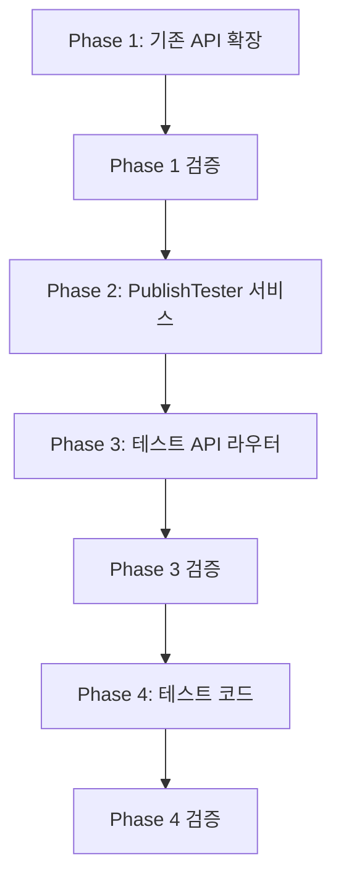

# 발행/재발행 개별 테스트 기능 작업 계획서

> **버전**: v1.0.0 | **작성일**: 2026-03-22
> **목적**: GP 통합 후 발행(publish)/재발행(republish)을 개별적으로 테스트할 수 있는 기능 구현
> **방안**: 방안 3 (개별 실행 API + 단계별 테스트 API 조합)

---

## 1. 배경

### 1.1 현재 상황

GP(Growth Profile) 통합으로 publish/republish 모듈이 제거되었습니다.
발행/재발행은 GP에서 직접 제어하며, 별도 모듈 없이 실행됩니다.

**문제**: 현재 발행/재발행을 테스트하려면 플로우 전체를 실행해야 합니다.

```
현재: POST /api/v1/flows/{id}/execute → 전체 실행 (collect → data → publish → republish → generate)
필요: 발행만, 재발행만, 또는 단계별로 개별 테스트
```

### 1.2 기존 테스트 인프라 참고

생성 파이프라인에는 이미 단계별 테스트 API가 있습니다:

| 엔드포인트 | 기능 |
|-----------|------|
| `POST /generation/test/select-title` | 제목 선택 테스트 |
| `POST /generation/test/recombine-title` | 제목 재조합 테스트 |
| `POST /generation/test/collect-references` | 참조자료 수집 테스트 |
| `POST /generation/test/generate-content` | 글 생성 테스트 |
| `POST /generation/test/generate-image` | 이미지 생성 테스트 |
| `POST /generation/test/full-pipeline` | 전체 파이프라인 (dry_run 지원) |

발행/재발행도 동일한 패턴으로 구현합니다.

---

## 2. 구현 범위

### 2.1 방안 1: 기존 API에 action_type 파라미터 추가

플로우 실행 API에서 특정 action만 실행할 수 있도록 확장합니다.

```
POST /api/v1/flows/{flow_id}/execute                     → 전체 실행 (기존)
POST /api/v1/flows/{flow_id}/execute?action_type=publish  → 발행만 실행
POST /api/v1/flows/{flow_id}/execute?action_type=republish → 재발행만 실행
```

### 2.2 방안 2: 발행 전용 테스트 API 신규 생성

단계별로 독립 테스트할 수 있는 전용 엔드포인트를 만듭니다.

```
POST /api/v1/publish/test/check-warmup         → 워밍업 상태 확인
POST /api/v1/publish/test/check-inventory      → 발행 재고 확인
POST /api/v1/publish/test/publish-single       → 단건 발행 (dry_run 지원)
POST /api/v1/publish/test/republish-single     → 단건 재발행 (dry_run 지원)
POST /api/v1/publish/test/full-pipeline        → 전체 발행 파이프라인 (dry_run 지원)
```

---

## 3. 상세 설계

### Phase 1: 기존 플로우 실행 API 확장 (방안 1)

**파일**: `app/routers/flows_execute.py`

#### 3.1.1 엔드포인트 변경

```python
# 변경 전
@router.post("/{flow_id}/execute")
async def execute_flow_once(flow_id: int, ...):
    ...

# 변경 후
@router.post("/{flow_id}/execute")
async def execute_flow_once(
    flow_id: int,
    action_type: Optional[str] = Query(
        None,
        description="특정 액션만 실행 (publish, republish, collect, data, generate)"
    ),
    ...
):
    ...
```

#### 3.1.2 실행 로직 변경

```python
# action_type이 지정되면 해당 액션만 실행
if action_type:
    # 유효한 action_type인지 검증
    valid_actions = {"collect", "data", "publish", "republish", "generate"}
    if action_type not in valid_actions:
        raise HTTPException(400, f"유효하지 않은 action_type: {action_type}")

    # 백그라운드에서 단일 액션 실행
    asyncio.create_task(
        _execute_single_action(
            flow_id=flow.id,
            action_type=action_type,
            user_id=current_user.id,
            execution_id=execution_id,
        )
    )
else:
    # 기존: 전체 실행
    asyncio.create_task(
        _execute_flow_background(...)
    )
```

#### 3.1.3 단일 액션 실행 함수 (신규)

```python
async def _execute_single_action(
    flow_id: int,
    action_type: str,
    user_id: int,
    execution_id: str,
) -> None:
    """특정 action_type만 실행하는 백그라운드 태스크"""
    async with db_manager.get_session() as db:
        # 플로우 및 블로그 로드
        flow = await _load_flow_with_relations(db, flow_id)
        blogs = [link.blog for link in flow.blog_links if link.blog]

        # GP 컨텍스트 빌드
        gp_settings = _find_gp_settings(flow)
        gp_context = _build_gp_context(flow, gp_settings, blogs)

        now = datetime.now(KST)

        if action_type == "publish":
            await _execute_publish_step(db, flow, blogs, gp_context, gp_settings, now, user_id)
        elif action_type == "republish":
            await _execute_republish_step(db, flow, blogs, gp_context, gp_settings, now, user_id)
        elif action_type == "collect":
            await _execute_collect_step(db, flow, user_id)
        elif action_type == "data":
            await _execute_data_step(db, flow, user_id)
        elif action_type == "generate":
            await _execute_generate_step(db, flow, blogs, gp_context, gp_settings, user_id)

        await db.commit()
```

#### 3.1.4 UI 변경

**파일**: `app/templates/flows/_card.html`, `app/static/js/flows/list.js`

기존 "1회 실행" 버튼을 드롭다운으로 확장:

```html
<!-- 기존: 단일 버튼 -->
<button @click="executeFlow(flow.id)">▶ 1회 실행</button>

<!-- 변경: 드롭다운 메뉴 -->
<div x-data="{ open: false }" class="relative">
    <button @click="open = !open">▶ 실행 ▾</button>
    <div x-show="open" class="dropdown-menu">
        <button @click="executeFlow(flow.id)">전체 실행</button>
        <button @click="executeFlow(flow.id, 'publish')">📤 발행만</button>
        <button @click="executeFlow(flow.id, 'republish')">🔄 재발행만</button>
        <button @click="executeFlow(flow.id, 'generate')">✏️ 생성만</button>
        <button @click="executeFlow(flow.id, 'collect')">📥 수집만</button>
    </div>
</div>
```

```javascript
// list.js 수정
async executeFlow(flowId, actionType = null) {
    let url = `/api/v1/flows/${flowId}/execute`;
    if (actionType) {
        url += `?action_type=${actionType}`;
    }
    const response = await fetch(url, { method: 'POST' });
    ...
}
```

---

### Phase 2: 발행 테스트 서비스 구현 (방안 2 - 서비스)

**파일**: `app/services/generation/publish_tester.py` (신규)

#### 3.2.1 PublishTester 클래스

```python
class PublishTester:
    """발행/재발행 단계별 테스트 서비스 (PipelineTester 패턴)"""

    def __init__(self, db: AsyncSession):
        self.db = db

    async def test_check_warmup(
        self,
        blog_id: int,
        flow_id: int,
    ) -> dict:
        """
        워밍업 상태 확인 테스트

        반환:
        {
            "step": "check_warmup",
            "blog": {"id": int, "name": str, "total_post_count": int},
            "warmup_status": {
                "is_active": bool,
                "days_elapsed": int,
                "daily_max": int,
                "today_published": int,
                "can_publish": bool,
                "effective_interval": int | None
            },
            "warmup_settings": dict,    # 적용된 설정
            "active_hours": int,        # 활성 시간대 수
            "gp_stage": str,            # 현재 GP 스테이지명
            "publish_enabled": bool,    # GP에서 발행 활성화 여부
            "execution_time_ms": int
        }
        """

    async def test_check_inventory(
        self,
        blog_id: int,
    ) -> dict:
        """
        발행 재고 확인 테스트

        반환:
        {
            "step": "check_inventory",
            "blog": {"id": int, "name": str},
            "inventory": {
                "current_count": int,           # 현재 발행 대기 글 수
                "publishable_posts": [          # 발행 가능한 글 목록 (최대 10개)
                    {"id": int, "title": str, "created_at": str}
                ],
                "oldest_post": {"id": int, "title": str} | None,  # 다음 발행 대상
            },
            "execution_time_ms": int
        }
        """

    async def test_publish_single(
        self,
        blog_id: int,
        flow_id: int,
        dry_run: bool = True,
    ) -> dict:
        """
        단건 발행 테스트

        dry_run=True: 실제 플랫폼 API 호출 없이 시뮬레이션
        dry_run=False: 실제 발행 진행

        반환:
        {
            "step": "publish_single",
            "dry_run": bool,
            "blog": {"id": int, "name": str, "platform": str},
            "checks": {
                "gp_publish_enabled": bool,     # GP 발행 활성화
                "warmup_can_publish": bool,      # 워밍업 허용
                "inventory_available": bool,     # 재고 있음
                "fes_interval_ok": bool,         # FES 간격 통과
            },
            "target_post": {                    # 발행 대상 글
                "id": int,
                "title": str,
            } | None,
            "result": {                         # dry_run=False일 때만
                "success": bool,
                "published_url": str | None,
                "platform_post_id": str | None,
                "image_uploaded": bool,
            } | None,
            "skip_reason": str | None,          # 스킵된 경우 이유
            "execution_time_ms": int
        }
        """

    async def test_republish_single(
        self,
        blog_id: int,
        flow_id: int,
        dry_run: bool = True,
    ) -> dict:
        """
        단건 재발행 테스트

        dry_run=True: 실제 플랫폼 API 호출 없이 시뮬레이션
        dry_run=False: 실제 재발행 진행

        반환:
        {
            "step": "republish_single",
            "dry_run": bool,
            "blog": {"id": int, "name": str, "platform": str},
            "checks": {
                "gp_republish_enabled": bool,   # GP 재발행 활성화
                "fes_interval_ok": bool,         # FES 간격 통과
                "platform_supported": bool,      # 플랫폼 지원 여부
            },
            "target_post": {                    # 재발행 대상 글
                "id": int,
                "title": str,
                "url": str,
            } | None,
            "result": {                         # dry_run=False일 때만
                "success": bool,
                "message": str,
            } | None,
            "skip_reason": str | None,
            "execution_time_ms": int
        }
        """

    async def test_full_publish_pipeline(
        self,
        blog_id: int,
        flow_id: int,
        dry_run: bool = True,
    ) -> dict:
        """
        전체 발행 파이프라인 테스트 (모든 단계를 순서대로 실행)

        1. 워밍업 체크
        2. 재고 확인
        3. 발행 대상 선택
        4. (dry_run=False) 이미지 업로드 → HTML 주입 → 플랫폼 발행 → 상태 업데이트

        반환:
        {
            "step": "full_publish_pipeline",
            "dry_run": bool,
            "blog": {"id": int, "name": str, "platform": str},
            "pipeline_steps": [
                {"step": "warmup_check", "status": "passed", "detail": {...}},
                {"step": "inventory_check", "status": "passed", "detail": {...}},
                {"step": "post_selection", "status": "passed", "detail": {...}},
                {"step": "image_upload", "status": "skipped|passed|failed", "detail": {...}},
                {"step": "html_injection", "status": "passed", "detail": {...}},
                {"step": "platform_publish", "status": "dry_run|passed|failed", "detail": {...}},
                {"step": "status_update", "status": "dry_run|passed|failed", "detail": {...}},
            ],
            "overall_result": "success" | "skipped" | "failed",
            "skip_reason": str | None,
            "execution_time_ms": int
        }
        """
```

#### 3.2.2 내부 헬퍼 메서드

```python
class PublishTester:
    # ... 위 메서드들 ...

    async def _load_blog(self, blog_id: int) -> Blog:
        """블로그 조회 + 검증"""

    async def _load_gp_context(self, flow_id: int, blog_id: int) -> tuple:
        """
        GP 컨텍스트 로드

        반환: (gp_settings, gp_context, stage_params)
        """

    async def _get_warmup_status(
        self, blog_id: int, gp_settings: dict
    ) -> WarmupStatus:
        """워밍업 상태 조회"""

    async def _get_publishable_posts(
        self, blog_id: int, limit: int = 10
    ) -> list:
        """발행 가능한 글 목록 조회"""

    async def _check_fes_interval(
        self, flow_id: int, action_type: str, blog_id: int
    ) -> tuple:
        """
        FES 간격 체크

        반환: (is_ok: bool, fes: FlowExecutionState, next_at: datetime | None)
        """

    def _format_blog_info(self, blog: Blog) -> dict:
        """블로그 정보 포맷"""

    def _format_warmup_status(self, status: WarmupStatus) -> dict:
        """WarmupStatus를 dict로 변환"""
```

---

### Phase 3: 발행 테스트 API 라우터 (방안 2 - 라우터)

**파일**: `app/routers/publish_test.py` (신규)

#### 3.3.1 요청 스키마

```python
# Pydantic 요청 모델

class CheckWarmupRequest(BaseModel):
    """워밍업 상태 확인 요청"""
    blog_id: int
    flow_id: int

class CheckInventoryRequest(BaseModel):
    """발행 재고 확인 요청"""
    blog_id: int

class PublishSingleRequest(BaseModel):
    """단건 발행 테스트 요청"""
    blog_id: int
    flow_id: int
    dry_run: bool = True  # 기본값: 시뮬레이션 모드

class RepublishSingleRequest(BaseModel):
    """단건 재발행 테스트 요청"""
    blog_id: int
    flow_id: int
    dry_run: bool = True

class FullPublishPipelineRequest(BaseModel):
    """전체 발행 파이프라인 테스트 요청"""
    blog_id: int
    flow_id: int
    dry_run: bool = True
```

#### 3.3.2 엔드포인트 구현

```python
router = APIRouter(
    prefix="/publish/test",
    tags=["발행 테스트"]
)

@router.post("/check-warmup")
async def test_check_warmup(
    request: CheckWarmupRequest,
    current_user: User = Depends(get_current_user),
    db: AsyncSession = Depends(get_db_session),
):
    """워밍업 상태 확인 테스트"""
    tester = PublishTester(db)
    return await tester.test_check_warmup(
        blog_id=request.blog_id,
        flow_id=request.flow_id,
    )

@router.post("/check-inventory")
async def test_check_inventory(
    request: CheckInventoryRequest,
    current_user: User = Depends(get_current_user),
    db: AsyncSession = Depends(get_db_session),
):
    """발행 재고 확인 테스트"""
    tester = PublishTester(db)
    return await tester.test_check_inventory(
        blog_id=request.blog_id,
    )

@router.post("/publish-single")
async def test_publish_single(
    request: PublishSingleRequest,
    current_user: User = Depends(get_current_user),
    db: AsyncSession = Depends(get_db_session),
):
    """단건 발행 테스트 (dry_run 지원)"""
    tester = PublishTester(db)
    return await tester.test_publish_single(
        blog_id=request.blog_id,
        flow_id=request.flow_id,
        dry_run=request.dry_run,
    )

@router.post("/republish-single")
async def test_republish_single(
    request: RepublishSingleRequest,
    current_user: User = Depends(get_current_user),
    db: AsyncSession = Depends(get_db_session),
):
    """단건 재발행 테스트 (dry_run 지원)"""
    tester = PublishTester(db)
    return await tester.test_republish_single(
        blog_id=request.blog_id,
        flow_id=request.flow_id,
        dry_run=request.dry_run,
    )

@router.post("/full-pipeline")
async def test_full_publish_pipeline(
    request: FullPublishPipelineRequest,
    current_user: User = Depends(get_current_user),
    db: AsyncSession = Depends(get_db_session),
):
    """전체 발행 파이프라인 테스트 (dry_run 지원)"""
    tester = PublishTester(db)
    return await tester.test_full_publish_pipeline(
        blog_id=request.blog_id,
        flow_id=request.flow_id,
        dry_run=request.dry_run,
    )
```

#### 3.3.3 라우터 등록

**파일**: `app/main.py`

```python
from app.routers import publish_test
app.include_router(publish_test.router, prefix="/api/v1")
```

---

### Phase 4: 테스트 코드

**파일**: `tests/integration/test_publish_tester.py` (신규)

#### 3.4.1 테스트 구조

```python
class TestCheckWarmup:
    """워밍업 상태 확인 테스트 (5개)"""
    # T01: 워밍업 비활성 블로그 → is_active=False
    # T02: 워밍업 활성 + 발행 가능 → can_publish=True
    # T03: 워밍업 활성 + 일일 한도 초과 → can_publish=False
    # T04: GP 발행 비활성 → publish_enabled=False
    # T05: GP 없는 플로우 → 에러 응답

class TestCheckInventory:
    """재고 확인 테스트 (4개)"""
    # T06: 재고 있음 → current_count > 0, publishable_posts 포함
    # T07: 재고 없음 → current_count = 0, publishable_posts 빈 리스트
    # T08: 존재하지 않는 blog_id → 에러 응답
    # T09: 재고 목록 최대 10개 제한 확인

class TestPublishSingle:
    """단건 발행 테스트 (6개)"""
    # T10: dry_run=True, 정상 → checks 모두 통과, target_post 있음, result=None
    # T11: dry_run=True, 재고 없음 → skip_reason="재고 없음"
    # T12: dry_run=True, 워밍업 한도 초과 → skip_reason="워밍업 한도 초과"
    # T13: dry_run=True, GP 발행 비활성 → skip_reason="GP 발행 비활성"
    # T14: dry_run=False, 정상 → result.success=True (Mock 사용)
    # T15: dry_run=False, 플랫폼 오류 → result.success=False

class TestRepublishSingle:
    """단건 재발행 테스트 (4개)"""
    # T16: dry_run=True, 정상 → checks 모두 통과
    # T17: dry_run=True, GP 재발행 비활성 → skip_reason
    # T18: dry_run=True, 미지원 플랫폼 → skip_reason
    # T19: dry_run=False, 정상 → result.success=True (Mock 사용)

class TestFullPublishPipeline:
    """전체 파이프라인 테스트 (4개)"""
    # T20: dry_run=True, 모든 단계 통과 → pipeline_steps 7개
    # T21: dry_run=True, 워밍업 단계 실패 → 이후 단계 스킵
    # T22: dry_run=True, 재고 단계 실패 → 이후 단계 스킵
    # T23: dry_run=False, 전체 통과 → overall_result="success" (Mock 사용)
```

총 23개 테스트

---

## 4. 실행 순서 및 의존성



| Phase | 의존성 | 예상 파일 수 |
|-------|--------|------------|
| Phase 1 | 없음 | 수정 3개 (flows_execute.py, _card.html, list.js) |
| Phase 2 | 없음 | 신규 1개 (publish_tester.py) |
| Phase 3 | Phase 2 | 신규 1개 (publish_test.py) + 수정 1개 (main.py) |
| Phase 4 | Phase 2, 3 | 신규 1개 (test_publish_tester.py) |

---

## 5. 파일 목록

### 5.1 신규 파일

| 파일 | 역할 | 예상 줄 수 |
|------|------|-----------|
| `app/services/generation/publish_tester.py` | 발행 테스트 서비스 | ~350줄 |
| `app/routers/publish_test.py` | 테스트 API 라우터 | ~120줄 |
| `tests/integration/test_publish_tester.py` | 통합 테스트 | ~300줄 |

### 5.2 수정 파일

| 파일 | 변경 내용 | 변경량 |
|------|----------|-------|
| `app/routers/flows_execute.py` | action_type 쿼리 파라미터 추가, _execute_single_action 함수 | +60줄 |
| `app/templates/flows/_card.html` | 실행 드롭다운 메뉴 | +15줄 |
| `app/static/js/flows/list.js` | executeFlow에 actionType 파라미터 | +10줄 |
| `app/main.py` | publish_test 라우터 등록 | +2줄 |

---

## 6. 데이터 흐름

### 6.1 방안 1: 개별 실행 흐름

```
[UI] 드롭다운 "📤 발행만" 클릭
  ↓
[API] POST /api/v1/flows/1/execute?action_type=publish
  ↓
[Router] execute_flow_once() → action_type="publish" 감지
  ↓
[Background] _execute_single_action(flow_id=1, action_type="publish")
  ↓
[Execute] _execute_publish_step()
  ├─ GP 컨텍스트 빌드
  ├─ 블로그별 발행 실행
  └─ AutorunLog 기록
  ↓
[결과] AutorunLog에서 확인
```

### 6.2 방안 2: 단계별 테스트 흐름

```
[UI/API 클라이언트] POST /api/v1/publish/test/check-warmup
  ↓
[Router] test_check_warmup()
  ↓
[Service] PublishTester.test_check_warmup(blog_id=5, flow_id=1)
  ├─ Blog 로드
  ├─ GP 컨텍스트 로드 → stage_params 획득
  ├─ WarmupManager.check_warmup() 호출
  └─ 결과 포맷팅
  ↓
[응답] JSON 결과 즉시 반환
  {
    "warmup_status": {"is_active": true, "can_publish": true, ...},
    "gp_stage": "rapid_growth",
    "publish_enabled": true
  }
```

### 6.3 발행 파이프라인 단계

```
test_full_publish_pipeline(blog_id=5, flow_id=1, dry_run=true)
  │
  ├─ Step 1: warmup_check
  │  └─ WarmupManager.check_warmup()
  │
  ├─ Step 2: inventory_check
  │  └─ InventoryManager.get_inventory_status()
  │
  ├─ Step 3: post_selection
  │  └─ InventoryManager.get_post_for_publish()
  │
  ├─ Step 4: image_upload (dry_run=true → skipped)
  │  └─ PublisherPipeline 내부 ImageUploader
  │
  ├─ Step 5: html_injection (dry_run=true → skipped)
  │  └─ PublisherPipeline 내부 HtmlInjector
  │
  ├─ Step 6: platform_publish (dry_run=true → simulated)
  │  └─ WordPressPublisher / BloggerPublisher
  │
  └─ Step 7: status_update (dry_run=true → skipped)
     └─ InventoryManager.mark_as_published()
```

---

## 7. API 응답 예시

### 7.1 check-warmup 응답

```json
{
    "step": "check_warmup",
    "blog": {
        "id": 5,
        "name": "제이틴 블로그",
        "total_post_count": 25
    },
    "warmup_status": {
        "is_active": true,
        "days_elapsed": 3,
        "daily_max": 2,
        "today_published": 1,
        "can_publish": true,
        "effective_interval": 480
    },
    "warmup_settings": {
        "enabled": true,
        "warmup_days": 14,
        "initial_daily_posts": 1,
        "max_daily_posts": 3,
        "ramp_rate": 0.5
    },
    "active_hours": 16,
    "gp_stage": "rapid_growth",
    "publish_enabled": true,
    "execution_time_ms": 45
}
```

### 7.2 check-inventory 응답

```json
{
    "step": "check_inventory",
    "blog": {
        "id": 5,
        "name": "제이틴 블로그"
    },
    "inventory": {
        "current_count": 3,
        "publishable_posts": [
            {"id": 101, "title": "포항 이삿짐센터 추천", "created_at": "2026-03-20T10:00:00"},
            {"id": 102, "title": "부산 맛집 가이드", "created_at": "2026-03-21T14:30:00"},
            {"id": 103, "title": "서울 카페 투어", "created_at": "2026-03-22T09:00:00"}
        ],
        "oldest_post": {"id": 101, "title": "포항 이삿짐센터 추천"}
    },
    "execution_time_ms": 32
}
```

### 7.3 publish-single (dry_run=true) 응답

```json
{
    "step": "publish_single",
    "dry_run": true,
    "blog": {
        "id": 5,
        "name": "제이틴 블로그",
        "platform": "wordpress"
    },
    "checks": {
        "gp_publish_enabled": true,
        "warmup_can_publish": true,
        "inventory_available": true,
        "fes_interval_ok": true
    },
    "target_post": {
        "id": 101,
        "title": "포항 이삿짐센터 추천"
    },
    "result": null,
    "skip_reason": null,
    "execution_time_ms": 58
}
```

### 7.4 publish-single (스킵된 경우) 응답

```json
{
    "step": "publish_single",
    "dry_run": true,
    "blog": {
        "id": 5,
        "name": "제이틴 블로그",
        "platform": "wordpress"
    },
    "checks": {
        "gp_publish_enabled": true,
        "warmup_can_publish": false,
        "inventory_available": true,
        "fes_interval_ok": true
    },
    "target_post": null,
    "result": null,
    "skip_reason": "워밍업 일일 발행 한도 초과 (오늘 2/2개 발행 완료)",
    "execution_time_ms": 41
}
```

### 7.5 full-pipeline (dry_run=true) 응답

```json
{
    "step": "full_publish_pipeline",
    "dry_run": true,
    "blog": {
        "id": 5,
        "name": "제이틴 블로그",
        "platform": "wordpress"
    },
    "pipeline_steps": [
        {
            "step": "warmup_check",
            "status": "passed",
            "detail": {"is_active": true, "can_publish": true, "daily_max": 2, "today_published": 1}
        },
        {
            "step": "inventory_check",
            "status": "passed",
            "detail": {"current_count": 3, "oldest_post_id": 101}
        },
        {
            "step": "post_selection",
            "status": "passed",
            "detail": {"post_id": 101, "title": "포항 이삿짐센터 추천"}
        },
        {
            "step": "image_upload",
            "status": "dry_run",
            "detail": {"message": "dry_run 모드: 이미지 업로드 생략"}
        },
        {
            "step": "html_injection",
            "status": "dry_run",
            "detail": {"message": "dry_run 모드: HTML 주입 생략"}
        },
        {
            "step": "platform_publish",
            "status": "dry_run",
            "detail": {"message": "dry_run 모드: 플랫폼 발행 생략", "platform": "wordpress"}
        },
        {
            "step": "status_update",
            "status": "dry_run",
            "detail": {"message": "dry_run 모드: 상태 업데이트 생략"}
        }
    ],
    "overall_result": "success",
    "skip_reason": null,
    "execution_time_ms": 125
}
```

---

## 8. 사용 시나리오

### 시나리오 1: "발행이 잘 되나 빠르게 확인"

```bash
# UI에서 플로우 카드 → "📤 발행만" 클릭
# 또는 API:
curl -X POST http://localhost:8001/api/v1/flows/1/execute?action_type=publish
```

### 시나리오 2: "발행이 안 되는데 원인을 모르겠어"

```bash
# 1단계: 워밍업 확인
curl -X POST http://localhost:8001/api/v1/publish/test/check-warmup \
  -d '{"blog_id": 5, "flow_id": 1}'
# → "can_publish: false, 워밍업 한도 초과" 발견!

# 2단계: 재고 확인 (참고)
curl -X POST http://localhost:8001/api/v1/publish/test/check-inventory \
  -d '{"blog_id": 5}'
# → "current_count: 3" (재고는 충분)
```

### 시나리오 3: "새 블로그 설정 후 발행 테스트"

```bash
# dry_run으로 시뮬레이션 먼저
curl -X POST http://localhost:8001/api/v1/publish/test/full-pipeline \
  -d '{"blog_id": 10, "flow_id": 1, "dry_run": true}'
# → 모든 단계 확인

# 확인 후 실제 발행
curl -X POST http://localhost:8001/api/v1/publish/test/publish-single \
  -d '{"blog_id": 10, "flow_id": 1, "dry_run": false}'
```

### 시나리오 4: "재발행 설정이 맞는지 확인"

```bash
curl -X POST http://localhost:8001/api/v1/publish/test/republish-single \
  -d '{"blog_id": 5, "flow_id": 1, "dry_run": true}'
# → checks.gp_republish_enabled, platform_supported 확인
```

---

## 9. 주의사항

### 9.1 보안

- 모든 엔드포인트에 `get_current_user` 의존성 필수
- 사용자 소유 블로그/플로우만 접근 가능하도록 검증
- dry_run=false 실행 시 실제 플랫폼 API 호출이 발생하므로 주의

### 9.2 파일 크기 제한

- `publish_tester.py`: 350줄 이내 (500줄 제한 준수)
- `publish_test.py`: 120줄 이내
- `test_publish_tester.py`: 300줄 이내

### 9.3 기존 코드 영향

- `flows_execute.py`: action_type 파라미터 추가는 기존 동작에 영향 없음 (None이면 전체 실행)
- `main.py`: 라우터 등록만 추가
- UI: 드롭다운 메뉴 추가, 기존 "전체 실행" 옵션 유지

---

## 10. 요약

| 구분 | 내용 |
|------|------|
| **방안 1** | 기존 API에 `?action_type=` 파라미터 추가 (빠른 개별 실행) |
| **방안 2** | `/publish/test/*` 단계별 테스트 API 5개 (상세 디버깅) |
| **신규 파일** | 3개 (publish_tester.py, publish_test.py, test_publish_tester.py) |
| **수정 파일** | 4개 (flows_execute.py, _card.html, list.js, main.py) |
| **테스트** | 23개 (5 + 4 + 6 + 4 + 4) |
| **핵심 기능** | dry_run 모드, 단계별 체크, 즉시 결과 반환 |
