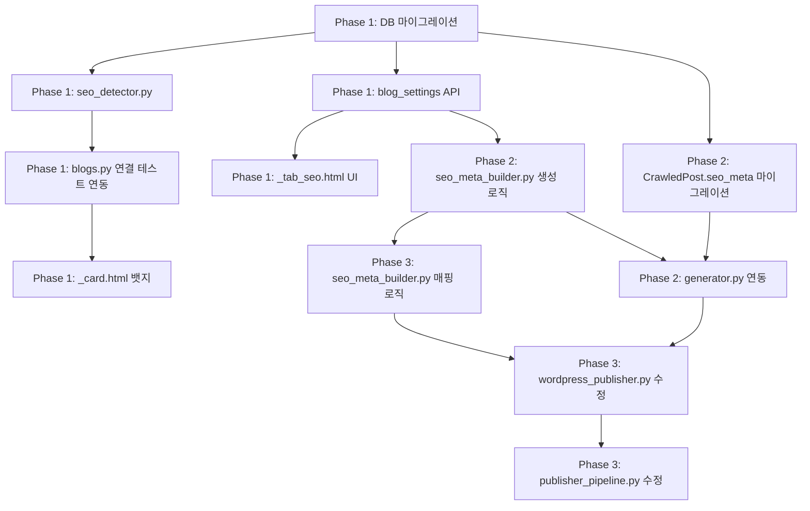

# SEO 플러그인 자동 감지 및 연동 시스템 구현 계획서

> **작성일**: 2026-03-29
> **목표**: WordPress SEO 플러그인 자동 감지 → 블로그 설정에서 SEO 자동 입력 on/off → 글 생성 시 SEO 메타 생성 → 발행 시 플러그인별 payload 매핑
> **예상 Phase**: 3단계

---

## 배경 및 목적

### 현재 상태
- 워드프레스 발행 시 SEO 필드(Focus Keyphrase, Slug, Meta Description) 미입력
- 사용자가 워드프레스 관리자에서 수동으로 입력해야 함
- 이전 버전(blogauto_new)에서는 Yoast SEO 한정으로 자동 입력 기능이 존재했음

### 목표
- 블로그 등록/연결 테스트 시 설치된 SEO 플러그인 자동 감지
- 블로그 설정에서 SEO 자동 입력 활성화/비활성화 + 생성 방식 선택
- 글 생성 파이프라인에서 SEO 메타 값 생성 및 저장
- 발행 시 감지된 플러그인에 맞는 메타 키로 자동 입력

### 지원 플러그인 (시장 점유율 순)
| 플러그인 | 활성 설치 수 | 네임스페이스 | 지원 수준 |
|---------|------------|------------|----------|
| Yoast SEO | 500만+ | `yoast/v1` | 완전 지원 |
| Rank Math | 300만+ | `rankmath/v1` | 완전 지원 |
| All in One SEO | 300만+ | `aioseo/v1` | 완전 지원 (자체 API) |
| SEOPress | 30만+ | `seopress/v1` | 완전 지원 |

---

## 아키텍처 개요

```
┌─────────────────────────────────────────────────────────────────┐
│ Phase 1: 감지 + 설정                                            │
│                                                                 │
│  블로그 등록/연결 테스트                블로그 설정 SEO 탭        │
│  ┌─────────────────────┐              ┌─────────────────────┐   │
│  │ GET /wp-json/       │              │ ☑ SEO 자동 입력     │   │
│  │ → namespaces 확인   │              │                     │   │
│  │ → "yoast/v1" 감지   │──저장──→     │ 감지됨: Yoast SEO   │   │
│  │ → Blog.seo_config   │              │                     │   │
│  └─────────────────────┘              │ Focus: ○제목 ○AI    │   │
│                                       │ Slug:  ○제목 ○AI    │   │
│                                       │ Desc:  ○서론 ○AI    │   │
│                                       └─────────────────────┘   │
└─────────────────────────────────────────────────────────────────┘

┌─────────────────────────────────────────────────────────────────┐
│ Phase 2: 글 생성 시 SEO 메타 생성                                │
│                                                                 │
│  ContentGenerator.generate()                                    │
│  ┌─────────────────────────────────────────────────────────┐   │
│  │ 제목 선택 → 참조자료 수집 → AI 글 생성                    │   │
│  │                                  ↓                       │   │
│  │                          SEO 메타 생성 ← NEW             │   │
│  │                                  ↓                       │   │
│  │            치환/HTML 변환 → 이미지 생성 → DB 저장          │   │
│  │                                          (seo_meta 포함)  │   │
│  └─────────────────────────────────────────────────────────┘   │
└─────────────────────────────────────────────────────────────────┘

┌─────────────────────────────────────────────────────────────────┐
│ Phase 3: 발행 시 플러그인별 payload 매핑                         │
│                                                                 │
│  PublisherPipeline.publish_post()                               │
│  ┌─────────────────────────────────────────────────────────┐   │
│  │ 이미지 업로드 → HTML 가공 → 플랫폼 발행 → 상태 갱신       │   │
│  │                              ↓                           │   │
│  │                    WordPress Publisher                    │   │
│  │                    ┌───────────────────┐                 │   │
│  │                    │ payload:          │                 │   │
│  │                    │   title, content  │                 │   │
│  │                    │   slug ← NEW      │                 │   │
│  │                    │   meta ← NEW      │                 │   │
│  │                    │   (플러그인별 키)  │                 │   │
│  │                    └───────────────────┘                 │   │
│  └─────────────────────────────────────────────────────────┘   │
└─────────────────────────────────────────────────────────────────┘
```

---

## 플러그인별 메타 키 매핑표

| 기능 | Yoast SEO | Rank Math | AIOSEO | SEOPress |
|------|-----------|-----------|--------|----------|
| Focus Keyphrase | `_yoast_wpseo_focuskw` | `rank_math_focus_keyword` | 자체 API | `_seopress_analysis_target_kw` |
| Meta Description | `_yoast_wpseo_metadesc` | `rank_math_description` | 자체 API | `_seopress_titles_desc` |
| SEO Title | `_yoast_wpseo_title` | `rank_math_title` | 자체 API | `_seopress_titles_title` |
| 네임스페이스 | `yoast/v1` | `rankmath/v1` | `aioseo/v1` | `seopress/v1` |
| `_` 접두사 | 있음 | **없음** | 있음 | 있음 |
| Slug | WordPress core `slug` 필드 (모든 플러그인 공통) |

### AIOSEO 특수 처리
- AIOSEO v4+는 별도 테이블(`aioseo_posts`) 사용
- 발행 후 자체 REST API로 추가 호출 필요:
  ```
  POST /wp-json/aioseo/v1/posts/{post_id}
  {"title": "...", "description": "...", "keyphrases": {"focus": {"keyphrase": "..."}}}
  ```

---

## Phase 1: SEO 플러그인 감지 + 블로그 설정 UI

### 1.1 목표
- 블로그 연결 테스트 시 SEO 플러그인 자동 감지
- Blog 모델에 `seo_config` JSON 컬럼 추가
- 블로그 설정에 SEO 탭 추가 (활성화/비활성화 + 생성 방식 선택)
- 블로그 카드에 감지된 플러그인 뱃지 표시

### 1.2 DB 변경

#### Alembic 마이그레이션 (031)
```python
# alembic/versions/031_add_seo_config.py
# Blog 모델에 seo_config 컬럼 추가
op.add_column('blogs', Column('seo_config', JSON, nullable=True))
```

#### Blog.seo_config 스키마
```json
{
  "detected_plugin": "yoast",
  "detected_at": "2026-03-29T10:00:00",
  "auto_seo_enabled": true,
  "focus_keyphrase_method": "title",
  "slug_method": "title",
  "meta_description_method": "intro",
  "meta_description_length": 140
}
```

| 키 | 타입 | 기본값 | 설명 |
|----|------|--------|------|
| `detected_plugin` | string\|null | null | 감지된 플러그인: "yoast"\|"rankmath"\|"aioseo"\|"seopress"\|null |
| `detected_at` | string\|null | null | 감지 시점 (ISO 8601) |
| `auto_seo_enabled` | bool | false | SEO 자동 입력 활성화 |
| `focus_keyphrase_method` | string | "title" | "title"(제목 사용) \| "ai"(AI 추출) |
| `slug_method` | string | "title" | "title"(제목 사용) \| "ai"(AI 최적화) |
| `meta_description_method` | string | "intro" | "intro"(서론 도입부) \| "ai"(AI 요약) |
| `meta_description_length` | int | 140 | meta description 최대 길이 (120-160) |

### 1.3 파일 변경 목록

```
신규 파일:
├── app/services/publishing/seo_detector.py        # SEO 플러그인 감지 서비스
├── app/templates/blogs/settings/_tab_seo.html     # SEO 설정 탭 UI
└── alembic/versions/031_add_seo_config.py         # DB 마이그레이션

수정 파일:
├── app/models/blog.py                             # seo_config 컬럼 추가
│   └── 라인 106 근처: seo_config = Column(JSON, ...)
│
├── app/routers/blogs.py                           # 연결 테스트에 감지 로직 추가
│   └── 라인 351-369: test_blog_connection()
│   └── 연결 테스트 성공 시 seo_detector 호출 → Blog.seo_config 저장
│
├── app/routers/blog_settings.py                   # SEO 설정 GET/POST API 추가
│   └── 기존 패턴 따라 GET/POST /blogs/{blog_id}/settings/seo 추가
│
├── app/templates/blogs/_card.html                 # SEO 플러그인 뱃지 추가
│   └── 라인 84-133 뱃지 영역에 추가
│
└── app/templates/blogs/list.html                  # SEO 탭 버튼 + 콘텐츠 추가
    └── 라인 641-643 (matching 탭 앞): SEO 탭 버튼 추가
    └── 라인 678 (matching 콘텐츠 앞): SEO 탭 콘텐츠 추가
```

### 1.4 seo_detector.py 상세 설계

```python
"""
SEO 플러그인 자동 감지 서비스

WordPress REST API 루트(/wp-json/)의 namespaces를 확인하여
설치된 SEO 플러그인을 감지합니다.
"""

# 감지 우선순위 (네임스페이스 → 플러그인명)
PLUGIN_NAMESPACES = {
    "yoast/v1": "yoast",
    "rankmath/v1": "rankmath",
    "aioseo/v1": "aioseo",
    "seopress/v1": "seopress",
}

class SEODetector:
    async def detect(self, blog_url: str) -> dict:
        """
        /wp-json/ 루트를 호출하여 SEO 플러그인을 감지합니다.
        인증 불필요 (공개 엔드포인트).

        Args:
            blog_url: 블로그 URL

        Returns:
            {"detected_plugin": "yoast", "detected_at": "..."}
        """
        # GET {blog_url}/wp-json/
        # response.namespaces에서 PLUGIN_NAMESPACES 매칭
        # 첫 번째 매칭된 플러그인 반환
```

### 1.5 SEO 설정 탭 UI 설계

```
┌─────────────────────────────────────────────────────┐
│ SEO 플러그인 설정                                    │
├─────────────────────────────────────────────────────┤
│                                                     │
│ 감지된 플러그인                                      │
│ ┌─────────────────────────────────────────────────┐ │
│ │ 🟢 Yoast SEO 감지됨  (2026-03-29)              │ │
│ │            [다시 감지] 버튼                      │ │
│ └─────────────────────────────────────────────────┘ │
│                                                     │
│ ─── 또는 플러그인 미감지 시 ───                      │
│ ┌─────────────────────────────────────────────────┐ │
│ │ ⚠️ SEO 플러그인이 감지되지 않았습니다            │ │
│ │    [다시 감지] 버튼                              │ │
│ └─────────────────────────────────────────────────┘ │
│                                                     │
│ ─── 구분선 ───                                      │
│                                                     │
│ SEO 자동 입력                                       │
│ ┌─────────────────────────────────────────────────┐ │
│ │ [토글] 발행 시 SEO 자동 입력                     │ │
│ └─────────────────────────────────────────────────┘ │
│                                                     │
│ ─── 토글 활성화 시 아래 표시 ───                     │
│                                                     │
│ Focus Keyphrase 생성 방식                           │
│   ○ 포스트 제목 사용 (기본, 무료)                    │
│   ○ AI 키워드 추출 (글 생성 시 함께)                 │
│                                                     │
│ Slug 생성 방식                                      │
│   ○ 포스트 제목 사용 (기본, 무료)                    │
│   ○ AI SEO 최적화 (글 생성 시 함께)                  │
│                                                     │
│ Meta Description 생성 방식                          │
│   ○ 서론 도입부 사용 (기본, 무료)  길이: [140]자     │
│   ○ AI 요약문 생성 (글 생성 시 함께)                 │
│                                                     │
│                              [저장] 버튼            │
└─────────────────────────────────────────────────────┘
```

### 1.6 블로그 카드 뱃지

```html
<!-- _card.html 라인 84-133 뱃지 영역 -->
<!-- 기존 크롤링/매칭 뱃지 다음에 추가 -->
<span x-show="blog.seo_config?.detected_plugin"
      class="inline-flex items-center px-2 py-0.5 rounded-full
             text-xs font-medium bg-purple-100 text-purple-800">
    SEO: <span x-text="blog.seo_config.detected_plugin"></span>
</span>
```

---

## Phase 2: 글 생성 시 SEO 메타 생성

### 2.1 목표
- 글 생성 파이프라인에 SEO 메타 생성 단계 추가
- Blog.seo_config의 생성 방식 설정에 따라 규칙 기반(A) 또는 AI(C) 생성
- 생성된 SEO 메타를 CrawledPost.seo_meta에 저장

### 2.2 DB 변경

#### CrawledPost 모델 확장
```python
# app/models/crawled_post.py
# 라인 110 근처에 추가
seo_meta = Column(
    JSON,
    nullable=True,
    comment="SEO 메타데이터: focus_keyphrase, slug, meta_description"
)
```

#### seo_meta JSON 구조
```json
{
  "focus_keyphrase": "인천공항 마티나라운지 이용 꿀팁",
  "slug": "인천공항-마티나라운지-이용-꿀팁",
  "meta_description": "인천공항 마티나라운지를 이용하는 방법과 꿀팁을 정리했습니다. 라운지 위치, 이용 자격, 음식 메뉴까지 상세하게 안내합니다.",
  "generated_by": "rule"
}
```

| 키 | 타입 | 설명 |
|----|------|------|
| `focus_keyphrase` | string | 포커스 키워드 |
| `slug` | string | URL slug (한글 가능) |
| `meta_description` | string | 메타 설명 (120-160자) |
| `generated_by` | string | 생성 방식: "rule"\|"ai" |

### 2.3 파일 변경 목록

```
신규 파일:
├── app/services/publishing/seo_meta_builder.py    # SEO 메타 생성 서비스
└── alembic/versions/032_add_seo_meta.py           # CrawledPost.seo_meta 마이그레이션

수정 파일:
├── app/models/crawled_post.py                     # seo_meta 컬럼 추가
│   └── 라인 110 근처: seo_meta = Column(JSON, ...)
│
└── app/services/generation/generator.py           # SEO 메타 생성 단계 추가
    └── 라인 256 (치환 처리) 이전에 SEO 메타 생성 호출
    └── 라인 291-341 (DB 저장) 시 seo_meta 포함
```

### 2.4 seo_meta_builder.py 상세 설계

```python
"""
SEO 메타 데이터 생성 서비스

Blog.seo_config의 설정에 따라 규칙 기반 또는 AI로
Focus Keyphrase, Slug, Meta Description을 생성합니다.
"""

class SEOMetaBuilder:
    def __init__(self, db: AsyncSession):
        self.db = db

    async def build(
        self,
        blog: Blog,
        title: str,
        content_html: str,
    ) -> dict | None:
        """
        Blog.seo_config 설정에 따라 SEO 메타 생성

        Args:
            blog: 대상 블로그
            title: 재조합된 포스트 제목
            content_html: 생성된 HTML 본문

        Returns:
            {"focus_keyphrase": ..., "slug": ..., "meta_description": ...}
            또는 None (비활성화 시)
        """
        seo_config = blog.seo_config or {}
        if not seo_config.get("auto_seo_enabled"):
            return None
        if not seo_config.get("detected_plugin"):
            return None

        return {
            "focus_keyphrase": self._build_keyphrase(title, seo_config),
            "slug": self._build_slug(title, seo_config),
            "meta_description": self._build_description(
                content_html, seo_config
            ),
            "generated_by": self._get_method_type(seo_config),
        }

    def _build_keyphrase(self, title: str, config: dict) -> str:
        """Focus Keyphrase 생성"""
        method = config.get("focus_keyphrase_method", "title")
        if method == "title":
            return title
        # method == "ai": AI 추출은 generator.py에서 처리
        return title

    def _build_slug(self, title: str, config: dict) -> str:
        """Slug 생성"""
        method = config.get("slug_method", "title")
        if method == "title":
            return title  # WordPress가 자동으로 URL 인코딩 처리
        return title

    def _build_description(
        self, content_html: str, config: dict
    ) -> str:
        """Meta Description 생성"""
        method = config.get("meta_description_method", "intro")
        max_len = config.get("meta_description_length", 140)

        if method == "intro":
            return self._extract_intro(content_html, max_len)
        return ""

    @staticmethod
    def _extract_intro(content_html: str, max_length: int) -> str:
        """
        HTML에서 서론 도입부 텍스트 추출
        첫 번째 h2 태그 이전의 <p> 텍스트를 수집합니다.
        """
        # BeautifulSoup로 첫 h2 이전 <p> 태그 텍스트 추출
        # max_length 이내로 자르되 온전한 문장 단위 유지
```

### 2.5 generator.py 수정 위치

```python
# app/services/generation/generator.py
# _execute_pipeline() 내부, 현재 흐름:
#
# (라인 233-245) AI 글 생성
# (라인 247-254) 내부링크 삽입
# (라인 256-262) 치환 처리
# (라인 264-289) 이미지 생성
# (라인 291-341) DB 저장

# 변경: AI 글 생성 후 ~ 치환 처리 전에 SEO 메타 생성 추가

# (라인 233-245) AI 글 생성
# ─── NEW: SEO 메타 생성 ───
# seo_meta_builder = SEOMetaBuilder(self.db)
# seo_meta = await seo_meta_builder.build(blog, recombined_title, raw_html)
# ─── AI 방식 선택 시: AI 프롬프트에 SEO 값 요청 포함 ───
# (라인 247-254) 내부링크 삽입
# (라인 256-262) 치환 처리
# (라인 264-289) 이미지 생성
# (라인 291-341) DB 저장 ← seo_meta 포함

# DB 저장 시:
# crawled_post.seo_meta = seo_meta
```

### 2.6 AI 방식(C) 구현 시 프롬프트 확장

```
# 기존 글 생성 프롬프트에 추가 지시:
"""
추가로 다음 SEO 메타데이터를 JSON 형식으로 글 끝에 포함해주세요:
---SEO_META---
{
  "focus_keyphrase": "이 글의 핵심 키워드 (검색에 최적화된 형태)",
  "slug": "url에-적합한-형태의-slug",
  "meta_description": "검색 결과에 표시될 150자 이내 요약문"
}
---SEO_META_END---
"""

# generator.py에서 응답 파싱:
# 1. ---SEO_META--- ~ ---SEO_META_END--- 사이 JSON 추출
# 2. 본문에서 SEO_META 블록 제거
# 3. seo_meta로 분리 저장
```

---

## Phase 3: 발행 시 플러그인별 payload 매핑

### 3.1 목표
- 저장된 CrawledPost.seo_meta를 읽어 WordPress payload에 추가
- 감지된 플러그인에 맞는 메타 키로 변환 (Strategy Pattern)
- AIOSEO는 발행 후 자체 API 추가 호출

### 3.2 파일 변경 목록

```
수정 파일:
├── app/services/publishing/seo_meta_builder.py    # 플러그인별 메타 키 변환 추가
│   └── build_plugin_meta(plugin, seo_meta) 메서드 추가
│
├── app/services/publishing/wordpress_publisher.py # payload에 slug + meta 추가
│   └── 라인 84-95: payload에 slug, meta 필드 추가
│   └── AIOSEO 후처리 메서드 추가
│
└── app/services/publishing/publisher_pipeline.py  # SEO 메타 전달 로직
    └── publish_post()에서 CrawledPost.seo_meta 읽어서 전달
    └── _publish_to_platform()에 seo_meta 파라미터 추가
```

### 3.3 seo_meta_builder.py 플러그인별 변환

```python
# Strategy Pattern으로 플러그인별 메타 키 매핑

PLUGIN_META_MAP = {
    "yoast": {
        "focus_keyphrase": "_yoast_wpseo_focuskw",
        "meta_description": "_yoast_wpseo_metadesc",
    },
    "rankmath": {
        "focus_keyphrase": "rank_math_focus_keyword",
        "meta_description": "rank_math_description",
    },
    "seopress": {
        "focus_keyphrase": "_seopress_analysis_target_kw",
        "meta_description": "_seopress_titles_desc",
    },
    # AIOSEO는 별도 API 사용 (자체 테이블)
}

def build_plugin_meta(
    plugin: str,
    seo_meta: dict,
) -> dict:
    """
    SEO 메타를 플러그인별 WordPress meta 키로 변환

    Args:
        plugin: 감지된 플러그인명 ("yoast", "rankmath" 등)
        seo_meta: {"focus_keyphrase": ..., "meta_description": ...}

    Returns:
        {"_yoast_wpseo_focuskw": "...", ...} (WordPress meta 필드)
    """
    mapping = PLUGIN_META_MAP.get(plugin, {})
    result = {}
    for field, meta_key in mapping.items():
        if field in seo_meta and seo_meta[field]:
            result[meta_key] = seo_meta[field]
    return result
```

### 3.4 wordpress_publisher.py 수정

```python
# 현재 (라인 84-95):
payload = {
    "title": post.title,
    "content": final_html,
    "status": "publish",
    "format": "standard",
}

# 변경 후:
payload = {
    "title": post.title,
    "content": final_html,
    "status": "publish",
    "format": "standard",
}

# SEO 메타 추가
if seo_meta:
    # slug 설정 (WordPress core, 플러그인 무관)
    if seo_meta.get("slug"):
        payload["slug"] = seo_meta["slug"]

    # 플러그인별 메타 키 변환
    plugin_meta = build_plugin_meta(plugin_name, seo_meta)
    if plugin_meta:
        payload["meta"] = plugin_meta

# 카테고리 매핑
categories = self._get_categories(blog)
if categories:
    payload["categories"] = categories
```

### 3.5 AIOSEO 특수 처리

```python
# AIOSEO는 별도 테이블 구조 → 발행 후 자체 API 호출
async def _update_aioseo_meta(
    self,
    client: httpx.AsyncClient,
    blog_url: str,
    auth_str: str,
    platform_post_id: str,
    seo_meta: dict,
) -> None:
    """
    AIOSEO 자체 REST API로 SEO 메타데이터 업데이트

    발행 성공 후 호출됩니다.
    실패해도 발행 결과에 영향 없습니다.
    """
    aioseo_url = (
        f"{blog_url.rstrip('/')}/wp-json/aioseo/v1/posts/{platform_post_id}"
    )
    await client.post(
        aioseo_url,
        headers={"Authorization": f"Basic {auth_str}", ...},
        json={
            "title": seo_meta.get("focus_keyphrase", ""),
            "description": seo_meta.get("meta_description", ""),
            "keyphrases": {
                "focus": {
                    "keyphrase": seo_meta.get("focus_keyphrase", ""),
                }
            },
        },
    )
```

### 3.6 publisher_pipeline.py 수정

```python
# publish_post() 메서드 내
# Step 3 (플랫폼별 발행) 전에 SEO 메타 준비

# SEO 메타 로드
seo_meta = None
seo_plugin = None
if blog.platform == BlogPlatform.WORDPRESS:
    seo_config = blog.seo_config or {}
    if seo_config.get("auto_seo_enabled") and seo_config.get("detected_plugin"):
        seo_meta = crawled_post.seo_meta
        seo_plugin = seo_config["detected_plugin"]

# _publish_to_platform()에 전달
publish_result = await self._publish_to_platform(
    blog, crawled_post, final_html,
    image_result, credential,
    seo_meta=seo_meta,
    seo_plugin=seo_plugin,
)
```

---

## 생성 파이프라인 전후 비교

### 변경 전
```
제목 선택 → 참조자료 수집 → AI 글 생성 → 내부링크 → 치환/HTML → 이미지 생성 → DB 저장
```

### 변경 후
```
제목 선택 → 참조자료 수집 → AI 글 생성 → SEO 메타 생성 → 내부링크 → 치환/HTML → 이미지 생성 → DB 저장
                                          ↑ Phase 2                                    (seo_meta 포함)
```

### 발행 파이프라인 (변경 최소)
```
이미지 업로드 → HTML 가공 → 인라인 이미지 → 플랫폼 발행 → 상태 갱신
                                            ↑ Phase 3
                                    payload에 slug + meta 추가
                                    (저장된 seo_meta 읽기만)
```

---

## 전체 파일 변경 요약

### Phase 1 (감지 + 설정 UI)
| 유형 | 파일 | 예상 줄 수 |
|------|------|-----------|
| NEW | `app/services/publishing/seo_detector.py` | ~80줄 |
| NEW | `app/templates/blogs/settings/_tab_seo.html` | ~200줄 |
| NEW | `alembic/versions/031_add_seo_config.py` | ~20줄 |
| EDIT | `app/models/blog.py` (seo_config 컬럼) | +5줄 |
| EDIT | `app/routers/blogs.py` (연결 테스트에 감지 추가) | +15줄 |
| EDIT | `app/routers/blog_settings.py` (SEO GET/POST API) | +60줄 |
| EDIT | `app/templates/blogs/_card.html` (뱃지) | +8줄 |
| EDIT | `app/templates/blogs/list.html` (탭) | +10줄 |

### Phase 2 (생성 시 SEO 메타)
| 유형 | 파일 | 예상 줄 수 |
|------|------|-----------|
| NEW | `app/services/publishing/seo_meta_builder.py` | ~150줄 |
| NEW | `alembic/versions/032_add_seo_meta.py` | ~20줄 |
| EDIT | `app/models/crawled_post.py` (seo_meta 컬럼) | +5줄 |
| EDIT | `app/services/generation/generator.py` (SEO 생성 호출) | +20줄 |

### Phase 3 (발행 시 매핑)
| 유형 | 파일 | 예상 줄 수 |
|------|------|-----------|
| EDIT | `app/services/publishing/seo_meta_builder.py` (매핑 추가) | +50줄 |
| EDIT | `app/services/publishing/wordpress_publisher.py` (payload) | +30줄 |
| EDIT | `app/services/publishing/publisher_pipeline.py` (전달) | +15줄 |

---

## 의존성 및 구현 순서



---

## 테스트 계획

### Phase 1 테스트
- [ ] SEO 플러그인 감지: Yoast 설치 사이트에서 `yoast/v1` 감지 확인
- [ ] 감지 결과 저장: Blog.seo_config에 정상 저장 확인
- [ ] 설정 UI: 활성화/비활성화 토글 동작 확인
- [ ] 생성 방식 선택: 라디오 버튼 저장/로드 확인
- [ ] 블로그 카드: 뱃지 정상 표시 확인

### Phase 2 테스트
- [ ] 규칙 기반 생성: 제목 → keyphrase, 서론 → description 확인
- [ ] AI 생성: 프롬프트에 SEO 요청 포함 → 응답 파싱 확인
- [ ] DB 저장: CrawledPost.seo_meta에 JSON 정상 저장 확인
- [ ] 비활성화 시: seo_meta = None 확인

### Phase 3 테스트
- [ ] Yoast payload: `_yoast_wpseo_focuskw`, `_yoast_wpseo_metadesc` 포함 확인
- [ ] Rank Math payload: `rank_math_focus_keyword`, `rank_math_description` 포함 확인
- [ ] slug 설정: WordPress에서 커스텀 slug 반영 확인
- [ ] AIOSEO 후처리: 발행 후 자체 API 호출 확인
- [ ] SEO 비활성화 시: payload에 meta 미포함 확인
