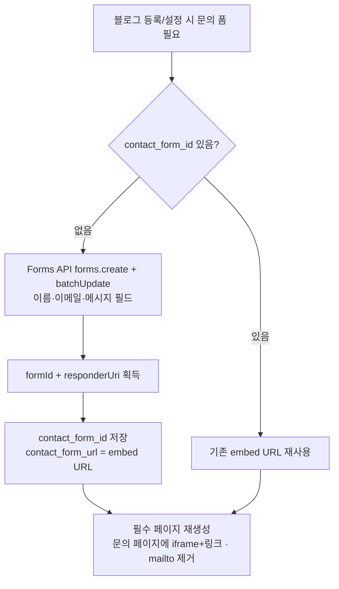

# F10 — 문의 폼 자동 생성 (Google Forms 통합)

> 근거: `docs/plans/adsense_f10_contact_form_plan.md`. 사용자 확정(2026-08-18):
> **블로거·워드프레스 통합 — 양 플랫폼 모두 Google Forms 임베드.** 도메인 무구매·
> 자체호스팅 없음·이메일 미노출. 범용 `docs.google.com` iframe이라 공개 지문 없음.

## 원칙
- **단일 방식**: 블로그별 Google Form을 Forms API로 자동 생성 → 문의 페이지에
  embed URL을 `contact_form_url`로 자동 채움(기존 iframe 골격 재사용).
- **플랫폼 무관**: 블로거=Pages API, 워드프레스=REST `wp/v2/pages` 본문에 iframe.
  워드프레스 iframe 제거(sanitization) 시 **링크 폴백**(`_contact_section` 내장).
- **이메일 미노출**: 필수 페이지의 mailto 제거, 폼 링크로 대체.
- **멱등**: 블로그별 `contact_form_id` 저장 → 재생성 방지.

## 프로비저닝 흐름



## 인증(스코프) 매핑

```mermaid
flowchart TD
    P[Google Forms API<br/>scope: forms.body] --> Q{플랫폼}
    Q -->|블로거| R[그 블로그의 구글 계정 자격<br/>기존 google_credential에 Forms 스코프 추가]
    Q -->|워드프레스| S[운영자 지정 구글 계정 자격<br/>WP는 자체 구글 계정 없음]
    R --> T[폼 소유=블로그 소유 → 새 연결 없음]
    S --> U[운영자 계정이 폼 소유<br/>비공개 계정 연결(로테이션으로 희석 가능)]
```

## 수신 (단계적)
- **Phase 1**: 네이티브 수신 — 응답은 Google Forms(응답 탭/시트)에서 확인.
- **Phase 2(후속)**: `forms.responses.list` polling → blogauto 통합 수신함 테이블.

## 스팸 방지
- 자체 구축 없음 — Google Forms 기본 방어 사용.

## 영향 파일(예정)
| 구분 | 파일 |
|------|------|
| 신규 | `services/publishing/google_forms_service.py`(폼 생성/URL), 프로비저닝 훅 |
| 수정 | `services/publishing/required_pages_templates.py`(mailto 제거·링크 폴백 확인), 블로그 등록/설정 API, `google_credential` 스코프 |
| 데이터 | `contact_form_id`(author_profile JSONB 또는 신규 필드) |

## 사전 준비물(운영자/사용자 — 코드 착수 전 필요)
1. **GCP 프로젝트에 Google Forms API 활성화**(OAuth 클라이언트와 동일 프로젝트).
2. **OAuth 동의 화면에 Forms 스코프 추가 + 재동의**(블로거 각 구글 계정 / WP용 운영자 계정).
3. **WP 블로그 폼용 구글 계정 지정**(+ 로테이션 정책 여부).

## 리스크/한계
- Forms API 쿼터(대량 생성 throttling 필요).
- 기존 블로거 자격 재동의 마찰.
- 일부 WP(멀티사이트·보안 플러그인)에서 iframe 제거 → 링크 폴백.
- WP 폼의 비공개 계정 연결(공개 미노출, 수용).
