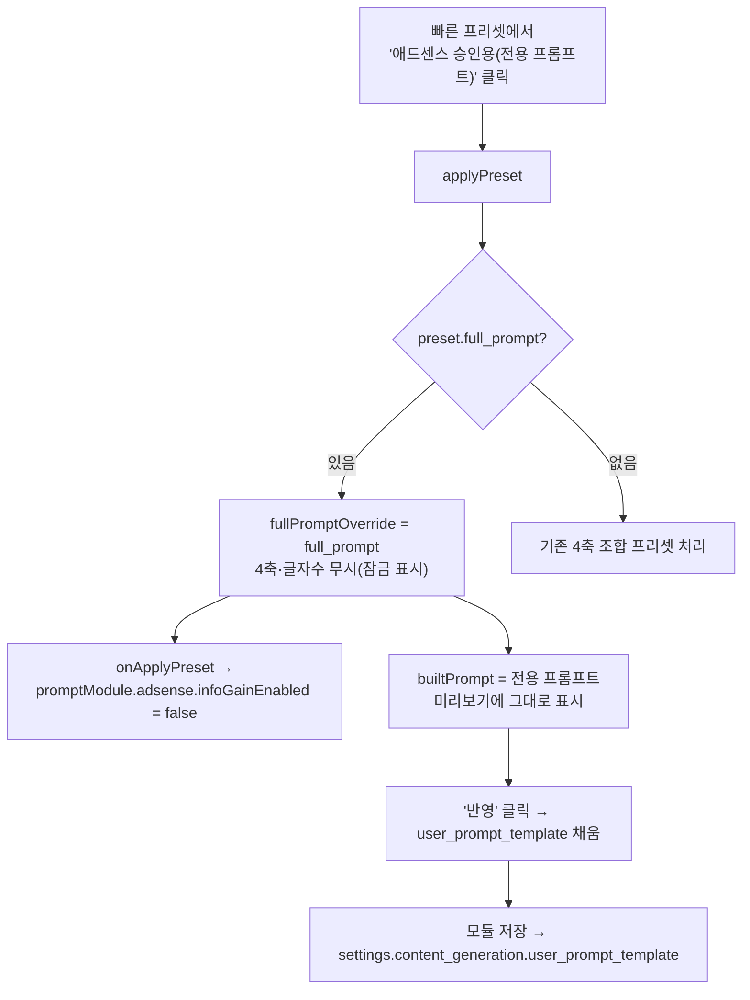

# F11 — 애드센스 승인용 전용 프롬프트 프리셋

> 근거: `docs/plans/adsense_approval_features_plan.md` F11 + 제안서 §2.4.
> 사용자 확정(2026-08-17): 기존 4축 조합이 아니라 **애드센스 승인에 실제 유리한
> 독립 프롬프트를 프리셋으로 제공**. 웹 취합(정보이득·검색의도·E-E-A-T·출처·
> people-first·자연스러움)을 반영한 전용 프롬프트. 승인 테스트 후 적절성 판단.

> **경위**: 1차 구현은 기존 4축(P-Analyst 등)을 골라 잠그는 방식이었으나, 사용자가
> "그건 기존 항목 고정일 뿐 애드센스 전용 프롬프트가 아니다"라고 정정 → 전용
> 프롬프트 텍스트를 그대로 채우는 방식(full_prompt)으로 교체. [[feedback_adsense_prompt_intent]]

## 원칙
- **4축 조합 아님.** `presets.py`의 `ADSENSE_APPROVAL_PROMPT`(완성 프롬프트)를
  `user_prompt_template`에 그대로 채운다.
- **정보이득 지시 내장 → F7 토글 OFF.** 프롬프트가 정보이득 지시를 자체 포함하므로
  적용 시 모듈 `info_gain_enabled`를 끈다(이중 지시 방지).
- **유연 구조.** 경직된 6섹션 STRUCTURE 대신 검색의도에 맞춘 자연어 소제목,
  표·목록은 판단 근거가 드러날 때만(정형화·padding 회피).
- **정직 가드레일.** 없는 통계·가짜 경험담 생성 금지(기만 콘텐츠 방지).
- **적용 중 4축·글자수·커스텀저장 비활성.** 전용 프롬프트가 이들을 무시하므로
  UI에서 잠금 표시. 다른 프리셋 선택 또는 "전체 초기화"로 해제.

## 프리셋 정의 (presets.py)
```
code: "adsense-approval"
label: "🔒 애드센스 승인용 (전용 프롬프트)"
full_prompt: ADSENSE_APPROVAL_PROMPT   # {title}/{category}/{keywords}/{reference_materials} 치환
```

## 흐름 (모듈 임베드 패널)



- 해제: 다른 프리셋 클릭 또는 "전체 초기화" → `fullPromptOverride=''` → 4축 조합 복귀.
- 표준 `/prompt-builder` 페이지(복사 전용)에서도 프리셋은 노출되며, 미리보기에
  전용 프롬프트가 그대로 표시·복사됨(모듈 토글 연동은 임베드 패널에서만).

## 영향 파일
| 구분 | 파일 |
|------|------|
| 백엔드 | `services/prompt_builder/presets.py`(ADSENSE_APPROVAL_PROMPT 상수 + 전용 프리셋) |
| 프론트 | `static/js/prompt_builder/app.js`(fullPromptOverride·applyPreset 분기·builtPrompt·isComplete·clearAll·isActivePreset), `static/js/prompt_builder/embedded_panel.js`(콜백·전용 프롬프트 안내·비활성 UI) |
| 캐시 | `templates/modules/list.html`, `templates/prompt_builder/index.html` ?v= bump |
| 테스트 | `tests/unit/test_adsense_f11.py`(프리셋·플레이스홀더·신호) |

## 마이그레이션
- **없음.** 프리셋은 `presets.py` 상수 → `load_blocks_for_template`가 그대로 전달.

## 향후(테스트 후 판단)
- 프롬프트 문구 적절성은 실제 애드센스 승인 테스트로 검증 후 조정.
- 필요 시 F7 `info_gain_enabled` 토글/Q-AdsenseGain와의 관계 재정리.
