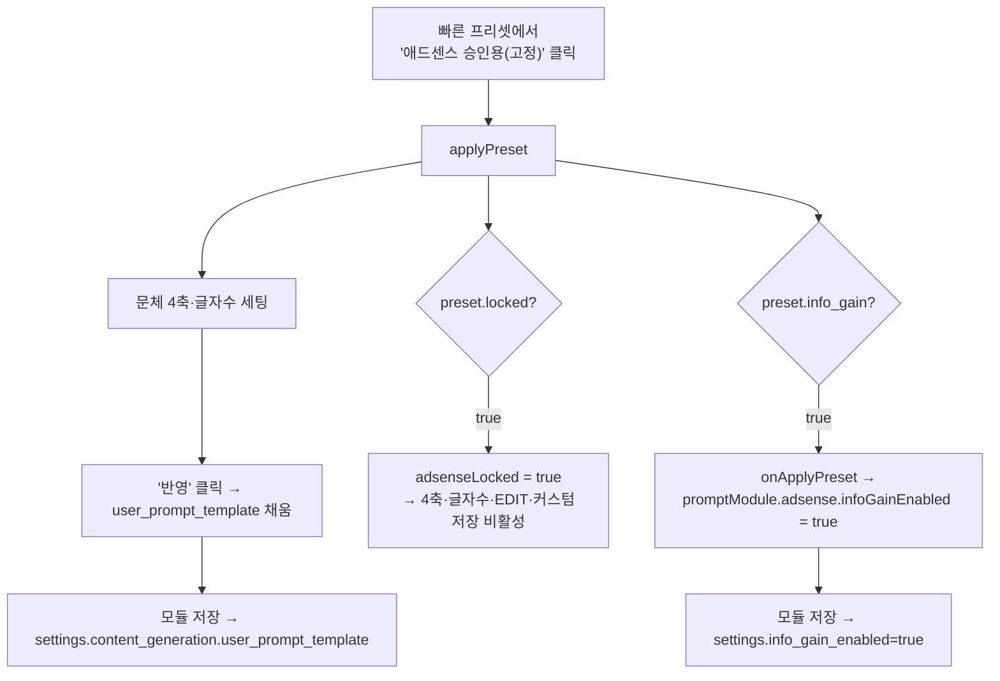

# F11 — 애드센스 승인용 프롬프트 프리셋 (A안·고정)

> 근거: `docs/plans/adsense_approval_features_plan.md` F11 + 제안서 §2.4.
> 사용자 확정(2026-08-17): **A안 + 고정(수정 불가) 프리셋**. 프롬프트 빌더에
> 애드센스용 축/블록을 새로 만들지 않고, **프리셋 1개만** 추가한다. 승인 테스트용
> 고정 구성 — 결과가 좋으면 유지, 아니면 추후 수정.

## 원칙
- **새 축(QUALITY 등) 노출 안 함.** 정보이득 지시문(Q-AdsenseGain)은 기존 F7
  경로(`content_generator_helper`가 `info_gain_enabled` 토글 시 생성 시점 주입)를
  그대로 재사용 — 템플릿에 박지 않음(이중 주입 없음).
- **프리셋 = 문체 4축 조합만.** `presets.py`에 고정 프리셋 1개 추가.
- **적용 시 정보이득 토글 자동 ON.** 임베드 패널에서 이 프리셋을 고르면
  프롬프트 모듈의 `adsense.infoGainEnabled`를 자동으로 켠다.
- **수정 잠금.** 이 프리셋이 적용된 동안 빌더의 문체 4축·글자수·EDIT·커스텀
  저장을 비활성화(승인 테스트용 고정). 다른 프리셋 선택 또는 "전체 초기화"로 해제.

## 프리셋 정의 (presets.py)
```
code: "adsense-approval"
label: "🔒 애드센스 승인용 (고정)"
persona: P-Analyst · reader: R-Intermediate · pattern: P1 · tone: T-Numbers
  (근거·수치·비교형 문체 — 제안서 §2.4 "근거 제시형", 기존 프리셋과 조합 미중복)
info_gain: true   # 적용 시 F7 토글 자동 ON
locked: true      # 문체·옵션 편집 잠금
```

## 흐름 (모듈 임베드 패널)



- 해제: 다른 프리셋 클릭(locked 없는 프리셋) 또는 "전체 초기화" → `adsenseLocked=false`.
- 표준 `/prompt-builder` 페이지(복사 전용)에서도 프리셋은 노출되나, 모듈
  토글이 없어 `info_gain` 연동은 임베드 패널에서만 동작(페이지는 문체만 세팅).

## 영향 파일
| 구분 | 파일 |
|------|------|
| 백엔드 | `services/prompt_builder/presets.py`(프리셋 추가 + 타입힌트) |
| 프론트 | `static/js/prompt_builder/app.js`(onApplyPreset opt·adsenseLocked·applyPreset·clearAll), `static/js/prompt_builder/embedded_panel.js`(콜백 배선·잠금 UI) |
| 캐시 | `templates/modules/list.html` ?v= bump |
| 테스트 | `tests/unit/test_adsense_f11.py`(프리셋 존재·플래그) |

## 마이그레이션
- **없음.** 프리셋은 `presets.py` 상수 → `load_blocks_for_template`가 그대로 전달.
