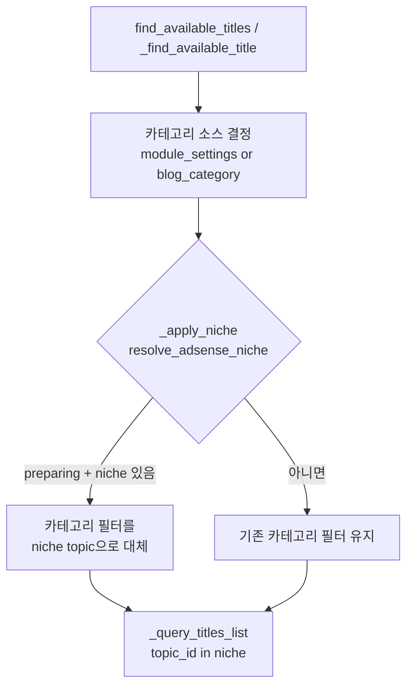

# F4 — 니치(주제) 강제 (옵트인 차단)

> 근거: `docs/plans/adsense_approval_features_plan.md` F4. 사용자 확정(2026-08-12):
> **카테고리 기반 판정 + 옵트인 차단**.

## 원칙
- **카테고리 기반**: 블로그는 이미 배정 카테고리(topic/subtopic)로 생성 범위가
  필터링됨(`_get_blog_category_filter_ids`). F4는 그 위에 "허용 topic 목록
  (`Blog.niche_topic_ids`)"을 얹어 준비 블로그를 단일 니치로 제한한다.
- **옵트인 차단**: `Blog.adsense_status='preparing'` + `niche_topic_ids` 있을 때만
  강제. 그 외(none/applied/approved, 니치 미설정)는 무변화(기존 동작).
- **선택 단계에서 차단**: 인벤토리 제목 선택 시 니치 밖 제목을 애초에 배제 →
  생성 후 스킵으로 인한 재시도 루프도 방지.

## 흐름 (인벤토리 제목 선택)

## 판정 (adsense_niche.resolve_adsense_niche, 순수)
- `preparing` + `niche_topic_ids` 비어있지 않음 → 허용 topic_id 목록 반환(강제).
- 그 외 → None(강제 안 함). id는 int 정규화, None 제거.

## 변경 파일
- `models/blog.py`: `niche_topic_ids`(JSON, nullable).
- `alembic/versions/048_add_niche_topic_ids.py`: 컬럼 추가(데이터 보존).
- `generation/adsense_niche.py`(신규): `resolve_adsense_niche` 순수 판정.
- `generation/inventory_trigger.py`: `_niche_topic_ids`(blog 로드) + `_apply_niche`
  (두 선택 경로 공통) 배선.
- `routers/blog_settings_adsense.py`: `GET/POST .../settings/niche`.
- 테스트: `tests/unit/test_adsense_f4.py`(판정 8케이스).

## 미해결/후속
- **UI 미구현**: 애드센스 설정 탭에 니치 topic 선택기(현재는 API로만 설정 가능).
- niche를 subtopic 단위로 세분화(현재 topic 단위 대체). 필요 시 확장.
- F9 준비도 감사의 "니치 집중도" 항목을 niche_topic_ids 기준으로 정량화(현재 미구현).
- 마이그레이션 048은 로컬 psycopg2 부재로 이 환경에서 직접 실행 불가 — alembic이
  로컬 docker/서버 배포 시 적용(047과 동일 패턴, 데이터 보존).
