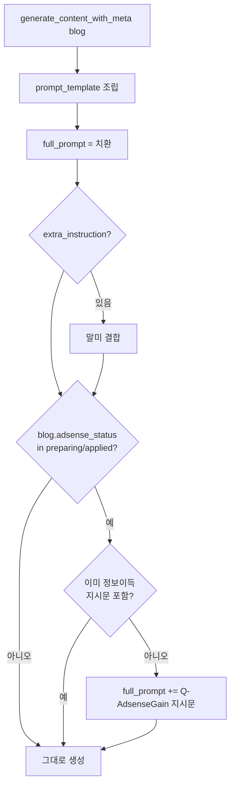

# F7 — Information Gain 프롬프트 + 애드센스 승인용 프리셋

> 근거: `docs/plans/adsense_approval_features_plan.md` F7 + `adsense_prompt_and_growth_profile_proposal.md` §2·§3·§9.
> 목표: 애드센스 준비 블로그의 생성 프롬프트에 "정보이득 지시문"을 자동 주입하고,
> 1일1포 + 품질모드를 묶은 "애드센스 승인용" 성장 프리셋을 신설한다.

## 원칙
- **옵트인**: `Blog.adsense_status`(F5에서 추가됨)가 `preparing`/`applied`일 때만 동작.
  `none`(기본)·`approved`·`rejected` 블로그는 영향 없음 → 기존 운영 무변화.
- **SoT**: 지시문 문구는 `prompt_builder/blocks.py`의 `Q-AdsenseGain` 블록 1곳.
- **하위호환**: `build_prompt`는 quality 인자 없으면 기존과 동일 출력.

## 자동 주입 흐름 (생성)

## 정보이득 지시문 (Q-AdsenseGain, blocks.py SoT)
- 공개정보 단순 재배열 금지 → 섹션마다 (a)비교판단기준 (b)주의점·예외 (c)검증가능 수치 중 1+.
- 표·목록은 "판단 근거"가 드러나게.
- 가능하면 출처 명시, 없는 수치 지어내기 금지(확인 불가 시 정성표현).
- 공허한 CTA 지양, 실행 가능한 다음 행동 하나로 마무리.

## 애드센스 승인용 성장 프리셋 (growth_profile_defaults.py "adsense")
- 단일 준비 스테이지: generate `daily_count=1`, publish `daily_count=1`(=1일1포),
  republish `enabled=false`(준비 중 재발행 억제).
- 승인 후엔 운영자가 다른 프리셋으로 전환(계획서 §3.2 6단계).
- 케이던스 상한(F5 `publish_daily_cap`)과 방향 일치 — 프리셋은 "발행 스케줄",
  F5는 "오토런 상한 게이트"로 이중 안전.

## 변경 파일
- `prompt_builder/blocks.py`: `QUALITY`(Q-None/Q-AdsenseGain) + `adsense_gain_directive()` + `build_prompt(quality_code=None)` + `blocks_for_template` 노출.
- `generation/content_generator_helper.py`: adsense_status 옵트인 자동 주입(중복 가드).
- `generation/growth_profile_defaults.py`: `"adsense"` 프리셋 추가.
- 테스트: `tests/unit/` (블록 존재·build_prompt 삽입·주입 로직·프리셋 daily_count=1).

## 미해결/후속
- `/prompt-builder` UI에 5번째 QUALITY 블록 수동 선택 노출(선택적, 자동주입으로 이미 동작).
- growth 프리셋 목록 UI에 "adsense" 노출(라우터 프리셋 키 목록 확인 필요).
- F7 출처 자동 삽입(외부 인용)은 범위 밖(프롬프트 지시로 유도만).
