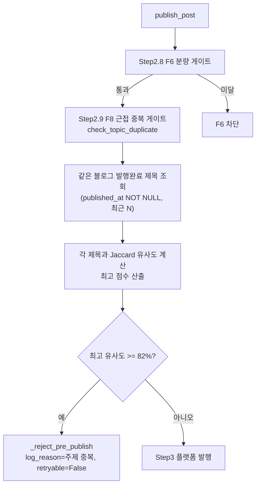

# F8 — 발행 전 근접 중복(주제 중복) 게이트

> 근거: `docs/plans/adsense_approval_features_plan.md` F8. 사용자 확정(2026-08-17):
> **제목 Jaccard 유사도 + 차단(보수 임계값)**. 계획서의 V3 통합 식별자 게이트
> 재사용은 V3가 HOLD·튜닝 미완이라 발행 경로 오차단·비용 리스크가 커서 채택하지
> 않고, 경량 Jaccard 방식으로 이탈([[project_similarity_unified_gate]] HOLD).

## 원칙
- **발행 직전 단일 choke point에서 검사.** 모든 발행 경로(스케줄러·수동·Celery)가
  통과하는 `PublisherPipeline.publish_post()`의 F6(분량) 게이트 직후에 삽입.
- **같은 블로그 발행 이력과 비교.** `CrawledPost.published_at IS NOT NULL`인
  같은 블로그 글 제목과 Jaccard 토큰 유사도 비교.
- **근접 중복만 차단.** 수집 단계 정확일치 dedup(`title_dedup`)이 못 거른 "거의
  같은 제목"만 대상. 보수 임계값(기본 82%)으로 오차단 최소화.
- **차단 = 발행 실패 기록.** F6과 동일 패턴(`_reject_pre_publish`,
  `retryable=False`, log_reason="주제 중복") → `record_publish_failure`.

## 흐름

## 판정 (topic_dedup_gate.py, 순수 + DB 조회)
- `_tokenize`: 특수문자 제거·소문자·2자+ 토큰(similarity_matcher_service와 동일 규칙).
- `_jaccard(A,B) = |A∩B| / |A∪B|`.
- `check_topic_duplicate(db, blog_id, title, exclude_post_id, threshold=0.82)`:
  같은 블로그 발행완료 제목(최근 `PUBLISH_DEDUP_MAX_COMPARE`개)과 비교, 최고
  유사도 ≥ threshold면 사유 문자열, 아니면 None.

## 임계값 근거
- 수집 단계에서 **정확 일치 제목은 이미 차단**되므로, F8은 "거의 동일"만 잡으면 됨.
- Jaccard 0.82 = 토큰의 82% 이상 겹침 → 어순만 다르거나 한두 단어 차이인 사실상
  동일 제목. 정상적으로 주제만 겹치는 글은 통과(오차단 방지).

## 영향 파일
| 구분 | 파일 |
|------|------|
| 신규 | `services/publishing/topic_dedup_gate.py`(게이트 순수/조회 로직) |
| 수정 | `services/publishing/publisher_pipeline.py`(F6 직후 F8 호출) |
| 테스트 | `tests/unit/test_publish_topic_dedup_gate.py` |

## 마이그레이션
- **없음.** 기존 `CrawledPost`(blog_id·title·published_at) + 인덱스
  `ix_crawled_post_blog_source_published` 활용.

## 향후
- 임계값·on/off를 SystemSettings로 노출(현재 상수). 필요 시 topic_id 병행 판정.
