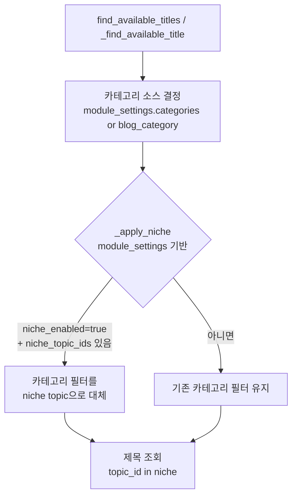
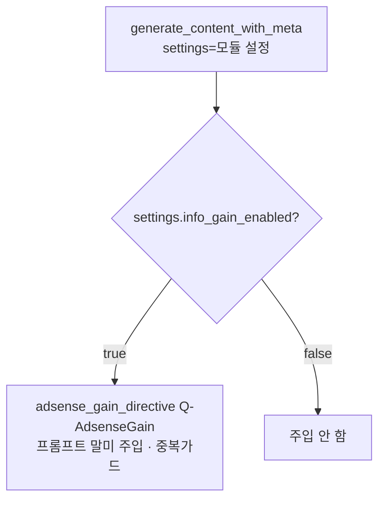
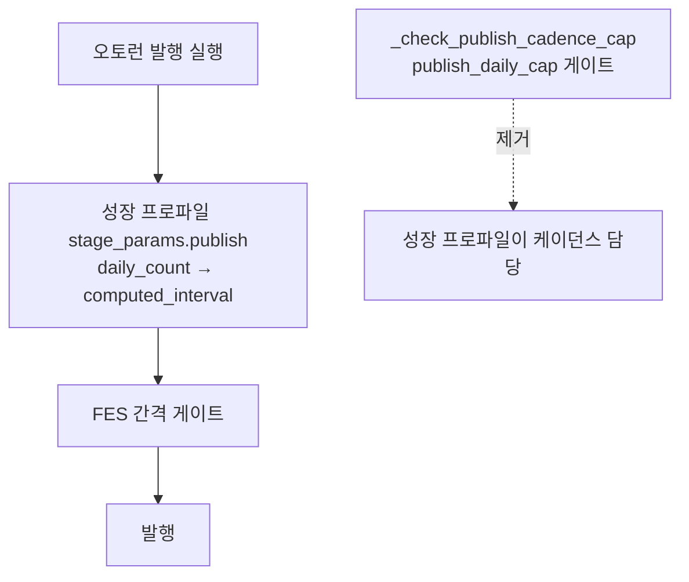

# 애드센스 생성/발행 제어의 모듈 이전 (F4/F5/F7 재편)

> 근거: `docs/plans/adsense_approval_features_plan.md` §11. 사용자 확정(2026-08-16):
> **애드센스 승인용 생성/발행 제어를 블로그 단위에서 "모듈" 단위로 이전**한다.
> 이유: 사용자가 애드센스 승인용 모듈을 일반 모듈과 통합해 쓰거나, 애드센스
> 전용 모듈만 별도로 만들어 쓸 수 있어야 함. 블로그 전역 스위치
> (`blog.adsense_status`)로는 이 통합/분리 선택이 불가능.

## 결정 요약

| 기능 | 이전(블로그 단위) | 이후(모듈 단위) |
|------|------------------|-----------------|
| **F4 니치 강제** | `Blog.niche_topic_ids` + `adsense_status=preparing` | 프롬프트 모듈 `settings.niche_enabled` + `settings.niche_topic_ids` |
| **F7 정보이득 주입** | `blog.adsense_status ∈ (preparing, applied)` | 프롬프트 모듈 `settings.info_gain_enabled` 토글 |
| **F5 일일 발행 상한** | 애드센스 탭 `publish_daily_cap` + `_check_publish_cadence_cap` 게이트 | 제거 → 성장 프로파일 "애드센스 승인용" 프리셋(1일1포)이 대체 |
| **F7 프리셋 노출** | 프론트 하드코딩 누락으로 UI 미노출 | 성장 프로파일 모듈 프리셋 목록에 노출 |
| `blog.adsense_status` | 다목적 트리거 | **애드센스 계정 신청 상태 추적용**으로만 유지(애드센스 탭 + F9 준비도) |

## F4 — 니치 강제 (모듈 settings 기반)

- 판정 순수 함수 `resolve_module_niche(module_settings)`:
  - `niche_enabled == true` AND `niche_topic_ids` 비어있지 않음 → 허용 topic_id 목록 반환(강제)
  - 그 외 → None(강제 안 함). id는 int 정규화, None 제거
- `blog.adsense_status` 조건 **제거**. 모듈이 켜지면 그 모듈의 생성에만 니치 적용
  → 같은 블로그라도 "애드센스 모듈"은 니치 강제, "일반 모듈"은 무강제 공존 가능
- `Blog.niche_topic_ids` 컬럼은 미사용화(운영 중 UI 미노출로 데이터 없음, drop 마이그레이션은 롤백 리스크로 보류 — 코드 참조만 제거)

## F7 — 정보이득 주입 (모듈 토글 기반)

- 트리거를 `blog.adsense_status`에서 `settings.info_gain_enabled`로 교체
- 중복 가드(`directive[:20] not in full_prompt`)는 유지

## F5 — 일일 발행 상한 제거

- `flow_scheduler._check_publish_cadence_cap` 및 호출부 제거 → 발행량은 성장
  프로파일 프리셋(애드센스=1일1포)이 일원 관리
- `publish-cadence` API는 `adsense_status`만 저장(F9 준비도·계정 상태 추적).
  `publish_daily_cap` 저장/조회 제거. `Blog.publish_daily_cap` 컬럼 미사용화

## UI 배치

- **프롬프트/생성 모듈**(`prompt-form-template.js`): 카테고리 선택 섹션 근처에
  - "애드센스 니치 강제" 토글 + topic 다중선택
  - "정보이득(애드센스) 강화" 토글
- **성장 프로파일 모듈**(`growth-profile-form.js`): 프리셋 목록에 "애드센스 승인용" 카드 노출
- **블로그 설정 애드센스 탭**(`_tab_adsense.html`): 일일 발행 상한 입력 제거,
  애드센스 상태 드롭다운 + F9 준비도 유지

## 영향 파일

| 구분 | 파일 |
|------|------|
| 백엔드 F4 | `services/generation/inventory_trigger.py`, `services/generation/adsense_niche.py` |
| 백엔드 F7 | `services/generation/content_generator_helper.py` |
| 백엔드 F5 | `scheduler/flow_scheduler.py`, `routers/blog_settings_adsense.py` |
| 프론트 | `static/js/modules/prompt-form-template.js`, `prompt-form.js`, `growth-profile-form.js`, `templates/blogs/settings/_tab_adsense.html`, `templates/modules/list.html`(?v=) |
| 테스트 | `tests/unit/test_adsense_f4.py`, `test_adsense_f7.py`, `test_flow_scheduler_cadence_gate.py` |

## 마이그레이션

- **없음.** 모듈 `settings`는 자유 JSONB(`Dict[str, Any]`)라 키 추가만으로 저장.
  `Blog.niche_topic_ids`/`publish_daily_cap` 컬럼은 남기고 미사용화(drop 보류).
