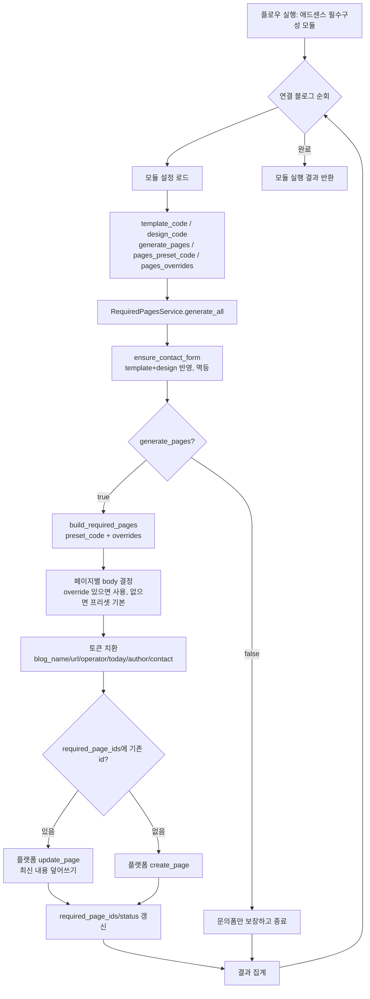
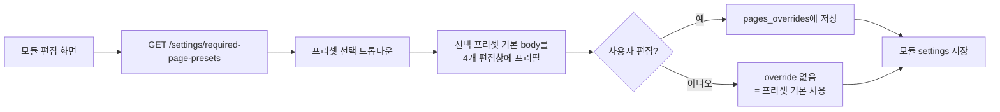

# 애드센스 필수구성 모듈 순서도

문의폼 + 필수 4페이지를 한 모듈이 멱등 생성. 애드센스 탭 버튼은 제거(모듈 일원화).

```mermaid
flowchart TD
    A[플로우 실행: 애드센스 필수구성 모듈] --> B{연결 블로그 순회}
    B --> C[모듈 설정 로드]
    C --> C1[template_code / design_code<br/>generate_pages / pages_preset_code / pages_overrides]
    C1 --> D[RequiredPagesService.generate_all]

    D --> E[ensure_contact_form<br/>template+design 반영, 멱등]
    E --> F{generate_pages?}
    F -- false --> Z[문의폼만 보장하고 종료]
    F -- true --> G[build_required_pages<br/>preset_code + overrides]

    G --> H[페이지별 body 결정<br/>override 있으면 사용, 없으면 프리셋 기본]
    H --> I[토큰 치환<br/>blog_name/url/operator/today/author/contact]
    I --> J{required_page_ids에 기존 id?}
    J -- 있음 --> K[플랫폼 update_page<br/>최신 내용 덮어쓰기]
    J -- 없음 --> L[플랫폼 create_page]
    K --> M[required_page_ids/status 갱신]
    L --> M
    M --> N[결과 집계]
    Z --> N
    N --> B
    B -- 완료 --> O[모듈 실행 결과 반환]
```

## 편집/프리셋 흐름 (UI)

```mermaid
flowchart LR
    P[모듈 편집 화면] --> Q[GET /settings/required-page-presets]
    Q --> R[프리셋 선택 드롭다운]
    R --> S[선택 프리셋 기본 body를<br/>4개 편집창에 프리필]
    S --> T{사용자 편집?}
    T -- 예 --> U[pages_overrides에 저장]
    T -- 아니오 --> V[override 없음<br/>= 프리셋 기본 사용]
    U --> W[모듈 settings 저장]
    V --> W
```
