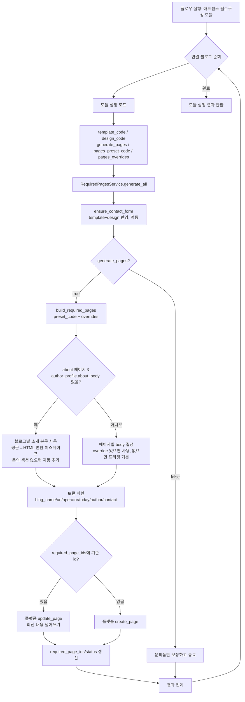
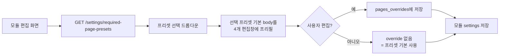

# 애드센스 필수구성 모듈 순서도

문의폼 + 필수 4페이지를 한 모듈이 멱등 생성. 애드센스 탭 버튼은 제거(모듈 일원화).



## 편집/프리셋 흐름 (UI)



## 블로그별 소개 본문 (author_profile.about_body)

모듈 pages_overrides는 여러 블로그가 공유하므로, 블로그마다 다른 소개 본문은
블로그 설정 > 애드센스 탭 > 저자 프로필의 "소개 페이지 본문" 칸에 저장한다.

```mermaid
flowchart TD
    A[애드센스 탭 저자 프로필 저장] --> B[POST /settings/author-profile<br/>about_body 최대 5000자로 자름]
    B --> C[blog.author_profile.about_body]
    C --> D[필수 페이지 생성/갱신 실행]
    D --> E{about_body 비어있음?}
    E -- 예 --> F[overrides.about > 프리셋 기본]
    E -- 아니오 --> G{HTML 태그로 시작?}
    G -- 예 --> H[HTML 그대로 사용]
    G -- 아니오 --> I[평문 변환<br/>빈 줄=문단, '- '=목록, '## '=소제목<br/>HTML 이스케이프]
    H --> J{'{{contact}}' 포함?}
    I --> J
    J -- 아니오 --> K[h3 문의 + contact 블록 추가]
    J -- 예 --> L[토큰 치환 후 기존 페이지 id로 update]
    K --> L
```
