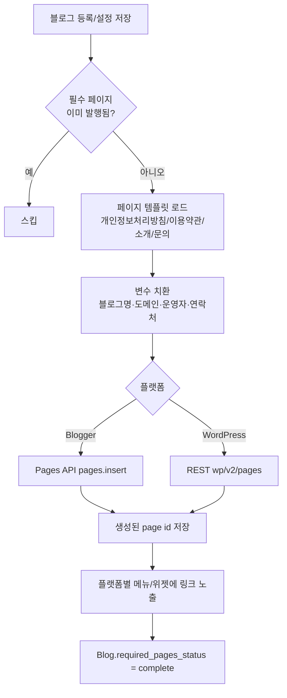
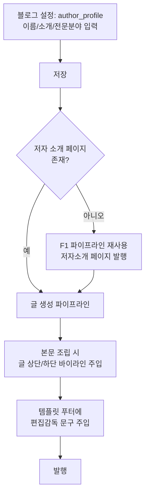
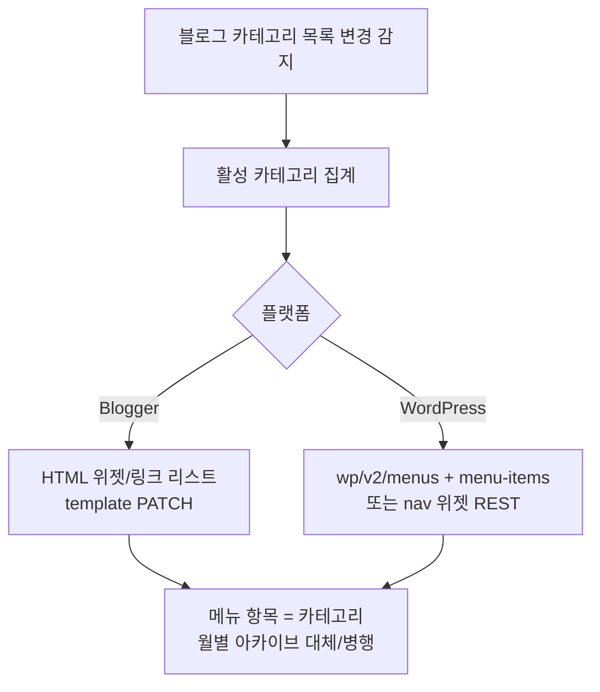

# 애드센스 승인 지원 — Sprint 1 (P1: F1~F3) 순서도

> 근거 계획서: `docs/plans/adsense_approval_features_plan.md` §3 Phase 1
> 착수 전 필수 작성(CLAUDE.md 규칙 4). 코드 착수는 별도 세션에서 본 문서 기준으로 진행.

## F1. 필수 페이지 4종 자동 생성

## F2. 저자성(E-E-A-T) 신호 주입

## F3. 카테고리/내비게이션 메뉴 자동 구성

## 데이터 모델 변경 (F1~F3 공통)

- `Blog.author_profile` (JSON: name, bio, expertise) — nullable
- `Blog.required_pages_status` (enum: none/partial/complete)
- `Blog.required_page_ids` (JSON: {privacy, terms, about, contact} → 플랫폼 page id)
- 마이그레이션: 로컬 alembic upgrade 먼저 검증 후 배포 ([[feedback_local_migration_first]])

## 영향 파일 (예상, 500줄/50줄 규칙 준수 위해 신규 파일 분리 권장)

- `app/models/blog.py` — 컬럼 3종 추가
- `app/services/publish/blogger_adapter.py`, `app/services/publish/wordpress_adapter.py` (또는 실제 경로) — 페이지 생성 메서드 추가
- `app/services/publish/required_pages_templates.py` (신규) — 4종 템플릿
- `app/services/generation/...` — 바이라인/편집감독 문구 주입 지점
- `alembic/versions/xxxx_add_blog_adsense_p1_fields.py` (신규)

## 미해결 설계 질문 (착수 세션에서 확정)

1. Blogger Pages API 인증 스코프가 기존 google_credential으로 충분한지 확인 필요.
   → **결론(2026-08-06)**: 코드상 스코프 하드코딩 없음(동의 시 범위에 의존).
   Posts 발행이 기존 credential로 이미 동작 중이므로 최소 `blogger` 풀스코프가
   부여됐을 가능성이 높고, Blogger API는 posts/pages를 별도 스코프로 나누지
   않음. 403 발생 시 재인증 안내 메시지로 감지(`blogger_page_publisher.py`).
2. WordPress 사이트 중 REST pages 엔드포인트가 막힌 곳(플러그인 mu-plugin 필요, [[project_wordpress_seo_autoinput]] 유사 케이스) 존재 가능 — 사전 조사 필요.
   → **결론**: 범용 사전검사 대신 "시도 후 실패 기록" 방식 채택
   (`required_pages_status=partial` + 페이지별 error 메시지 보존). 별도
   프로브 로직은 이번 스코프에서 구현하지 않음.
3. 기존 블로그(운영 중) 소급 적용 범위 — 신규 등록만 vs 전체 백필.
   → **결론**: 자동 트리거 없음. `POST /blogs/{id}/settings/required-pages/generate`
   API로 신규/기존 블로그 모두 수동(또는 향후 UI 버튼) 트리거. 등록 시점
   자동실행은 도메인/설정 미확정 리스크로 보류.

## 구현 상태 (2026-08-06)

- **완료**: F1(필수 페이지 4종 생성) 백엔드 — 마이그레이션(046)/모델 필드/
  템플릿/Blogger·WordPress 페이지 발행/설정 API. 단위테스트 8종 통과.
- **부분**: F2(저자성) — `author_profile` 필드 + 저장 API + About 페이지
  반영까지만. 개별 글 본문 바이라인/편집감독 문구 주입(생성 파이프라인
  `generator.py` 훅)은 **다음 세션 과제**로 보류(운영 중 전체 발행에 영향
  가능해 별도 검증 필요).
- **미착수**: F3(카테고리 메뉴 자동 구성) — Blogger 템플릿 PATCH/WordPress
  메뉴 REST는 플랫폼별 리스크가 커 이번 세션 범위 밖. 다음 세션 과제.
- **미착수**: 관리자 UI(생성 버튼/상태 표시) — API만 구현, 프런트 연동 없음.
