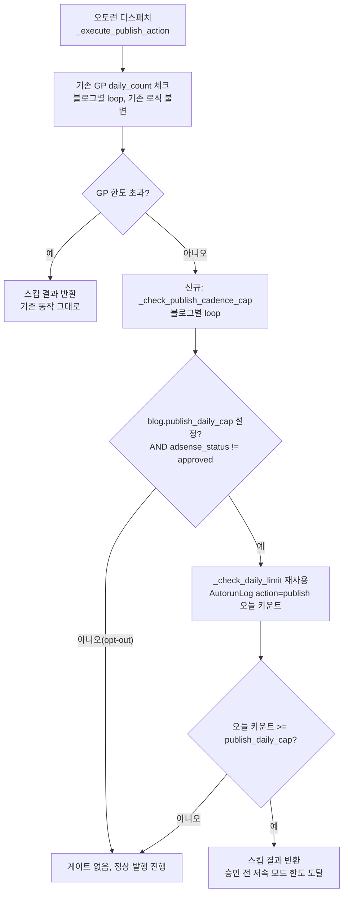
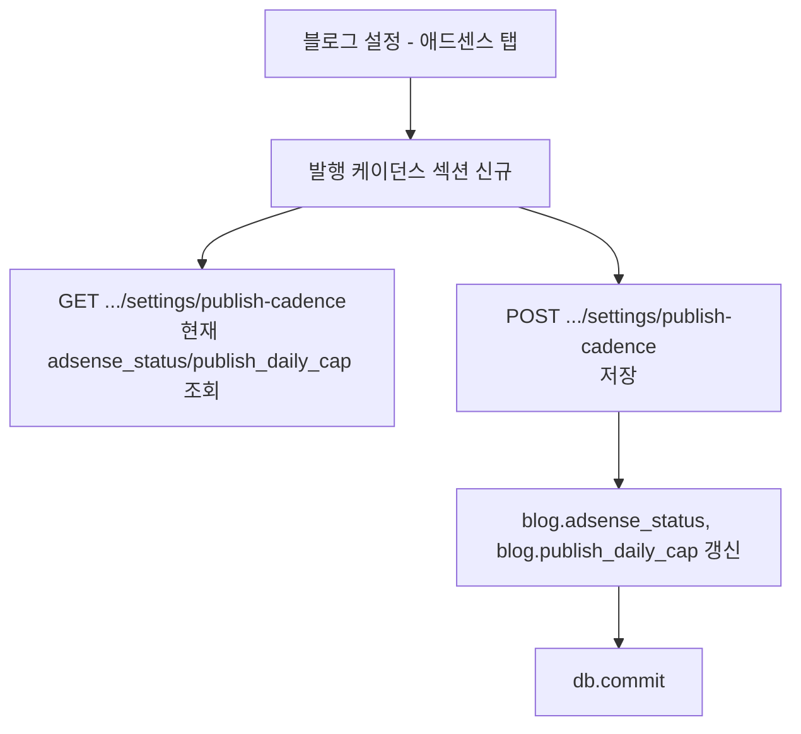

# 애드센스 승인 지원 — Sprint 2 (F5: 발행 케이던스 조절) 순서도

> 근거 계획서: `docs/plans/adsense_approval_features_plan.md` §3 Phase 2 F5
> 착수 전 필수 작성(CLAUDE.md 규칙 4).

## 배경 / 스코프

F1(필수 페이지)·F2(저자성)·F9(준비도 감사)는 완료됐고, F3(카테고리 메뉴)은
라이브 블로그 템플릿 파손 리스크로 두 세션 연속 보류 중(`adsense_sprint1_p1.md`
"구현 상태" 참고). F5는 **스케줄러/오토런 로직만** 건드리고 원격 플랫폼
템플릿을 수정하지 않아 F3보다 리스크가 낮음 — 이번 세션 착수 대상으로 선정.

**이번 스코프**: "일일 발행 상한 + 승인 전 저속 모드"만 구현한다.
- 발행(publish) 액션에만 게이트 적용 — scaled content abuse의 핵심 타깃은
  신규 공개 발행이며, republish(기존 글 갱신)·generate(초안 생성)는 이미
  각자 GP(Growth Profile) `daily_count`로 별도 제한되고 있어 이번 스코프 밖.
- 월 상한(월 158개 사례의 "월" 단위)은 이번 세션에서 구현하지 않음 —
  일일 상한을 먼저 검증한 뒤 필요 시 별도 세션에서 월 단위 확장.
- 완전 opt-in: `publish_daily_cap`이 설정된 블로그에만 영향, 기존 운영
  블로그는 필드 미설정(NULL)이라 동작 변화 없음.

## 데이터 모델 변경

- `Blog.adsense_status` (String(20), NOT NULL, default `"none"`) —
  `none | preparing | applied | approved`. F9 준비도 감사·A/B 테스트 라벨링에도
  재사용 가능하도록 범용 상태값으로 설계(계획서 §4).
- `Blog.publish_daily_cap` (Integer, nullable, default NULL) — 승인 전
  적용할 일일 발행 상한. NULL이면 게이트 비활성(opt-in).
- 마이그레이션: `047_add_publish_cadence.py`, `down_revision = "046"`.
  로컬 `alembic upgrade head` 먼저 검증 ([[feedback_local_migration_first]]).

## F5. 발행 케이던스 게이트

- 삽입 위치: `app/scheduler/flow_scheduler.py`
  `_execute_publish_action`(2527) 내부, 기존 GP 일일한도 체크 블록
  (2579-2607) **직후**에 신규 루프 추가.
- 기존 `_check_daily_limit(db, blog_id, action_type, daily_count)`(947)를
  그대로 재사용 — action_type="publish"로 호출해 GP 카운트 로직과 동일 기준
  (KST 자정 이후 `AutorunLog.action=="publish" and status=="success"`)을 공유.
- 기존 GP 체크와 동일하게 **블로그 목록 순회 중 첫 초과 블로그에서
  전체 함수 종료(return)** 패턴을 따른다 — 기존 함수의 비대칭 동작
  (다른 블로그도 이번 사이클 스킵됨)을 그대로 답습, 별도 개선은 이번
  스코프 밖(기존 GP 로직과 동일 리스크 프로필 유지가 목적).

## 설정 API/UI

- 신규 라우터: `app/routers/blog_settings_adsense.py`에
  `GET/POST /blogs/{blog_id}/settings/publish-cadence` 추가(F1/F2와 동일
  서브라우터 패턴, `get_blog_or_404` 재사용).
- UI: `_tab_adsense.html`에 "발행 케이던스" 섹션 추가 — `adsense_status`
  드롭다운(none/preparing/applied/approved) + `publish_daily_cap` 숫자 입력
  (빈 값=무제한/게이트 비활성).

## 영향 파일

- `app/models/blog.py` — 컬럼 2종 추가(`adsense_status`, `publish_daily_cap`)
- `alembic/versions/047_add_publish_cadence.py` (신규)
- `app/scheduler/flow_scheduler.py` — `_check_publish_cadence_cap` 메서드
  신규 추가 + `_execute_publish_action` 내 호출 2줄 추가
- `app/routers/blog_settings_adsense.py` — 엔드포인트 2종 추가
- `app/templates/blogs/settings/_tab_adsense.html` — UI 섹션 추가
- `tests/unit/test_flow_scheduler_cadence_gate.py` (신규)
- `tests/unit/test_blog_settings_adsense_router.py` 또는 기존 라우터
  테스트 파일에 케이스 추가(있는 경우)

## 미해결/후속 과제

1. 월 단위 상한 — 이번 세션 미구현, 필요성 확인 후 별도 세션.
2. republish/generate 액션에도 동일 게이트 적용할지 — 계획서는 "발행
   케이던스"에 초점이라 이번엔 publish만. 운영 데이터로 필요성 판단 후 결정.
3. F9 준비도 감사(`adsense_readiness_service.py`)에 `adsense_status`/
   `publish_daily_cap` 설정 여부를 체크리스트 항목으로 반영할지 — 이번
   스코프 밖, 후속 검토.
