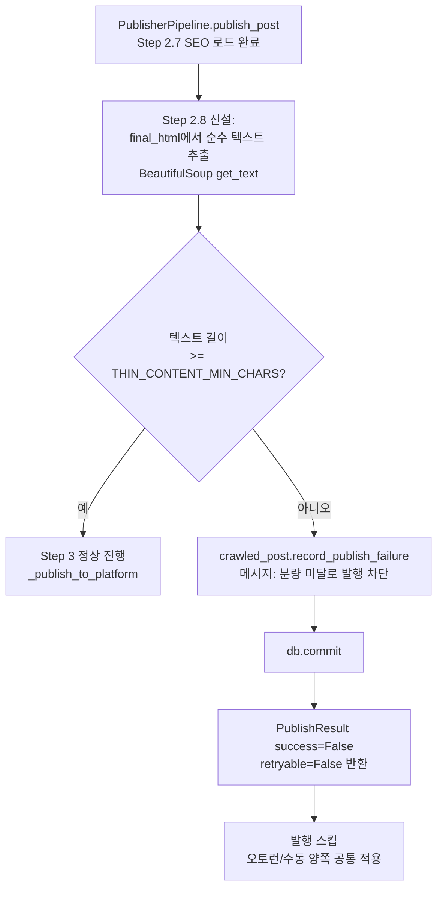

# 애드센스 승인 지원 — Sprint 2 F6 (최소 분량·구조 게이트) 순서도

> 근거 계획서: `docs/plans/adsense_approval_features_plan.md` §3 Phase 2 F6
> 착수 전 필수 작성(CLAUDE.md 규칙 4).

## 범위 축소 (착수 세션 판단)

계획서 원안은 "미달 시 재생성 또는 검수 큐로"였으나, 조사 결과 코드베이스에
재생성 트리거/검수 큐 개념이 없음(`CrawledPost.match_status`는
pending/matched/unmatched뿐, 있는 건 `publish_attempts` 기반 3회 소진
제외뿐). 이번 세션은 **발행 차단 + 실패 로그 기록**까지만 구현하고,
재생성 자동 트리거·검수 큐 UI는 별도 스코프로 보류한다.

또한 "과도한 템플릿 반복·표만 있는 글" 판정은 임계치 설계 근거가 없어
**보류** — 이번 세션은 순수 텍스트 글자수 게이트만 구현한다.

## 흐름

## 삽입 지점

- `app/services/publishing/publisher_pipeline.py` `publish_post()` —
  Step 2.7(SEO 로드) 끝, Step 3(`_publish_to_platform`) 호출 전.
  이 함수는 오토런(`flow_scheduler.py`)·수동/셀러리
  (`publish_workflow.py`→`celery_publish_tasks.py`)·리뉴얼
  (`renewal_updater.py`) 모두가 거치는 단일 공통 지점이라 한 곳만
  걸면 전체 경로 커버.
- 기존 Step 1.5(이미지 실패) 게이트와 동일한 shape 재사용:
  `record_publish_failure` → `commit` → `PublishResult(success=False)`
  반환, 플랫폼 호출 자체를 스킵.

## 신규 파일

- `app/services/publishing/thin_content_gate.py` — 텍스트 추출 +
  임계치 판정 함수. `publisher_pipeline.py`가 514줄로 500줄 제한에
  근접해 있어 별도 파일로 분리(CLAUDE.md 규칙 3).
- 임계치: `THIN_CONTENT_MIN_CHARS = 600` (계획서 §1 진단 4번 "600자↓
  thin content" 그대로 채용). 블로그별 커스터마이즈는 이번 스코프 밖
  (전역 상수).

## 미해결 설계 질문 (다음 세션 과제)

1. 표 비율/템플릿 반복 판정 — 임계치·측정 방법 미정.
2. 블로그별 임계치 커스터마이즈 필요 여부 — 니치(F4)와 함께 재검토.
3. 발행 차단된 글의 사후 처리(수동 재생성 유도 UI) — F9 준비도 감사와
   함께 설계 권장.
