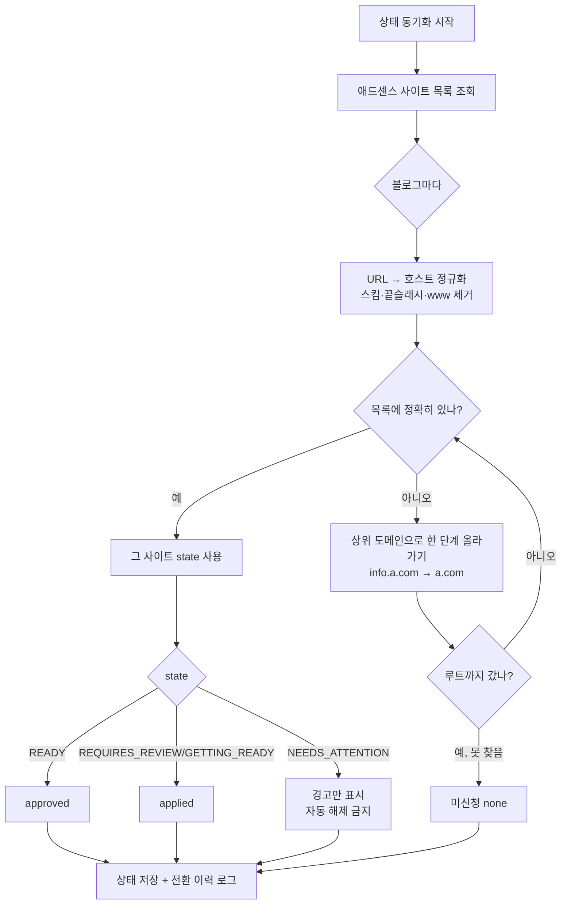
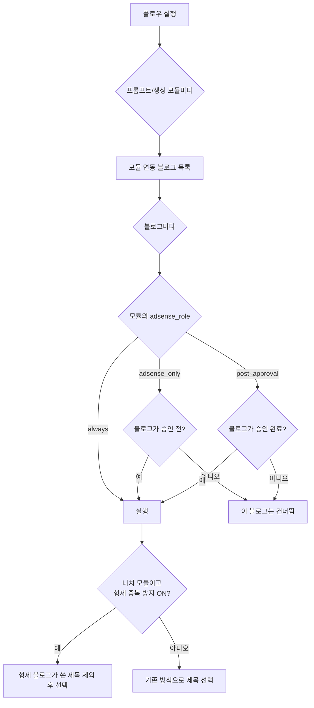
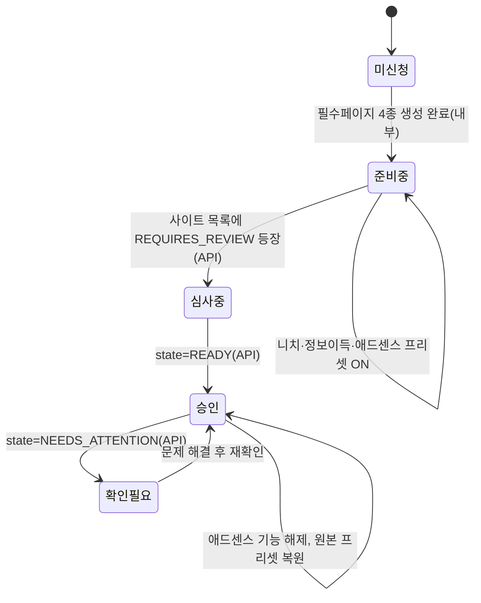

# 애드센스 승인 상태 자동화 순서도

계획서: docs/plans/adsense_status_automation_plan.md

## 1. 상태 동기화 (하루 1~2회 + 수동)

```mermaid
flowchart TD
    A[상태 동기화 시작] --> B[애드센스 사이트 목록 조회]
    B --> C{블로그마다}
    C --> D[URL → 호스트 정규화<br/>스킴·끝슬래시·www 제거]
    D --> E{목록에 정확히 있나?}
    E -- 예 --> F[그 사이트 state 사용]
    E -- 아니오 --> G[상위 도메인으로 한 단계 올라가기<br/>info.a.com → a.com]
    G --> H{루트까지 갔나?}
    H -- 아니오 --> E
    H -- 예, 못 찾음 --> I[미신청 none]
    F --> J{state}
    J -- READY --> K[approved]
    J -- REQUIRES_REVIEW/GETTING_READY --> L[applied]
    J -- NEEDS_ATTENTION --> M[경고만 표시<br/>자동 해제 금지]
    K --> N[상태 저장 + 전환 이력 로그]
    L --> N
    I --> N
    M --> N
```

## 2. 상태에 따른 모듈 실행 판정 (블로그별)

```mermaid
flowchart TD
    A[플로우 실행] --> B{프롬프트/생성 모듈마다}
    B --> C[모듈 연동 블로그 목록]
    C --> D{블로그마다}
    D --> E{모듈의 adsense_role}
    E -- always --> F[실행]
    E -- adsense_only --> G{블로그가 승인 전?}
    E -- post_approval --> H{블로그가 승인 완료?}
    G -- 예 --> F
    G -- 아니오 --> I[이 블로그는 건너뜀]
    H -- 예 --> F
    H -- 아니오 --> I
    F --> J{니치 모듈이고<br/>형제 중복 방지 ON?}
    J -- 예 --> K[형제 블로그가 쓴 제목 제외 후 선택]
    J -- 아니오 --> L[기존 방식으로 제목 선택]
```

## 3. 상태 전환 계기

```mermaid
stateDiagram-v2
    [*] --> 미신청
    미신청 --> 준비중: 필수페이지 4종 생성 완료(내부)
    준비중 --> 심사중: 사이트 목록에 REQUIRES_REVIEW 등장(API)
    심사중 --> 승인: state=READY(API)
    승인 --> 확인필요: state=NEEDS_ATTENTION(API)
    확인필요 --> 승인: 문제 해결 후 재확인
    준비중 --> 준비중: 니치·정보이득·애드센스 프리셋 ON
    승인 --> 승인: 애드센스 기능 해제, 원본 프리셋 복원
```
