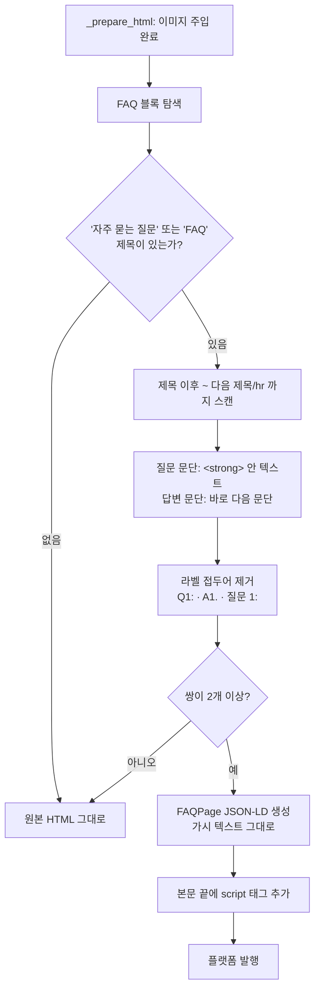

# A5 — FAQPage 스키마 삽입

> 근거: `docs/plans/niche_title_aeo_plan.md` §5.3 A5,
> `docs/plans/external_skill_review_seo.md` §4-(1)

## 원칙

- **가시 텍스트에서만 만든다.** JSON-LD 를 따로 생성하지 않고, 본문에 이미 보이는
  Q&A 문자열을 그대로 뽑아 쓴다. 마크업에만 있고 화면에 없는 FAQ 는 스팸 판정 대상이다.
- **콘텐츠 주도.** 별도 설정 스위치를 두지 않는다. 본문에 FAQ 블록이 있으면 넣고,
  없으면 넣지 않는다. AEO 지시문을 끄면 블록이 사라지고 스키마도 자동으로 빠진다.
- **리치결과를 기대하지 않는다.** 구글은 2026-05-07 FAQ 리치결과를 폐지했다.
  목적은 검색·RAG 엔진의 **내용 이해와 답변 발췌 보조**다.
- **실패해도 발행을 막지 않는다.** 파싱 실패 시 원본 HTML 을 그대로 반환한다.

## 흐름

## 파싱 규칙

| 대상 | 규칙 |
|---|---|
| 블록 시작 | `<h2>`~`<h4>` 중 텍스트에 `자주 묻는 질문` 또는 `FAQ` 포함 |
| 블록 끝 | 다음 `<h1>`~`<h4>` 또는 `
` |
| 질문 | 문단 안 `<strong>`/`<b>` 텍스트 |
| 답변 | 그 문단 **바로 다음** 문단의 텍스트 |
| 라벨 제거 | `^(Q|A|질문|답변)\s*\d*\s*[:.）)]\s*` |

라벨(`Q1:`)은 번호 표식일 뿐이고, 제거한 나머지 문자열은 **페이지에 그대로 존재**한다.

## 삽입 위치

본문 HTML 맨 끝. 워드프레스·블로거 모두 동일하게 `final_html` 에 붙인다.

> ⚠️ 워드프레스는 사용자 권한에 따라 본문의 `<script>` 를 제거할 수 있다
> (`unfiltered_html`). 배포 후 실제 발행 글에서 스키마가 살아있는지 확인해야 한다.
