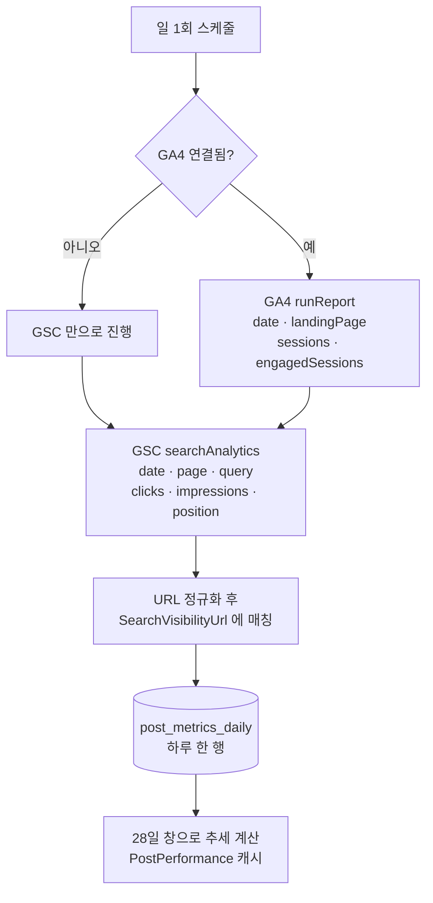
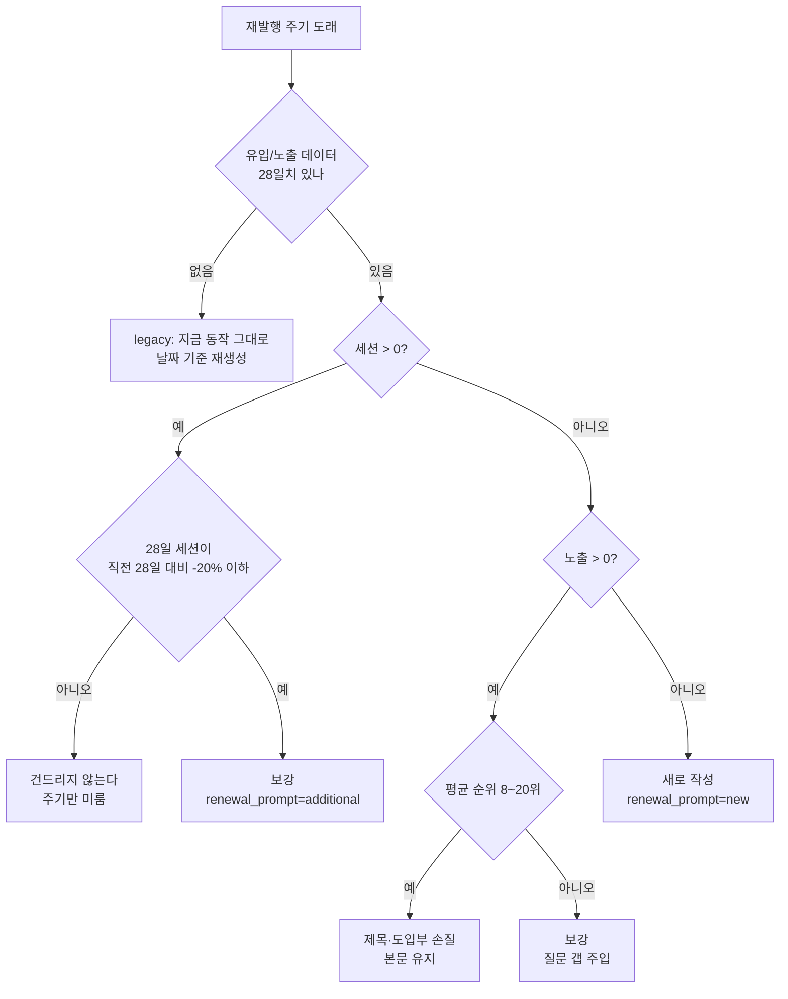
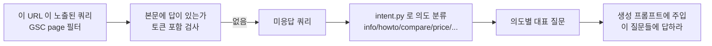

# 유입 데이터 수집 → 재발행 판정

지금 재발행은 **날짜만** 본다. 주기가 오면 잘 되는 글도 갈아엎는다.
유입을 붙여 "무엇을 할지" 를 글마다 다르게 정한다.

## 수집 (하루 1회)

두 API 모두 **3일 지연**을 두고 조회한다. 서치콘솔은 2~3일,
GA4 는 당일치가 확정 전이다. 어제 것을 읽으면 값이 계속 흔들린다.

## 판정 — 무엇을 할 것인가

`KEEP` 가 이 작업의 핵심이다. 지금은 존재하지 않는 선택지다.

## 니즈 갭 — 무엇을 채울 것인가

보강·재작성 어느 쪽이든 "무엇을 더 쓸지" 가 있어야 한다.
외부 유료 API(AlsoAsked 등) 없이 **우리 서치콘솔 실측**으로 만든다.

`intent.py`(의도 분류)와 `angles.py`(경쟁 각도)가 이미 있다.
같은 자리에 **실측 쿼리**를 하나 더 꽂는 것이다.
