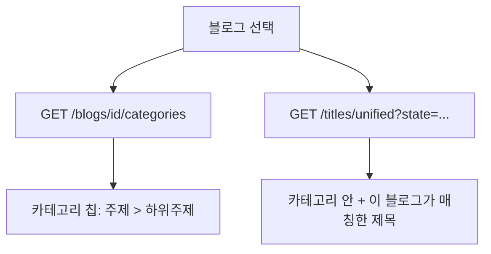

# 블로그가 쓰는 카테고리

## 왜

정식제목 탭에서 블로그를 고르면 **그 블로그의 카테고리에 속한 제목만** 보인다.
그런데 화면에는 무슨 카테고리가 걸려 있는지 적혀 있지 않아, 왜 어떤 제목이
보이고 어떤 제목이 안 보이는지 알 수 없었다.

## 흐름

## 안쪽 판정 (한 곳에서)

블로그의 활성 카테고리를 두 갈래로 모은다.

    하위주제까지 지정   subtopic_id 집합
    주제만 지정        topic_id 집합

    안  subtopic_id ∈ 하위주제  또는  topic_id ∈ 주제

카테고리를 걸어 두지 않은 블로그는 제한이 없다(전체가 보인다).
판정은 `services/titles/blog_scope.py` 한 곳에 둔다 — 예전에는 titles.py 와
blogs.py 가 같은 규칙을 따로 구현해, 목록과 카운트가 어긋날 여지가 있었다.

## 되돌린 것 — '카테고리 밖' 목록 (2026-09-26)

독립포스트 중 카테고리 밖 제목만 모아 보는 화면을 넣었다가 **되돌렸다.**
독립포스트는 카테고리가 바뀌면 그 기준으로 다시 불러오므로 **분류가 틀린
제목이 남지 않는다** — 볼 필요가 없는 목록이었다.

정리가 필요할 수 있는 자리는 **발행대기 글**이다. 옛 카테고리로 발행대기에
올려 둔 글이 있는데 그 카테고리가 지워지면, 그 글은 어디에도 속하지 않은
채로 남는다. 그 정리는 별도로 검토한 뒤 다시 정한다.

## 카테고리 정렬 (고침)

카테고리 열을 눌러도 가나다 순으로 서지 않았다. 화면은 `sort_field=category`
를 보내는데 서버는 그 이름을 몰라 **생성일 정렬로 되돌아갔다.**

    정식제목(블로그 미선택)  Topic.name → SubTopic.name 으로 정렬(outer join)
    정식제목(블로그 선택)    합친 뒤 category_path 문자열로 정렬
    임시제목                예전에는 topic_id(번호)로 정렬 → 이름으로 바꿈

한글 음절은 코드포인트가 가나다 순이라 문자열 정렬로 충분하다. 분류가 없는
제목은 **방향과 무관하게 맨 뒤**로 보낸다 — 분류 없는 제목이 수천 건이라
오름차순 첫 화면이 그것들로만 차면 정렬이 안 된 것처럼 보인다.
