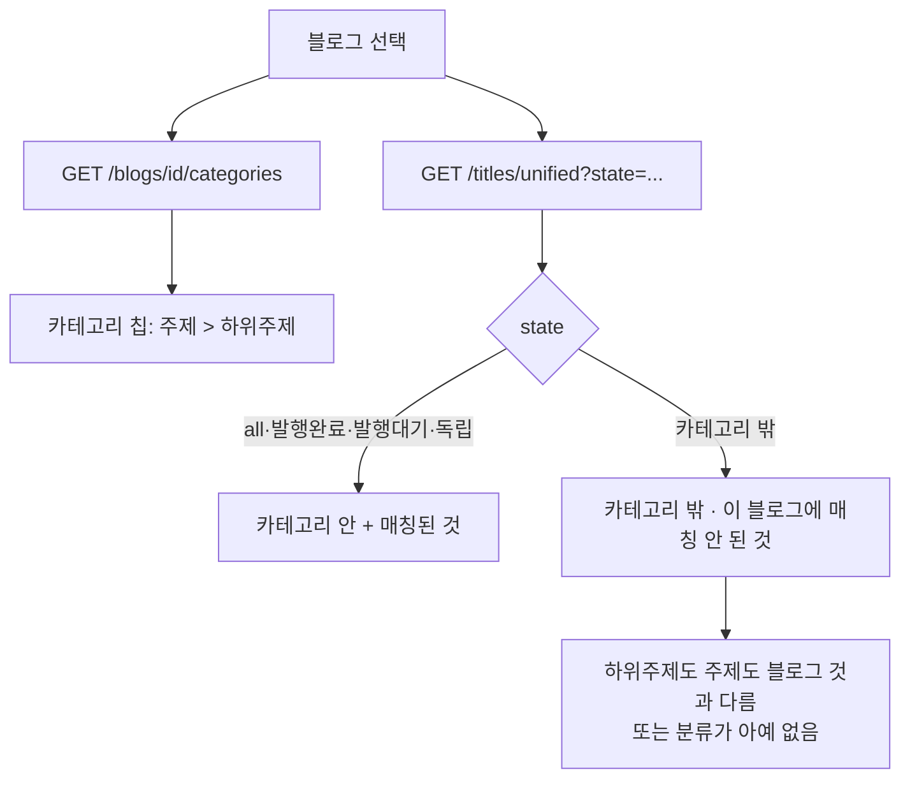

# 블로그의 카테고리 안과 밖

## 왜

정식제목 탭에서 블로그를 고르면 **그 블로그의 카테고리에 속한 제목만** 보인다.
그런데 화면에는 무슨 카테고리가 걸려 있는지 적혀 있지 않아, 왜 어떤 제목이
보이고 어떤 제목이 안 보이는지 알 수 없었다.

반대쪽도 필요하다. 독립포스트(아직 이 블로그가 안 쓴 제목) 중 **카테고리
밖에 있는 것**은 지금 화면에서 아예 빠져 있어, 잘못 분류된 제목을 찾아
고치거나 지울 방법이 없었다.

## 흐름

## 카테고리 안/밖 판정 (한 곳에서)

블로그의 활성 카테고리를 두 갈래로 모은다.

    하위주제까지 지정   subtopic_id 집합
    주제만 지정        topic_id 집합

    안  subtopic_id ∈ 하위주제  또는  topic_id ∈ 주제
    밖  안이 아니다 + **분류가 없는 것도 밖**

`NOT IN` 은 NULL 에서 참이 되지 않으므로, 분류가 비어 있는 제목은 따로
살려 줘야 한다. 그러지 않으면 "밖"에서 조용히 사라진다.

판정은 `services/titles/blog_scope.py` 한 곳에 둔다 — 예전에는 titles.py 와
blogs.py 가 같은 규칙을 따로 구현해, 목록과 카운트가 어긋날 여지가 있었다.

## 카테고리 정렬 (고침)

카테고리 열을 눌러도 가나다 순으로 서지 않았다. 화면은 `sort_field=category`
를 보내는데 서버는 그 이름을 몰라 **생성일 정렬로 되돌아갔다.**

    정식제목(블로그 미선택)  Topic.name → SubTopic.name 으로 정렬(outer join)
    정식제목(블로그 선택)    합친 뒤 category_path 문자열로 정렬
    임시제목                예전에는 topic_id(번호)로 정렬 → 이름으로 바꿈

한글 음절은 코드포인트가 가나다 순이라 문자열 정렬로 충분하다. 분류가 없는
제목은 빈 문자열이라 오름차순에서 맨 앞, 내림차순에서 맨 뒤로 모인다.
