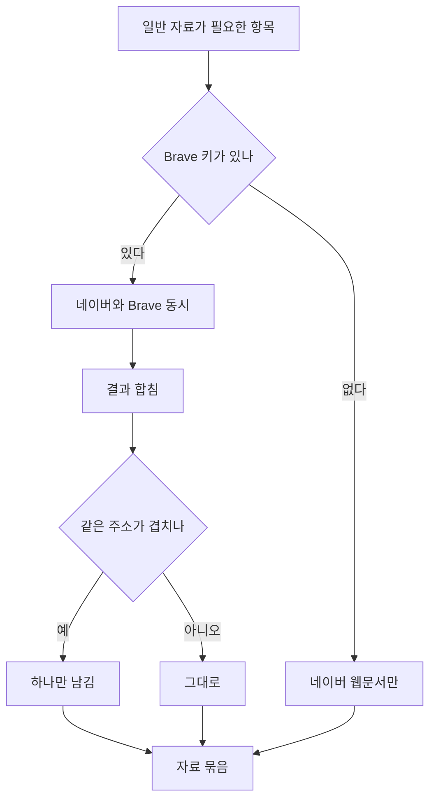

# 일반 자료를 클로드와 같은 곳에서 찾는다

## 왜 Brave 인가

클로드가 자료를 찾을 때 쓰는 검색이 **Brave** 다. Anthropic 이 자사
subprocessor 문서에 Brave 를 웹 검색 벤더로 명시하고 있다.

즉 Brave 를 붙이면 **손으로 글을 쓸 때 보던 것과 같은 검색 결과**가
자료로 들어온다. 모델은 바꾸지 않아도 된다.

## 네이버를 빼지 않는다

이사·청소는 **한국 로컬 정보**가 많다. 지역 업체 시세, 동네 사정,
실제 겪은 사람 이야기는 네이버 쪽이 낫다. 반대로 법·제도·업계 자료는
네이버 밖에 있다.

그래서 일반 자료 갈래에서 **둘 다 던지고 합친다.**

한쪽이 실패해도 나머지는 쓴다. Brave 가 막혀서 글이 안 나오는 일은
없어야 한다.

## 발췌문을 더 받는다

Brave 는 `extra_snippets` 를 켜면 한 결과에서 **여러 대목**을 준다.
페이지를 긁지 않고도 쓸 만한 분량이 나온다.

## 소스 구분

| 갈래 | 어디서 |
|---|---|
| 일반 자료 | 네이버 웹문서 **+ Brave** |
| 법·판례 | 법제처 원문 (없으면 네이버 전문자료) |
| 뉴스·지식iN·카페·백과 | 네이버 |
