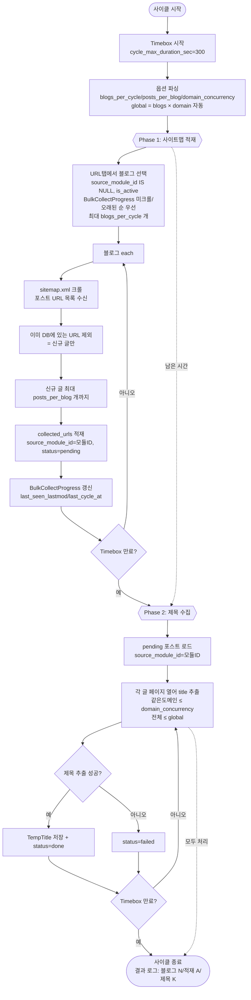
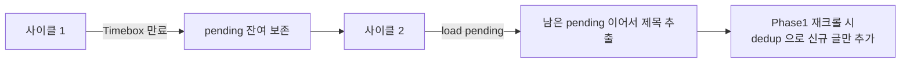

# 대량 수집(bulk_collect) 재설계 순서도

> 계획서: `docs/plans/bulk_collect_redesign_plan.md` | 작성일 2026-06-04

## 1 사이클 전체 흐름

## 재개(이어하기) 메커니즘

## 데이터 역할 분리 (D-1 꼬리표)

| collected_urls 행 | source_module_id | 역할 |
|---|---|---|
| 블로그 루트 URL | NULL (수집 모듈 적재) | Phase 1 크롤 대상 |
| 포스트 URL | 모듈 ID (대량수집 적재) | Phase 2 제목 추출 대상 |
