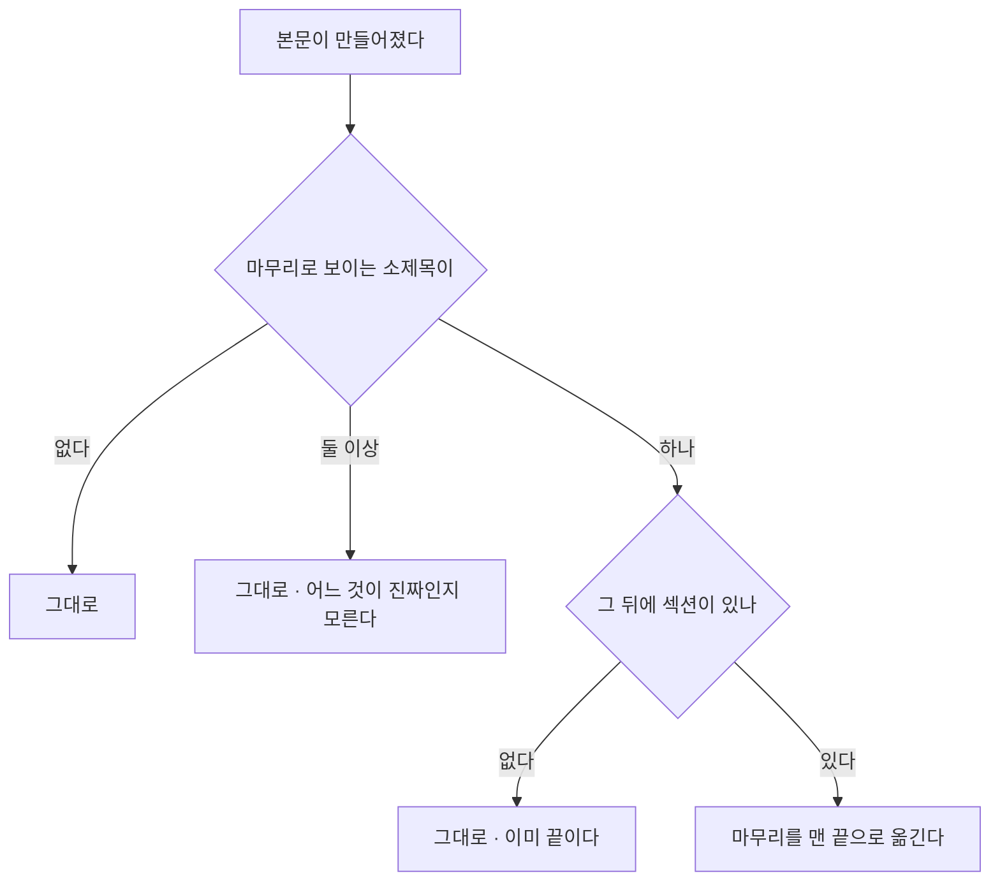

# 마무리 뒤에 글이 또 시작된다

## 무엇이 보였나

글 중간에 「마치며」가 나오고, 그 아래로 **새 구조의 글이 더** 이어졌다.
읽는 사람은 글이 두 번 끝나는 것처럼 느낀다.

## 두 자리에서 생긴다

**1. 이어쓰기.** 초안이 발행 최소 분량에 못 미치면 한 번 더 받아 뒤에
잇는다. 초안이 이미 마무리로 끝났으면 새 섹션이 그 뒤로 간다.

    ## 마치며        ← 초안의 끝
    ## 추가로 알아둘 것 ← 이어쓴 것

**2. AEO 지시.** 「자주 묻는 질문을 맨 뒤에 덧붙이라」고 적혀 있었다.
구조가 마무리로 끝나면 FAQ 역시 마무리 뒤로 간다.

## 내용은 두고 자리만 바로잡는다

이어쓴 것도 FAQ 도 쓸모 있는 내용이다. 지우지 않고 **마무리를 맨 끝으로**
옮긴다.

마무리로 보는 말: 마치며 · 마무리 · 맺음말 · 정리하며 · 끝으로 · 마지막 ·
총정리

## 프롬프트도 함께 고친다

AEO 지시문이 「맨 뒤에 덧붙이라」 대신 **「마무리 바로 앞에 넣으라」** 고
말한다. 뒤처리로 고치기 전에 애초에 그 자리에 쓰게 하는 편이 낫다.

## 진짜 원인은 분량 설정일 수 있다

이어쓰기는 **초안이 짧을 때만** 돈다. 발행 최소 분량이 구조 약속의 합계보다
훨씬 크면 매번 이어쓰기가 돌아 글이 늘어진다. 본문 분량 칸에서 둘을 나란히
놓고 경고하는 이유가 이것이다(순서도 `min_length_placement.md`).
