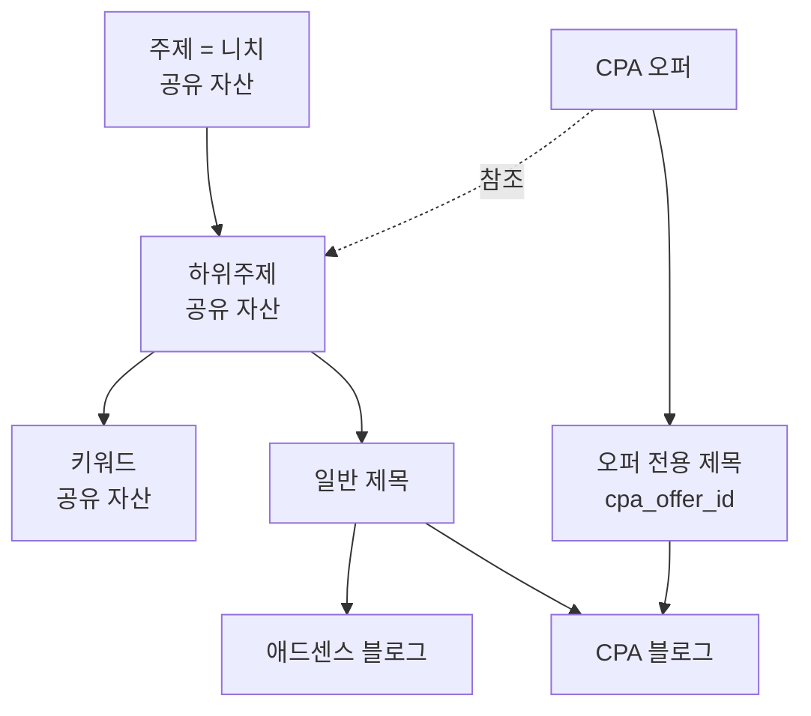

# 오퍼와 니치 — 소유하지 않고 참조한다

## 왜 바꾸나

니치를 오퍼에 배타적으로 귀속시키면(`topics.cpa_offer_id`) 그 니치를 쓰던
블로그가 전부 CPA 로 넘어간다. 실측(2026-09-09)이다.

| 니치 | 정식제목 | 연결 블로그 |
|---|---|---|
| 생활 정보 | 879 | **7** |
| 여행/관광 | 583 | **5** |
| 재테크/돈관리 | 238 | **5** |
| 건강/의학 | 400 | **4** |

이사스토리 오퍼를 '생활 정보' 에 붙이면 **제목 879건과 블로그 7개**가 CPA 가
된다. 실제로 '금융/대출' 을 붙였더니 정식제목 1,023건이 넘어갔다.

## 단위는 하위주제다

```
생활 정보 > 통신·인터넷    키워드 7 · 제목 1     ← 현금사은품 오퍼가 여기
생활 정보 > 생활 정보      키워드 47 · 제목 419
건강/의학 > 병원·진료      키워드 15 · 제목 12   ← 안과 오퍼가 여기
건강/의학 > 질병 및 증상   키워드 6 · 제목 141
```

주제 단위면 879건, 하위주제 단위면 1건이다. **879 대 1.**

## 구조



**소유가 아니라 참조다.** 오퍼가 `건강/의학 > 병원·진료` 를 쓴다고 그
하위주제가 CPA 전용이 되지 않는다. 애드센스 블로그도 계속 쓴다.

## 글은 실행 시점에 갈린다

```
CPA 블로그      담당 오퍼의 하위주제 + 오퍼 전용 제목 → 오퍼 규칙 적용
애드센스 블로그  같은 하위주제의 일반 제목 → 오퍼 규칙 없음
```

같은 키워드로 두 종류 글이 나온다. 이것이 "정보성 글을 CPA 에도 쓴다" 의
실현이다.

**오퍼 전용 제목을 먼저 쓴다.** 하위주제에 일반 제목이 수백 건이면 방금
만든 오퍼 제목이 순번에서 밀린다(앞서 4,401 대 5로 겪었다).

## 오퍼가 끝나면

오퍼는 일시적이다 — 재확인 30일, 광고주가 중단하면 끝이다. 니치·키워드는
남는다. **참조만 끊으면 자산은 그대로다.** 오퍼에 소유시켰다면 같이 죽는다.
