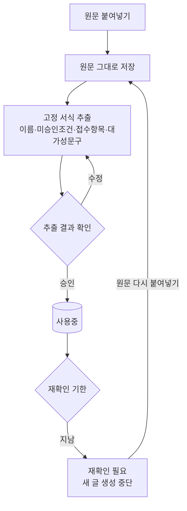
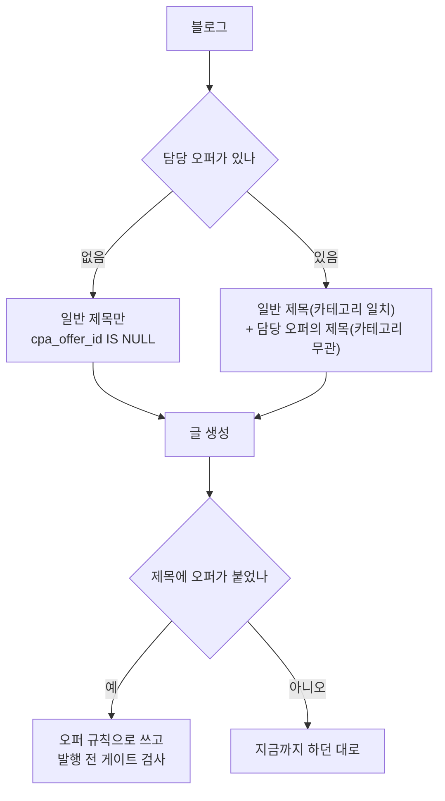

# CPA 오퍼 — 등록과 확인

계획서: `docs/plans/cpa_affiliate_plan.md`

## 왜 붙여넣기인가

애드릭스 프로모션 페이지는 로그인해야 열린다. 비로그인 호출은 248바이트짜리
자바스크립트 알림만 돌려준다(2026-09-08 실측).

```
<script>alert('로그인을 해주시기 바랍니다.');
        parent.location.href='.../login/login.asp?backurl=...'</script>
```

크롤은 불가능하다. 사람이 로그인해 복사한 원문을 받는다.

## 원문의 두 층

실제 오퍼 7건을 보니 문서가 두 부분으로 나뉜다.

```
┌ 광고주가 쓴 자유 서술 ────────────┐   업종마다 형식이 제각각
│  소개 · 금지사항 · 추천키워드      │   → AI 가 규칙으로 바꾼다 (P2)
└───────────────────────────────────┘
┌ 애드릭스 고정 서식 ───────────────┐   7건 모두 같은 모양
│  전환 정보 / 미승인조건            │   → 규칙 기반으로 확실히 뽑는다
│  접수 항목                         │
│  대가성 문구 표시                  │
└───────────────────────────────────┘
```

**고정 서식은 AI 에게 맡기지 않는다.** 형식이 정해져 있으면 규칙으로 뽑는 쪽이
정확하고 공짜다. AI 는 형식이 없는 곳에만 쓴다.

## 등록 흐름



## 상태

| 상태 | 뜻 | 글 생성 |
|---|---|---|
| `draft` | 등록했으나 확인 전 | ✗ |
| `active` | 확인 완료 | ✓ |
| `recheck` | 재확인 기한 경과 | ✗ |
| `stopped` | 중단 | ✗ |

**기한이 지나면 자동으로 멈춘다.** 오퍼 조건이 바뀌어도 우리는 알 수 없다.
단가·금지문구·랜딩이 바뀐 채로 계속 쓰면 이미 나간 글 전부가 위반이 된다.
기본 30일.

## 확인해야 보이는 것

카드 앞면에 둔다. 접어두면 보지 않는다.

- **커버리지** — 원문 문장 중 규칙으로 바뀐 비율. 나머지는 검사되지 않는다
- **충돌** — 오퍼가 금지한 낱말을 오퍼 소개문이 쓰는 경우(실측: 중정 '전문',
  스탁론 '금리')
- **advisory** — 기계가 못 지키는 항목("성의 있게 작성", "본인 DB 금지")

유입 분석에서 매칭률 0%가 로그에만 찍혀 아무도 몰랐다. 같은 실수를 반복하지 않는다.

## 오퍼 → 블로그 → 글

제목을 만들어도 **아무 블로그도 그것을 뽑지 못했다**(2026-09-09 실측).
빠진 것이 둘이었다.

```
오퍼 ──▶ 제목 ──▶  ???  ──▶ 글
                    ↑
              어느 블로그가 쓸지 정하는 곳이 없었다
```

### ① 격리 — 일반 블로그가 CPA 제목을 가져가면 안 된다

제목 선택 질의에 `cpa_offer_id` 조건이 없었다. 카테고리 조건이 없는
블로그는 **CPA 제목까지 후보로 잡는다.** 애드센스 블로그가 CPA 규칙이
붙은 글을 발행하는 사고가 난다.

### ② 연결 — CPA 제목은 카테고리로 고를 수 없다

CPA 제목에는 주제·하위주제가 없다. 카테고리로 거르는 기존 경로에서는
언제나 탈락한다. 오퍼에 담당 블로그를 지정하고, 그 블로그만 그 오퍼의
제목을 뽑는다.



CPA 제목이 카테고리를 건너뛰는 이유: 오퍼가 곧 주제다. 오퍼를 블로그에
붙인 순간 그 블로그가 무엇을 쓸지 정해진다.
