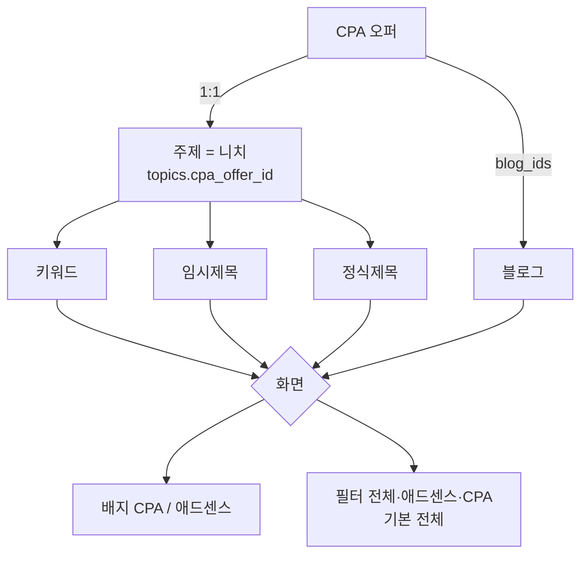

# CPA 구분 — 숨기지 않고 표시한다

## 왜 모드 전환이 아닌가

전수 조사(2026-09-09) 결과다.

| 데이터 | 규모 | 구분 필요 |
|---|---|---|
| 주제·하위주제(니치) | 23 / 161 | **필요** |
| 키워드 / 후보 | 1,027 / 9,237 | **필요** |
| 임시제목 | 88,014 | **필요** |
| 정식제목 | 4,406 | **필요** |
| 블로그 | 13 | **필요** |
| 필터설정 · 니치도메인 · 블랙리스트 | 170 / 1,270 / 1,894 | **공유** |
| 키워드·제목생성 모듈 · 성장 프로파일 | 5 / 13 | **공유** |
| 플로우 · 오토런 로그 | 15 / 30,529 | 공유·자동 구분 |

구분이 필요한 것 5종, 공유해도 되는 것 7종이다. 모드 전환은 뒤의 7종까지
숨긴다. 도메인 블랙리스트 1,894건을 CPA 화면에서 못 보게 할 이유가 없다.

비용도 다르다.

```
모드 전환   조회 API 84개 전수 검토 + 화면 6개 + 모드 상태     ~90곳
표시 구분   목록 5곳에 배지·필터                              ~15곳
```

**실패 방향이 반대다.** 모드 전환은 필터를 빠뜨리면 남의 데이터가 섞여
보이는데 화면은 멀쩡해 발견이 늦다. 표시 구분은 배지를 빠뜨려도 데이터가
사라지지 않는다. `cpa_offer_id` 하나로 이미 세 곳을 빠뜨렸다.

## 구분 축은 니치다

**오퍼 1개 = 니치(주제) 1개.** 키워드·임시제목·정식제목이 이미 `topic_id`
를 들고 있으므로 컬럼을 더 만들지 않는다.



블로그는 컬럼을 더하지 않는다. `cpa_offers.blog_ids` 가 이미 있다.

## 판정 규칙

| 대상 | CPA 인가 |
|---|---|
| 주제 | `topics.cpa_offer_id` 가 있다 |
| 하위주제 | 부모 주제가 CPA |
| 키워드·임시제목 | `topic_id` 가 CPA 주제 |
| 정식제목 | `cpa_offer_id` 가 있거나 주제가 CPA |
| 블로그 | 어떤 오퍼의 `blog_ids` 에 있다 |

**숨기지 않는다.** 기본 필터는 "전체" 다. 한쪽만 보고 싶을 때만 고른다.
