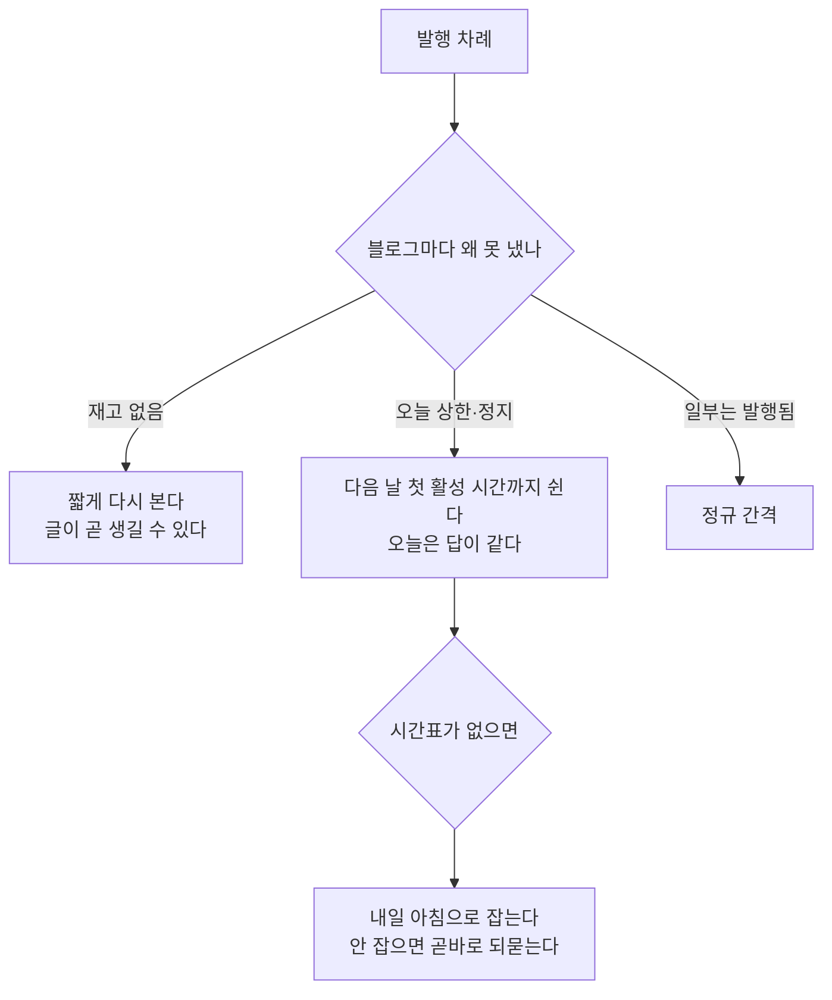

# 오늘 상한에 닿았으면 내일까지 쉰다

## 무엇이 벌어졌나

군타·굿팁꿀팁은 **74일간 색인 0건**이라 하루 1개로 발행이 제한됐다. 오늘
1개를 이미 냈으니 더 낼 것이 없는데, 스케줄러는 계속 되물었다 — 사흘간
블로그마다 **33번**씩.

    [SCHED:PUBLISH] 발행 건너뜀 (오늘 1/1) — 74일간 색인 0건 — 하루 1개로 제한

## 왜 되물었나

상한에 걸린 블로그를 **재고 대기와 같은 자리에 셌다.** 재고 대기는
"곧 글이 생길 수 있으니 짧게 다시 보자"는 뜻이라, 스케줄러가 몇 분 뒤를
다시 잡았다. 그런데 상한은 **날짜가 바뀌어야** 풀린다. 같은 답을 받으러
다시 가는 셈이었다.

**섞여 있으면 쉬지 않는다.** 한 블로그가 상한이어도 다른 블로그가 낼 수
있으면 정규 간격으로 간다. 쉬는 것은 **낼 수 있는 블로그가 하나도 없을
때**뿐이다.

## 재발행도 같다

재발행은 한도에 닿은 블로그를 건너뛰고 "성공 0/1" 로만 알렸다. 그 말로는
한도인지 실패인지 알 수 없어 역시 되물었다. 한도를 결과에 담아 같은 길로
보낸다.
