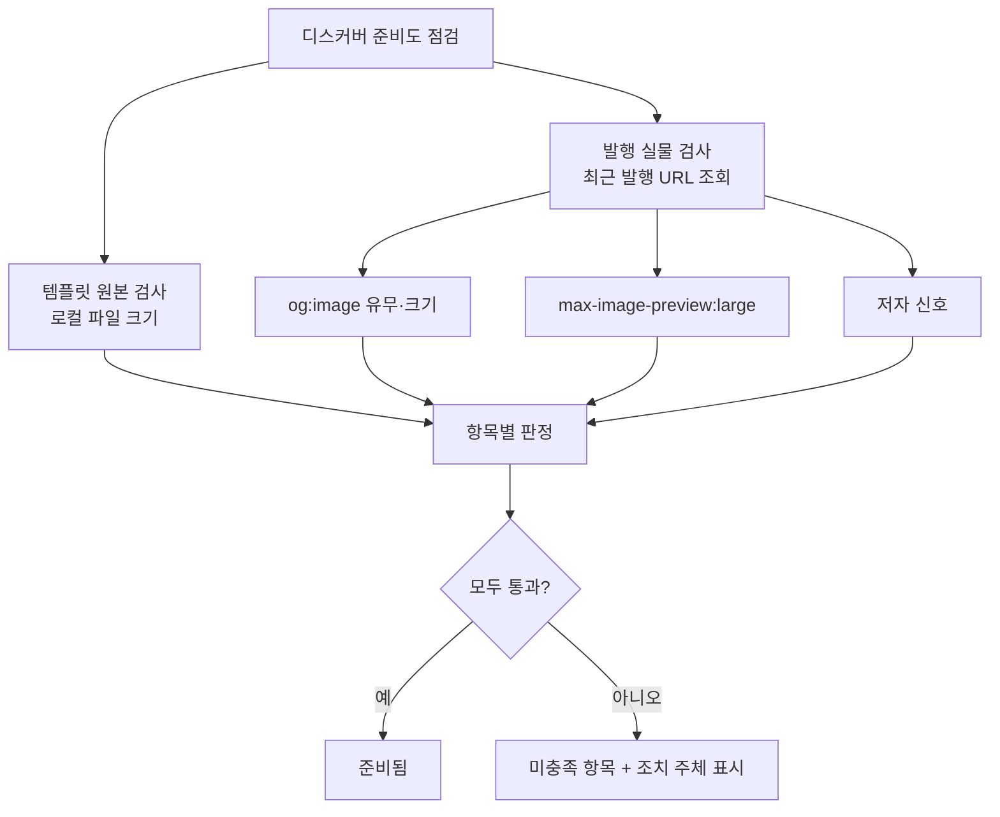
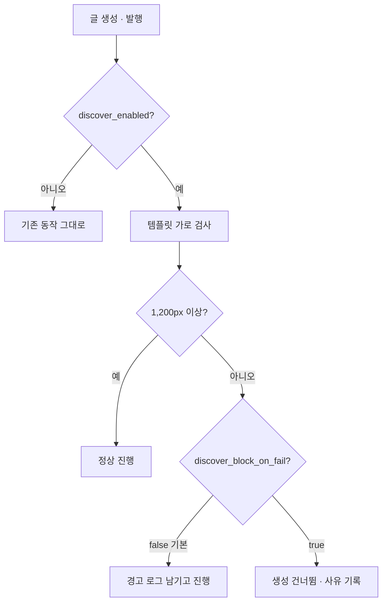

# X5 — 디스커버 준비도 (옵트인)

> 근거: `docs/plans/discover_readiness_plan.md`
> 사용자 확정(2026-08-28): **무조건 교체하지 않는다.** 조건을 제시하고,
> 사용자가 켠 블로그에서만 그 조건이 강제·검사되도록 한다.

## 원칙

- **진단은 항상, 강제는 옵트인.** 켜지 않아도 준비도는 볼 수 있다.
  끄면 아무것도 강제하지 않고 기존 동작 그대로다.
- **누가 고칠 수 있는지 구분해 보여준다.** 항목마다 `앱`(코드가 처리) /
  `사용자`(소재·테마 교체 필요)를 표시한다. 코드로 못 하는 걸 할 수 있는 척하지 않는다.
- **없는 화질을 만들어내지 않는다.** 500px 를 1,200px 로 확대하지 않는다. 경고만 한다.
- **발행을 막지 않는다(기본값).** 차단은 별도 옵션으로 두고 기본은 꺼둔다.
- **실물에서 잰다.** 설정값이 아니라 발행된 페이지의 og:image 를 실제로 받아 크기를 잰다.
  (설정이 맞아도 테마·플러그인이 다른 이미지를 내보낼 수 있다 — 실제로 그랬다)

## 판정 흐름



## 점검 항목

| 항목 | 기준 | 조치 주체 |
|---|---|---|
| 템플릿 원본 가로 | ≥ 1,200px | **사용자** — 소재 교체 |
| 발행 og:image 가로 | ≥ 1,200px | **사용자** (템플릿에서 파생) |
| og:image 존재 | 있어야 함 | **사용자** — 블로거 테마 |
| `max-image-preview:large` | 있어야 함 | 워드프레스는 SEO 플러그인이 처리 / **블로거는 테마 HTML 수동 추가** |
| 저자 바이라인 | author_profile.name 설정 | 앱 — 설정만 하면 자동 주입(F2) |

> ⚠️ 블로거의 `max-image-preview` 는 `<head>` 에 들어가야 하는데, 본문 HTML 로는
> 넣을 수 없고 Blogger API v3 에 테마 편집 기능이 없다. **테마 HTML 수동 편집이 유일한 방법**이다.
> 앱이 대신할 수 있는 척하지 않고 안내만 한다.

## 옵트인 시 동작



## 데이터

`blogs.search_index_config` 에 키를 추가한다(컬럼 신설 없음).

```json
{
  "discover_enabled": false,
  "discover_min_image_width": 1200,
  "discover_block_on_fail": false
}
```

기본 `false` — 켜지 않으면 어떤 동작도 바뀌지 않는다.
