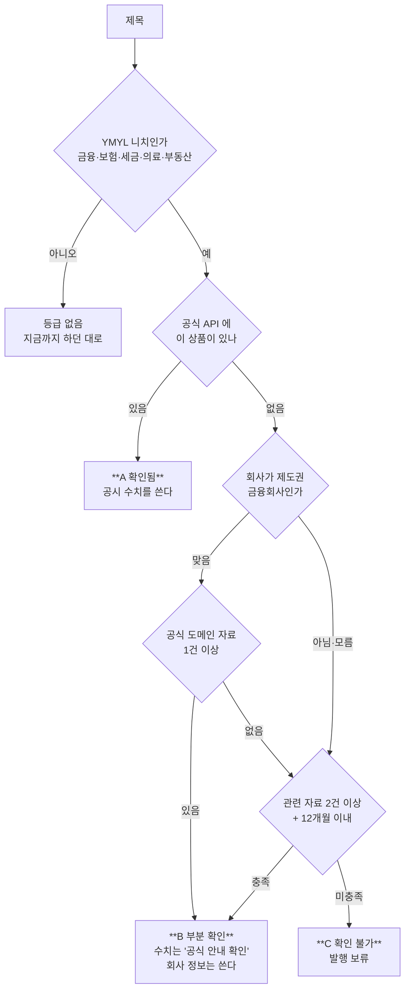
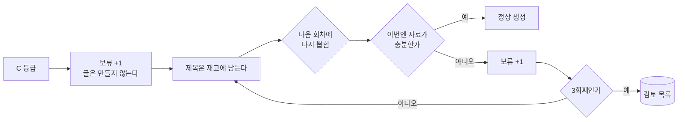

# 근거 등급과 보류 — 확인된 것만 사실로 쓴다

2026-09-07 실측: "AK론 대출 금리와 조건" 글에 우리은행 신용대출 정보가
공식 자료로 붙었다. AK론은 금감원 공시에 없고, 웹에서도 10년 전 글에서
"업체 실체를 알기 어렵다"는 말이 나온다.

**증명은 불가능하다.** 할 수 있는 것은 확인된 것과 확인 안 된 것을
섞지 않는 것이다.

## 등급 판정

## 수집 충분 기준 (YMYL)

| 조건 | 뜻 |
|---|---|
| 공식 API 적중 | 기관이 공시한 값 — 가장 강하다 |
| 공식 도메인 자료 | `.go.kr` `.or.kr` 금융사 공식 — 1차에 준한다 |
| 자료 2건 이상 | 한 곳만 있으면 그 글의 오류를 그대로 받는다 |
| 12개월 이내 | 금리·제도는 오래된 값이 틀린 값이다 |

**블로그·카페만 있고 수치가 한 곳에서만 나오면 충분하지 않다.**

## 보류와 재시도

**삭제하지 않는다.** 지우면 우리가 놓친 잘못을 확인할 방법이 사라진다.
3회 보류된 제목만 목록에 올려 사람이 판단한다.

## 왜 3회인가

한 번은 그날 검색이 나빴을 수 있다. 두 번은 우연이 겹칠 수 있다.
세 번이면 그 주제에 **공개된 근거가 없다**고 보는 편이 맞다.
