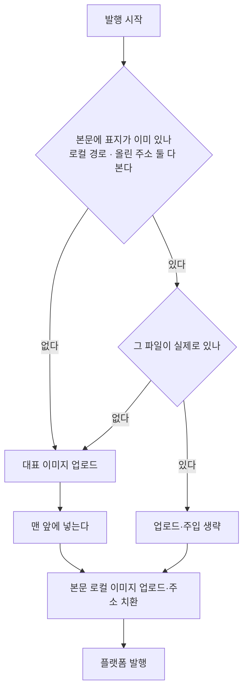

# 표지 이미지는 한 번만

## 무엇이 잘못됐나 (2026-09-24 확인)

발행된 글 맨 앞에 **같은 이미지가 둘 연속으로** 들어갔다.

    저장된 본문   [고지문][표지 /static/...png][본문]
    발행된 글     [표지 ibb][고지문][표지 ibb][본문]

표지를 넣는 자리가 두 곳이었고, 서로를 몰랐다.

1. **조립**(`promo/assembler`) — 모듈 테스터의 미리보기·저장이 지나는 길.
   본문에 그 주소가 없으면 표지를 넣는다.
2. **발행**(`publisher_pipeline` → `html_injector`) — 대표 이미지를 맨 앞에
   **아무 확인 없이** 넣었다.

조립을 거친 글(모듈 테스터에서 반영한 글)만 두 번 들어갔다. 자동 발행 글은
본문에 표지가 없어 멀쩡했다 — 그래서 모듈 테스터로 운영하는 블로그
(이사노트·수작남)에서만 나타났다.

발행 직전에는 본문 표지가 아직 `/static/...` 로컬 경로다. 올린 주소만
비교하면 못 잡는다(그래서 조립 쪽 확인도 통하지 않았다).

## 고친 흐름

## 규칙

* 표지를 넣기 전에 **본문을 본다.** 로컬 경로와 올린 주소 두 형태를 모두
  본다(`HtmlInjector.has_image`).
* 이미 있으면 **올리지도 않는다** — 올려서 버리면 imgbb 호출만 낭비된다.
* 단, **파일이 없으면 건너뛰지 않는다.** 본문 쪽 이미지는 발행 직전에
  조용히 지워지므로, 업로드를 태워 *이미지 없는 발행 금지* 관문에 걸리게
  해야 한다. 이미지 없는 글이 나가는 것보다 발행이 막히는 게 낫다.
* 재발행(리뉴얼)이 기존 주소를 다시 주입하는 길도 같은 확인을 지난다.

## 이미 나간 글

코드 수정은 **앞으로 발행될 글**에만 듣는다. 2026-09-19 이후 이미 나간
중복 글(이사노트 14건·수작남 1건, 2026-09-24 기준)은 발행된 글을 고쳐야
지워진다.
