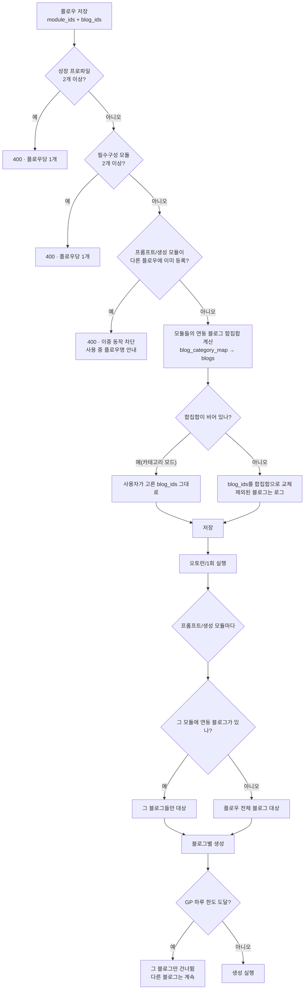

# 플로우–모듈–블로그 연결 정합성 순서도

플로우 저장 시 검증·정규화와, 실행 시 모듈별 블로그 분리.

```mermaid
flowchart TD
    A[플로우 저장<br/>module_ids + blog_ids] --> B{성장 프로파일<br/>2개 이상?}
    B -- 예 --> E1[400 · 플로우당 1개]
    B -- 아니오 --> C{필수구성 모듈<br/>2개 이상?}
    C -- 예 --> E2[400 · 플로우당 1개]
    C -- 아니오 --> D{프롬프트/생성 모듈이<br/>다른 플로우에 이미 등록?}
    D -- 예 --> E3[400 · 이중 동작 차단<br/>사용 중 플로우명 안내]
    D -- 아니오 --> F[모듈들의 연동 블로그 합집합 계산<br/>blog_category_map → blogs]
    F --> G{합집합이 비어 있나?}
    G -- 예(카테고리 모드) --> H[사용자가 고른 blog_ids 그대로]
    G -- 아니오 --> I[blog_ids를 합집합으로 교체<br/>제외된 블로그는 로그]
    H --> J[저장]
    I --> J

    J --> K[오토런/1회 실행]
    K --> L{프롬프트/생성 모듈마다}
    L --> M{그 모듈에 연동 블로그가 있나?}
    M -- 예 --> N[그 블로그들만 대상]
    M -- 아니오 --> O[플로우 전체 블로그 대상]
    N --> P[블로그별 생성]
    O --> P
    P --> Q{GP 하루 한도 도달?}
    Q -- 예 --> R[그 블로그만 건너뜀<br/>다른 블로그는 계속]
    Q -- 아니오 --> S[생성 실행]
```
