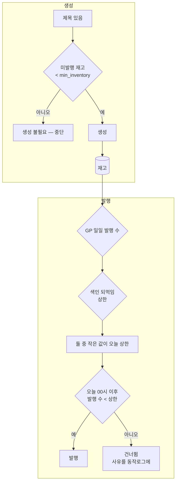

# 색인 되먹임 — 구글이 보는 지점에서 막는다

## 왜 발행 단계인가

구글이 보는 것은 **발행된 글**이다. 우리 DB에 쌓인 재고는 검색 신호에
아무 영향이 없다. 그런데 지금까지는 생성을 막았다.

```
2026-09-08 실측
  12개 블로그 전부 색인 0건 → 전부 하루 1개로 고정
  그 결과 미발행 재고: 수작남 3, 슈마즈 2, 나머지 0~1
```

재고가 비었다. 색인이 회복돼도 발행할 글이 없어 며칠을 다시 기다려야 한다.
**막을 곳을 잘못 잡았다.**

생성은 이미 스스로 멈춘다 — 미발행 재고가 `min_inventory` 에 닿으면
"생성 불필요" 로 중단한다. 되먹임이 생성까지 볼 이유가 없다.

## 적용 지점



## 상한 판정

| 색인률(최근 30일 발행분) | 상한 |
|---|---|
| 30% 이상 | 제한 없음 |
| 10% 이상 | GP 설정의 절반 |
| 0% 초과 | 하루 1개 |
| 0% (지속 30일 미만) | 하루 1개 |
| 0% (지속 30일 이상) | 발행 정지 |
| 점검 표본 5건 미만 | 제한 없음 (새 블로그를 막지 않는다) |

## 지속 일수를 어디서 재는가

**최근 30일 창 안에서 재면 안 된다.** 창이 30일이니 창 안의 가장 오래된
글은 언제나 30일 미만이다. 그래서 "0% 가 30일 이어짐" 이 영원히 성립하지
않았다(2026-09-08 실측: 12개 블로그 전부 `29일차`, `stop=False`).

색인 0건일 때만 **전체 이력**에서 첫 점검 글을 찾아 잰다.

## 동작로그 표기

막을 때는 세 가지를 다 적는다. 하나라도 빠지면 사용자가 원인을 못 찾는다.

```
발행 건너뜀 (오늘 1/1) — 색인 0건(31일차) · 성장 프로파일 2개 → 되먹임 1개
        ↑ 오늘 실적      ↑ 왜 줄었나        ↑ 원래 설정과 실제 상한
```

성장 프로파일 값이 워커까지 가지 않으면 마지막 항목이 빠진다. 수동 실행
경로가 그랬다(`stage_params_dict=None`).
