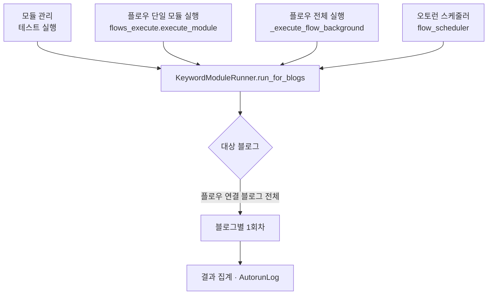
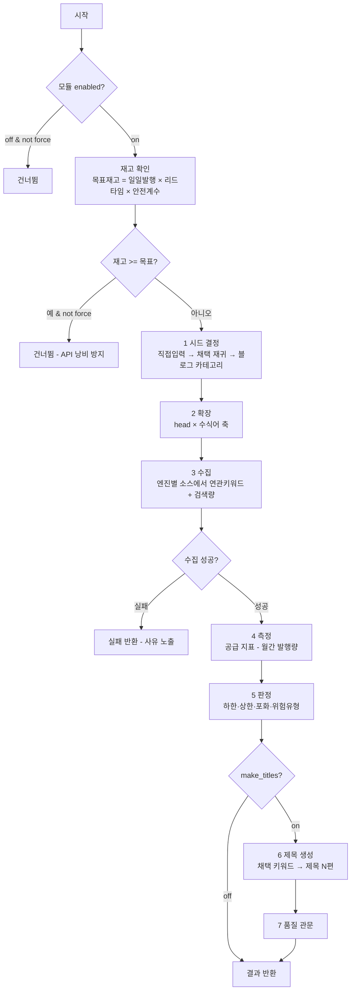
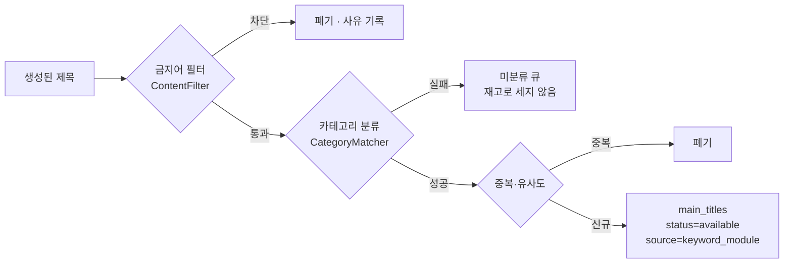

# 키워드 모듈 순서도

> 계획서: `docs/plans/keyword_module_redesign_plan.md`
> 검토서: `docs/plans/keyword_management_review.md`

## 1. 실행 진입 경로 (3경로 동일 실행기)

**규칙**: 어느 경로로 들어와도 `KeywordModuleRunner` 하나만 탄다.
다른 코드를 타면 한쪽에서만 나는 버그가 생긴다.

## 2. 한 회차 (블로그 1개)

## 3. 품질 관문 (제목 → 재고)

**핵심**: 기존 수집(`temp_titles → main_titles`)이 거치는 관문을 그대로 통과시킨다.
현행은 이 관문을 전부 우회해 금지어·중복·미분류 제목이 재고에 직행했다.

## 4. 플래그 의미 (겸용 금지)

| 컬럼 | 뜻 | 세팅 시점 |
|---|---|---|
| `promoted` | **시드로 이미 썼다** | `pick_seeds()` 가 다음 회차 시드로 뽑을 때 |
| `titled` | **제목을 이미 만들었다** | `TitleMaker` 가 제목을 만든 뒤 |

두 값을 한 칸에 겸용하면 *검색량 상위 채택 키워드가 시드로 소비되면서
제목 대상에서 빠진다*(회귀 이력: 검토서 D-4).

## 5. 블로그별 후보 격리

`keyword_candidates` 유일성은 **(user_id, blog_id, keyword)** 다.
사용자 전역으로 걸면 1번 블로그가 먼저 잡은 키워드를 2~12번 블로그가
영원히 재수집하지 못한다(검토서 D-6).
